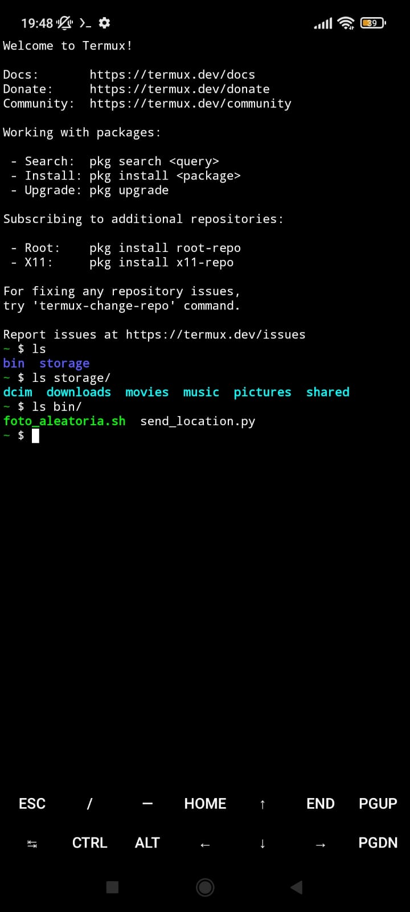
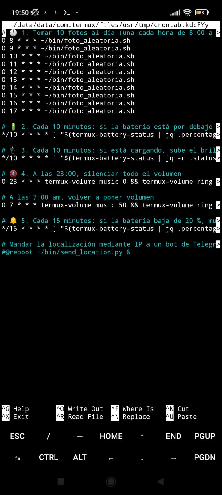
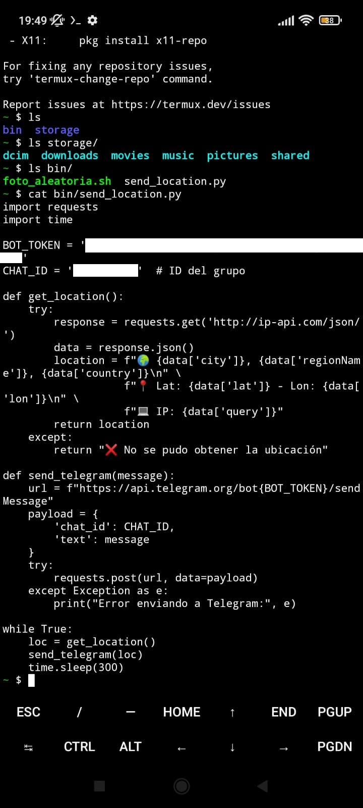

<p align="center">
  
</p>

# Introducción

Termux es una poderosa herramienta de emulación de terminal que permite ejecutar un entorno Linux (casi completo) sin necesidad de [rootear](https://en.wikipedia.org/wiki/Rooting_(Android)) el dispositivo móvil Android. Es decir, sin necesidad de conseguir permisos/control de superusuario (root) del sistema operativo del móvil.

> [!Note]
> 
> Rootear un Android es el equivalente a hacer _jailbreaking_ en iPhones o iPads.

Los binary packages que necesitemos instalar en nuestra distro Linux del móvil los podemos manejar usando un [package manager](https://www.digitalocean.com/community/tutorials/package-management-basics-apt-yum-dnf-pkg), típicamente el de FreeBSD, para tareas como actualizar, instalar y eliminar software. Desde mi experiencia, no hay problema instalando la mayoría de los paquetes normales, siempre que se encuentre un mirror practicable para descargarlos.

La mejor manera de instalar Termux es mediante F-Droid. Puedes obtener las builds de Termux desde [F-Droid](https://f-droid.org/packages/com.termux/). **No lo instales desde Google Play.** Como apuntan en su [wiki](https://wiki.termux.com/wiki/Main_Page). Algo igual de vital que Termux son sus addons (e.g., API). Las opciones para instalar todo esto son: o bien desde F-Droid todo, o bien desde otros instaladores externos todo, o bien desde Google Play, que no te va a funcionar correctamente. Google lo "capa" y trata de controlar y restringir todo aquello externo que se usa dentro de sus herramientas, por supuesto.

## Android vs Linux

Como curiosidad, el propio sistema operativo Android (creado por Google) está basado en el kernel de Linux, pero con una diferencia clave: Android es Linux sin GNU. Esto significa que, aunque comparte el núcleo con distribuciones tradicionales como Ubuntu o Debian, prescinde de las herramientas GNU y en su lugar utiliza componentes propios como la biblioteca Bionic y un entorno de ejecución basado en Java (Dalvik/ART). Esta modularidad permite que cualquier móvil, independientemente del fabricante, pueda ejecutar Android, aunque requiere drivers propietarios para cada componente hardware (cámaras, sensores, chips de radio, etc.), lo que limita la estandarización y la libertad de modificación.

Por el contrario, un sistema Linux tradicional (GNU/Linux) combina el kernel Linux con herramientas GNU, ofreciendo un ecosistema de software nativo (GTK/Qt, gestores de paquetes como APT o DNF) y mayor compatibilidad con hardware estándar (gracias a BIOS/UEFI y drivers más abiertos). Mientras Android está optimizado para móviles con interfaces táctiles y restricciones de fabricantes, las distros GNU/Linux priorizan la flexibilidad, el control del usuario y la interoperabilidad en PCs y servidores. En resumen: Android es Linux en su núcleo, pero con un enfoque radicalmente distinto en software, hardware y filosofía de uso.

# Termux

Ahora bien, ¿para qué es útil esta herramienta? ¿Para qué quiero ni siquiera un Linux en Android? Pues [aquí](https://www.reddit.com/r/termux/comments/udf2yk/what_can_we_do_with_termux/) nos cuentan unas cuantas aplicaciones posibles.

Por ejemplo:

1. Automatizar tareas (fotos, backups, alarmas...).
2. Ejecutar scripts en Python, Bash, Node.js, etc.
3. Servidores web, bases de datos, herramientas de hacking ético.
4. Monitorear sensores del dispositivo (GPS, batería, acelerómetro).
5. Entrar desde SSH al móvil, usar el modo gráfico, etc.

En este post, exploraremos varias herramientas muy interesantes, una a una, y las juntaremos en una sola gran automatización, incluyendo:

1. Automatización con crontab de múltiples funcionalidades (tomar fotografías automáticamente, activar el modo silencioso, bajar el brillo a una hora determinada...).
2. Seguridad y antirobo (envío de ubicación a Telegram por si se pierde el móvil o lo roban).



### Sobre el **almacenamiento compartido**

En Termux, se puede acceder al almacenamiento del usuario (como `/sdcard`) si se da permiso con el comando `termux-setup-storage`. Pero no se pueden ver carpetas privadas de otras apps ni todo el sistema sin root. Con root, sí se puede, pero naturalmente tiene riesgos. Para compartir carpetas, se pueden copiar archivos entre Termux y las carpetas que sí son accesibles.

> [!Note]
> 
> Sobre la opacidad de Android o Google
> 
> Parece que desde Android 11, Google aplica “Scoped Storage”, que bloquea el acceso libre al almacenamiento y oculta carpetas como `/Android/data/`, afectando a gestores de archivos y a apps avanzadas como Termux, que deben recurrir a métodos alternativos (FTP, SSH, document picker) para mover archivos; aunque se justifica como una mejora de seguridad, muchos lo ven como un cerrojazo que limita la libertad del usuario y refuerza el control de Google sobre el ecosistema Android.

### Tarea de crontab para tomar una foto

Para hacer una foto, veremos que se puede ejecutar un comando como este:

```bash
termux-camera-photo -c 1 ~/storage/shared/Pictures/TermuxFotos/foto-$(date +%Y%m%d-%H%M).jpg
```

Tarea crontab lista para que tome una foto todos los días a las 18:09 con la cámara frontal (`-c 1`), y la guarde en `~/storage/shared/Pictures/TermuxFotos/`.

En Termux, ejecutar:

```bash
crontab -e
```

Añade esta línea al final:

```cron
9 18 * * * mkdir -p ~/storage/shared/Pictures/TermuxFotos && termux-camera-photo -c 1 ~/storage/shared/Pictures/TermuxFotos/foto-$(date +\%Y\%m\%d-\%H\%M).jpg
```

> **NOTA:** Se usan `\%` en lugar de `%` para evitar errores en crontab, que interpreta `%` como un salto de línea.

La opción `-c 1` indica usar la cámara frontal. Guardar en la carpeta `TermuxFotos` dentro de `Pictures`. Asegúrate de que `crond` esté funcionando. En Termux, ejecutar:

```bash
pkg install cronie -y
crond
```

Para que el servicio cron se inicie automáticamente cada vez que abras Termux, se puede añadir esto al `~/.bashrc` o `~/.zshrc`:

```bash
echo "crond" >> ~/.bashrc
```

Por último, verificar permisos de ejecución desde el Android base. Asegurarse de que Termux tiene permiso para cámara y almacenamiento en: **Ajustes > Aplicaciones > Termux > Permisos**

Salir de Termux, naturalmente, impide que `crond` siga funcionando aunque sea en segundo plano, en principio y a este nivel básico, pues todos los procesos en segundo plano se detienen, incluyendo `crond`. Una opción para impedir que esto pase, que las actividades en segundo plano sigan funcionando, sería (además de rootear el móvil) explorar herramientas como `termux-wake`.

## Aplicaciones

A continuación, un grupo de experimentos curiosos con Termux, listados y con ejemplos de funcionamiento.

Antes de nada, cómo instalar paquetes, e.g., `requests`:

Para instalar el paquete `requests` en Termux, primero se necesita tener Python instalado. Guía aproximada:

1. **Instalar Python en Termux**
   Abrir Termux y ejecutar:
   ```bash
   pkg update && pkg upgrade
   pkg install python
   ```

2. **Instalar pip (viene con Python normalmente)**
   Verificar que `pip` esté instalado:
   ```bash
   pip --version
   ```
   Si no está, se puede intentar reinstalar Python:
   ```bash
   pkg install python
   ```

3. **Instalar el paquete `requests`**
   Una vez se tenga pip, simplemente instalar `requests` con:
   ```bash
   pip install requests
   ```

4. **Probar la instalación**
   Abrir Python en la terminal:
   ```bash
   python
   ```
   Y luego escribir:
   ```python
   import requests
   print(requests.__version__)
   ```

### Macro-automatización de tareas

Se puede manipular la batería y otras funciones del móvil con tareas, todas practicables y automatizables desde Termux:

#### 🔋 1. *Reducir brillo si la batería baja del 55%*

```bash
[ "$(termux-battery-status | jq .percentage)" -lt 55 ] && termux-brightness 25
```

> ✅ Puedes ponerlo en un script y ejecutarlo con cron cada 10 minutos, por ejemplo.

#### 🔌 2. *Poner brillo al 80% si el cargador está conectado*

```bash
[ "$(termux-battery-status | jq .status)" = "CHARGING" ] && termux-brightness 200
```

#### 🔇 3. *Silenciar el volumen por completo por la noche*

```bash
termux-volume music 0
termux-volume ring 0
termux-notification --title "Silencio nocturno" --content "Volumen desactivado"
```

Se pueden poner en crontab a las 23:00, por ejemplo.

#### 🔔 4. *Alarma si batería baja de 20%*

```bash
[ "$(termux-battery-status | jq .percentage)" -lt 20 ] && termux-toast "¡Batería baja!" && termux-vibrate
```

#### 📸 5. *Tomar una foto cada X horas y guardarla*

Se podría tomar una cada 3 horas:

```bash
termux-camera-photo -c 0 ~/storage/shared/TermuxFotos/foto-$(date +%Y%m%d-%H%M).jpg
```

Esto es por mera diversión, la verdad, como la aplicación [BeReal](https://bereal.com/es/), solo que verdaderamente _sin que te des cuenta_.


### Macro-tarea con crontab

Podemos usar `cron -e` para programar una macro-tarea de scripts con Termux, del tipo:

```bash
/data/data/com.termux/files/usr/tmp/crontab.kdcFYy
# 🕗 1. Tomar 10 fotos al día (una cada hora de 8:00 a >
0 8 * * * ~/bin/foto_aleatoria.sh
0 9 * * * ~/bin/foto_aleatoria.sh
0 10 * * * ~/bin/foto_aleatoria.sh
0 11 * * * ~/bin/foto_aleatoria.sh
0 12 * * * ~/bin/foto_aleatoria.sh
0 13 * * * ~/bin/foto_aleatoria.sh
0 14 * * * ~/bin/foto_aleatoria.sh
0 15 * * * ~/bin/foto_aleatoria.sh
0 16 * * * ~/bin/foto_aleatoria.sh
0 17 * * * ~/bin/foto_aleatoria.sh

# 🔋 2. Cada 10 minutos: si la batería está por debajo >
*/10 * * * * [ "$(termux-battery-status | jq .percentag>

# 🔌 3. Cada 10 minutos: si está cargando, sube el bril>
*/10 * * * * [ "$(termux-battery-status | jq -r .status>

# 🔇 4. A las 23:00, silenciar todo el volumen
0 23 * * * termux-volume music 0 &…
```



### Macro-automatización en `~/scripts/`

Juntamos todos estos en un script de bash, del tipo:

```bash
# METER AQUI TODO EL CODIGO DE AUTOMATIZACIÓN DE MI TERMUX
```

Todo esto se puede programar realmente en crontab o con `termux-job-scheduler`.

# Alarma a Telegram de localización

Ahora haremos un script que mande geolocalización/ubicación a un canal de Telegram, por si lo roban y que funcione incluso estando el teléfono bloqueado. Usando Python y solicitudes a la API de un servicio de localización aproximada mediante IP, por ejemplo.

Para que la tarea funcione aunque esté bloqueado, sepamos que en Linux, se pueden programar scripts que se ejecuten en segundo plano con cron, incluso al inicio del sistema, mediante un simple símbolo `&`. (Algo que violaría políticas de seguridad de la plataforma en Android/iOS y además sería mucho más complicado sin acceso root/jailbreak o aplicaciones que automatizan tareas, incluso con widgets, como [Tasker](https://tasker.joaoapps.com/) (ver [aquí](https://wiki.termux.com/wiki/Termux:Tasker)) o [MacroDroid](https://www.macrodroid.com/)).

Para conseguir acceso a la geolocalización, como para acceder a GPS necesitamos permiso a dicha herramienta y no siempre es posible, o como alternativa, podemos obtener ubicación aproximada mediante redes WiFi cercanas o IP. Eso sí, si no hay acceso a Internet, si no hay red, no hay forma de enviar nada.

A continuación describimos cómo usamos `requests` a `https://ip-api.com/` para obtener la ubicación y enviarla por Telegram.

Primero necesitamos crear un bot de Telegram. Esto se vuelve trivial hablando con `@BotFather`. Se escribe: `/newbot` y se sigue los pasos.

Guardar el token del bot (algo como `123456789:ABCdefGHIjkl...`).

Luego, mandar cualquier mensaje al bot (e.g., "Hola") y obtener el ID del grupo entrando en la URL tipo `https://api.telegram.org/bot<tu_token>/getUpdates` (reemplazando `<tu_token>` por el del bot que acabamos de crear)

Se verá el `chat.id` del grupo => a mi me salió  **146XXXXXXX** (tampoco lo voy a poner aquí)

El script Python que envía ubicación cada 3 segundos puede ser algo así:

```python
import requests
import time

# Configuración del bot
BOT_TOKEN = 'TU_TOKEN_DEL_BOT'
CHAT_ID = '-146XXXXXXX'  # ID del grupo

def get_location():
    try:
        response = requests.get('http://ip-api.com/json/')
        data = response.json()
        location = f"🌍 {data['city']}, {data['regionName']}, {data['country']}\n" \
                   f"📍 Lat: {data['lat']} - Lon: {data['lon']}\n" \
                   f"💻 IP: {data['query']}"
        return location
    except:
        return "❌ No se pudo obtener la ubicación"

def send_telegram(message):
    url = f"https://api.telegram.org/bot{BOT_TOKEN}/sendMessage"
    payload = {
        'chat_id': CHAT_ID,
        'text': message
    }
    try:
        requests.post(url, data=payload)
    except Exception as e:
        print("Error enviando a Telegram:", e)

while True:
    loc = get_location()
    send_telegram(loc)
    time.sleep(3)
```



### Operación: dejarlo ejecutando siempre

Una opción es iniciarlo junto con el sistema (Linux):

Crear un archivo `.desktop` en `~/.config/autostart/` para iniciar el script al prender el subsistema Termux (o el móvil).

O también se puede enviar una sola vez desde el script y en su lugar usar `crontab -e` con la opción `&` para que ejecute en segundo plano, i.e., que no se quede esperando en la terminal hasta el retorno del script:

```cron
@reboot /usr/bin/python3 /ruta/a/script.py &
```

> [!Note]
> 
> Otras opciones serían usar `tmux`, `nohup` o `systemd` para asegurar que sigue corriendo sin cerrar el terminal.

Cabe decir que la geolocalización IP no es muy precisa (aprox. 5 km máximo de exactitud, con alta precisión, de promedio), pero para precisión GPS real se necesitaría acceso a hardware o apps móviles. Para la localización, también se podría usar `termux-location`.


# Referencias

- Hay buenos tutoriales en [Termux](https://prohoster.info/es/blog/administrirovanie/termux-shag-za-shagom-chast-1-2)

# TODO

- Otra posible aplicación: Sistema aviso de robo. Si alguien nos quiere robar el móvil en la playa, podemos hacer sonar una alarma estruendosa y que le saque fotos. Por ejemplo, si colocamos el móvil en horizontal y detectamos por medio del acelerómetro que se ha girado mucho, o algo así. O estar sacando fotos periódicamente y detectar un cambio brusco de foto a otra. 
