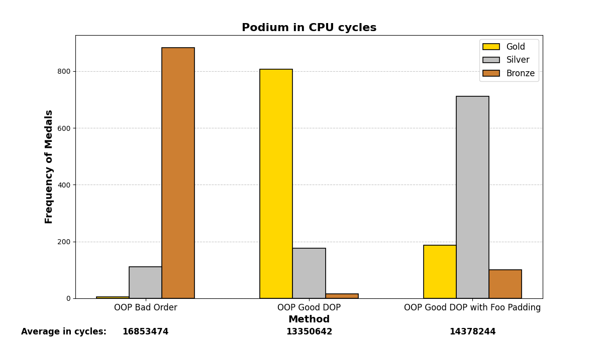
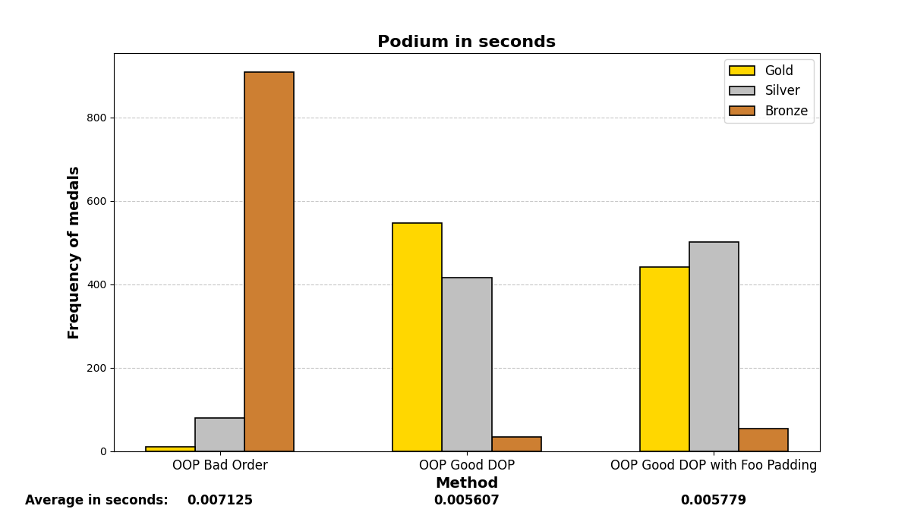
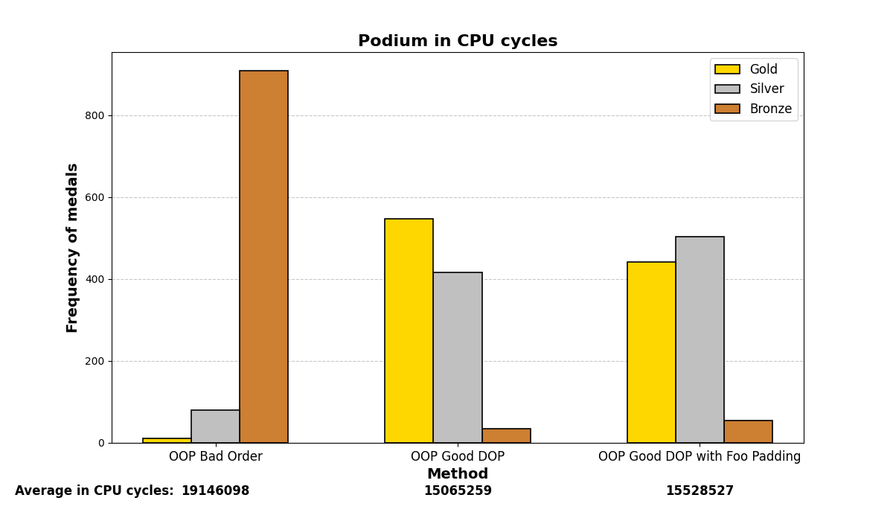
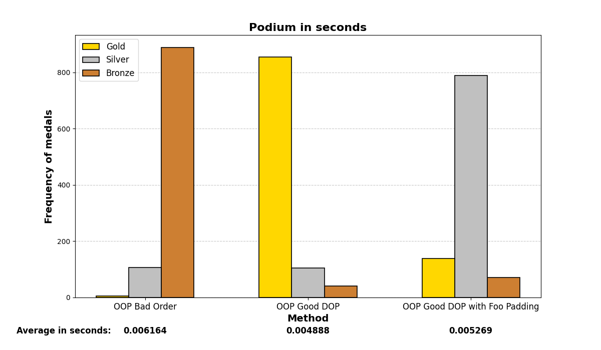
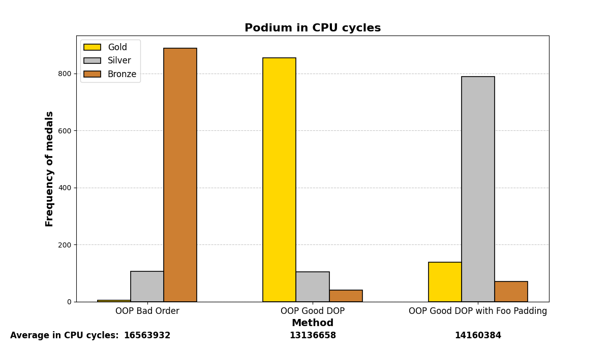
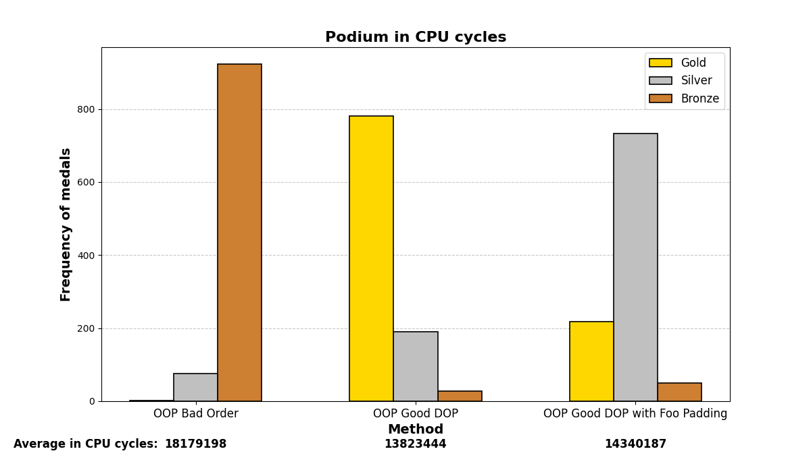
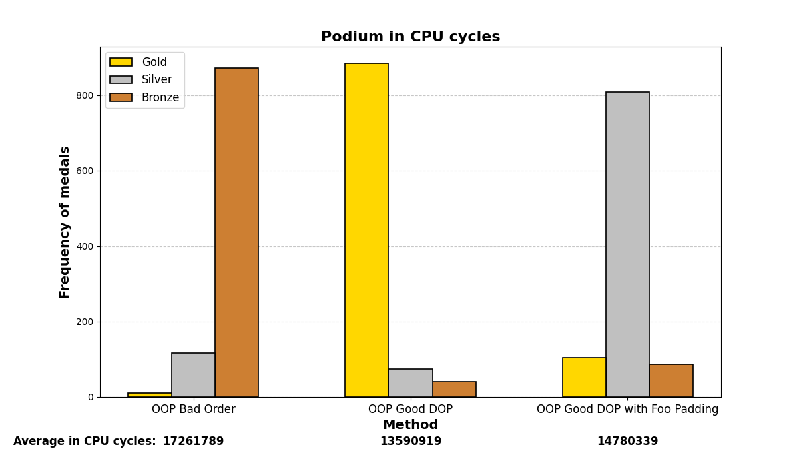
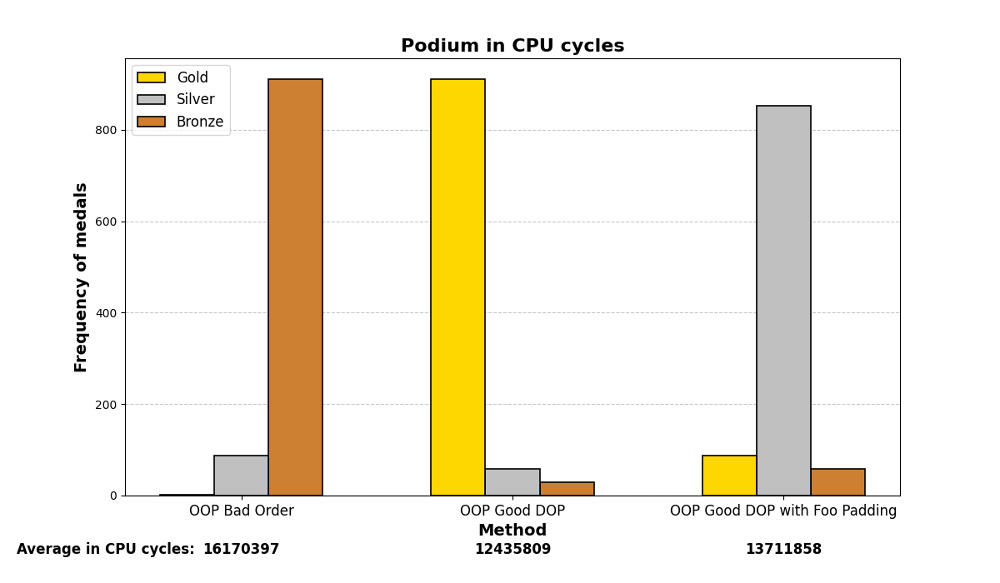

## Introduction

**Memory alignment matters. And it gets worse at a large scale. As someone said, 1 ms could make the difference between getting frustrated or not, when waiting for Word to open.**

In this post, we will experiment with how the alignment of attributes in classes/structures affects the computational cost of code (in C++) in terms of execution time.

The idea is that we will create many instances of various classes with multiple attributes and a method that updates or _does something_ with those attributes, many times. We will evaluate and compare the execution time of each one. We will introduce concepts from DOP (Data-Oriented Programming) and put them into practice to see how they can help us in our daily life as ~~**_high-performance_**~~ programmers.

1. We will create a class ```Entity_OOP_Bad``` as any innocent subscriber to OOP would do.
2. We will paint the previous class with our knowledge of DOP and turn it into ```Entity_OOP_Good```.
   _Still in progress..._
3. We will further maximize the efficiency of our code in ```Entity_OOP_GoodWithFooPadding```.

* How will we evaluate performance? The quality assessment will be purely based on execution time with ```chrono``` and CPU cycles with ```__rdtsc``` from ```x86intrin.h``` library.

For the curious, this is my machine:
```bash
$ uname -a 
```
```text
Linux pop-os 6.9.3-76060903-generic #202405300957~1732141768~22.04~f2697e1 SMP PREEMPT_DYNAMIC Wed N x86_64 x86_64 x86_64 GNU/Linux
```
```bash
$ lscpu | grep -E 'Architecture|Cache|CPU|Model|NUMA|cache|L1|L2|L3'
```
```text
Architecture:                         x86_64
CPU op-mode(s):                       32-bit, 64-bit
CPU(s):                               4
On-line CPU(s) list:                  0-3
Model name:                           12th Gen Intel(R) Core(TM) i7-12650H
CPU family:                           6
Model:                                154
L1d cache:                            192 KiB (4 instances)
L1i cache:                            128 KiB (4 instances)
L2 cache:                             5 MiB (4 instances)
L3 cache:                             96 MiB (4 instances)
NUMA node(s):                         1
NUMA node0 CPU(s):                    0-3
Vulnerability L1tf:                   Not affected
```
```bash
$ g++ --version 
```
```text
g++ (Ubuntu 11.4.0-1ubuntu1~22.04) 11.4.0
Copyright (C) 2021 Free Software Foundation, Inc.
This is free software; see the source for copying conditions.  There is NO
warranty; not even for MERCHANTABILITY or FITNESS FOR A PARTICULAR PURPOSE.
```

## Hands-on code
Let us define the number of class instances (entities) we will create to test at large scale to do the test. Better to be a large number, e.g.:
```cpp
const int num_entities = 1000000;
```

### ```Entity_OOP_Bad```
OOP class with poor attribute ordering, causing padding
Padding will be used to properly align the attributes in memory.
The attribute order is random and does not take into account the size of each data type.
This causes the compiler to add padding (filler bytes) to properly align the attributes in memory. As a result, memory is wasted.
```cpp
class Entity_OOP_Bad {
public:
    struct atributes {
        double dx, dz;       // 8 bytes each (16 bytes total)
        float x, y;          // 4 bytes each (8 bytes total)
        uint16_t something;  // 2 bytes
        double dy;           // 8 bytes
        uint16_t something1; // 2 bytes
        uint16_t something2; // 2 bytes
        int score;           // 4 bytes
        int score1;          // 4 bytes
        int score2;          // 4 bytes
        char id;             // 1 byte
        float z;             // 4 bytes
        bool active;         // 1 byte
                             // _______
                             // 56 bytes total, alignment 8 bytes
    };

    atributes mAtributes;

    void modifyParams(){
        this->mAtributes.x = this->mAtributes.y = this->mAtributes.z = 0.0f;
        this->mAtributes.dx = this->mAtributes.dy = this->mAtributes.dz = 0.1;
        this->mAtributes.active = true;
        this->mAtributes.id = 'A';
        this->mAtributes.score = 100;
        this->mAtributes.score1 = 100;
        this->mAtributes.score2 = 100;
        this->mAtributes.something *= 2;
        this->mAtributes.something1 *= 2;
        this->mAtributes.something2 *= 2;
    }
};
```
Now, let’s test it:
```cpp
std::chrono::duration<double> elapsedOOPDOP;
std::vector<Entity_OOP_Bad> entities(num_entities);
auto start = std::chrono::high_resolution_clock::now();
unsigned long long start_cycles = __rdtsc();
for (auto& entity : entities) entity.modifyParams();
unsigned long long end_cycles = __rdtsc();
elapsedOOPBad = std::chrono::high_resolution_clock::now() - start;
std::cout << "OOP (Bad Order) CPU cycles: " << (end_cycles - start_cycles) << "\n";
std::cout << "OOP (Bad Order) Execution time: " << elapsedOOPBad.count() << " seconds\n";
```
```text
OOP (Bad Order) CPU cycles: 17961504
OOP (Bad Order) Execution time: 0.0066837 seconds
```

...but that's pretty fast, right? Well... yes, but let's continue going deeper.

### ```Entity_OOP_Good```
OOP class with proper attribute ordering, minimizing padding
Here, padding is reduced by grouping similar types together.
The attributes are reordered from largest to smallest size (first double, then float, followed by int, char, and finally bool).
This minimizes the amount of padding required, making the structure more compact in memory.
On a more technical level, when performing operations on the attributes, the machine code will perform register lookups starting from rax (rax+4, rax+20...) with fewer shifts, and thus more efficiently, if the attributes are properly ordered.
```cpp
class Entity_OOP_Good {
public:
    struct atributes {
        double dx, dy, dz;   // 8 bytes each (24 bytes total)
        float x, y, z;       // 4 bytes each (12 bytes total)
        int score;           // 4 bytes
        int score1;          // 4 bytes
        int score2;          // 4 bytes
        uint16_t something;  // 2 bytes
        uint16_t something1; // 2 bytes
        uint16_t something2; // 2 bytes
        char id;             // 1 byte
        bool active;         // 1 byte
                             // _______
                             // 56 bytes total, alignment 8 bytes
    };

    atributes mAtributes;

    void modifyParams(){
        this->mAtributes.x = this->mAtributes.y = this->mAtributes.z = 0.0f;
        this->mAtributes.dx = this->mAtributes.dy = this->mAtributes.dz = 0.1;
        this->mAtributes.active = true;
        this->mAtributes.id = 'A';
        this->mAtributes.score = 100;
        this->mAtributes.score1 = 100;
        this->mAtributes.score2 = 100;
        this->mAtributes.something *= 2;
        this->mAtributes.something1 *= 2;
        this->mAtributes.something2 *= 2;
    }
};
```
Now, let’s test it:
```cpp
std::chrono::duration<double> elapsedOOPDOP;
std::vector<Entity_OOP_Good> entities(num_entities);
auto start = std::chrono::high_resolution_clock::now();
unsigned long long start_cycles = __rdtsc();
for (auto& entity : entities) entity.modifyParams();
unsigned long long end_cycles = __rdtsc();
elapsedOOPDOP = std::chrono::high_resolution_clock::now() - start;
std::cout << "OOP (Good Order by DOP) CPU cycles: " << (end_cycles - start_cycles) << "\n";
std::cout << "OOP (Good Order by DOP) Execution time: " << elapsedOOPDOP.count() << " seconds\n";
```
```text
OOP (Good Order by DOP) CPU cycles: 15459546
OOP (Good Order by DOP) Execution time: 0.00575244 seconds
```

Again a better result. This indicates that we are not thinking nonsense, but we can go even further, and this is just transfering to code naive knowledge about CPU architecture...

> Note: With the command ```$ lscpu``` you can view the information about your CPU, to see the size in bytes that the CPU queries in each cycle, in order to know how to maximize the efficiency of your structure to avoid unnecessary gaps and perform operations in the fewest number of cycles (L1 and L2 cache sizes, 64-bit data bus size, etc.).

### ```Entity_OOP_GoodWithFooPadding```
Now we manually add the necessary padding to align the data with the 64-bit boundaries of our CPU's memory architecture:
```cpp
class Entity_OOP_GoodWithFooPadding {
public:
    struct atributes {
        double dx, dy, dz;   // 8 bytes each (24 bytes total)
        float x, y, z;       // 4 bytes each (12 bytes total)
        int score;           // 4 bytes
        int score1;          // 4 bytes
        int score2;          // 4 bytes
        uint16_t something;  // 2 bytes
        uint16_t something1; // 2 bytes
        uint16_t something2; // 2 bytes
        char id;             // 1 byte
        bool active;         // 1 byte
        char padding[8];     // 8 bytes de padding para completar el bloque de 64 bytes
                             // _______
                             // 64 bytes total, alignment 8 bytes
    };

    atributes mAtributes;

    void modifyParams() {
        this->mAtributes.x = this->mAtributes.y = this->mAtributes.z = 0.0f;
        this->mAtributes.dx = this->mAtributes.dy = this->mAtributes.dz = 0.1;
        this->mAtributes.active = true;
        this->mAtributes.id = 'A';
        this->mAtributes.score = 100;
        this->mAtributes.score1 = 100;
        this->mAtributes.score2 = 100;
        this->mAtributes.something *= 2;
        this->mAtributes.something1 *= 2;
        this->mAtributes.something2 *= 2;
    }
};
```
Now, let’s test it:
```cpp
std::chrono::duration<double> elapsedOOPDOP_GoodWithFooPadding;
std::vector<Entity_OOP_GoodWithFooPadding> entities(num_entities);
auto start = std::chrono::high_resolution_clock::now();
unsigned long long start_cycles = __rdtsc();
for (auto& entity : entities) entity.modifyParams();
unsigned long long end_cycles = __rdtsc();
elapsedOOPDOP_GoodWithFooPadding = std::chrono::high_resolution_clock::now() - start;
std::cout << "OOP (Good Order by DOP and Foo Padding) CPU cycles: " << (end_cycles - start_cycles) << "\n";
std::cout << "OOP (Good Order by DOP and Foo Padding) Execution time: " << elapsedOOPDOP_GoodWithFooPadding.count() << " seconds\n";
```
```text
OOP (Good Order by DOP and Foo Padding) CPU cycles: 14294218
OOP (Good Order by DOP and Foo Padding) Execution time: 0.00531921 seconds
```

Even faster. We have found an evidence to the presented hypotesis. Let’s summarize the resultd:

```cpp
std::cout << "With DOP, the processing is " << (elapsedOOPBad.count() - elapsedOOPDOP.count()) * 1e3 << " ms faster\n";
std::cout << "With DOP and Foo Padding, the processing is " << (elapsedOOPBad.count() - elapsedOOPDOP_GoodWithFooPadding.count()) * 1e3 << " ms faster\n";
```
```text
With DOP, the processing is 0.931258 ms faster
With DOP and Foo Padding, the processing is 1.36449 ms faster
```

### Larger scale

One may wonder, but what if this was something more casual than causal? And what if it was just a quick coincidence? We can run this $$n$$ times to see if Gauss is on our side (is it true that DOP works or not?).

Below are the graph results after running the test many (1000) times and analyzing which methods were the fastest. There are three methods and three positions (gold, silver, and bronze), depending on which method was the fastest or slowest. The graphs show a summary of the positions in which each method ended up in all the iterations.




Mostly, the results align with what was experienced before; careful structuring of variables in memory enhances performance on both small and large scales, even with the optimizations that modern compilers may add.

### Compiler customization
Let’s be more austere. In the following, we will enable some [compiler flags](https://caiorss.github.io/C-Cpp-Notes/compiler-flags-options.html) for the g++ (GCC) compiler and analyze whether the graphs vary significantly or not. We are using ```Qt 6.8.1``` and specifying the flags in the ```.pro``` file via the ```QMAKE_CXXFLAGS``` variable.

#### 1. With no flags:
<div style="display: flex; justify-content: space-between;">
  
  
</div>

#### 2. No optimization:
```.pro
QMAKE_CXXFLAGS += O0
```
Faster compilation time and better for debugging.
<div style="display: flex; justify-content: space-between;">
  
  
</div>

#### 3. O2 optimization:
```.pro
QMAKE_CXXFLAGS += O2
```
High level of optimization. Slower compilation time, better for releasing.
<div style="display: flex; justify-content: space-between;">
  
  
</div>

#### 4. O3 optimization:
```.pro
QMAKE_CXXFLAGS += O3
```
Higher (most aggressive) level of optimization. Slower compilation time, better for releasing.
<div style="display: flex; justify-content: space-between;">
  
  
</div>

#### 5. No optimization, march native:
```.pro
QMAKE_CXXFLAGS += -march=native
```
To utilize all specific characteristics of your CPU hardware.
<div style="display: flex; justify-content: space-between;">
  
  
</div>

#### 6. O3 optimization, march native:
```.pro
QMAKE_CXXFLAGS += -O3 -march=native
```
<div style="display: flex; justify-content: space-between;">
  
  
</div>

#### 7. Vectorizing:
```.pro
QMAKE_CXXFLAGS += -ftree-vectorize -mavx -mavx2 -msse4.2
```
Leveraging advanced parallel processing with SIMD (AVX and AVX2) capabilities.
<div style="display: flex; justify-content: space-between;">
  
  
</div>

#### 8. All for one and one for all:
```.pro
QMAKE_CXXFLAGS += -O3 -march=native -funroll-loops -fomit-frame-pointer -finline-functions -ftree-vectorize -mavx -mavx2 -msse4.2
```
```-funroll-loops```: Optimizes loops by unrolling them, which can speed up repetitive iterations.

```-fomit-frame-pointer```: Removes the frame pointer register to optimize register usage.

```-finline-functions```: Forces the inlining of small functions, improving performance.

<div style="display: flex; justify-content: space-between;">
  
  
</div>

### Conclusion
Modern CPUs access memory in blocks (typically 8 bytes or more). If the data is properly aligned in memory, access is faster because it can load and store the data in a single memory cycle. If the data is not properly aligned, the CPU may have to perform more memory accesses, which introduces performance penalties due to the need to correct the alignment at runtime.

One lesson learned is that programming often needs to be approached with a statistical mindset: structure your code in the most probabilistically favorable way for it to execute under normal conditions. If a switch case is likely to hit a specific case most of the time, place that one first. If you can do something at compile-time that results in reasonable performance, do it there instead of at runtime. Reduce the number of calls by studying and thinking about which cases are more probable in your problem; save work for the CPU, whose threads you can't really control deterministically.

We painted the paradigms as "good" or "bad", but this goes no further than satire. Each one has its field of application, and it cannot be said that one is better than the other without establishing a particular framework because their philosophy is different. They are not supplementary; rather, they reinforce each other, but especially in the sense that DOP **reinforces OOP**.

_Still in progress..._

### Reference

[Mike Acton CppCon 2014](https://www.youtube.com/watch?v=rX0ItVEVjHc)

