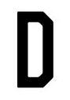
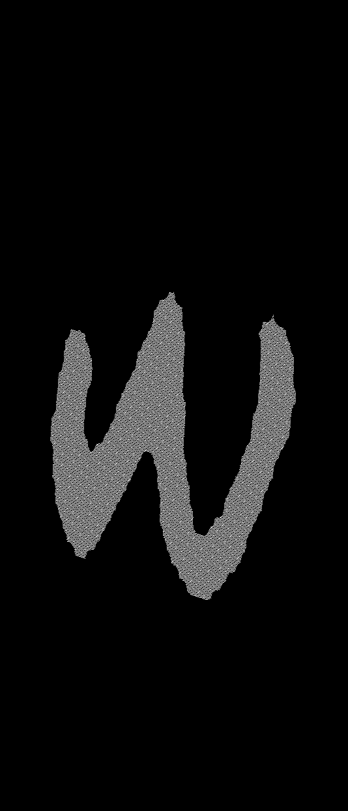

## Shape Normalization

In applications like Optical Character Recognition (OCR), it is uncommon for the letters to be written in a unified font, whether digitally or handwritten. A preprocessing block that normalizes the shape of the character to some **common frame** may enhance the capabilities of the recognition machine, AI or correlation-based models.

The application of certain transformations (e.g., affine) to a binary shape (e.g., contour) can help normalize it against perspective changes in such a way that its **main axes** align with the coordinates, achieving an effect similar to the T-Net in PointNet in 3D context. 

In this post we review is a way to **normalize the shape of objects** to make them robust against varying geometry in tasks such as identification.

The basic idea is that after normalization, the object will have a unit scatter matrix multiplied by a constant, which indicates that the shape is as compact as possible.

## What images we will be dealing with

Let’s have a look at some images we would like to normalize in shape. We want to make the i-th character look "very similar" to the rest of the i-th characters; this way, we would achieve invariance across different writers:

<table>
    <tr>
        <td></td>
        <td></td>
        <td></td>
        <td></td>
        <td></td>
        <td></td>
        <td></td>
        <td></td>
    </tr>
    <tr>
        <td></td>
        <td></td>
        <td></td>
        <td></td>
        <td></td>
        <td></td>
        <td></td>
        <td></td>
    </tr>
    <tr>
        <td></td>
        <td></td>
        <td></td>
        <td></td>
        <td></td>
        <td></td>
        <td></td>
        <td></td>
    </tr>
</table>

The characters can be written in either white or black. To add some adaptability, we will threshold at 127 (considering 8-bit depth), rescale the image to a size of 512x512, and calculate the relative percentage of white pixels in the image. If this percentage is less than 0.5, we are dealing with an image where white pixels dominate, and therefore the character will be made white. Finally, we will scale the amplitude to the range [0-1]:


<table>
    <caption>Above: input characters. Below: their binarized versions.</caption>
    <tr>
        <td></td>
        <td></td>
        <td></td>
        <td></td>
    </tr>
    <tr>
        <td></td>
        <td></td>
        <td></td>
        <td></td>
    </tr>
</table>

### Algorithm
1. The first step to normalize the shape of the object is to compute its centroid (x_hat, y_hat):
$$\bar{x} = \frac{\sum_{y=0}^{n-1} \sum_{x=0}^{m-1} x \cdot I(x, y)}{\sum_{y=0}^{n-1} \sum_{x=0}^{m-1} I(x, y)},$$
$$\bar{y} = \frac{\sum_{y=0}^{n-1} \sum_{x=0}^{m-1} y \cdot I(x, y)}{\sum_{y=0}^{n-1} \sum_{x=0}^{m-1} I(x, y)}.$$

where $$n$$ is the total of rows, $$m$$ is the total of columns, $$I(x, y) \in \{0, 1\}$$ is the (binary, in this case) pixel intensity and $$(x, y) \in [0, 512)^2$$ is the pixel position.

```cpp
// Compute the centroid of the image
const double* img_ptr = image.ptr<double>(0);
double sumX{0.0}, sumY{0.0}, sumIntensity{0.0};
for (int y = 0; y < n; ++y)
{
    for (int x = 0; x < m; ++x)
    {
        double intensity = img_ptr[y * m + x];
        sumX += x * intensity;
        sumY += y * intensity;
        sumIntensity += intensity;
    }
}
const double centroidX = sumX / sumIntensity;
const double centroidY = sumY / sumIntensity;
```

2. Now, we compute the shape dispersion matrix $$M$$ with the moments $$m_{11}$$ (second moment along the $$x$$-axis), $$m_{22}$$ (second moment along the $$y$$-axis), $$m_{12}$$ and $$m_{21}$$ (cross moments that represent correlations between $$x$$ and $$y$$):

$$
M = 
\begin{bmatrix}
m_{11} & m_{12} \\
m_{21} & m_{22}
\end{bmatrix},
$$

where:
$$
m_{11} = \frac{\sum_{y=0}^{N-1} \sum_{x=0}^{M-1} x^2 \cdot I(x, y)}{\sum_{y=0}^{N-1} \sum_{x=0}^{M-1} I(x, y)} - \bar{x}^2,
m_{22} = \frac{\sum_{y=0}^{N-1} \sum_{x=0}^{M-1} y^2 \cdot I(x, y)}{\sum_{y=0}^{N-1} \sum_{x=0}^{M-1} I(x, y)} - \bar{y}^2,
m_{12} = m_{21} = \frac{\sum_{y=0}^{N-1} \sum_{x=0}^{M-1} x \cdot y \cdot I(x, y)}{\sum_{y=0}^{N-1} \sum_{x=0}^{M-1} I(x, y)} - \bar{x} \cdot \bar{y}.
$$

```cpp
// Compute the moments m11, m22, m12 and m21
double sum_m_11{0.0}, sum_m_22{0.0}, sum_m_12_m_21{0.0};
for (int y = 0; y < totalRows; ++y)
{
    for (int x = 0; x < totalCols; ++x)
    {
        double intensity = img_ptr[y * totalCols + x];
        sum_m_11 += x * x * intensity;
        sum_m_22 += y * y * intensity;
        sum_m_12_m_21 += x * y * intensity;
    }
}
const double m11 = sum_m_11 / sumIntensity - centroidX * centroidX;
const double m22 = sum_m_22 / sumIntensity - centroidY * centroidY;
const double m12 = sum_m_12_m_21 / sumIntensity - centroidX * centroidY;
const double m21 = m12;

// Compute the shape dispersion matrix with the moments
cv::Mat M = (cv::Mat_<double>(2, 2) << m11, m12, m21, m22);

```

3. Compute the eigenvalues and eigenvectors of $$M$$:
```cpp
cv::Mat eigenvalues, eigenvectors;
cv::eigen(M, eigenvalues, eigenvectors);
double lambda1 = eigenvalues.at<double>(0, 0);
double lambda2 = eigenvalues.at<double>(1, 0);
cv::Vec2d E1(eigenvectors.at<double>(0, 0), eigenvectors.at<double>(1, 0));
cv::Vec2d E2(eigenvectors.at<double>(0, 1), eigenvectors.at<double>(1, 1));
```

4. Align the image with the _spectrum_ of $$M$$:  
To do this, we perform the following transformations:
- Translate the origin to the centroid $$(\bar{x}, \bar{y})$$,
- Rotate the axes to align with the eigenvectors of $$M$$,
- Scale the axes according to the eigenvalues $$\lambda_1$$ and $$\lambda_2$$.

To ensure that the area of the transformed image approximately matches the area of the input image (which may be of interest), we introduce an adaptive scaling factor $$k$$ based on the area of the character:
```cpp
const int whitePixelCountOriginal = cv::countNonZero(image);

cv::Mat normalized;

double k = 1.0;
double tolerance = 0.1; // tolerance for adjusting k
double error = std::numeric_limits<double>::max();
int maxIterations = 50;
int iteration = 0;
while (error > tolerance && iteration < maxIterations)
{
    double minX = std::numeric_limits<double>::max();
    double minY = std::numeric_limits<double>::max();
    double maxX = std::numeric_limits<double>::min();
    double maxY = std::numeric_limits<double>::min();
    const double* R_ptr = R.ptr<double>(0);

    for (int y = 0; y < totalRows; ++y)
    {
        for (int x = 0; x < totalCols; ++x)
        {
            double x_centered = x - centroidX;
            double y_centered = y - centroidY;

            double x_rotated = R_ptr[0] * x_centered + R_ptr[1] * y_centered;
            double y_rotated = R_ptr[2] * x_centered + R_ptr[3] * y_centered;

            double x_scaled = (k / std::sqrt(lambda1)) * x_rotated;
            double y_scaled = (k / std::sqrt(lambda2)) * y_rotated;

            if (x_scaled < minX) minX = x_scaled;
            if (x_scaled > maxX) maxX = x_scaled;
            if (y_scaled < minY) minY = y_scaled;
            if (y_scaled > maxY) maxY = y_scaled;
        }
    }

    int newCols = static_cast<int>(std::ceil(maxX - minX + 1));
    int newRows = static_cast<int>(std::ceil(maxY - minY + 1));

    normalized = cv::Mat(newRows, newCols, CV_64FC1, cv::Scalar(0));
    double* normalizedPtr = normalized.ptr<double>(0);
    for (int y = 0; y < totalRows; ++y)
    {
        for (int x = 0; x < totalCols; ++x)
        {
            double intensity = img_ptr[y * totalCols + x];

            double x_centered = x - centroidX;
            double y_centered = y - centroidY;

            double x_rotated = R_ptr[0] * x_centered + R_ptr[1] * y_centered;
            double y_rotated = R_ptr[2] * x_centered + R_ptr[3] * y_centered;

            double x_scaled = (k / std::sqrt(lambda1)) * x_rotated;
            double y_scaled = (k / std::sqrt(lambda2)) * y_rotated;

            int newX = static_cast<int>(std::round(x_scaled - minX));
            int newY = static_cast<int>(std::round(y_scaled - minY));

            if (newX >= 0 && newX < newCols && newY >= 0 && newY < newRows)
                normalizedPtr[newY * newCols + newX] = intensity;
        }
    }

    const int whitePixelCountTransformed = cv::countNonZero(normalized);

    std::cout << "whitePixelCountTransformed: " << whitePixelCountTransformed << std::endl;
    error = std::abs((double)whitePixelCountOriginal - (double)whitePixelCountTransformed) / (double)whitePixelCountOriginal;
    std::cout << "Iteration: " << iteration << ", Error: " << error << std::endl;

    k *= whitePixelCountTransformed < whitePixelCountOriginal ? 1.1 : 0.9;

    ++iteration;
}
```
We will understand the above code:
* **Initialization**:  
   - `whitePixelCountOriginal`: This variable stores the number of white pixels in the original image. This represents the area of the input image that we want to preserve after transformation.  
   - `k`: The adaptive scaling factor, initialized to 1.0. This will be adjusted in each iteration to minimize the error between the transformed and original areas.  
   - `tolerance`: The allowable error margin for the scaling factor adjustment.  
   - `error`: Tracks the difference between the areas of the input and transformed images.  
   - `maxIterations`: Limits the number of iterations to avoid infinite loops in case the error does not reduce.

* **Iterative Transformation**:  
   The algorithm iterates through the following steps:
   - We perform the translation, rotation and scaling transformations.
   - We compute the dimensions of the bounding box of the transformed image by tracking the minimum and maximum values of the scaled coordinates.

* **Reconstruction of the Transformed Image**:  
   A new image `normalized` is created, with dimensions corresponding to the transformed image's bounding box. The pixel intensities of the original image are mapped to the new image based on the transformed coordinates.

* **Error Calculation**:  
   After constructing the transformed image, the number of white pixels in the transformed image is compared (relative difference between areas) with the original number of white pixels.

* **Adjustment of Scaling Factor $$k$$**:  
   If the transformed image's area is smaller than the original, $$k$$ is increased, otherwise $$k$$ is decreased. This brings transformed area closer to the original in each iteration.

* **Stopping criteria**:  
   The algorithm terminates when the error between the original and transformed image areas is below the specified tolerance, or when the maximum number of iterations is reached.

5. To further refine the transformed image, we crop the bounding box of the object:

<table>
    <caption>Above: before cropping the bounding box. Below: cropped.</caption>
    <tr>
        <td></td>
        <td></td>
        <td></td>
        <td></td>
    </tr>
    <tr>
        <td></td>
        <td></td>
        <td></td>
        <td></td>
    </tr>
</table>

Believe it or not, the last two images are of the number 3. The algorithm seems to prefer an unusual representation of the number 3, probably due to the dominant direction of the sharp geometry at its ends.

### Results

A few examples of images before and after shape normalization. 
<table>
    <tr>
        <td></td>
        <td></td>
        <td></td>
        <td></td>
        <td></td>
        <td></td>
        <td></td>
        <td></td>
        <td></td>
        <td></td>
        <td></td>
        <td></td>
    </tr>
    <tr>
        <td></td>
        <td></td>
        <td></td>
        <td></td>
        <td></td>
        <td></td>
        <td></td>
        <td></td>
        <td></td>
        <td></td>
        <td></td>
        <td></td>
    </tr>
</table>

A few more:
<table>
    <tr>
        <td></td>
        <td></td>
        <td></td>
        <td></td>
        <td></td>
        <td></td>
        <td></td>
        <td></td>
        <td></td>
        <td></td>
        <td></td>
        <td></td>
    </tr>
    <tr>
        <td></td>
        <td></td>
        <td></td>
        <td></td>
        <td></td>
        <td></td>
        <td></td>
        <td></td>
        <td></td>
        <td></td>
        <td></td>
        <td></td>
    </tr>

</table>

_Still in progress..._

### Reference

*Image Processing Principles and Applications*, Tinku Acharya & Ajoy K. Ray, p. 200.

