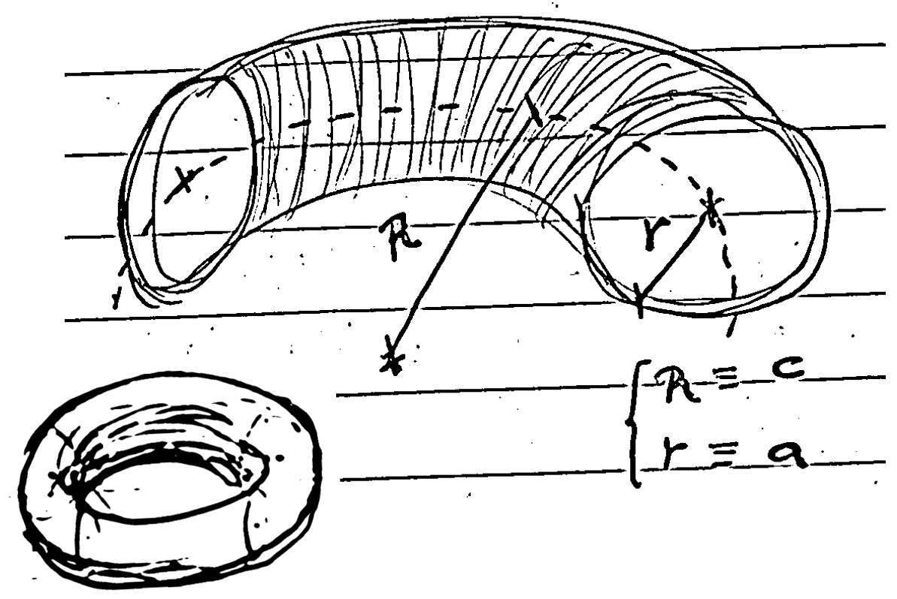
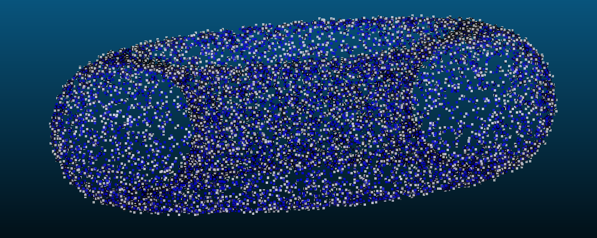
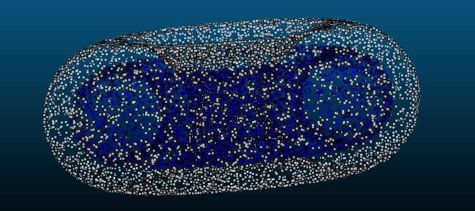
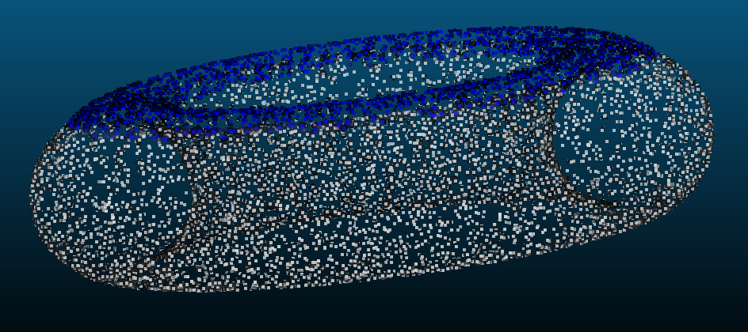

## Introduction

In our post [geometric-fitting-intuition](./geometric-fitting-intuition), we explored the topic of geometric fitting of various entities to a set of observed data points.

When dealing with the fitting of an uncentered (or even unaligned with the horizontal XY plane) torus, which is useful in some metrology applications of cylindrical parts, one encounters a non-linear equation that must be optimized using methods like Newton-Raphson, gradient descent, Gauss-Newton, or Levenberg-Marquardt (see [6]).

Nevertheless, it may be beneficial to develop an alternative approach using the tools formulated centuries ago by Brook Taylor, in order to find very efficient linear approaches that often make our lives easier.

## Paper

To the benefict of better visualization, you can access the post main content in the LaTex PDF attached below:

<script src="/assets/js/pdf.js"></script>

<div class="container text-center" id="pdf-container" style="min-height: 100%;">
  <div id="viewerContainer align-items-center">
    <div id="pdf-viewer" class="mt-6"></div>
  </div>
  <h4 class="font-weight-bold" style="text-align: right; margin-top: 5px"><a target="_blank" href="{{ '/assets/blog_pdfs/2025-01-22-torus-fit/torus-fit.pdf' }}">Open as PDF</a></h4>
</div>

<script>
  var url = '../assets/blog_pdfs/2025-01-22-torus-fit/torus-fit.pdf';

  pdfjsLib.getDocument(url).promise.then(function (pdf) {
    var viewer = document.getElementById('pdf-viewer');

    for (var pageNumber = 1; pageNumber <= pdf.numPages; pageNumber++) {
      var pageContainer = document.createElement('div');
      pageContainer.className = 'pdf-page';

      var canvas = document.createElement('canvas');
      canvas.className = 'pdf-page-canvas';
      pageContainer.appendChild(canvas);

      viewer.appendChild(pageContainer);

      renderPage(pageNumber, canvas, pdf);
    }
  });

  function renderPage(pageNumber, canvas, pdf) {
    pdf.getPage(pageNumber).then(function (page) {
      var viewport = page.getViewport({ scale: 0.2 });
      var scale = canvas.clientWidth / viewport.width;

      var scaledViewport = page.getViewport({ scale: scale });

      var context = canvas.getContext('2d');
      canvas.height = scaledViewport.height;
      canvas.width = scaledViewport.width;

      var renderContext = {
        canvasContext: context,
        viewport: scaledViewport,
      };

      page.render(renderContext);
    });
  }
</script>

## Experiments:

The code was implemented in C++ using STL and Eigen. In this section, we present some self-explanatory results and perform a subjective quality assessment of the proposed method.
```cpp
bool fitTorusUncentered(const std::vector<std::vector<double>>& puntos, double& a, double& c, double& xo, double& yo, double& zo) {
    int num_points = puntos.size();
    if (num_points < 8) {
        return false;
    }

    Eigen::MatrixXd points(num_points, 3);
    for (int j = 0; j < num_points; ++j) {
        points(j, 0) = puntos[j][0];
        points(j, 1) = puntos[j][1];
        points(j, 2) = puntos[j][2];
    }

    Eigen::Vector3d centroid = points.colwise().mean();
    const double xo_0 = centroid(0);
    const double yo_0 = centroid(1);

    const double xo_0_squared_plus_yo_0_squared = xo_0 * xo_0 + yo_0 * yo_0;

    Eigen::MatrixXd A(num_points, 8);
    Eigen::VectorXd b(num_points);
    for (int i = 0; i < num_points; ++i) {
        const double xi = points(i, 0);
        const double yi = points(i, 1);
        const double zi = points(i, 2);

        A(i, 0) = 1.0;
        A(i, 1) = 1.0;
        A(i, 2) = -2.0 * xi;
        A(i, 3) = -2.0 * yi;
        A(i, 4) = -2.0 * zi;

        const double Chi = xo_0_squared_plus_yo_0_squared - xi * xo_0 - yi * yo_0;
        const double Li = std::sqrt((xi - xo_0) * (xi - xo_0) + (yi - yo_0) * (yi - yo_0));
        A(i, 5) = 2.0 * (Chi - Li * Li) / Li;

        A(i, 6) = 2.0 * (xi - xo_0) / Li;
        A(i, 7) = 2.0 * (yi - yo_0) / Li;

        b(i) = xi * xi + yi * yi + zi * zi;
    }

    if (A.rows() == 0 || A.cols() == 0 || b.size() != A.rows()) {
        return false;
    }

    Eigen::JacobiSVD<Eigen::MatrixXd> svd(A, Eigen::ComputeThinU | Eigen::ComputeThinV);
    if (svd.rank() < 4) {
        return false;
    }

    Eigen::VectorXd params = svd.solve(b);

    xo = -1 * params(2);
    yo = -1 * params(3);
    zo = -1 * params(4);
    c = std::abs(params(6) / xo);
    a = std::sqrt(c * c / std::abs(params(0)));

    if (!(std::isfinite(a) && std::isfinite(c) && std::isfinite(xo) && std::isfinite(yo) && std::isfinite(zo))) {
        return false;
    }

    return true;
}
```

In blue, we can see a synthetic torus with values $$ a = 2 $$, $$ c = 5 $$, and in white, we can see the torus after adding Gaussian noise (mean = 0, sigma = 0.1) to each point and removing points with a 10 % probability, in order to test the robustness of the method. Additionally, the input point cloud was translated in 3D space by a distance given by the translation vector $$ (-10, 2, 5) $$. 



The following shows the fitting result (in blue the data, in white the result of the fitted torus):



The result is not so good; event though the method fitted an accurate $$ c = 4.99 $$, the value $$ a = 3.23 $$ is far from being similar to the real one. But the fitting method successfully approximated the center of the torus up to hundredth accuracy, so the linearization method did not influence its performance in estimating the centroid.

Furthermore, now we crop the input point cloud and use only the upper face (see the blue point cloud), which might be the part of the torus that is most "linear" (approximately flat region), and we perform the fitting again:



It is confirmed that, even with much fewer data, the result is more satisfactory; the root mean square error has decreased.

## Conclusions and Future Work

### This approximation has several limitations

- The **geometry of a toroid is inherently non-linear**, and linearizing it using a Taylor expansion only captures a small part of this non-linearity. This results in poor fitting for the overall toroidal shape, as the linear model can't represent the full complexity of the surface.

- A good linear approximation and solution convergence heavily depends on a good initial guess. 

- For complex geometries like this, converting the non-linear problem into a linear one **oversimplifies the fitting process**, leading to poor results in most cases.

### Then... when it could work well?
- In **small regions near the toroid**. If the points are close to a flat surface or a small portion of the toroid, the linear approximation can work reasonably well because the geometry is less curved. So it would work well in simplified models, too.

The workaround _does the trick_; it allows us to fit a set of points in 3D space to an off-centered torus efficiently to a certain degree of accurateness. Fitting a torus whose front symmetry plane has an arbitrary orientation complicates the problem significantly; the equation becomes even more complicated to express, even approximately, in a closed form. While the orientation can be integrated as a separate step by first fitting a plane as the torus's front symmetry plane, along with centering it using centroid approximation of the points, encapsulating the optimization entirely in a rigorous formulation is open for further discussion, such as the one presented here. For further exploration of this topic, refer to [7].

For better accuracy, it is encomended to use **non-linear fitting methods** (e.g., Levenberg-Marquardt or Gauss-Newton), which can handle the true non-linear nature of the toroid and provide a more robust and precise solution. The linear approximation, although efficient, should only be used in very specific, simple cases. Additionally, RANSAC-type iterations applied to either the nonlinear or the linearized method could strengthen the results, as the torus is a geometric entity that lends itself to being associated with a notion of distance/error that can be leveraged.

## References

[1] Chernov, N. (2010). *Circular and Linear Regression: Fitting Circles and Lines by Least Squares*. Boca Raton: Chapman and Hall-CRC. ISBN 978-1-439-83590-6. [Journal of the Royal Statistical Society Series A: Statistics in Society, Volume 174, Issue 3, July 2011, Page 843.](https://doi.org/10.1111/j.1467-985X.2011.00709_4.x)

[2] Birchfield, S. (2017). *Image Processing and Analysis*. 1st Edition. Cengage Learning. ISBN 978-1285179520.

[3] Schneider, P., & Eberly, D. H. (2002). *Geometric Tools for Computer Graphics*. 1st Edition. Morgan Kaufmann. ISBN 978-1558605947.

[4] Eberly, D. (2020). *Robust and Error-Free Geometric Computing*. 1st Edition. CRC Press. ISBN 978-0367352943.

[5] https://mathworld.wolfram.com/Torus.html

[6] https://www.geometrictools.com/Documentation/TorusFitting.pdf

[7] ...
