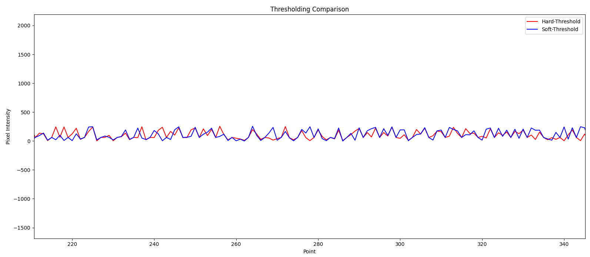
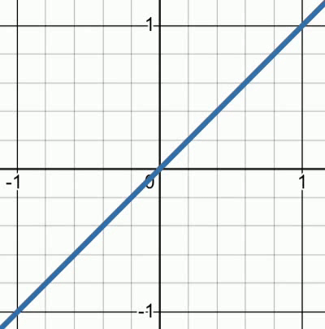

# Introduction

Loas métodos de filtrado espacial a veces ocluyen eclipsan a otras técnicas más complejas que, para las tareas que ´tipicamente se quieren resolver en la práctica en procesamiento de imagen, son suficientes herramientas sencillas, como filtros de mediana o bilateral. Pero hay una enorme gama de opciones en la literatura en lo reslativo al filtrado frecuecnial y robust statics que muchas veces se pasa por alto y merece la pena detenerse a indagar y experimentar con algunos de estos casos.

En este post discutiremos el Denoising mediante hard-thresholding y soft-thresholding a través de la Discrete Cosine Transform (DTC) de imágenes, pero directamente extrapolable a otros tipos de señales digitales.

# Methodology

La idea es eliminar los coeficientes de la DCT pequeños, pues serán los que alberguen menos información y que se asumen cercanos al ruido que contamina la imagen, pero lo que conlleva tambińe asumir que se perderán detalles agudos enmascarados junto con el ruuido, i.e. se reducirá ruido de alta frecuencia pero inevitablemente también señal. AUnque el uso de técnicas en el dominio espectral como la DCT reduce la influencia de esa última asunción, hasta cierto punto, porque recordemos que la DFT y DCT solo tienen control sobre la frecuecnia y no el espacio (muchos peros y aunques... vayamos al grano).
 
## DCT

...

## Hard-thresholding

El Hard-thresholding: Establece a cero los coeficientes DCT menores que un umbral, eliminando  agresivamente el ruido, pero puede perder detalles finos:

soft_thresholding(x) = {x ​si ∣x∣ > T, 0 si ∣x∣ ≤ T}​

Es decir, Si el valor absoluto de un coeficiente es mayor que un umbral, lo mantienes; si es menor, lo pones a cero.

## Soft-thresholding

El sfot-thresholding Reduce los coeficientes pequeños sin eliminarlos completamente a no ser que sean muy pequeños, ofreciendo una transición más suave y preservando más detalles.

hard_thresholding(x) = sign(x) ⋅ max(0, ∣x∣ − T)

Es decir, Reducir el valor de los coeficientes sin eliminarlos completamente, restando el valor del umbral.

Podemos usar Desmos para ver la diferencia entre ambas técnicas de thresholding, modificando el valor umbral $$a$$ de 0 a 1, en bucle:

# Experiments 

Now we will try various images, synthetic and real noise and compare both methods objectively and subjectively.

...

# Conclusion

Da la sensación de que el soft-thresholding potencia los detalles más pequeños que no logra potenciar el hard-thresholding, así como evita el sobre-enhancment de los detalles de gran amplitud que tiende a exagerar el hard-thresholding. Véase en la siguiente imagen:

