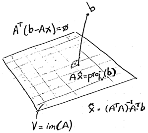

## Introduction

Many concepts for analyzing a geometric problem are applicable to other contexts. For example, in 3D problems involving the computation of distances between pairs of objects (points, line segments, triangles, tetrahedra, etc.), each type of object can be analyzed using specific knowledge about its shape. The unifying idea that brings these problems under a common framework is that objects can be parameterized using zero (point), one (line segment), two (triangle, rectangle), or three (tetrahedron, cube) parameters.
The squared distance between any two points is a quadratic polynomial in the appropriate parameters. A search within the domain of this quadratic function will lead to the parameters corresponding to the closest points on the objects, and thus to the minimum squared distance between them. This provides a powerful and generalizable approach for solving geometric fitting problems in a least-squares sense.

## Paper

To the benefict of better visualization, you can access the post main content in the LaTex PDF attached below:

  

    

  

  <h4 class="font-weight-bold" style="text-align: right; margin-top: 5px"><a target="_blank" href="{{ '/assets/blog_pdfs/2025-01-27-geometric-fitting-intuition-pt1/geometric-fitting-intuition-pt1.pdf' }}">Open as PDF</a></h4>

## References

[1] https://understandinglinearalgebra.org/sec-least-squares.html

