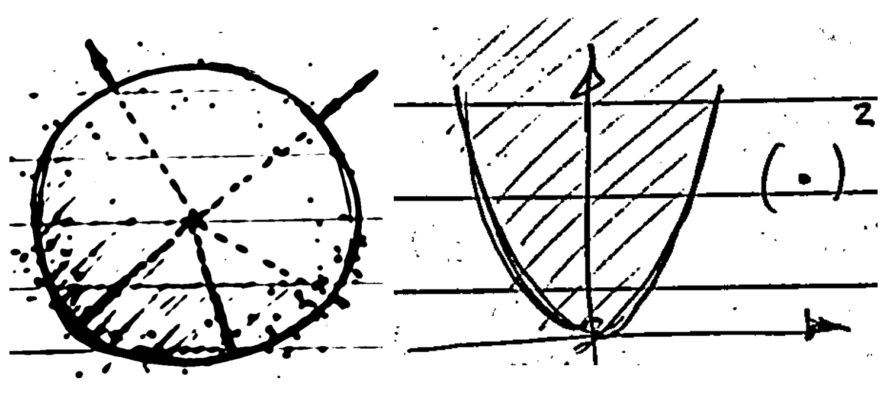

## Introduction

Fitting algorithms are a widely discussed topic in geometry processing. Circle fitting algorithms like Taubin, Chernov, and others, as well as plane fitting algorithms using least-squares, are commonly used in 2D and 3D computer vision applications to measure geometric entities or perform registration. For a comprehensive bibliographic review on this topic, see [1].

Let’s imagine a classic problem: we have a set of 2D points and we want to fit a straight line to them. Furthermore, the line that **best** fits them, in a certain sense of the word. The closed-form least-squares approach is one way of conceptualizing this **optimal fit**. The equation of a line is:

$$
ax + by + c = 0,
$$

and it is an affine mapping with respect to the $$ x $$ and $$ y $$ variables, meaning that it is not a linear function. However, the mapping is linear with respect to the $ a $, $ b $, and $ c $ variables, which will be useful to us...

Thus, the least-squares fitting problem for a line is:

$$
E(a, b, c) = \sum_{i=1}^{m} (ax_i + by_i + c)^2
$$

This can be solved in one step because it represents a parabola, which is strictly convex, as the error function is quadratic in the unknowns.

By differentiating $$E(\cdot)$$ with respect to the unknowns and setting it equal to 0, we get (thanks to the nature of this particular equation) three linear equations in the unknowns.

However, curves are usually higher-order functions than straight lines, so the error function, in the form of the sum of perpendicular distances to a curve, is not usually quadratic. Therefore, these geometric errors cannot be minimized "in a single step," but rather by using iterative nonlinear methods. However, through different approaches, it is possible to "quite well" approximate the minimization of **geometric error** with that of an **algebraic error**, typically quadratic. This categorizes fitting methods into two main families: algebraic and geometric. In general, algebraic error is a good approximation of geometric error, even as the initial seed for iterative geometric methods. See [2] for a continued discussion of these concepts.

We will gain some insight into various important geometric fitting algorithms.

## Paper

To the benefict of better visualization, you can access the post main content in the LaTex PDF attached below:

  

    

  

  <h4 class="font-weight-bold" style="text-align: right; margin-top: 5px"><a target="_blank" href="{{ '/assets/blog_pdfs/2025-01-27-geometric-fitting-intuition-pt2/geometric-fitting-intuition-pt2.pdf' }}">Open as PDF</a></h4>

## Conclusions and Future Work

We now have a slightly more formed intuition about this topic, although so far we have only glimpsed the world of geometric fitting.

__A work in progress...__

## References

[1] Chernov, N. (2010). *Circular and Linear Regression: Fitting Circles and Lines by Least Squares*. Boca Raton: Chapman and Hall-CRC. ISBN 978-1-439-83590-6. [Journal of the Royal Statistical Society Series A: Statistics in Society, Volume 174, Issue 3, July 2011, Page 843.](https://doi.org/10.1111/j.1467-985X.2011.00709_4.x)

[2] Birchfield, S. (2017). *Image Processing and Analysis*. 1st Edition. Cengage Learning. ISBN 978-1285179520.

[3] Schneider, P., & Eberly, D. H. (2002). *Geometric Tools for Computer Graphics*. 1st Edition. Morgan Kaufmann. ISBN 978-1558605947.

[4] Eberly, D. (2020). *Robust and Error-Free Geometric Computing*. 1st Edition. CRC Press. ISBN 978-0367352943.

