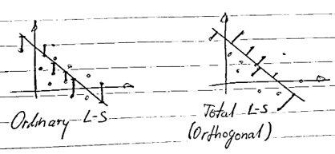

## Introduction

Whether you're interested in designing an analytical classification model, calibrating a measurement or instrumentation system quickly and easily, performing linear regression for your chemistry tasks, fitting a simple prediction model to your observed data, tracking 3D eye movements and needing a real-time mathematical model for further processing, deriving the equation of the Wiener filter, or measuring the distance between two walls or any other related task, we will explore and learn, with not much introduction, very interesting concepts about the world of geometric fitting and linear algebra, oriented towards a practical approach.

## Paper

To the benefict of better visualization, you can access the post main content in the LaTex PDF attached below:

  

    

  

  <h4 class="font-weight-bold" style="text-align: right; margin-top: 5px"><a target="_blank" href="{{ '/assets/blog_pdfs/2025-01-28-geometric-fitting-intuition-pt0/geometric-fitting-intuition-pt0.pdf' }}">Open as PDF</a></h4>

## References

[1] Schneider, P., & Eberly, D. H. (2002). *Geometric Tools for Computer Graphics*. 1st Edition. Morgan Kaufmann. ISBN 978-1558605947.

[2] Eberly, D. (2020). *Robust and Error-Free Geometric Computing*. 1st Edition. CRC Press. ISBN 978-0367352943.

[3] https://mathworld.wolfram.com/VandermondeMatrix.html
