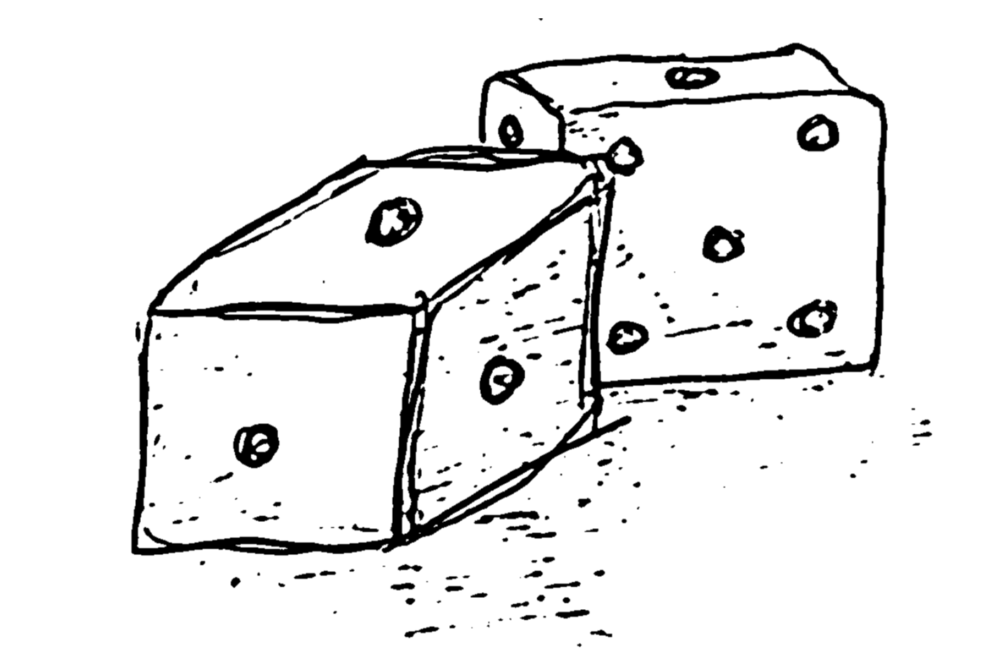

A few days ago, I came across a very interesting concept in machine learning that is worth mentioning. I am just a novice in the field, merely a student and an active enthusiast of working with ML tools, but I enjoy delving into the mathematical subtleties of many concepts in this area, and this one is an example of such cases. We are talking about **conformal prediction** (CP).

AI is often criticized for being unreliable in critical or industrial systems. "If you don't know how it reaches the solution, why should we trust it?". For some time now, we have been learning that we can indeed trust, and a lot, artificial intelligence systems designed to follow statistically grounded paradigms: they can **give us assurance that they provide good guarantees** for their predictions. Whether it's a linear regressor, an SVM, or a deep neural network, the goal is to make model predictions more reliable.

## Introduction

CP is a technique focused on improving the performance and reliability of _ML models_. Yes, _almost any_ model or algorithm, whether machine learning, deep learning, or statistical learning, designed to make predictions. It is an easy-to-understand and implement paradigm that guarantees better decision-making and solution effectiveness.

More than just a technique, it encompasses a whole framework of tools aimed at enhancing the reliability and interpretability of ML models. Every inference carries with it uncertainty, and very rarely do engineers/scientists in computer science stop to analyze the reliability of the results: if my classifier "hits the mark" 98% of the time, I’ll settle for that. But tomorrow, a cat dressed as a dog might come along, and we could be sold a lie.

Put in more formal terms, this means that the (best) models and AI systems not only need to make predictions, but also quantify the validity (uncertainty) of those predictions. Would I be willing to throw a part into scrap if the prediction tells me it's defective with a 20% chance? Maybe not. Going further, in a more common application: imagine an automatic stock trading system where a model predicts (in the future) the price of a stock. It may happen that a specific prediction resembles an outlier due to the high randomness of the stock market. Therefore, it would be useful for the AI system to be capable of estimating a range that guarantees the real value with high probability, allowing the trading system to estimate the best and worst alternatives and make sensible decisions adaptively in truly uncertain situations.

## How it works?

The basic idea is to convert the algorithm's prediction value into prediction sets, meaning that instead of making a single prediction, it generates a range of values that, with high probability (certainty), contains the real value. CP techniques are designed to work well even with a limited amount of data, guaranteeing that the real value falls within the range with a predefined probability, making models more robust and useful in scenarios where uncertainty is high, such as in financial markets or medical diagnoses.

The prediction regions (or intervals) produced by CP are statistically valid, and only the exchangeability of the data is assumed, meaning that the order of the data does not influence the model's results. CP works by computing nonconformity scores on previously labeled data and using them to create prediction sets for new, unlabeled data. Thus, unlike traditional methods that offer a single prediction, conformal prediction generates prediction intervals, highlighting the uncertainty involved.

CP quantifies uncertainties in AI systems. Given an input data set, the technique estimates (with both cases being equivalent):
- A prediction interval in **regression** problems
- A class set in **classification** problems

## History

The history of CP is mostly clustered in recent years, thanks to the explosion driven by the world of ML, but it actually dates back to 1998, when Vladimir Vovk, Alexander Gammerman, and Vladimir Vapnik [1] proposed a transductive version of CP (i.e., a type of inference where reasoning is based on observed, specific (training) cases to specific (test) cases). From there, the framework has evolved and branched out. The master reference on the topic is provided by Vovk et al. in 2005 [2]. Larry Wasserman brought conformal prediction into the statistics community, along with collaborators like Jing Lei, in numerous studies since the mid-2010s [3-5]. A recent overview of the topic is given in [6].

### Theory

Imagine you are playing a game where you try to predict whether a die will land on an even or odd number. You have played this game many times, and with each roll, you learn a little more about how the die works. **CP** is like using everything you have learned from previous rolls to make a prediction for the next roll.

But instead of saying, "The next roll will be even," you create a "confidence range." That is, you don't just make a concrete prediction (like "even"), you say, "The next roll will probably be even, but it could also be odd with a certain probability." And the more you learn about the die, the more accurate your prediction range will be.

For the conformal prediction to be valid, it must satisfy the coverage property, which says that, by making that prediction, the **real value** (the number that actually appears when you roll the die) **must fall within the range** you predicted in most cases. This means that if you say the next roll has a 95% chance of being even, then, 95% of the time, that real number **should** be even.

Formally, this is expressed as:

$$
    P(Y_{n+1} \in \tau(X_{n+1})) \geq 1 - \alpha
$$

Where:

- $ P(Y_{n+1} \in \tau(X_{n+1})) $ is the probability that the real number falls within the range you predicted.
- $ \tau(X_{n+1}) $ is the prediction range for the next roll.
- $ 1 - \alpha $ is your confidence level (e.g., a 95% confidence).

So, if your confidence is 95% ($ \alpha = 0.05 $), that means the real value must fall within your prediction range 95% of the time.

The **efficiency** in this case refers to how small or large your predicted range is. If you can make a precise and very narrow prediction, that means your prediction is efficient. For example, if you know the die has a 95% chance of landing on an odd number, but you could also predict between "odd" and "even," this would be less efficient because the range would be larger.

The main assumption of CP is that the **data are exchangeable**. This means you don't need to assume that previous results follow exactly the same pattern every time (like in a traditional learning model). It is a more flexible assumption that allows working with more types of data.

To make a conformal prediction, you first need a **scoring function**: a rule to measure how reliable your prediction is.

- **In regression**, this score measures the **difference** between what your model predicted and what actually happened. In short, how far off was your prediction from the truth?

- **In classification**, the score measures how confident your model is in its answer. For example, if the model says "there is an 80% chance it’s even," the score would measure how close it was to reality.

Once you have your scores (i.e., how wrong your previous predictions were), you calculate a **percentile** to determine how large your prediction range should be. The $(1 - \alpha)$ percentile gives you the threshold beyond which you would not accept a prediction as valid.

Finally, you create the **prediction range** for the next instance. This range will include all values $ Y $ whose score is less than this percentile value, ensuring that your prediction is reliable with the desired confidence level.

For example, if you get a score of $ \hat{e} $, then your prediction set for the next roll would be:

$$
    \tau(X_{n+1}) = \{ Y : s(X_{n+1}, Y) \leq \hat{e} \}
$$

This set includes all possible answers $ Y $ that fall within a range that gives you a high probability of being correct, based on what you have learned from previous rolls.

## Extensions of CP

- **Inductive Conformal Prediction (ICP)**: To improve computational efficiency, Inductive Conformal Prediction (ICP) is introduced, which splits the dataset into a training subset and a calibration subset, avoiding the need to retrain the model for each new prediction.
- **Mondrian Conformal Prediction (MICP)**: In this method, non-conformity scores are calculated in a class-dependent manner for classification problems, allowing more tightly adjusted prediction sets for each class.

## Application

For an updated use case, see [8]. This method allows us to quantify and communicate uncertainty, shifting the question from "What will happen?" to "What is likely to happen, and how confident are we about it?"

The approach is flexible, model-agnostic, and works across various scenarios. It uses calibration data, non-conformity measures, and prediction intervals to ensure reliable predictions, with specified confidence levels (e.g., 95%). However, challenges include ensuring proper calibration across different datasets and accounting for the assumption of interchangeability in the data.

Conformal prediction is particularly useful in high-stakes fields, offering a clearer understanding of prediction limits and helping make more informed decisions.

Let’s look at two example frameworks...

### Classification Example

In classification problems, conformal prediction generates a set of classes rather than a single label. For example, if a model predicts that an image belongs to one of the following classes with high probability:

$$
    \tau(X) = \{ \text{Cat, Dog} \}
$$

this indicates that the model does not have enough certainty to differentiate between these two classes.

### Regression Example

In regression, conformal prediction generates prediction intervals. For example, if the model estimates that the price of a stock will be:

$$
    \hat{Y} = 100
$$

and the generated prediction interval is:

$$
    [\hat{Y} - 5, \hat{Y} + 5] = [95, 105]
$$

this means that the true price will fall within this interval with a probability of $ 1 - \alpha $.

# Conclusion

Conformal prediction provides an accurate approach to measuring uncertainty in machine learning models, offering a confidence range based on past experience. This approach ensures that the real value has a high probability of falling within this range, making the prediction robust and reliable. While it can be computationally expensive in some cases, its variants allow it to be applied in practical situations.

## References

[1] Gammerman, Alexander; Vovk, Vladimir; Vapnik, Vladimir (1998). "Learning by transduction". Uncertainty in Artificial Intelligence. 14: 148–155.
[2] Vovk, V., Gammerman, A., & Shafer, G. (2005). Algorithmic learning in a random world. Springer. https://doi.org/10.1007/b106715
[3] Lei, J., Rinaldo, A. & Wasserman, L. A conformal prediction approach to explore functional data. Ann Math Artif Intell 74, 29–43 (2015). https://doi.org/10.1007/s10472-013-9366-6
[4] Jing Lei and Larry Wasserman. Distribution-free prediction bands for non-parametric regression. Journal of the Royal Statistical Society: Series B, 76(1):71–96, 2014
[5] Jing Lei, Max G’Sell, Alessandro Rinaldo, Ryan J. Tibshirani, and Larry Wasserman. Distribution-free predictive inference for regression. Journal of the American Statistical Association, 113(523):1094–1111, 2018.
[6] Anastasios N. Angelopoulos and Stephen Bates. A gentle introduction to conformal prediction and distribution-free uncertainty quantification. Foundations and Trends in Machine Learning, 16(4):494–591, 2023
[7] Shafer, G., & Vovk, V. (2008). A tutorial on conformal prediction. Journal of Machine Learning Research, 9, 371–421.
[8] [Conformal Prediction: An introduction to measuring uncertainty](https://www.bbvaaifactory.com/conformal-prediction-an-introduction-to-measuring-uncertainty/)
[9] [Valeriy Manokhin's course](https://maven.com/valeriy-manokhin/applied-conformal-prediction)
