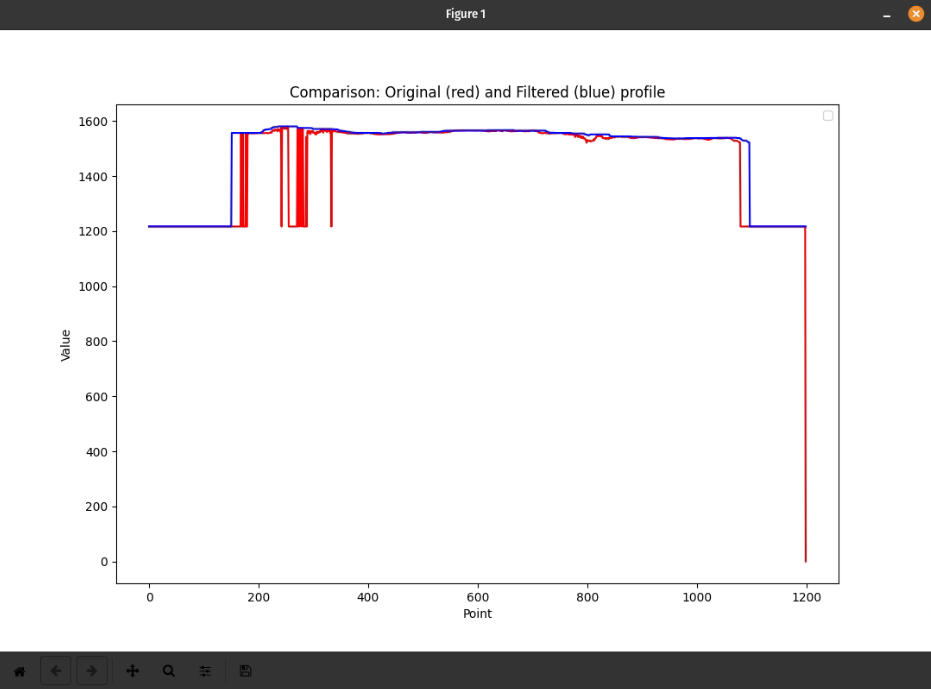

# Introduction

Today, I'd like to share and document what I consider the best library for quickly plotting 1D signals in C++.

Compared to other alternatives like QWT or Qt's own libraries, the header-only library matplotlibcpp is extremely simple, free of errors, and as transparent to use as its Python counterpart.

# Matplotlibcpp

Available on [GitHub](https://github.com/lava/matplotlib-cpp), this plotting library mirrors the plotting API used by Matlab and matplotlib. Let's give it a try in Qt.

Specify directories where the compiler should look for header files during compilation:
```pro
INCLUDEPATH += /opt/matplotlib-cpp
INCLUDEPATH += /usr/include/python3.10
```
Specify additional libraries to link against:
```pro
LIBS += -lpython3.10
```

Now, let's move to our ```main.cpp```. First, include our encapsulated library:
```cpp
#include <matplotlibcpp.h>
```

For convenience, use the plt namespace, just like in Python:
```cpp
namespace plt = matplotlibcpp;
```

Create a structure to make the code modular and more understandable: 
```cpp
struct PlotData {
    std::vector<double> u;
    std::vector<double> f;
    std::mutex mtx;
    double timestep_s = 0.001;
    bool update_plot = false;
};
```

Since we don't want our visualization process to interfere with other tasks in the main thread, let's create a function that will run in a secondary thread:.
```cpp
void plotThread(PlotData& plot_data) {
    plt::figure_size(1080, 720);
    while (true)
    {
        std::lock_guard<std::mutex> lock(plot_data.mtx);
        if (plot_data.update_plot)
        {
            std::vector<double> x_samples(plot_data.u.size());
            for (int i = 0; i < (int)plot_data.u.size(); ++i)
                x_samples[i] = static_cast<double>(i);
            plt::clf();
            plt::plot(x_samples, plot_data.f, "r-");
            plt::plot(x_samples, plot_data.u, "b-");
            plt::title("TV denoising evolution");
            plt::xlabel("Punto");
            plt::ylabel("Valor");
            plt::legend();
            plt::draw();
            plt::pause(plot_data.timestep_s);
            plot_data.update_plot = false;
        }
    }
}
```

Later, in any function or context where we want to display the figure, we can simply use multithreading libraries like ```std::thread``` to plot our data:
```cpp
size_t N = u.size();
PlotData plot_data;
plot_data.f = f;
plot_data.timestep_s = 0.001;

std::thread plot_thread;
if (showResults)
    plot_thread = std::thread(plotThread, std::ref(plot_data));

```

To test the library, we'll synthesize a 1D signal and filter it to show the results before and after. For curiosity's sake, we'll use a moving average filter, but we won't detail how it works in this post.

We'll need a one-dimensional grid for the abscissas and another for the ordinates:
```cpp
std::vector<double> xValues(noisy_signal.size());
for (size_t i = 0; i < xValues.size(); ++i)
    xValues[i] = static_cast<double>(i);
plt::figure_size(1080, 720);
plt::plot(xValues, noisy_signal, "r-");
plt::plot(xValues, smooth_signal, "b-");
plt::title("Comparison: Original Profile (red) vs Filtered (blue) " + std::to_string(profileNumber));
plt::xlabel("Point");
plt::ylabel("Value");
plt::legend();
plt::show();
```

Our noisy signal looks like this:
```cpp
for (int i = 0; i < profile.cols; ++i)
    noisy_signal.push_back(profile.at<double>(0, i));

std::vector<double> xValues(noisy_signal.size());
for (size_t i = 0; i < xValues.size(); ++i)
    xValues[i] = static_cast<double>(i);
plt::figure_size(1080, 720);
plt::plot(xValues, noisy_signal, "r-");
plt::title("Original profile");
plt::xlabel("Point");
plt::ylabel("Value");
plt::legend();
plt::show();
```


<p>The library even integrates buttons for zooming, detrending, or translating the graph!</p>


<p>After applying our filter, we may want to graph both on the same scale to compare them. We can do it simply and easily:</p>



Of course, by moving the functions to other threads, we can see the evolution of the filtering within the processing loop:
```cpp
void filterSignal(std::vector<double>& u, const std::vector<double>& f, int iterations, bool showResults) {
    size_t N = u.size();
    PlotData plot_data;
    plot_data.f = f;
    plot_data.timestep_s = 0.001;

    std::thread plot_thread;
    if (showResults)
        plot_thread = std::thread(plotThread, std::ref(plot_data));

    for (int iter = 0; iter < iterations; ++iter) {
        std::vector<double> u_new(N);

        u_new = processMySignal();

        u = u_new;

        if (showResults)
        {
            std::lock_guard<std::mutex> lock(plot_data.mtx);
            plot_data.u = u;
            plot_data.update_plot = true;
            std::this_thread::sleep_for(std::chrono::milliseconds((int)(plot_data.timestep_s * 1000) * 2)); // Applying Nyquist Theorem, sending data at double the display rate
        }
    }

    if (showResults)
        plot_thread.join();
}
```

The resolution is very high, and the widget's response is dynamic. There's no risk of the application freezing, as per my experiments with it.


