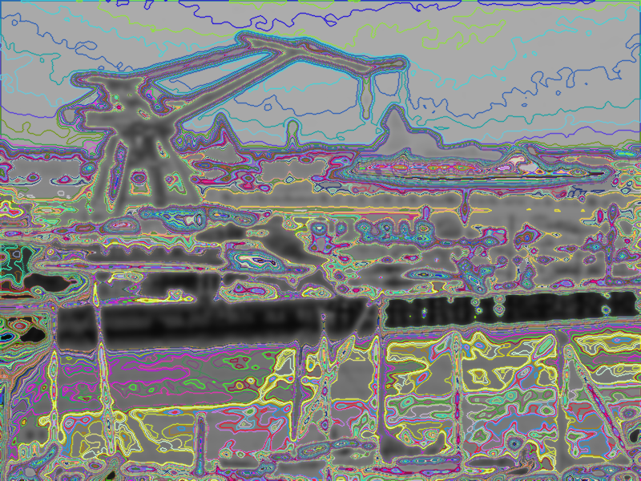

# Introduction

In the field of image processing, the ability to detect and represent object contours and regions of interest is crucial, whether in face detection, background removal, enhancing object tracking in video, or MRI applications where complex scans of brain structures need to be studied. The **boundaries or contours** of objects are effectively captured by a mathematically powerful framework, the level set method, which provides a continuous and flexible way to represent curves and surfaces. In this post, we will provide an intuition of this technique.

Before level sets, lets first dig in the concept of **_isocontour_**. This concept is very intuitively understood; imagine an image as a mountain. The mountain is not a perfect inverted parabola, on the contrary, it has significant relief and texture; there are small and large stones along the path, bumps and ridges, gravel and sand act as sinks, rock formations create different levels in the terrain, there are even rivers and meanders that vary the average height of the mountainous surface, etc. When it rains, we experience that some areas "fill" before others. If we do some geoengineering and manage to provoke rain for a controlled period of time, we will see that multiple water paths have formed on the mountain, each flowing through different places but connected through the water molecules' connections within the same current. Each path with equal flow can be seen as a level set.

In digital images, its domain (typically grid-based) is mapped into a discrete set of values, e.g., {0, 255} if we are dealing with grayscale intensity levels. By zooming into an image, we will see that there are paths of "same grayscale", some more extended than others. Each of these paths, formed by pixels connected under a **certain notion of neighborhood**, is called a level set. In this post, we will see why they are so important and some of their most common uses.

We can begin drawing the concept of level sets by creating isocontours at various threshold levels of a grayscale image. The provided code generates **distinct pixels sets** by applying thresholding and then finding the contours at each threshold level. The contours are drawn with different colors, highlighting how the boundaries evolve at different intensity levels in the image.

Let's test this with the following image:


How many isocontours might it have? Easy, 4, if we count the edge (exterior) of the image. And we can draw them:


And that's it, this image doesn't have more isocontours (let's assume the color is really uniform as it was synthetically generated, and let's not zoom in too much on it...). You don't believe this? Let's show its histogram. 


Although it's a work in progress to create a nicer histogram, the image doesn't have more than 4 gray levels; that is the number of isocontours.

A more complex example is shown below:


As a curiosity, we used a ```std::set``` and a custom comparison criterion to iterate through the image pixels and assign a unique color to each level set:
```cpp
struct ScalarComparator {
bool operator()(const cv::Scalar& a, const cv::Scalar& b) const {
    if (a[0] != b[0]) return a[0] < b[0];
    if (a[1] != b[1]) return a[1] < b[1];
    return a[2] < b[2];
}
};

std::set<cv::Scalar, ScalarComparator> usedColors;

auto getUniqueColor = [&usedColors]() -> cv::Scalar {
static std::random_device rd;
static std::mt19937 gen(rd());
std::uniform_int_distribution<> dis(0, 255);

cv::Scalar color;
do {
    color = cv::Scalar(dis(gen), dis(gen), dis(gen));
} while (usedColors.find(color) != usedColors.end());

usedColors.insert(color);
return color;
};
```

But wait... _aren't we cheating a bit?_ Aren't we predefining the number of isocontours that (we know, or something) the image has? Yes, and this was just for illustrative purposes. What we should do is analyze the number of "independent intensities" in the image to figure out how many level sets it should have. We will use the following image:


Its histogram and the number of level sets that we get are (approx.) the following:


They look something like this:


We found: 244 unique intensity values, i.e., 244 isocontours. That's quite a few! But they look somewhat off, maybe due to the presence of noise... Let's smooth the peppers a bit and try again:


Its histogram and the number of level sets that we get are (approx.) the following:


They look something like this:


This time we found: 226 isocontours. Since the image has been smoothed with a Gaussian, it has moved one step closer to its equilibrium state, so the number of level sets has decreased, and with that, the total variation (we will talk about this later). At least now it looks more visual.

Although we are only visually simplifying the concept of level sets, let’s take the exercise of asking ourselves a different question. Instead of asking, "If I specify the isocontours by setting the range of gray levels that generate them?", what about more abstract questions like "What if I specify the isocontours through other intrinsic properties of the image?" What attributes and methods can guide certain curves to form visually reasonable isocontours that separate structures that may resemble the objects in the image? **Level sets** are precisely tools that allow us to provide a robust answer to these abstract suggestions.

# Level sets

When working with images from a fascinating **mathematical-applied perspective**, explicit computational representation often proves insufficient and crude. It becomes necessary to rely on a mathematical representation in order to leverage mathematical tools through functions that appropriately characterize the properties of the image (such as piecewise smoothness) and natural scenes (richness in low frequencies) [7].

Throughout the history of science, the world that humans experience has been hypothesized through countless **models**, which have been tested over time. A typical model for images assumes that they are at least twice differentiable, meaning that (at least in a weak sense) the gradient and curvature of the image are well-defined throughout its entire domain (for all pixels). Based on this representation, images can be viewed as collections of level sets corresponding to certain intensity values; that is, for each brightness value, there exists a set of "companion" pixels (i.e., level sets).

Consider a grayscale image as a function with the aforementioned characteristics (at least twice continuously differentiable) and define the **level set** as the set of positions (pixels) in the image that share a specific brightness level. This is akin to partitioning the image into regions based on intensity, as we previously introduced with the equivalent concept of **isocontours**. In this way, the image can be represented as a family or collection of all the level sets, which depend on the "intensity" parameter.

This representation leads to the image domain being partitioned as the joint union of all disjoint level sets. Notice that with this type of representation, the normal vector to each level set is given by the gradient of the **image**. Since the curvature of a curve is defined as the rate of change of the unit normal vector along the curve, we obtain a fundamental relationship between these two geometric concepts. This connection can help constrain the solutions of our variational formulations in image processing problems from a mathematical perspective.

# Mathematical intuition

Level sets are extremely important in image processing from a variational perspective. Variational methods aim to minimize or maximize certain functionals to solve specific problems. In the case of level sets, the evolution of the contour is driven by the **minimization** of an energy functional, often related to the **length of the boundary**. This method naturally adapts to the underlying image structure, offering advantages in terms of robustness and flexibility in dealing with complex shapes.

Let $$ u = u(\mathbf{x}) $$ and $$ f = f(\mathbf{x}) $$ be two scalar functions defined in $$ \mathbb{R}^n $$, where $$ u $$ is our image. Assume that $$ u $$ is Lipschitz continuous (i.e., it "does not change too fast") and that for almost every $$ \lambda \in \mathbb{R} $$, the level set $$ L_\lambda = \{ \mathbf{x} \in \mathbb{R}^n : u(\mathbf{x}) = \lambda \} $$ is a smooth hypersurface of $$ n-1 $$ dimensions in $$ \mathbb{R}^n $$. Also assume that $$ f $$ is continuous and integrable. Thus, it can be shown that the **co-area formula** holds, which can be represented as:

$$
\int_{\mathbb{R}^n} |\nabla u| f \, dx = \int_{-\infty}^{+\infty} \left( \int_{L_\lambda} f \, ds \right) d\lambda,
$$

The co-area formula is a powerful tool for functional analysis. It tells us that there is a natural connection between the total variation (TV) of an image and the perimeters of its level sets.

For the specific case when $$ f(\mathbf{x}) = 1 $$ and the region of integration is a subset $$ \Omega \subset \mathbb{R}^n $$, we have:

$$
\int_{\Omega} |\nabla u| \cdot 1 \, dx = \int_{-\infty}^{+\infty} \left( \int_{L_\lambda} 1 \, ds \right) d\lambda = \int_{-\infty}^{+\infty} \text{Per}(L_\lambda, \Omega) \, d\lambda,
$$

where $$ \text{Per} $$ represents the perimeter. This result shows that the total variation of an image is simply the sum of the lengths of each of its level sets. Instead of integrating directly in $$ \mathbb{R}^n $$, we can first integrate over each level set $$ L_\lambda $$, which represents all points where the image value is $$ \lambda $$, and then integrate over the values of $$ \lambda $$.

In this way, the contribution of all the discontinuities (jumps) in the image are taken into account when calculating the value of the integral, ensuring the contribution of the edges in the image model given by the TV. This does not happen in other image models, where the **edges** (gradients) are highly **penalized** (as is the case, for example, with the squared Euclidean norm); using these models in image processing generally results in undefined edges. This is part of the reason why level sets are so important for the application, which will be discussed further later.

We will verify this empirically. We will begin by calculating the level sets of the following image, accumulate the perimeters of each one, and also calculate the total variation (both isotropic and anisotropic) over the entire domain using a simple backward difference scheme.

Here is our image:


And here are the histogram and the level sets (it has 256):




The **perimeter** value is 1.01907e+06 (pixels), and the **total variation** value is 1.01668e+06 (isotropic) and 1.20593e+06 (anisotropic). The theorem does not seem to hold precisely. If we look closely, the model assuming $$ u(x, y) \in C^2(\Omega) $$ does not fit very well with this image, which contains a considerable amount of edges, rapid intensity jumps, impulsive and white noise (among others), and, above all, low resolution, leading to strong discretization and quantization effects that undermine continuous modeling. However, if we instead use a smoother function (image) — a 2D Gaussian, which is certainly of bounded variation (BV) — like the one below, let's see what happens...:


And here are the histogram and the level sets (it has 256):


The **perimeter** value is 570025 (pixels), and the **total variation** value is 610659 (isotropic) and 662554 (anisotropic). Although everything suggests that the values are now converging, the theorem is still approximately holding due to the reasons mentioned earlier, derived from discretization and digitalization.

# What do we need level sets for?

The level set formulation is based on the observation that **a closed curve $$ f(s) $$ can be seen/described as a zero level(s)/crossing(s) of a function $$ \varphi(x, y) $$ in a higher dimension** (often called *characteristic function* or *embedding function*) and it allows major simplification, easily changing topology and incorporating region-based statistics, which other parametric methods do not allow. That is, it uses an implicit representation of contours by evolving a level set function, often used in segmentation problems. **Level sets** allow for the dynamic modeling of contours that can split, merge, and move over time, making them a powerful tool for capturing complex shapes in images. In the context of image processing, level sets can be used to extract meaningful regions, detect edges, and segment images into distinct areas. Today, this is a widely used way to evolve curves and surfaces numerically [4].

Level sets evolve to track and adjust to objects of interest by modifying the underlying function $$ \varphi(x, y) $$ instead of $$ f(s) $$. To reduce the amount of computation required, only a small strip (frontier) around the locations of the current zero-crossing needs to be updated at each step, which results in what are called fast marching methods [6].

For example, a curve in $$ \mathbb{R}^2 $$ can be represented as the zero-level line of a function $$ \mathbb{R}^2 \to \mathbb{R} $$, e.g. the signed distance to the curve, negative inside and positive outside, as int he header image shown at the top of the post.

Mathematically, let us assume that the unknown set of edges $$ K $$ is the boundary of an open and bounded subset of $$ \Omega $$; thus $$ K $$ can be represented by $$ K = \{ \mathbf{x} \in \Omega : \varphi(\mathbf{x}) = 0 \} $$ for some (unknown) Lipschitz continuous function $$ \varphi : \Omega \to \mathbb{R} $$, called a level set function. More "continuous" conditions such as higher resolution and a method for calculating the sub-pixel contour length, among others, could help the formula hold more precisely, but we will move on to discuss another interesting issue...

## Segmentation

The main purpose of segmentation is to find the contours of objects in images particionándola en regiones disjuntas. Two very established paradigms of image segmentation, within the framework of active contours, are **_parametric model_s** (like the *snakes* of Kass, Witkin, and Terzopoulos and **intelligent scissors** (Mortensen and Barrett 1995) [5-6]) and **_geometric deformable models_** (like **Geodesic Active Contours** [GAC] by Caselles, Kimmel, and Sapiro) [1-3]. The latter are formulated to address the limitations of the former and are based on the evolution of curves (or surfaces) with a formulation grounded in level sets. This evolution is guided by geometric measures.

Thus, the main purpose of segmentation through GAC and level sets is to model the contours of objects as curves that (typically) must move with a certain speed to match the highest gradients. The level set evolution for a GAC, the characteristic function **φ** is updated based on the curvature of the underlying surface modulated by an edge/speed function g(I), as well as the gradient of g(I), thereby attracting it to strong edges [6].

The problem is that dealing with the evolution of the curve in the image explicitly (i.e., parametrizing the curve and discretizing its equations) can be costly; that's why one of the main advantages of GAC is that it can be formulated as a *level set* problem, which tackles that difficulty. A **level set** defined by $$ \phi $$ can be defined as follows:

- $$ \phi(x, y) = 0 $$ for all points $$ (x, y) $$ that are on the curve.
- $$ \phi(x, y) > 0 $$ for points inside the region delimited by the curve.
- $$ \phi(x, y) < 0 $$ for points outside the region delimited by the curve.

Thanks to this implicit representation, important geometric attributes can be calculated, such as:

1. The **unit normal** to the curve:
$$
N = \frac{\nabla \phi}{|\nabla \phi|}
$$

2. The **mean curvature** $ \kappa $, which is given by the divergence of the unit normal:
$$
\kappa = \nabla \cdot N = \text{div} \left( \frac{\nabla \phi}{|\nabla \phi|} \right)
$$

The GAC method is based on an evolution equation of the form:

$$
\frac{\partial \phi}{\partial t} = g(I) \left( |\nabla \phi| \cdot \text{div} \left( \frac{\nabla \phi}{|\nabla \phi|} \right) \right) + \beta \cdot g(I) |\nabla \phi|,
$$

where:
- $$ g(I) $$ is a function based on the image gradient that acts as a stopping criterion, i.e., it halts the evolution when the curve encounters a strong edge.
- The first part of the equation contains the mean curvature term, which smooths the curve.
- The second part contains a normal velocity term $$ V $$, which moves the curve according to the content of the image.

# More?

This formulation allows the curve to evolve flexibly, splitting or merging without explicit intervention. Thus, the level set-based method overcomes the limitations of traditional parametric methods in image segmentation. The GAC model heavily relies on image edge information, so it is practically not applicable in images with poorly defined edges. Additionally, as it depends on local measures such as image gradients, it is susceptible to local minima. The pioneering **Chan-Vese** model is a variant of Active Contours and can be applied without the need for edges. Highly remarkable is the **Mumford-Shah** model too, both deserving of their own dedicated posts. Such approaches tackle this problem by making the energy measure the consistency of image statistics (e.g., color, texture, motion) inside and outside the segmented regions [6].

# References

[1] J.A. Sethian, *Level Set Methods and Fast Marching Methods: Evolving Interfaces in Computational Geometry, Fluid Mechanics, Computer vision, and Materials Science* (Cambridge University Press, Cambridge, 1999).

[2] S. Osher, R. Fedkiw, *Level Set Methods and Dynamic Implicit Surfaces* (Springer, Berlin, 2002).

[3] R. Kimmel, *Numerical Geometry of Images: Theory, Algorithms, and Applications* (Springer, Berlin, 2012).

[4] Guy Gilboa, Nonlinear Eigenproblems in Image Processing and Computer Vision, 2018, p. 29.

[5] Gilles Aubert, Pierre Kornprobst, Mathematical Problems in Image Processing: Partial Differential Equations and the Calculus of Variations, 2010, p. 173.

[6] Richard Szeliski, Computer Vision: Algorithms and Applications, 2nd ed., 2022, p. 470.

[7] Carlos Brito Loeza et al., Introducción a los Métodos Variacionales en Procesamiento de Imágenes: Filtros de Ruido, 2014.
