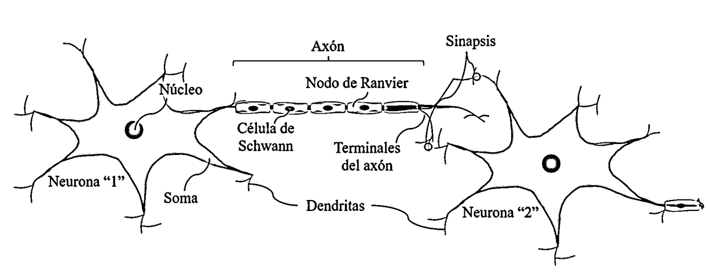

Richard Feynman had a very simple way of explaining how he would explain complex concepts to people who had no knowledge about the topic, or to anyone in general. The typical thing that is said is that if you can’t explain it to an elderly person (many people like to use the example of their grandmother), you don’t understand it. This comes from the quote by Albert Einstein: "If you can't explain it simply, then you don’t understand it well enough." I don’t like this point of view; it seems incomplete to me. Feynman, for his part, tells us that his (very useful) recipe for success is as follows:

1. **Explain (literally) the concept to a small but smart child**: Imagine you’re explaining the topic to an 8-year-old, like your cousin. Use simple language, analogies, and examples that make it easier to understand. The goal is to simplify it as much as possible.

2. **Reflect on what you’ve explained**: After giving that explanation, take some time to reflect on what you said. Ask yourself if you truly understand every part of the concept. This reflection period allows you to see the problem from a different perspective, as you become aware of the gaps in your knowledge when you compare what you thought you understood with what you can actually explain.

3. **Explain it again, but simpler**: Now, after that reflection, repeat the explanation but with more clarity and simplification, focusing on the parts you might have overlooked or didn’t understand completely. In this step, you’ll be more aware of the details that in the first explanation you might have overly simplified.

So formally, Feynman's technique is a method of learning and understanding that involves explaining a new concept to an imaginary child in order to identify gaps in your understanding and reinforce what you’ve learned. During the pause between steps 2 and 3, your brain has seen the problem retrospectively; you’ve already told the child what you thought was a brilliant simplification of the problem, so in step 3, in addition to simplifying further, you’ll consciously or unconsciously highlight details that in the first iteration you might have overlooked, trying to "patch" those concepts you didn’t explain well to the child, even if you didn’t know it. Be sure that after that second explanation, you’ll be able to apply Einstein's criterion!

---

# But, what is a neural network?

Convince yourself, friend, if you’re reading this, you’re going to have to explain this (if it’s not too late) to someone who has no idea what the answer is. I’ll try to write what I would say; in fact, this serves as preparation for the situation. And let’s be honest, right now I feel kind of bored.

Imagine you’re in your second year of university, attending a Calculus II class on double integrals. You’ve been assigned a terribly complicated task about parameterizing a volume of revolution that you don’t know how to approach, so you start asking your classmates for their opinions on how they would approach it: your classmate, who knows less than you, says something that makes no sense, so you’re stuck; the repeat student acts all smart and you’ve noticed he was saying nonsense; the smart student of the class tells you to use something called "Jacobian in cylindrical coordinates," so you write it down... After questioning your 15 classmates, you gather what seems to be good ideas in your notes and request a tutoring session with the professor. The next day, in his office, he suddenly grabs the notebook and rips your paper in half to pick the one thing worth mentioning from your 32 notes. Why? Because 16 students have already asked him for the same tutoring!

What we just recreated is a very bad metaphor of what a neural network is and how it works. Let’s try again:

Imagine you’re a chef trying to improve a pasta recipe. You know that the basic thing is making a good sauce, but you’re not sure what spices to use to make it taste the best. So you decide to experiment with different combinations of spices. You have a lot of ingredients, and at first, you don’t know what’s going to work. But after trying several times, you realize that, for example, a hint of basil works wonders, and black pepper brings out the flavor just the way you need it. With each attempt, you learn what combination has the biggest impact on the final flavor. So you adjust your ingredients and keep improving your recipe!

This is a slightly better metaphor (at least clearer) because we’ve learned from the mistakes we made when explaining it the first time (remember Feynman!). Let’s try again; I promise (_written a posteriori_) that this will be the last iteration...

Imagine that you’re a detective solving a mystery. You have lots of clues, but you don’t know if they’re relevant. At first, some of them don’t seem to make sense, and others lead you down the wrong paths. But as you go on, you learn to identify which clues are more important and how they connect with each other. Each clue gives you a small part of the solution, and little by little, you piece the puzzle together. In the end, you have everything solved and the mystery completely clear!

Okay, this metaphor _now completes everything_. At this point I’m sure you understand what a neural network is without the need to even mention technical terms (not a single one) like bias, weight, neocognitron, perceptron, hidden layer, dense layer, backpropagation, etc... Still not clear? Alright, then check this out ~~and explain the joke~~ bridge the narrative to technical concepts. In the next section we will certainly explain how a neural network works through our metaphors.

---

## 1. The Student’s Lesson: From Intuition to Error Correction

Imagine you’re in your second year of university, struggling with a challenging Calculus II problem. You ask your classmates for help, and while each offers a piece of the puzzle, you soon realize that what you thought you understood isn’t quite right. In neural network terms:

- **Initial Understanding vs. Reality:**  
  The gap between what you believed you knew and what your classmates’ insights reveal is akin to the **cost function** (or loss function) in a neural network. This function quantifies the error—the difference between the network’s prediction and the correct answer.

- **Collecting Perspectives:**  
  Each classmate’s input acts like a **linear combination** of inputs in a neuron. Just as the student gathers ideas from many sources, a neuron computes a weighted sum of its inputs. These weights determine the contribution of each input to the final decision.

- **Refinement through Feedback:**  
  When the professor steps in and selects the most valuable insight, think of him as applying a **nonlinear activation function**. This function helps decide whether the combined input is strong enough to trigger the next step (or “fire” the neuron).

- **Learning and Adjusting:**  
  After reflecting on the feedback, you adjust your understanding. This iterative process mirrors **backpropagation**, where the error is propagated backward through the network to update the weights using methods like **gradient descent**.  
  *Advanced note:* Just as you might pace your revisions carefully, neural networks use a **learning rate** to control how much each weight is updated. A rate that’s too high can cause overshooting, while one that’s too low may slow down learning.

## 2. The Chef’s Recipe: Optimization, Regularization, and Fine-Tuning

Now, picture yourself as a chef trying to perfect a pasta sauce. You experiment with various ingredients until you discover the ideal blend. Here’s how this metaphor maps to neural networks:

- **Ingredients as Parameters:**  
  The different ingredients represent the network’s **parameters** (weights and biases) that need to be finely tuned. At first, the mix might be off, but with each trial, you adjust the proportions.

- **Iterative Improvement:**  
  Every time you taste the sauce, you’re performing an evaluation similar to calculating the cost function. Then, by tweaking the recipe, you’re engaging in a process analogous to **gradient descent**—gradually minimizing the error to improve the final output.

- **Avoiding Overfitting:**  
  Sometimes, if you focus too much on a particular taste, you might end up with a recipe that works only in that specific context. In machine learning, this is known as **overfitting**—when the model learns noise in the data instead of the underlying pattern. Techniques like **regularization** (adding a penalty for overly complex models) or **dropout** (temporarily ignoring certain parameters during training) help prevent this, ensuring that the model generalizes well to new data.

## 3. The Detective’s Investigation: Feature Extraction and Specialized Architectures

Finally, envision a detective piecing together clues to solve a mystery:

- **Gathering Raw Data:**  
  The detective starts with many clues, some of which are red herrings. This is similar to the raw input data a neural network receives, which often contains noise and irrelevant details.

- **Extracting the Signal:**  
  Through careful analysis, the detective learns to identify the most significant clues. In neural networks, this corresponds to **feature extraction**, where early layers identify basic patterns that are later combined to form more abstract representations.

- **Advanced Investigative Techniques:**  
  For particularly complex cases, a detective might use specialized methods. This is akin to:
  
  - **Convolutional Neural Networks (CNNs):** Designed for spatial data (like images), where filters scan the input to capture local patterns.
  - **Recurrent Neural Networks (RNNs) and Transformers:** Tailored for sequential data (like text or time series), where past context is essential for understanding the present.
  - **Attention Mechanisms:** Allowing the model to focus on the most relevant parts of the input, much like a detective prioritizes certain clues over others.

- **Activation as the “eureka” Moment:**  
  When a clue suddenly makes sense, it’s like an **activation function** firing a neuron that has just transfered a critical feature. This moment of clarity is essential for piecing together the full picture.

Wait, in fact, this post itself is a ~~meta-~~metaphor about how a neural network works... think about it 🤔.

I think you now have the tools to explain it to whoever you prefer.

Thanks for reading.

_Formally, the central idea is to extract linear combinations of the inputs as derived features, and then model the target as a nonlinear function of these features._

