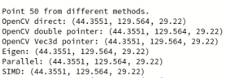

# Introduction

In the field of analysis, inspection, metrology... whether 2D or 3D, it is crucial to implement computationally efficient systems that can operate in real time without introducing large latencies that accumulate and cause delays and desynchronizations in systems where response time is critical.

Creating efficient applications in this regard depends not only on the hardware and the speed of our CPU, the frequency of our RAM, or GPU capacity, but also on how we design our software. In this regard, let's imagine a very typical situation in real-world applications: we want to perform a 3D transformation on a point cloud. Programming in C++, what tools/libraries can and should we use? In this post, we will experimentally explore this question.

For the curious, this is my machine:
```bash
$ uname -a 
```
```text
Linux pop-os 6.9.3-76060903-generic #202405300957~1732141768~22.04~f2697e1 SMP PREEMPT_DYNAMIC Wed N x86_64 x86_64 x86_64 GNU/Linux
```
```bash
$ lscpu | grep -E 'Architecture|Cache|CPU|Model|NUMA|cache|L1|L2|L3'
```
```text
CPU operating mode(s):       32-bit, 64-bit
CPU(s):                      20
Online CPU(s) list:          0-19
CPU family:                  6
Model:                       154
Max CPU MHz:                 4700.0000
Min CPU MHz:                 400.0000
L1d Cache:                   544 KiB (14 instances)
L1i Cache:                   704 KiB (14 instances)
L2 Cache:                    11.5 MiB (8 instances)
L3 Cache:                    24 MiB (1 instance)
NUMA node(s):                1
NUMA node 0 CPU(s):          0-19
L1tf vulnerability:          Not affected
```
```bash
$ g++ --version 
```
```text
g++ (Ubuntu 11.4.0-1ubuntu1~22.04) 11.4.0
Copyright (C) 2021 Free Software Foundation, Inc.
This is free software; see the source for copying conditions.  There is NO
warranty; not even for MERCHANTABILITY or FITNESS FOR A PARTICULAR PURPOSE.
```

# Hands-on code

## 1. OpenCV direct product

First, we will test a regular matrix multiplication of ```cv::Mat``` directly as a matrix product.
```cpp
auto transform_opencv = [=](const cv::Mat& cloud, const cv::Mat& transform, cv::Mat& result) {
    result = transform * cloud;
};
```  

## 2. OpenCV by pointers I

We will apply a transformation using OpenCV "manually" via pointers.
```cpp
auto transform_opencv_pointers_double = [=](const cv::Mat& cloud, const cv::Mat& transform, cv::Mat& result) {
    const double* cloudPtr = cloud.ptr<double>(0);
    const double* transformPtr = transform.ptr<double>(0);
    double* resultPtr = result.ptr<double>(0);
    for (int i = 0; i < cloud.cols; ++i)
    {
        double x = cloudPtr[i * 3 + 0];
        double y = cloudPtr[i * 3 + 1];
        double z = cloudPtr[i * 3 + 2];

        resultPtr[i * 3 + 0] = transformPtr[0] * x + transformPtr[1] * y + transformPtr[2] * z + transformPtr[3];
        resultPtr[i * 3 + 1] = transformPtr[4] * x + transformPtr[5] * y + transformPtr[6] * z + transformPtr[7];
        resultPtr[i * 3 + 2] = transformPtr[8] * x + transformPtr[9] * y + transformPtr[10] * z + transformPtr[11];
    }
};
```  

## 3. OpenCV by pointers II

Instead of double pointers, we will use pointers to Vec3d.
```cpp
auto transform_opencv_pointers_Vec3d = [=](const cv::Mat& cloud, const cv::Mat& transform, cv::Mat& result) {
    const cv::Vec3d* cloudPtr = cloud.ptr<cv::Vec3d>(0);
    const double* transformPtr = transform.ptr<double>(0);
    cv::Vec3d* resultPtr = result.ptr<cv::Vec3d>(0);
    for (int i = 0; i < cloud.cols; ++i)
    {
        const cv::Vec3d& point = cloudPtr[i];

        double x = point[0];
        double y = point[1];
        double z = point[2];

        resultPtr[i][0] = transformPtr[0] * x + transformPtr[1] * y + transformPtr[2] * z + transformPtr[3];
        resultPtr[i][1] = transformPtr[4] * x + transformPtr[5] * y + transformPtr[6] * z + transformPtr[7];
        resultPtr[i][2] = transformPtr[8] * x + transformPtr[9] * y + transformPtr[10] * z + transformPtr[11];
    }
};
```  

## 4. Eigen

We will use the widely recognized Eigen library to perform the transformation directly as a matrix product.
```cpp
auto transform_eigen = [=](const Eigen::MatrixXd& cloud, const Eigen::Matrix4d& transform, Eigen::MatrixXd& result) {
    result = transform * cloud;
};
```  

Each tool has its own formats... Eigen requires matrix representation:
```cpp
Eigen::MatrixXd cloud_eigen(4, num_points);
Eigen::Matrix4d transformation_eigen;
for (int i = 0; i < num_points; ++i) {
    cloud_eigen(0, i) = cloud.at<double>(0, i * 3 + 0);
    cloud_eigen(1, i) = cloud.at<double>(0, i * 3 + 1);
    cloud_eigen(2, i) = cloud.at<double>(0, i * 3 + 2);
    cloud_eigen(3, i) = 1.0;
}

transformation_eigen << transform.at<double>(0, 0), transform.at<double>(0, 1), transform.at<double>(0, 2), transform.at<double>(0, 3),
                        transform.at<double>(1, 0), transform.at<double>(1, 1), transform.at<double>(1, 2), transform.at<double>(1, 3),
                        transform.at<double>(2, 0), transform.at<double>(2, 1), transform.at<double>(2, 2), transform.at<double>(2, 3),
                        transform.at<double>(3, 0), transform.at<double>(3, 1), transform.at<double>(3, 2), transform.at<double>(3, 3);
```

## 5. Parallel transform
We will use the parallel computing library OMP.
```cpp
auto transform_parallel = [=](const cv::Mat& cloud, const cv::Mat& transform, cv::Mat& result) {
    const double* cloudPtr = cloud.ptr<double>(0);
    const double* transformPtr = transform.ptr<double>(0);
    double* resultPtr = result.ptr<double>(0);
    #pragma omp parallel for
    for (int i = 0; i < cloud.cols; ++i)
    {
        double x = cloudPtr[i * 3 + 0];
        double y = cloudPtr[i * 3 + 1];
        double z = cloudPtr[i * 3 + 2];

        resultPtr[i * 3 + 0] = transformPtr[0] * x + transformPtr[1] * y + transformPtr[2] * z + transformPtr[3];
        resultPtr[i * 3 + 1] = transformPtr[4] * x + transformPtr[5] * y + transformPtr[6] * z + transformPtr[7];
        resultPtr[i * 3 + 2] = transformPtr[8] * x + transformPtr[9] * y + transformPtr[10] * z + transformPtr[11];
    }
};
```

## 6. SIMD
We will program our SIMD "kernel" to process multiple vectors in a single instruction, paying special attention to the data size:
```cpp
auto transformWithSIMD = [=](const double* cloud, const double* transform, double* result, int num_points) {
    int num_simd_points = (num_points / 4) * 4;  // Points handled with SIMD, multiple of 4

    // Load transformation matrix rows into SIMD registers
    __m256d t0 = _mm256_set1_pd(transform[0]);
    __m256d t1 = _mm256_set1_pd(transform[1]);
    __m256d t2 = _mm256_set1_pd(transform[2]);
    __m256d t3 = _mm256_set1_pd(transform[3]);

    __m256d t4 = _mm256_set1_pd(transform[4]);
    __m256d t5 = _mm256_set1_pd(transform[5]);
    __m256d t6 = _mm256_set1_pd(transform[6]);
    __m256d t7 = _mm256_set1_pd(transform[7]);

    __m256d t8 = _mm256_set1_pd(transform[8]);
    __m256d t9 = _mm256_set1_pd(transform[9]);
    __m256d t10 = _mm256_set1_pd(transform[10]);
    __m256d t11 = _mm256_set1_pd(transform[11]);

    // Process blocks of 4 points at a time
    for (int i = 0; i < num_simd_points; i += 4) {
        // Load X, Y, and Z coordinates of 4 points
        __m256d x = _mm256_set_pd(cloud[(i + 3) * 3], cloud[(i + 2) * 3], cloud[(i + 1) * 3], cloud[i * 3]);
        __m256d y = _mm256_set_pd(cloud[(i + 3) * 3 + 1], cloud[(i + 2) * 3 + 1], cloud[(i + 1) * 3 + 1], cloud[i * 3 + 1]);
        __m256d z = _mm256_set_pd(cloud[(i + 3) * 3 + 2], cloud[(i + 2) * 3 + 2], cloud[(i + 1) * 3 + 2], cloud[i * 3 + 2]);

        // Perform the transformation
        __m256d res_x = _mm256_add_pd(_mm256_add_pd(_mm256_mul_pd(t0, x), _mm256_mul_pd(t1, y)),
                                      _mm256_add_pd(_mm256_mul_pd(t2, z), t3));
        __m256d res_y = _mm256_add_pd(_mm256_add_pd(_mm256_mul_pd(t4, x), _mm256_mul_pd(t5, y)),
                                      _mm256_add_pd(_mm256_mul_pd(t6, z), t7));
        __m256d res_z = _mm256_add_pd(_mm256_add_pd(_mm256_mul_pd(t8, x), _mm256_mul_pd(t9, y)),
                                      _mm256_add_pd(_mm256_mul_pd(t10, z), t11));

        // Store the results interleaved (X1, Y1, Z1, X2, Y2, Z2, ...)
        double temp_x[4], temp_y[4], temp_z[4];
        _mm256_store_pd(temp_x, res_x);
        _mm256_store_pd(temp_y, res_y);
        _mm256_store_pd(temp_z, res_z);

        for (int j = 0; j < 4; ++j) {
            result[(i + j) * 3]     = temp_x[j];
            result[(i + j) * 3 + 1] = temp_y[j];
            result[(i + j) * 3 + 2] = temp_z[j];
        }
    }

    // Handle remaining points (if num_points is not a multiple of 4)
    for (int i = num_simd_points; i < num_points; ++i) {
        int base = i * 3;
        double x = cloud[base];
        double y = cloud[base + 1];
        double z = cloud[base + 2];

        result[base]     = transform[0] * x + transform[1] * y + transform[2] * z + transform[3];
        result[base + 1] = transform[4] * x + transform[5] * y + transform[6] * z + transform[7];
        result[base + 2] = transform[8] * x + transform[9] * y + transform[10] * z + transform[11];
    }
};
```

# Point cloud and transformation initialization

The first step is to create a random point cloud in homogeneous coordinates and a random 4x4 transformation matrix, specifying it using Euler angles and a 3D translation vector.
```cpp
// Create a point cloud as a single row
int num_points = (int)1e6;
cv::Mat cloud(1, num_points, CV_64FC3);
cv::Mat transform(4, 4, CV_64F);

// Initialize point cloud and transformation matrix
cv::randu(cloud, cv::Scalar(0.0, 0.0, 0.0), cv::Scalar(100.0, 100.0, 100.0));

cv::Mat cloud_homogeneous(4, cloud.cols, CV_64FC1);
for (int i = 0; i < cloud.cols; ++i)
{
    const cv::Vec3d& pt = cloud.at<cv::Vec3d>(0, i);
    cloud_homogeneous.at<double>(0, i) = pt[0];
    cloud_homogeneous.at<double>(1, i) = pt[1];
    cloud_homogeneous.at<double>(2, i) = pt[2];
    cloud_homogeneous.at<double>(3, i) = 1.0;
}

transform = cv::Mat::eye(4, 4, CV_64F);
{
    double roll = M_PI / 6;   // Rotation around the X-axis
    double pitch = M_PI / 4;  // Rotation around the Y-axis
    double yaw = M_PI / 3;    // Rotation around the Z-axis
    cv::Mat Rx = (cv::Mat_<double>(3, 3) <<
        1, 0, 0,
        0, std::cos(roll), -std::sin(roll),
        0, std::sin(roll), std::cos(roll));
    cv::Mat Ry = (cv::Mat_<double>(3, 3) <<
        std::cos(pitch), 0, std::sin(pitch),
        0, 1, 0,
        -std::sin(pitch), 0, std::cos(pitch));
    cv::Mat Rz = (cv::Mat_<double>(3, 3) <<
        std::cos(yaw), -std::sin(yaw), 0,
        std::sin(yaw), std::cos(yaw), 0,
        0, 0, 1);
    cv::Mat R = Rz * Ry * Rx;
    R.copyTo(transform(cv::Rect(0, 0, 3, 3)));
    transform.at<double>(0, 3) = 10; // Translation in x
    transform.at<double>(1, 3) = -5; // Translation in y
    transform.at<double>(2, 3) = 3;  // Translation in z
}
``` 

# Objective comparison

We will test the code around 1000 times, measure the elapsed time for all the considered methods, and plot the results for a visual inspection (averaged).

We'll use ```std::chrono``` to measure time, but we could also use the CPU clock counter, as mentioned in our [previous post](./DOPvsOOP).
```cpp
auto measure_time = [=](const std::function<void()>& func) {
    auto start = std::chrono::high_resolution_clock::now();
    func();
    auto end = std::chrono::high_resolution_clock::now();
    return std::chrono::duration<double>(end - start).count();
};
```
Before anything else, let's verify that the transformation is performed correctly across all tools!



Indeed, the result is the same in all cases, up to the seventh significant decimal digit (the typical precision of the ```float``` format), at least for the evaluated point.

Now, let's look at the results after a high number of iterations.

First, using **no optimization** flags:
```.pro
QMAKE_CXXFLAGS += -O0
```


And then, using compiler **optimization** flags:
```.pro
QMAKE_CXXFLAGS += -O3 -march=native -funroll-loops -fomit-frame-pointer -finline-functions -ftree-vectorize -mavx -mavx2 -msse4.2
QMAKE_LFLAGS += -Wl, --strip-all # Optimization in the linking process
```


# Future work

At first glance, it seems surprising that OpenCV's direct method (and also Eigen's) is by far the slowest of all. Without delving deeply into the library's code, given how optimized it is, one would logically expect the overload of the `*` operator to be tied at a lower level to high-performance vectorized instructions. However, this may have a lot to do with how OpenCV is compiled. An interesting task would be to evaluate this same test in Python to see if these optimizations are actually performed "under the hood," if something is missing in the compilation, or if the direct method is indeed the slowest of all.

The results are somewhat predictable since OpenMP is really the only one (as far as I know) that employs a purely parallelized approach. In smaller tasks (or with fewer iterations), it may be outperformed, but not at such a large scale.

It would be interesting to program a **CUDA** kernel and test parallel processing on the GPU to see how it compares to CPU-based methods in terms of handling large-scale point cloud operations.
