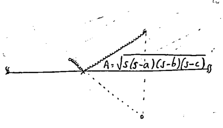
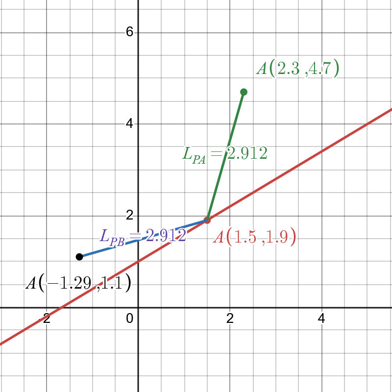
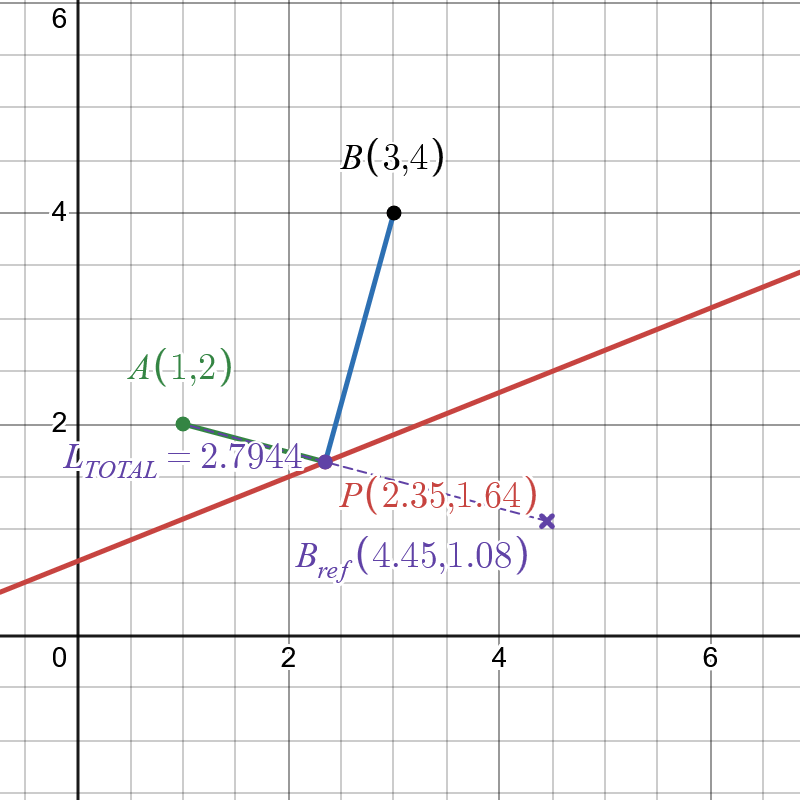

# Problema 1: Punto equidistante a $$ A $$ y $$ B $$

"**Dada una línea recta en el plano, encuéntrese el tercer punto $$ P $$ de esa recta que esté a la misma distancia de otros dos puntos $$ A $$ y $$ B $$ fuera de la recta**".

**Objetivo**: Encontrar $$ P=(x,y) $$ en la recta $$ L $$ que cumpla $$ PA = PB $$ .

**Paso 1: Parametrización de la recta**

Supongamos que la recta $$ L $$ se puede parametrizar como $$ y = mx + n $$ . El punto $$ P $$ pertenece a $$ L $$, por lo que $$ y = mx + n $$ .

**Paso 2: Función objetivo**

Definimos la función a minimizar como la diferencia cuadrática de distancias:

$$
J[x] = \left( \left( x - a_x \right)^2 + \left( mx + n - a_y \right)^2 \right) - \left( \left( x - b_x \right)^2 + \left( mx + n - b_y \right)^2 \right)
$$

> Nota: Minimizar $$ J[x] $$ garantiza que $$ PA = PB $$ .

**Paso 3: Derivada funcional**

Calculamos la derivada de $$ J[x] $$ respecto a $$ x $$ :

$$
\frac{dJ}{dx} = 2 \left( PA - PB \right) \left( \left( x - a_x \right) + m \left( mx + n - a_y \right) \right) - \left( \left( x - b_x \right) + m \left( mx + n - b_y \right) \right)
$$

**Paso 4: Condición de extremo**

Para encontrar los puntos críticos, igualamos $$ \frac{dJ}{dx} = 0 $$ . Esto nos lleva a la ecuación:

$$
PA = PB \Rightarrow (x - a_x)^2 + (mx + n - a_y)^2 = (x - b_x)^2 + (mx + n - b_y)^2
$$

Elevando al cuadrado y simplificando obtenemos:

$$
x = \frac{(b_x^2 + b_y^2 - a_x^2 - a_y^2) + 2n(a_y - b_y)}{2(b_x - a_x) + 2m(b_y - a_y)}
$$

**Solución Final**:

$$
P\left( \frac{(b_x^2 + b_y^2 - a_x^2 - a_y^2) + 2n(a_y - b_y)}{2(b_x - a_x) + 2m(b_y - a_y)}, m \left( \frac{(b_x^2 + b_y^2 - a_x^2 - a_y^2) + 2n(a_y - b_y)}{2(b_x - a_x) + 2m(b_y - a_y)} \right) + n \right)
$$

Hice una pequeña simulación en Desmos para comprobar el método en tiempo real:

<!--  -->

Entra desde [este enlace](https://www.desmos.com/calculator/xb2osal6jk?lang=es) y mueve los _input parameters_ para jugar con ello. También puedes jugar con ello en este _widget web_:

<div style="display: flex; justify-content: center; align-items: center; height: 100vh; margin-top: 0; margin-bottom: 0; padding-top: 0; padding-bottom: 0;">
    <iframe src="https://www.desmos.com/calculator/eaxo2ddfmt?embed" width="700" height="700" style="border: 1px solid #ccc;" frameborder="0"></iframe>
</div>

---

## Nota sobre el Cálculo de Cosenos - intuición geométrica

En la interpretación geométrica de la condición obtenida, al encontrar los puntos críticos, se mencionan las direcciones de los vectores $$\vec{PA}$$ y $$\vec{PB}$$ . En lugar de imponer $$ PA - PB = 0 $$ , igualamos a cero el otro factor de la derivada funcional:

$$
PA(x - ax) + m(mx + n - ay) - PB(x - bx) + m(mx + n - by) = 0.
$$

Esto implica que los cosenos de los ángulos entre la recta y los segmentos $$ PA $$ y $$ PB $$ son iguales si y solo si los segmentos tienen la misma inclinación respecto a la recta $$ L $$ . El vector director de $$\vec{PA}$$ es:

$$
\vec{PA} = (x - ax, y - ay).
$$

El coseno directriz de un vector respecto al eje $$x$$ es:

$$
\cos \theta_A = \frac{\text{proyección sobre el eje } x}{\text{norma del vector}} = \frac{x - ax}{\sqrt{(x - ax)^2 + (y - ay)^2}}.
$$

La relación entre los vectores $$\vec{PA}$$ y $$\vec{PB}$$ se da por el coseno del ángulo entre ellos:

$$
\cos(\theta) = \frac{\vec{PA} \cdot \vec{PB}}{|\vec{PA}| |\vec{PB}|}.
$$

Si la recta $$L$$ tiene pendiente $$m$$ y el vector $$\vec{u} = (ux, uy)$$, el coseno entre la recta y el vector es:

$$
\cos(\varphi) = \frac{m ux + uy}{\sqrt{1 + m^2} \sqrt{ux^2 + uy^2}}.
$$

### Generalización para una recta inclinada

Si la recta $$L$$ tiene pendiente $$m$$, su vector director es $$\vec{T} = (1, m)$$ y el coseno del ángulo con el eje $$x$$ es:

$$
\cos \theta_L = \frac{1}{\sqrt{1 + m^2}}.
$$

El coseno del ángulo entre el segmento $$PA$$ y la recta es:

$$
\cos \theta = \frac{\vec{PA} \cdot \vec{T}}{|\vec{PA}| |\vec{T}|}.
$$

Calculando el producto punto:

$$
\vec{PA} \cdot \vec{T} = (x - ax) + m(y - ay).
$$

La norma de $$\vec{T}$$ es $$\sqrt{1 + m^2}$$, y por lo tanto, el coseno entre el segmento $$PA$$ y la recta es:

$$
\cos \theta_A = \frac{(x - ax) + m(y - ay)}{(x - ax)^2 + (y - ay)^2}.
$$

Esta condición se cumple cuando los puntos $$A$$, $$B$$ y $$P$$ están alineados con una dirección que mantiene un ángulo constante con la recta $$L$$, pero no garantiza que $$PA = PB$$, lo que confirma que la condición $$PA - PB = 0$$ era la correcta para resolver el problema original.

# Problema 2: Punto a mínima distancia de $$ A $$ y $$ B $$

Vamos a cambiar un poco el planteamiento; parecerá que no causa efecto en el enunciado pero el significado de la formulación cambia. Así plantenamos nuestro segundo problema:

"**Dada una línea recta $$L$$ en el plano, encuéntrese el tercer punto $$P$$ de esa recta que esté a la menor distancia de ambos puntos $$A$$ y $$B$$ fuera de la recta**".

Es decir, se trata de encontrar el punto $$P$$ que minimice la distancia combinada a dos puntos $$A$$ y $$B$$ (i.e. minimizar los caminos $$PA$$ y $$PB$$).

**Objetivo**: Encontrar $$ P=(x,y) $$ en $$ L $$ que minimice $$ J(P) = PA + PB $$ .

## Paso 1: Función a minimizar

Supongamos que la recta $$L$$ tiene ecuación $$y = mx + n$$ . Sean:

- $$A = (a_x, a_y)$$,
- $$B = (b_x, b_y)$$,
- $$P = (x, y) = (x, mx + n)$$ (ya que $$P$$ está en $$L$$).

La función a minimizar es:

$$
J(x) = \sqrt{(x - a_x)^2 + (mx + n - a_y)^2} + \sqrt{(x - b_x)^2 + (mx + n - b_y)^2}
$$

## Paso 2: Condición de mínimo (derivada igual a cero)

Para encontrar el mínimo, derivamos $$J(x)$$ respecto a $$x$$ e igualamos a cero:

$$
\frac{dJ}{dx} = 0
$$

La derivada es:

$$
\frac{dJ}{dx} = \frac{(x - a_x) + m(mx + n - a_y)}{\sqrt{(x - a_x)^2 + (mx + n - a_y)^2}} + \frac{(x - b_x) + m(mx + n - b_y)}{\sqrt{(x - b_x)^2 + (mx + n - b_y)^2}} = 0
$$

## Paso 3: Resolución numérica/simbólica de la condición de optimalidad (* ver camino alternativo más adelante)

### Formulación del problema
Definimos las distancias cuadráticas:

$$
DA(x) = (x - a_x)^2 + (mx + n - a_y)^2 \\
DB(x) = (x - b_x)^2 + (mx + n - b_y)^2
$$

La condición de optimalidad $$J'(x) = 0$$ se expresa como:

$$
\frac{(1 + m^2)x - a_x + m(n - a_y)}{\sqrt{DA(x)}} + \frac{(1 + m^2)x - b_x + m(n - b_y)}{\sqrt{DB(x)}} = 0
$$

### Método simbólico (intento):
Al definir:

$$
\alpha = (1 + m^2)x - a_x + m(n - a_y) \\
\beta = (1 + m^2)x - b_x + m(n - b_y)
$$

La ecuación se reescribe como:

$$
\frac{\alpha}{\sqrt{DA(x)}} = -\frac{\beta}{\sqrt{DB(x)}}
$$

**Procedimiento:**
1. Elevar al cuadrado ambos lados:
   $$\frac{\alpha^2}{DA(x)} = \frac{\beta^2}{DB(x)}$$
2. Multiplicar en cruz:
   $$\alpha^2 DB(x) = \beta^2 DA(x)$$

**Grado de la ecuación:**
- Para $$m \neq 0$$ resulta en una ecuación polinómica de **cuarto grado**
- Caso especial ($$m=0$$): se reduce a cuadrática (solución analítica exacta)
- Para el caso cuártico existe realmente una forma cerrada pero es [extremadamente complicada](https://batterieseverywhere.com/ecuaciones_polinomicas/cuartica_solucion_es.htm) y nadie la usa (para $$m \not\equiv 0$$ o grado mayor que 4 la solución analítica es inviable)

### Método numérico (bisección más Newton-Raphson)

**Algoritmo:**
1. Definir $$f(x) = J'(x)$$
2. Calcular derivada $$f'(x)$$ analítica o numéricamente, e.g.:
   $$f'(x) \approx \frac{f(x+h) - f(x-h)}{2h}, \quad h \approx 10^{-5}$$
3. Iterar:
   $$x_{k+1} = x_k - \frac{f(x_k)}{f'(x_k)}$$

**Ejemplo práctico:**
- Recta $$L: y = 2x + 1$$
- Puntos $$A = (1,3)$$, $$B = (4,5)$$
- **Valor inicial**, sea la proyección de $$A$$ sobre $$L (1.5) $$ (usando Newton-Raphson) o **rango** en el que buscamos la raíz (usando bisección)

**Implementación:**

Se puede testear directamente en un [intérprete online de Python](https://www.programiz.com/online-compiler/0SqDRVJqW62Sh).

```python
from math import sqrt

def J_prime(x, m, n, ax, ay, bx, by):
    """ Derivada de J(x) con respecto a x """
    DA = sqrt((x - ax) ** 2 + (m * x + n - ay) ** 2)
    DB = sqrt((x - bx) ** 2 + (m * x + n - by) ** 2)

    return ((x - ax) + m * (m * x + n - ay)) / DA + ((x - bx) + m * (m * x + n - by)) / DB

def J_double_prime(x, m, n, ax, ay, bx, by):
    """ Segunda derivada de J(x) con respecto a x """
    y = m * x + n
    dy_dx = m
    
    # Compute terms for PA
    dx_pa = x - ax
    dy_pa = y - ay
    DA = sqrt(dx_pa**2 + dy_pa**2)
    numPA = dx_pa + m * dy_pa  # (x - ax) + m*(y - ay)
    term1_numerator = (1 + m**2) * DA**2 - numPA**2
    term1 = term1_numerator / DA**3
    
    # Compute terms for PB
    dx_pb = x - bx
    dy_pb = y - by
    DB = sqrt(dx_pb**2 + dy_pb**2)
    numPB = dx_pb + m * dy_pb  # (x - bx) + m*(y - by)
    term2_numerator = (1 + m**2) * DB**2 - numPB**2
    term2 = term2_numerator / DB**3
    
    return term1 + term2

def find_root_bisection(m, n, ax, ay, bx, by, a, b, tol=1e-6, max_iter=50):
    """ Método de bisección para encontrar un intervalo donde J'(x) cambia de signo """
    fa = J_prime(a, m, n, ax, ay, bx, by)
    fb = J_prime(b, m, n, ax, ay, bx, by)

    if fa * fb > 0:
        print("Bisección falló: No hay cambio de signo en el intervalo.")
        return None

    for _ in range(max_iter):
        c = (a + b) / 2
        fc = J_prime(c, m, n, ax, ay, bx, by)

        if abs(fc) < tol:
            return c

        if fa * fc < 0:
            b, fb = c, fc
        else:
            a, fa = c, fc

    return (a + b) / 2

def newton_raphson(x0, m, n, ax, ay, bx, by, tol=1e-6, max_iter=10):
    """ Método de Newton-Raphson con control de estabilidad """
    x = x0

    for i in range(max_iter):
        fx = J_prime(x, m, n, ax, ay, bx, by)
        dfx = J_double_prime(x, m, n, ax, ay, bx, by)

        if abs(dfx) < tol:
            print("Segunda derivada cercana a cero. Newton-Raphson no es estable.")
            return x  # Devuelve el mejor valor actual sin continuar

        x_new = x - fx / dfx

        if abs(x_new - x) < tol:
            break

        x = x_new

    return x

# Parámetros de la recta y los puntos
m, n = 0.5, 1
ax, ay = 1, 3
bx, by = 4, 5
intervalo = (1, 5) # Rango donde buscamos la raíz

# Paso 1: Buscar una raíz con bisección
x0 = find_root_bisection(m, n, ax, ay, bx, by, *intervalo)

if x0 is not None:
    print(f"Raíz inicial encontrada por bisección: x0 = {x0:.6f}")
    # Paso 2: Refinar con Newton-Raphson
    x_final = newton_raphson(x0, m, n, ax, ay, bx, by)
    y_final = m * x_final + n
    print(f"Solución final: x = {x_final:.6f}, y = {y_final:.6f}")
else:
    print("No se encontró raíz en el intervalo dado.")
```

Salida:

```text
Raíz inicial encontrada por bisección: x0 = 2.971428
Solución final: x = 2.971428, y = 2.485714
```

## Camino alternativo - Interpretación geométrica

Si no queremos meternos con las ecuaciones no lineales y métodos numéricos presentados arriba, y nuestro problema está tan bien condicionado que ambos puntos están del mismo lado, podemos emplear una archiconocido teorema para aproximar la solución de manera más intuitiva y geométrica.

Observemos que los términos en los numeradores y denominadores tienen una interpretación vectorial:

- El vector $$\overrightarrow{PA} = (a_x - x, a_y - (mx + n))$$
- El vector tangente a $$L$$ es $$\vec{T} = (1, m)$$ (derivada de $$(x, mx + n)$$)

El producto escalar $$\overrightarrow{PA} \cdot \vec{T}$$ es:

$$
\overrightarrow{PA} \cdot \vec{T} = (a_x - x) \cdot 1 + (a_y - mx - n) \cdot m = (a_x - x) + m(a_y - mx - n)
$$

Notamos que esto coincide con el numerador de la primera fracción en $$\frac{dJ}{dx}$$, pero con signo opuesto. Análogamente para $$\overrightarrow{PB} \cdot \vec{T}$$ .

Por lo tanto, la condición de optimalidad $$\frac{dJ}{dx} = 0$$ puede reescribirse como:

$$
\frac{\overrightarrow{PA} \cdot \vec{T}}{PA} + \frac{\overrightarrow{PB} \cdot \vec{T}}{PB} = 0
$$

Esto equivale a:

$$
\hat{u}_A \cdot \vec{T} + \hat{u}_B \cdot \vec{T} = 0
$$

donde $$\hat{u}_A$$ y $$\hat{u}_B$$ son los vectores unitarios en las direcciones $$\overrightarrow{PA}$$ y $$\overrightarrow{PB}$$, respectivamente.

> Nota: Relación con el principio de reflexión de Herón 
> 
> $$ \theta_A = \theta_B $$ (ley de reflexión de Herón)

La condición anterior implica que la suma de las componentes de $$\hat{u}_A$$ y $$\hat{u}_B$$ en la dirección de $$\vec{T}$$ (tangente a $$L$$) es cero. Esto sugiere que los ángulos que forman $$\overrightarrow{PA}$$ y $$\overrightarrow{PB}$$ con la recta $L$ son iguales en magnitud pero opuestos en signo (ley de reflexión).

**Solución particular (usando reflexión)**, esto es, cuando $$A$$ y $$B$$ están del mismo lado de la recta:

1. Reflejar $$B$$ sobre $$L$$ para obtener $$B'$$:

La fórmula para reflejar un punto $$(x_0, y_0)$$ sobre una recta $$y = mx + n$$ es:

$$
B' = \left( b_{x}-\frac{2m(mb_{x}-b_{y}+n)}{m^{2}+1}, b_{y}+\frac{2(mb_{x}-b_{y}+n)}{m^{2}+1} \right)
$$

2. Encontrar la intersección de $$AB'$$ con $$L$$:

La recta $$AB'$$ pasa por $$A = (a_x, a_y)$$ y $$B'$$ . La ecuación paramétrica de $$AB'$$ es:

$$
\frac{x - a_x}{B'_x - a_x} = \frac{y - a_y}{B'_y - a_y}
$$

Sustituyendo $$y = mx + n$$ (porque $$P$$ está en $$L$$), resolvemos para $$x$$:

$$
\frac{x - a_x}{B'_x - a_x} = \frac{mx + n - a_y}{B'_y - a_y}
$$

Despejando $$x$$, obtenemos $$P_x$$, y luego $$P_y = m P_x + n$$ .

Tras resolver el sistema, las coordenadas de $$P$$ tienen una expresión explícita:

$$
P_x = \frac{a_x(B'_y - a_y) + a_y(B'_x - a_x) - n(B'_x - a_x)}{(B'_y - a_y) - m(B'_x - a_x)}
$$

$$
P_y = m P_x + n
$$

## Conclusión

La condición de mínimo $$\frac{dJ}{dx} = 0$$ se interpreta geométricamente como la igualdad de ángulos entre $$PA$$, $$PB$$ y la recta $$L$$, lo que lleva al principio de reflexión. La solución explícita se obtiene reflejando uno de los puntos y encontrando la intersección con la recta.

> Atención: Casos degenerados:
> 
> 1. $$ AB' \parallel L $$ (reflexión falla): Solución tiende a infinito
> 2. Puntos equidistantes: $$ P $$ es punto medio de las proyecciones
> 3. Punto en la recta: Si $$ A \in L $$, entonces $$ P = A $$ 

---

Hice otra pequeña simulación en Desmos para comprobar el método en tiempo real:

<!--  -->

Entra desde [este enlace](https://www.desmos.com/calculator/vzltvx4vds?lang=es) y mueve los _input parameters_ para jugar con ello. También puedes jugar con ello en este _widget web_:

<div style="display: flex; justify-content: center; align-items: center; height: 100vh; margin-top: 0; margin-bottom: 0; padding-top: 0; padding-bottom: 0;">
    <iframe src="https://www.desmos.com/calculator/szhjzbi7si?embed" width="700" height="700" style="border: 1px solid #ccc;" frameborder="0"></iframe>
</div>

# Conclusión

- **Problema 1**: En este problema, buscamos el punto $$ P $$ en una recta $$ L $$ tal que las distancias desde $$ P $$ a los puntos $$ A $$ y $$ B $$ sean iguales. Usamos el cálculo variacional para minimizar la diferencia cuadrática de las distancias y obtener una fórmula explícita para $$ P $$ .

- **Problema 2**: Aquí, el objetivo es encontrar un punto $$ P $$ en la recta $$ L $$ que minimice la suma de las distancias a $$ A $$ y $$ B $$ . La solución se obtiene a través de una formulación con la ecuación de Euler-Lagrange, la cual muestra que esta configuración puede verse como equivalente al principio de reflexión geométrica.

Ambos problemas ilustran cómo el cálculo variacional generaliza métodos geométricos clásicos.

Probablemente haya más pequeños desafíos matemáticos en futuros _posts_.

---

# Referencias

- El problema 2 nace del problema de Herón y proviene del hecho de que la distancia mínima entre dos puntos respecto a una línea se obtiene mediante una reflexión. Ver [enlace](https://funes.uniandes.edu.co/wp-content/uploads/tainacan-items/32454/1182943/Pelegr25C325ADn2020Optimizaci25C325B3n.pdf).
