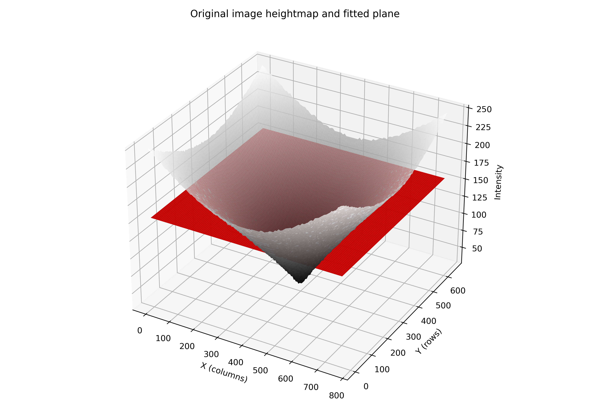
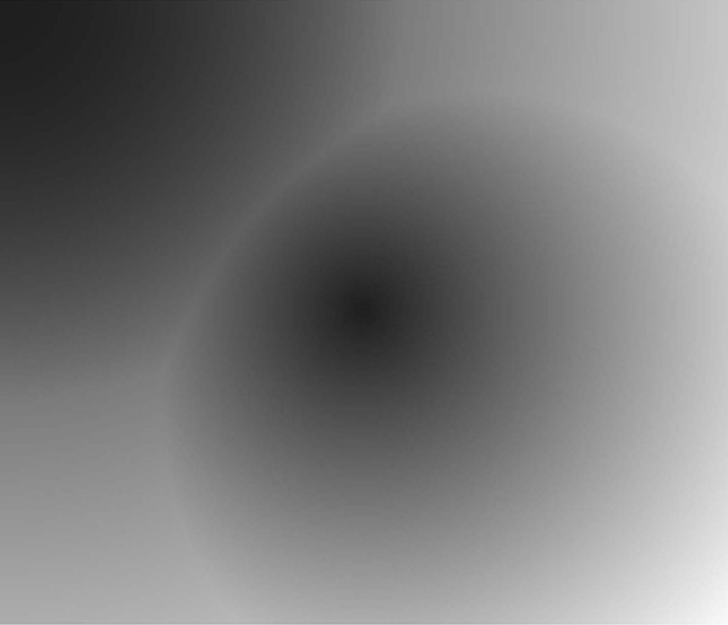
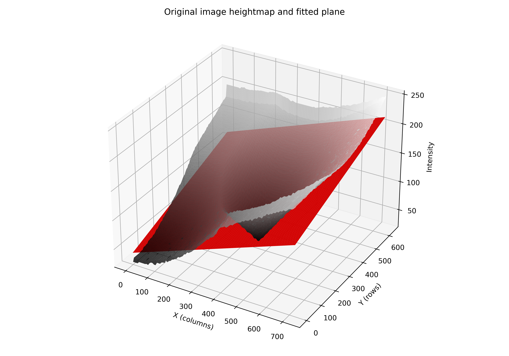
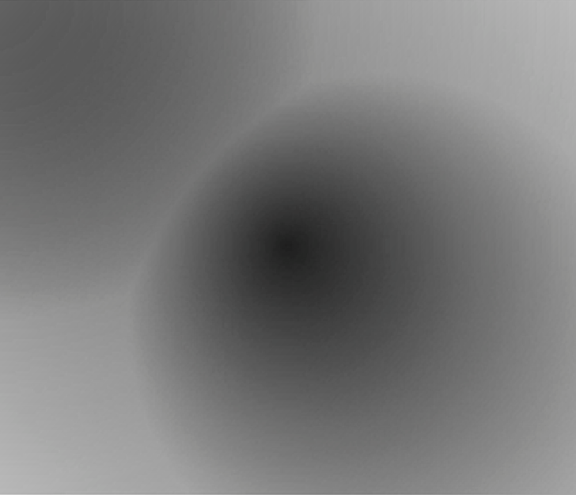
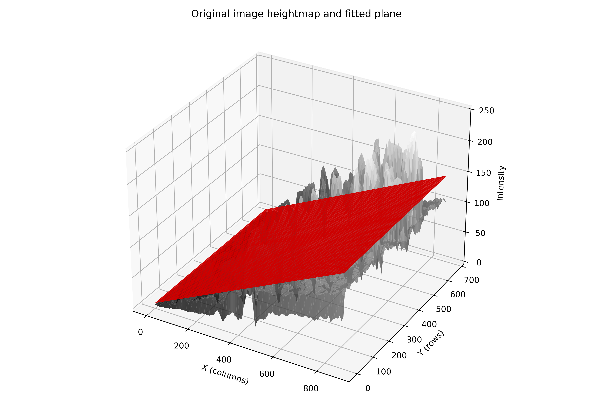
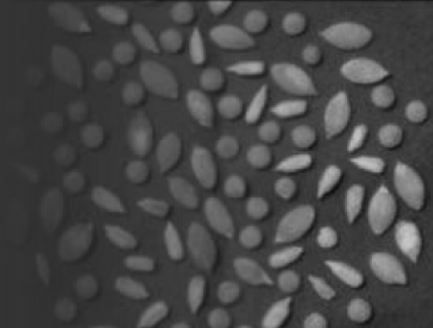

# Introduction

A way to improve uneven illumination in images → just as we can fit a line to a 1D signal, we can fit a plane to an image, as if it were a parallelepiped with a certain tilt. We convert this plane into a grayscale image, center it at 0±tol (with both negative and positive values), and add it to the grayscale channel of the unevenly illuminated image. This will make bright areas darker and dark areas brighter—or something like that. It’s like applying a proportional shadow correction to make the luminance channel more homogeneous.

In this post, we’ll design a simple and effective technique to enhance uneven illumination in images using plane fitting.

When we observe an image with uneven illumination, we often sense that something is wrong—it doesn’t look pleasing and makes it harder to perceive details. An intuitive and mathematical way to approach this problem is by fitting a plane to the image, similar to how a line is fit to a 1D signal.

# Theoretical Background

Imagine a grayscale image as a 3D surface, where each pixel has coordinates $$(x, y)$$ and an intensity $$z$$. If we fit a plane to this surface using linear regression (least squares), we obtain a representation of the general intensity trend across the image.

This plane can be interpreted as capturing the global illumination or tonal bias of the image. By centering this plane around zero and scaling it appropriately, we can add it to the original image to enhance intensity differences: bright areas become darker and dark areas become brighter, thus improving the homogeneity of illumination.

# Algorithm

**1. Conversion to float**

Convert the grayscale image to `float32` to perform numerical operations:

```python
I = img_gray.astype(np.float32)
```

**2. Coordinate generation**

Generate pixel coordinates:

```python
ys, xs = np.mgrid[0:h, 0:w]
```

**3. Plane fitting via least squares**

We want to fit a plane:

$$
z = ax + by + c
$$

Construct the linear system:

$$
A \cdot 
\begin{bmatrix}
a \\
b \\
c
\end{bmatrix}
= I,
$$

where $$I$$ is the vector of intensities and:

$$
A = \begin{bmatrix} x_1 & y_1 & 1 \\ x_2 & y_2 & 1 \\ \vdots & \vdots & \vdots \end{bmatrix}
$$

Solve using least squares:

```python
coeffs, *_ = np.linalg.lstsq(A, b, rcond=None)
```

**4. Plane centering and normalization**

Center and scale the resulting plane to have zero mean and unit standard deviation (to avoid imbalanced effects):

```python
plane_centered = plane - np.mean(plane)
plane_centered /= max(np.std(plane_centered), tol)
```

---

**5. Enhancement Application**

Counteract uneven illumination by subtracting the (scaled) plane from the original image:

$$
I_{\text{out}} = I + \alpha \cdot \text{Centered plane} \cdot 127
$$

Finally, clip values to valid range and convert back to `uint8`:

```python
I_out = np.clip(I_out, 0, 255).astype(np.uint8)
```

# Experimentation

The 3D visualization helps to understand how the plane fits the image’s intensity surface and how its addition enhances illumination.

Testing with some synthetic images:

| Uneven | Heightmap and plane | Corrected |
|--------|----------------------|-----------|
|  |  |  |
|  |  |  |
|  |  |  |
|  |  |  |

And with some real images:

| Uneven | Heightmap and plane | Corrected |
|--------|----------------------|-----------|
|  |  |  |
|  |  |  |
|  |  |  |
|  |  |  |

# Conclusion

When vignetting is strong or the uneven distribution is very unimodal (e.g., in case 3), the method tends to perform worse than when the plane fit is clearly dominated by a directional tilt.

Additionally, the idea behind the model is to counteract the nearly saturated regions in the opposite way, so it’s not a very intelligent algorithm and relies on a manual parameter. However, as seen in the paper's case, it is particularly useful for specific applications where an aesthetically pleasing perception of the image is desired in real time, Avoiding uneven lighting effects characteristic of a real outdoor scene.

