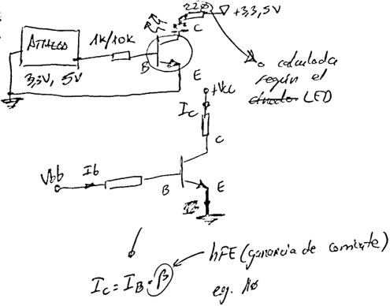

# Introduction

In this project, we explore the fundamentals of microcontroller programming using the ATMega328P chip to control two LEDs with a push button, via Interrupt Service Routine (ISR) and delays. While simple in concept, this exercise lays the groundwork for more complex IoT applications and demonstrates key and fundamental hardware/software integration concepts.

Also, this is a proof of concept to test whether the AVR programmer I just bought is working correctly.

# Design

## Desired operation

The system starts operating when the microcontroller is powered with +5V DC. It begins by blinking the green LED rapidly and continuously, which is connected to one of its output ports. When a button is pressed, the red LED starts blinking more slowly, and the green LED turns off. If the button is pressed again, only the green LED starts blinking once more, and the cycle repeats.

## Microcontroller Selection

The [ATMega328PU](https://components101.com/microcontrollers/atmega328p-pinout-features-datasheet) (328 refers to the chip type, P stands for the low-power variant, and -PU indicates the DIP package) ([datasheet](https://static6.arrow.com/aropdfconversion/65d19a89a4a2dbc52152b0afb98c31e87906937c/13atmega328_p20avr20mcu20with20picopower20technology20data20sheet20.pdf)) is an excellent choice due to:

- Low cost (≈€2.5 on [AliExpress](https://es.aliexpress.com/item/1005004505177113.html?spm=a2g0o.productlist.main.3.31a61171s0tDlx&algo_pvid=228027c7-779f-47e5-bf37-801674c2398d&algo_exp_id=228027c7-779f-47e5-bf37-801674c2398d-1&pdp_ext_f=%7B%22order%22%3A%22476%22%2C%22eval%22%3A%221%22%7D&pdp_npi=4%40dis%21EUR%213.24%210.99%21%21%213.42%211.05%21%40211b61a417428957065718703ea741%2112000034342483624%21sea%21ES%210%21ABX&curPageLogUid=DKH1qhtjkcjF&utparam-url=scene%3Asearch%7Cquery_from%3A))

- Sufficient memory (32KB flash, 2KB RAM) (see [Mouser](https://www.mouser.es/ProductDetail/Microchip-Technology/ATMEGA328P-PU?qs=K8BHR703ZXguOQv3sKbWcg%3D%3D))

- Arduino compatibility (makes programming easier)

Other low-cost alternatives:

- [ATTiny85](https://www.mouser.es/ProductDetail/Microchip-Technology/ATTINY85-20PU?qs=8jWQYweyg6NCiiaOb5GI9Q%3D%3D) (cheaper but with fewer pins/memory)

- [STM8S003F3](https://www.st.com/en/microcontrollers-microprocessors/stm8s003f3.html) (low-cost ARM alternative)

## Electronic Design

Naturally, we’ll use pull-up or pull-down resistors to ensure that the inputs connected to buttons have a defined state when the buttons are not pressed. The ATMega328 already includes internal pull-up or pull-down resistors, so we might omit them from the PCB design.

> NOTE 
>
> **When should you use or avoid the microcontroller’s internal pull-up or pull-down resistors?**  
>  
> ✅ **Recommended usage** for simple applications, especially when:  
> - The button is located close to the microcontroller.  
> - The environment is not electrically noisy.  
> - The pin doesn’t need to be shared (multiplexed) with other functions.  
>  
> ❌ **Not recommended** when:  
> - The button’s wire is long or runs through a noisy environment.  
> - Greater electrical robustness is required.  
> - The I/O pin will be used for multiple functions (input/output).  
> - You need a stronger resistor (e.g., 10kΩ instead of the ≈100kΩ internal one).

Therefore, we won’t use them for switches or LEDs, but we will use them for buttons, just to mix it up. A [standard semi-long neck tactile button](https://www.sunrom.com/p/tactile-switch-6x6x10mm) is selected.

### LEDs

Although the ATmega328P can handle LEDs directly, transistors offer significant advantages. It can supply a maximum of 40 mA (although the total current across all ports should not exceed 200 mA) (see page 308 of the [datasheet](https://ww1.microchip.com/downloads/en/DeviceDoc/ATmega48A-PA-88A-PA-168A-PA-328-P-DS-DS40002061B.pdf)), and a typical LED like BLABLA typically requires just 20 mA. However, beyond 20 mA, the output voltage degrades, as specified in the datasheet. So, we're close to the limit, which is why we will use transistors.

Some advantages of using transistors:

- **Higher current**: They allow control of LEDs that require more current than the microcontroller can supply, reducing the load on the uC.  
- **Isolation**: They protect the microcontroller from potential overloads.  
- **Handling larger loads**: They are ideal for driving multiple LEDs or higher-power LED strips.

So, despite 20mA capability, transistors protect GPIO pins. Thus, we use the classic NPN BJT 2N3904 as the LED driver (a PNP or MOSFET could also be used depending on specific needs, but for this small project, this is sufficient). We won’t use PWM; the LED will always be on in a high state because we are not concerned with dimming.

> INFO 
>
> Watch [this video](https://www.youtube.com/watch?v=wKIHAbnBCJM) and [this schematic](https://www.circuitlab.com/circuit/gmmqaq/2n2222-led/).

#### LED Resistor Calculation

Our power supply is 5 V. We assume an LED current of 20 mA (0.02 A) to ensure their longevity. The voltage drop across the 2N3904 transistor in saturation is 0.2V (V_CEsat). The forward voltage of the LEDs is approximately 2.0V (red) and 2.2V (green). According to Ohm’s law, the voltage that needs to drop across the resistor for each LED is calculated as:

**R_red** = V_red / I_red = (5 - 2.0 - 0.2) / 0.02 = **140 Ohm** => use commercial **100 Ohm + 47 Ohm** resistors in series

**R_green** = V_green / I_green = (5 - 2.2 - 0.2) / 0.02 = **80 Ohm** => use commercial **82 Ohm** resistor

#### Base Resistor Calculation

When calculating the base resistor between the microcontroller and the transistor, the goal is to ensure that, when operating, the transistor is in saturation (i.e., fully "open"), allowing the maximum possible current to flow through the LED without the transistor behaving like a resistor instead of a switch.

1. **Base Current (I_b)**: The relationship between the collector current (I_c) and the base current (I_b) is determined by the hFE (current gain; parameter β) of the transistor. Typically, to ensure that the transistor is in saturation, a base current at least 1/10th of the collector current is recommended (see [this link](https://electronics.stackexchange.com/questions/454905/how-can-we-find-the-value-of-beta-for-a-transistor-to-enter-in-a-saturation-regi)). Thus:
   - **Collector Current (I_c)**: This is the current flowing through the LED and should be 20 mA (0.02 A).
   - **Base Current (I_b)**: It should be at least I_b = I_c / β to ensure the transistor is fully open in saturation. E.g., with β = 10, **I_b** = I_c / 10 → I_b = 20 mA / 10 = **2 mA**

2. **Base Resistor Calculation (R_b)**: The base resistor (R_b) is calculated considering the voltage drop between the base and emitter of the transistor (V_BE) and the microcontroller’s output voltage (V_GPIO). The microcontroller's output voltage is typically 5V, and the voltage drop across the 2N3904 transistor in saturation is approximately 0.9V (see [datasheet](https://www.onsemi.com/download/data-sheet/pdf/2n3903-d.pdf) page 2, Base-Emitter Saturation Voltage).

The formula to calculate the base resistor is:

R_b = (V_GPIO - V_BE) / I_b

Substituting the values V_GPIO = 5V, V_BE = 0.9V, I_b = 2mA (0.002A):

**R_b** = (5V - 0.9V) / 0.002A = 4.1V / 0.002A = **2.05 kΩ** => use a commercial **2.2 kΩ** resistor

Therefore, the required base resistor is 2.05 kΩ to ensure that the transistor is fully saturated and can properly control the LED current.

3. **Collector Resistor for LEDs**: These are the resistors previously calculated based on the current consumed by each LED and its forward voltage.

### Decoupling Capacitors

These capacitors, typically ceramic (class X7R or similar, with low ESR), help filter noise and stabilize the power supply. They are usually placed as close as possible to the power pins of the microcontroller (uC), microprocessor (uP), or any integrated circuit potentially sensitive to micro-interruptions from noise, i.e., between VCC and GND to minimize trace inductance and ensure effective filtering. A common practice is to place approximately 100 nF (0.1 µF) capacitors near each power pin of the microcontroller, and also one larger capacitor (electrolytic or tantalum, with a voltage rating appropriate to your power supply) of 4.7 µF to 10 µF between VCC and GND near the microcontroller to improve low-frequency noise filtering (reduce voltage spikes from the power supply). See [this video](https://www.youtube.com/watch?v=e8V_eC-euT8).

Since we will be using the ADC, we will place three decoupling capacitors:

- One 100 nF capacitor near the VCC and GND pins of the ATmega328P.
  
- One 100 nF capacitor near the AVCC and GND pins of the ATmega328P.

- One 10 µF (or 4.7 µF) capacitor between VCC and GND on the board near the microcontroller.

### Clock Used

The ATmega328 has an internal 8 MHz oscillator, but an external oscillator (such as a quartz crystal or external oscillator) can improve timing accuracy and stability in certain cases. Using a quartz crystal or an external oscillator can be beneficial for:

- Improving frequency accuracy, as the internal oscillator may vary with temperature or voltage.
- Enabling the use of higher or lower adjustable frequencies.
- Reducing electrical interference generated by the internal oscillator.

A quartz crystal is a passive component that requires an additional circuit (typically capacitors) to function, offering high precision. An external oscillator is an active component with its own circuitry and is easy to implement, but may be less precise and more expensive.

To use an external oscillator with the ATmega328, it needs to be configured via the microcontroller’s fuses. The steps are:

1. Connect the oscillator or crystal to the corresponding pin of the microcontroller.
2. Program the ATmega328’s fuses to select the external oscillator. For example, the CKSEL fuse can be adjusted to choose the type of clock source.
3. Use tools like avrdude or Atmel Studio to program the fuses. See [this](https://www.avrfreaks.net/s/topic/a5C3l000000U5cVEAS/t035403) or [this](https://www.quora.com/How-do-I-add-an-external-oscillator-to-my-Atmega-16).

Along with the 16 MHz quartz external oscillator, two 22 pF ceramic capacitors (typical value) are used (between the crystal terminals and ground) to ensure stable and accurate operation. These help stabilize the oscillating signal generated by the crystal and ensure the oscillation frequency is precise, acting as filters to reduce noise and voltage fluctuations that could affect the clock signal.

### Power Supply

#### Estimated Current Consumption by Component

Assuming an ATmega328P running at 16 MHz all the time:

(Buttons only consume power when pressed. Their consumption is negligible if they are not connected to LED strips or other loads.)

(Transistors act as switches for the LEDs. Their collector current will be similar to that of the LED they drive. Base current consumption could be considered negligible compared to the collector (≈ 1–2 mA), since hFE gain > 100. Already accounted for in the LED current.)

(Capacitors and Crystal Net consumption: 0 mA (passive components))

We assumed 20 mA for the initial LED resistor design, but the commercial resistors give a slightly different real consumption. The LEDs are connected with resistors to limit the current, so we will estimate their current using Ohm's law: Red (with 47 Ω) Current = (5V - 2V) / 47Ω ≈ 64 mA, Green (with 82 Ω) Current = (5V - 2.2V) / 82Ω ≈ 34 mA. Total LEDs: ~98 mA when both are on.

| Component         | Condition                  | Calculation                                                         | Current (mA) |
|-------------------|----------------------------|---------------------------------------------------------------------|--------------|
| ATmega328P        | Running at 16 MHz          | Typical value from datasheet                                        | 20.0         |
| Red LED (100Ω)    | Continuous on              | (5V - 2.0V - 0.2V) / 140Ω = 20mA                                    | 20.0         |
| Green LED (82Ω)  | Continuous on              | (5V - 2.2V - 0.2V) / 82Ω = 31.7mA                                  | 31.7         |
| 2N3904 (base)    | Per transistor             | (5V - 0.9V) / 2.2kΩ = 1.86mA x2                                    | 3.7          |
| **Total Consumption** |                        |                                                                     | **75.4 mA**   |

If all components are active continuously, the total current is 137 mA. This means that, every second, your circuit uses 75.4 milliamps of current. So, how much power does it consume in one hour? The hourly consumption is 75.4 mAh (milliampere-hours). Let’s assume we use a 1000 mAh battery (like many 5V Li-Ion batteries). If the system consumes 75.4 mA constantly, we can calculate how long it will last: 1000 / 75.4 mA ≈ 13.26 hours. Depending on our requirements, we can calculate the needed capacity based on the desired operation time. But there are also other power systems...

This low power total consumption < 10mA enables battery operation. But to power the system, we choose to use the very useful [Elegoo power supply module](https://flaviocopes.com/electronics-component-power-supply/), directly connected to the breadboard:

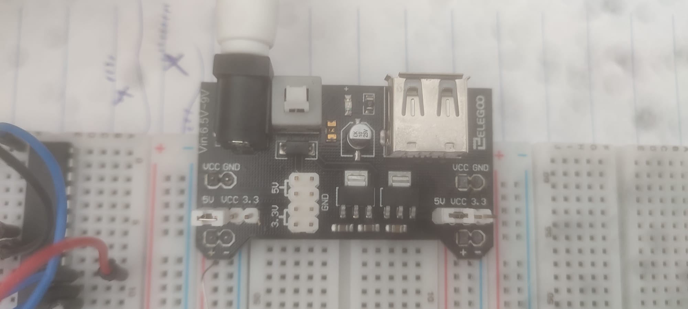

# Bill of materiales (BOM)

| Component                                                                 | Quantity | Unit Price (€) | Description                        |
|---------------------------------------------------------------------------|----------|----------------|------------------------------------|
| [ATMega328P-PU](https://ww1.microchip.com/downloads/en/DeviceDoc/ATmega48A-PA-88A-PA-168A-PA-328-P-DS-DS40002061B.pdf) | 1        | 2.50           | 8-bit AVR microcontroller          |
| [5 mm red LED](https://docs.rs-online.com/de32/A700000009318071.pdf)     | 1        | 0.08           | 20mA @ 2.0V forward voltage        |
| [5 mm green LED](https://docs.rs-online.com/49ec/A700000009318090.pdf)   | 1        | 0.07           | 20mA @ 2.2V forward voltage        |
| [2N3904 NPN Transistor](https://www.onsemi.com/download/data-sheet/pdf/2n3903-d.pdf) | 2 | 0.25           | LED driver transistor              |
| [2.2 kΩ resistor](https://protosupplies.com/product/resistor-2-2k-5/)     | 2        | 0.021          | Para base del transistor           |
| [220Ω resistor](https://protosupplies.com/product/resistor-2-2k-5/)       | 2        | 0.02           | Base current limiting              |
| [100Ω resistor](https://protosupplies.com/product/resistor-100-5/)        | 1        | 0.02           | Red LED current limiting           |
| [82Ω resistor](https://protosupplies.com/product/resistor-82-5/)          | 1        | 0.02           | Green LED current limiting         |
| [16 MHz quartz crystal](https://www.mouser.es/ProductDetail/ABRACON/ABL-16.000MHz-B4Y?qs=DZ%2FvJMgWWIsyUPmWNxNaQw%3D%3D) | 1 | 0.30 | External clock source              |
| [22 pF ceramic capacitor](https://www.mouser.es/ProductDetail/Vishay-BC-Components/VY1220K31U2JQ63V0?qs=YhDfSRCt1jRpTO4I1TK8Jw%3D%3D) | 2 | 0.05 | Crystal stabilization              |
| [0.1 µF ceramic capacitor](https://www.mouser.es/ProductDetail/Vishay-BC-Components/K104K10X7RF5UH5?qs=rLgk8CAOBHbAqIwDswVbzA%3D%3D) | 2 | 0.219 | Decoupling                         |
| [10 µF electrolytic capacitor](https://www.mouser.es/ProductDetail/KEMET/ESK106M400AH2EA?qs=9RUIYXQlAdAOR1GXIoSF3A%3D%3D) | 1 | 0.57 | Decoupling                         |
| **Total**                                                                 |          |       **4.68 €**         |                           |

We will, later, mount the prototype circuit in a very simple breadboard basis.

# Programming

## Simulation

The circuit was first simulated in Proteus ISIS using WinAVR compiler. This allowed verification of LED timing patterns before physical implementation.

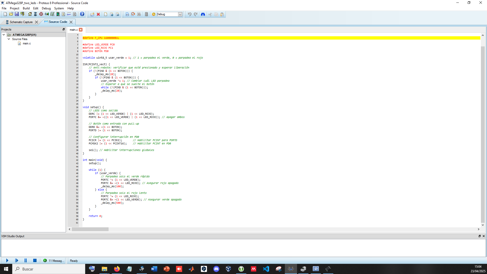

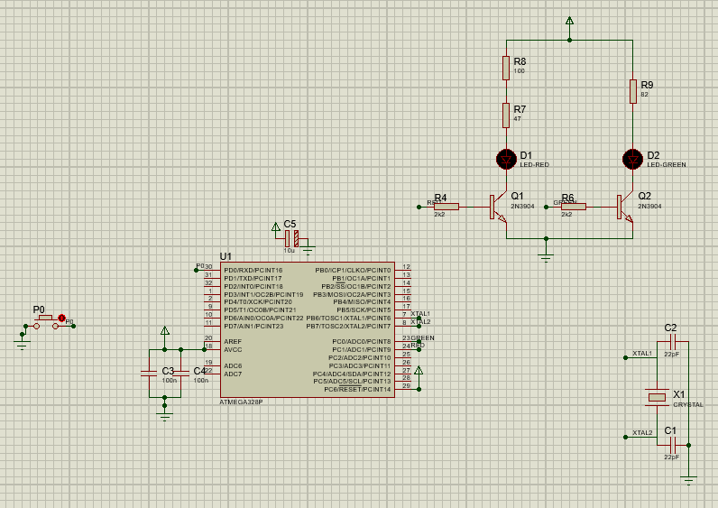

All the firmware code is written in C using the AVR libraries and is compiled in the following main.c:

```c
#include <avr/io.h>
#include <util/delay.h>
#include <avr/interrupt.h>

#define F_CPU 16000000UL

#define LED_VERDE PC0  // Green LED connected to PC0
#define LED_ROJO PC1   // Red LED connected to PC1
#define BOTON PD0      // Button connected to PD0

volatile uint8_t usar_verde = 1; // 1 = green blinks, 0 = red blinks

ISR(PCINT2_vect) {
    // Anti-debounce: check if button is pressed and wait for release
    if (!(PIND & (1 << BOTON))) {
        _delay_ms(20);  // Delay for debounce
        if (!(PIND & (1 << BOTON))) {
            usar_verde ^= 1; // Toggle which LED blinks
            // Wait until the button is released
            while (!(PIND & (1 << BOTON)));
            _delay_ms(20);  // Delay after release
        }
    }
}

void setup() {
    // Set LEDs as output
    DDRC |= (1 << LED_VERDE) | (1 << LED_ROJO);
    PORTC &= ~((1 << LED_VERDE) | (1 << LED_ROJO)); // Turn off both LEDs

    // Set button as input with pull-up resistor
    DDRD &= ~(1 << BOTON);
    PORTD |= (1 << BOTON);

    // Configure interrupt on PD0
    PCICR |= (1 << PCIE2);       // Enable PCINT for PORTD
    PCMSK2 |= (1 << PCINT16);    // Enable PCINT on PD0

    sei(); // Enable global interrupts
}

int main(void) {
    setup();  // Initialize the system

    while (1) {
        if (usar_verde) {
            // Blink only the green LED quickly
            PORTC ^= (1 << LED_VERDE);
            PORTC &= ~(1 << LED_ROJO); // Ensure red LED is off
            _delay_ms(100);  // Delay for fast blinking (aprox. 10 Hz)
        } else {
            // Blink only the red LED slowly
            PORTC ^= (1 << LED_ROJO);
            PORTC &= ~(1 << LED_VERDE); // Ensure green LED is off
            _delay_ms(500);  // Delay for slow blinking (aprox. 2 Hz)
        }
    }

    return 0;
}
```

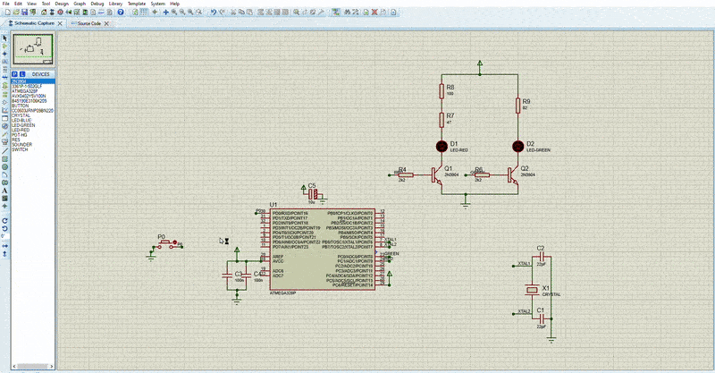

## Firmware uploading

1. Compiled in Atmel/Microchip Studio 7 to generate HEX file


One should see the USBasp programmer under System Devices like this (some issues may arise with the required drivers, as noted below):

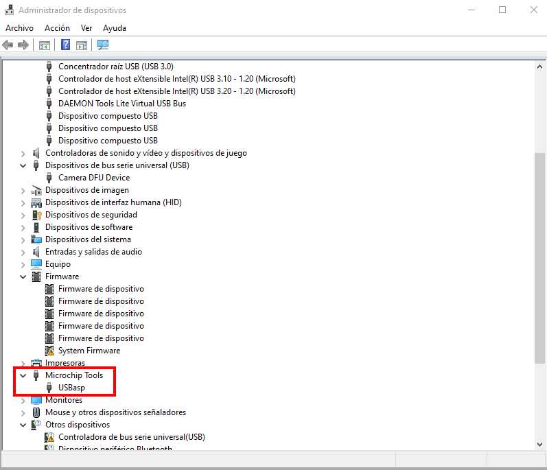

2. Used AVRDUDE via AVRDUDESS GUI with USBasp programmer:

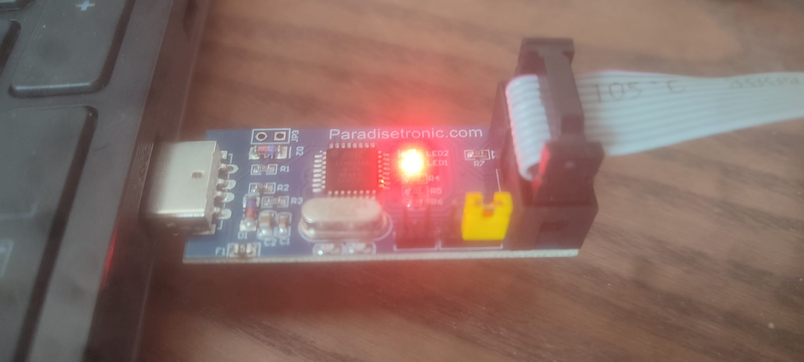

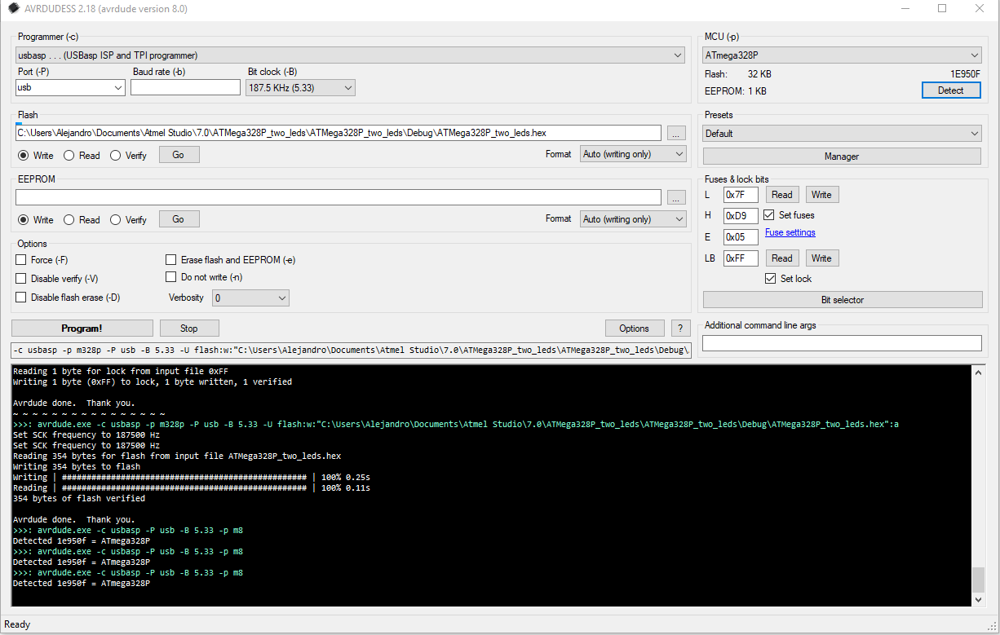

This is the specific command that burns the firmware (one could just use avrdude in command-line interface mode):

```bash
avrdude.exe -c usbasp -p m328p -P usb -B 5.33 -U flash:w:"C:\Users\Alejandro\Documents\Atmel Studio\7.0\ATmega328P_two_leds\ATmega328P_two_leds\Debug\ATmega328P_two_leds.hex":a
```

The fuses (low, high, and extended fuses) of the microcontroller had to be configured according to the required clock, divider, etc., using the AVRDUDESS fuse calculator:

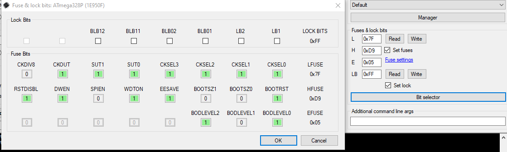

Furthermore, the acquired programmer included a very useful accessory to avoid any confusion with the orientation of the SPI connector pins:

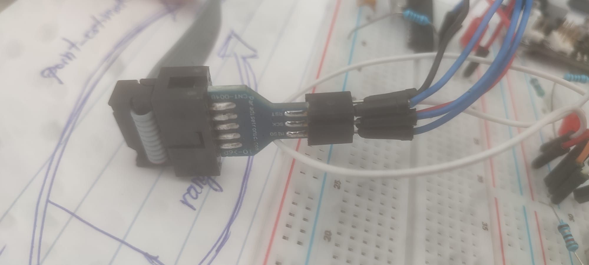

3. Verified SCK signal during programming. Next, we checked that the programming circuit is working by selecting the "Detect" option in AVRDUDESS. We can see an active pulse in the SCK pin:

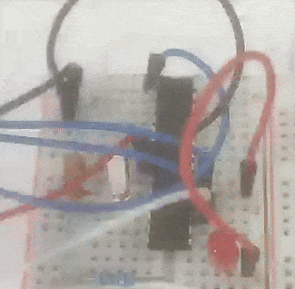

# Testing

The circuit we used to program the microcontroller would be the following:

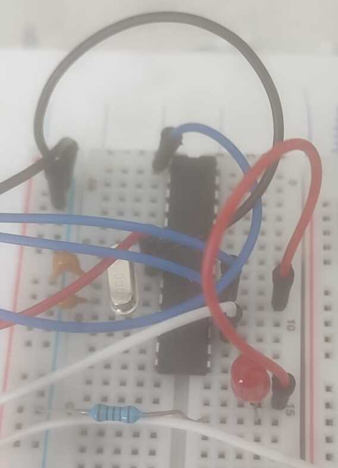

After flashing the firmware in the (non-volatile) uC flash memory, we transferred it to the prototype of the actual circuit:

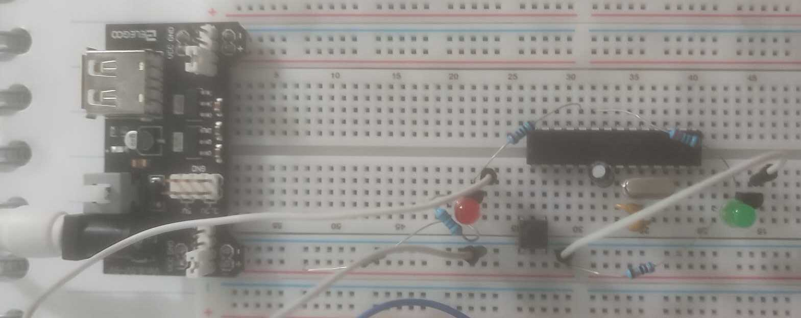

Final implementation showing alternating LED pattern:


# Troubleshooting

Due to using a USBasp clone programmer, several issues were encountered during the process. Below is a comprehensive list of all the problems and their corresponding solutions:

1 - USBasp recognition issues
- Solved using [Zadig](https://zadig.akeo.ie/) to install the **libusbK (v3.1.0.0)** driver.
- Reference links:
  - [StackExchange: USBasp not recognized](https://electronics.stackexchange.com/questions/416714/avrdude-does-not-recognize-usbasp-device)
  - [Video Tutorial 1](https://www.youtube.com/watch?v=vTvO68oTfgg)
  - [Video Tutorial 2](https://www.youtube.com/watch?v=tHWasv1FqSc)
  - [Alternative fix method](https://www.youtube.com/watch?v=tzekKRCbITQ)
  - [Arduino Forum Thread](https://forum.arduino.cc/t/built-in-avrdude-refuses-to-work-with-usbasp-clone/995372/2)

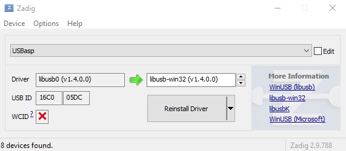

2 - ISP programmer appears as HID instead of USBasp
- Requires the **Chinese PROGISPV172** tool:
  - [Download from Archive.org](https://archive.org/details/prog-isp-ver-1.72-updated-chip)
  - [Download from MEGA](https://mega.nz/folder/cpgQHbJT#17X4YvWeTgorBwN4hmH_YA)
  - More info on [AVRfreaks](https://www.avrfreaks.net/s/topic/a5C3l000000UZPzEAO/t149941)
- This often occurs with USBasp clones using outdated or modified firmware.

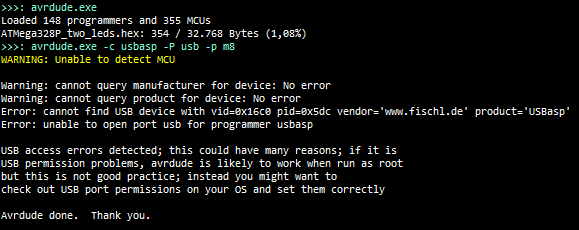

3 - `avrdude: program enable: target doesn't answer (0x01)` Error
- Common error during flashing.
- Possible fix: Use the `-B` flag in avrdude to lower the bit clock frequency (e.g., to **187.5 kHz**).
- More on this:
  - [EEVBLOG Forum Discussion](https://www.eevblog.com/forum/microcontrollers/new-findings-avrdude-error-program-enable-target-doesnt-answer-(0x01)/)
  - [Arduino Forum Discussion](https://forum.arduino.cc/t/avrdude-target-doesnt-answer-what-this-used-to-work/593903)

4 - USBasp clone not working due to modified firmware
- Some USBasp clones do not work out-of-the-box due to unofficial firmware.
- Solution: **Reflash the firmware** using another working USBasp programmer.

5 - LED flickering issues
- Solved by adding **decoupling capacitors** near the microcontroller's power pins to stabilize voltage.

6 - Clock instability
- Resolved by verifying the **22pF capacitors** on the crystal oscillator circuit.

# References

- [Robert Feranec's Playlist](https://www.youtube.com/playlist?list=PLXvLToQzgzdftro2qK5In8p6ExsDFdpzw) — see also the [GitHub repository](https://github.com/FEDEVEL/custom-keyboard)
- [Another concise project](https://www.youtube.com/watch?v=P_oSLBZABGA) using Fusion360
- [ATMega328P Datasheet (PDF)](https://ww1.microchip.com/downloads/en/DeviceDoc/ATmega48A-PA-88A-PA-168A-PA-328-P-DS-DS40002061B.pdf)
- [DroneBot Workshop Video Tutorial](https://www.youtube.com/watch?v=Sww1mek5rHU)
- [AVRfreaks Forum Thread](https://www.avrfreaks.net/s/topic/a5C3l000000Uap2EAC/t155336)
- [Full Example](https://www.youtube.com/watch?v=f6g7k3hyl8s) of a small-scale project using USBasp, Atmel Studio, and Zadig
- USBasp driver issue on Windows 10: [jfetronic tutorial](https://jfetronic.wordpress.com/drivers-del-programador-usbasp-avr-para-micros-atmel/)
