# Introduction

1D filtering is used in a wide variety of use cases: time series, forecasting, ECC signals, or, as focused here, filtering profiles like those scanned with laser profilometers, where causality (dependency on distant past values) is less critical than spatial contiguity/coherence in neighborhood points, robustness against data loss, extreme outliers, and preservation of central trends.

In this post, we will explore various 1D filtering techniques and apply them (implemented in C++) to two different 1D signals: a C Major chord signal and a real laser-scanned profile.

# Algorithms

Each subsection combines theory, code, and results. A global visual/quantitative comparison is provided at the end. Later sections will explain filtered signals and how noise was added. First, we briefly describe each method and show visual results.

## Exponential Filter

Smooths signals by exponentially weighting past values. This filter applies exponential smoothing (aka exponential moving average), commonly used in signal processing for smoothing or creating a "moving average" with emphasis on recent values.

**Equation**:
$$
y[i] = \alpha \cdot x[i] + (1 - \alpha) \cdot y[i-1]
$$

**Parameters**:
- α (0 < α < 1):
  - α ≈ 1 → Fast tracking (less smoothing)
  - α ≈ 0 → Slow tracking (more smoothing)

**Filtered Results**:
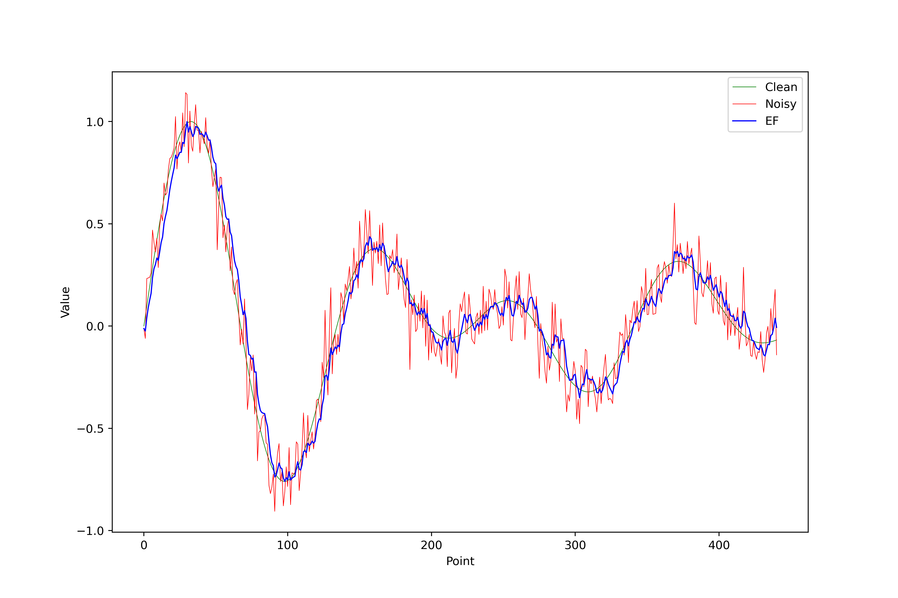
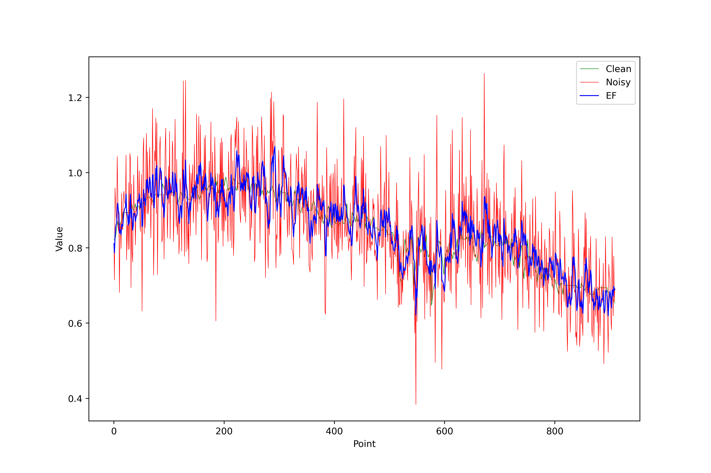

## Total Variation (TV) Filter

Minimizes total variation (gradients) while preserving edges.

**Energy Minimization Equation**:
$$
y[i] = \alpha \cdot x[i] + (1 - \alpha) \cdot y[i-1]
$$

**Parameters**:
- λ ≥ 0: Controls fidelity to original signal
- `step_size`: Gradient descent step size
- `iterations`: Number of iterations

**Filtered Results**:
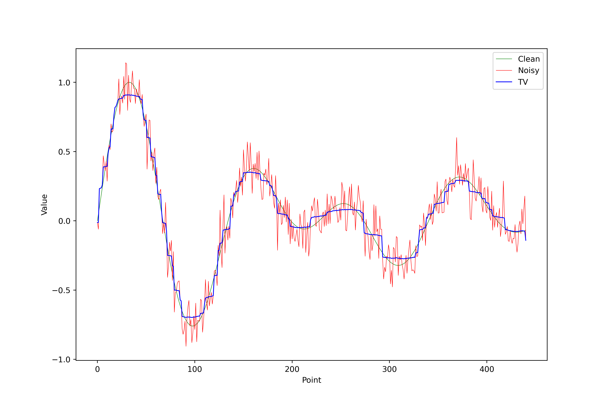


## Convex Hull Envelope

Computes upper convex hull of points (i, x[i]).

**Implicit Equation**:
$$
y[i] = \max \{ f[j] \ | \ (j, f[j]) \text{ lies on the convex hull} \}
$$

**Parameters**: None (depends on signal geometry)

**Filtered Results**:
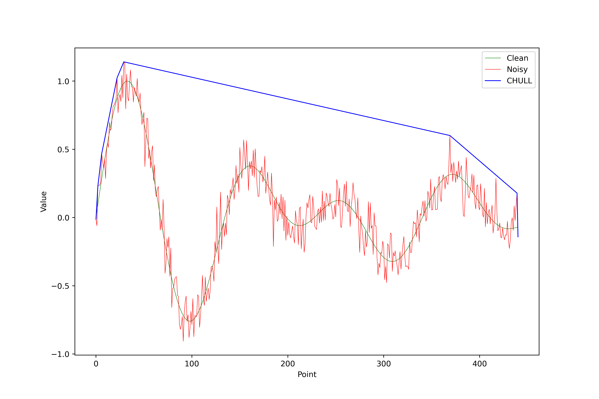


## Moving Average

Averages values in symmetric windows.

**Equation**:
$$
y[i] = \frac{1}{N} \sum_{k=-w}^{w} x[i + k]
$$
where \( N = 2w + 1 \) (window size).

**Parameters**:
- `window_size`: Window width (odd integer)

**Filtered Results**:


## Moving Maximum/Minimum

Upper envelope (maximum) or lower envelope (minimum).

**Equation (maximum)**:
$$
y[i] = \max \{ x[i - w], \ ..., \ x[i + w] \}
$$

**Parameters**:
- `window_size`: Window width

**Filtered Results (maximum)**:
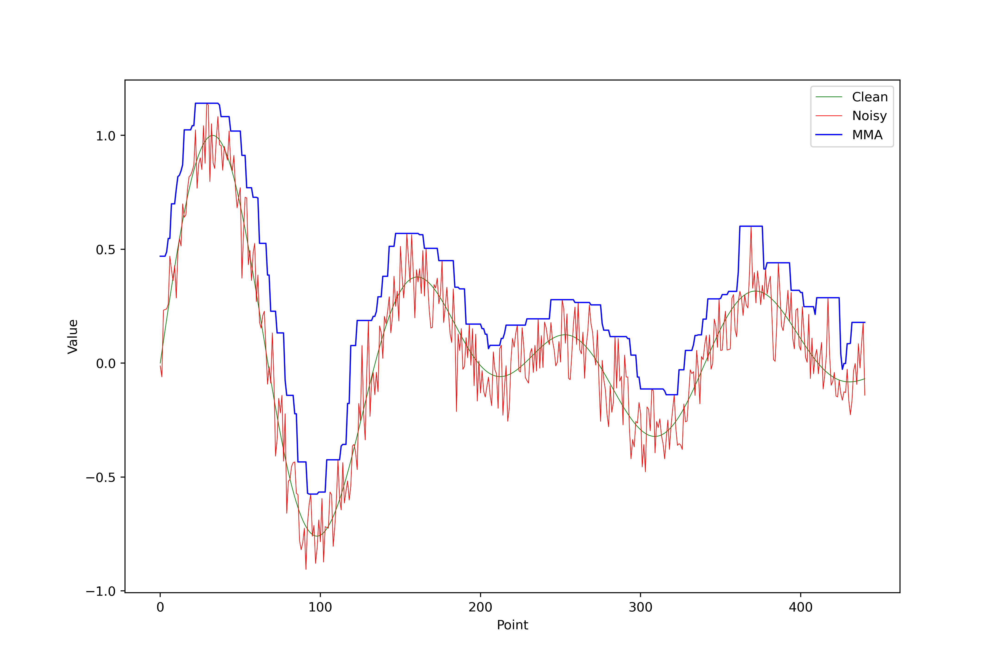
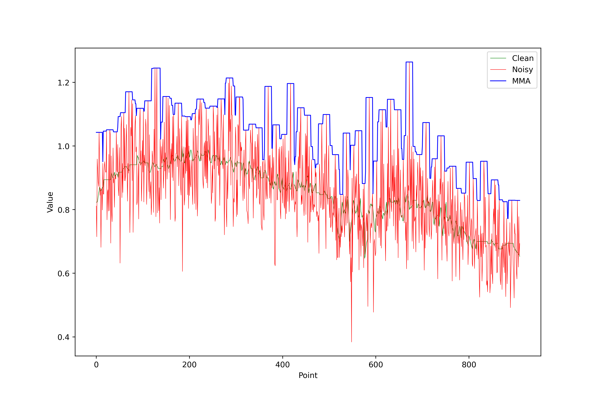

**Filtered Results (minimum)**:
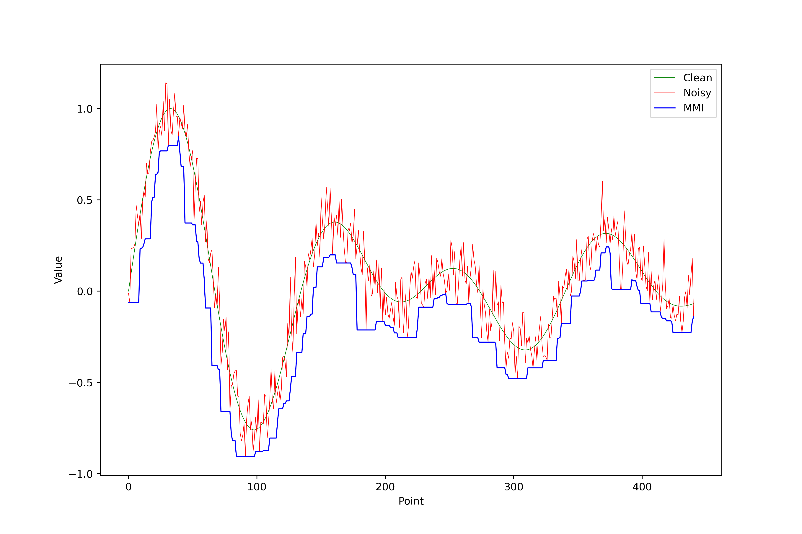
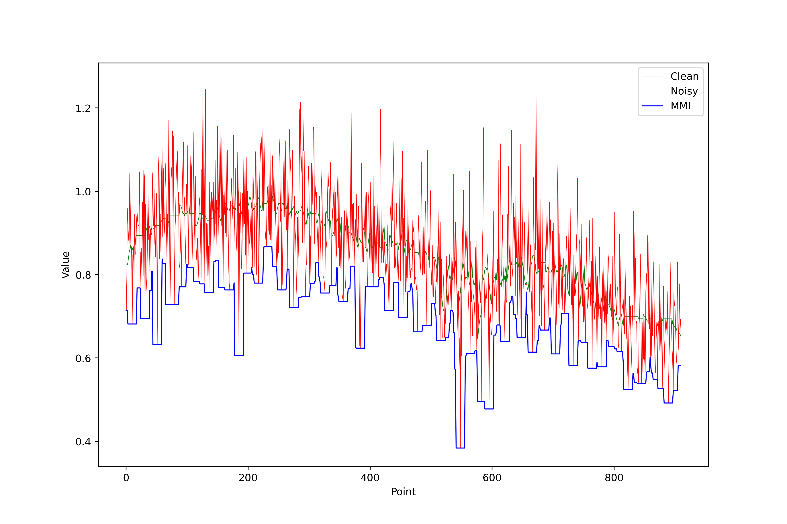

## Moving Median

Removes outliers using local median.

**Equation**:
$$
y[i] = \text{median} \{ x[i - w], \ ..., \ x[i + w] \}
$$

**Parameters**:
- `window_size`: Window width

**Filtered Results**:
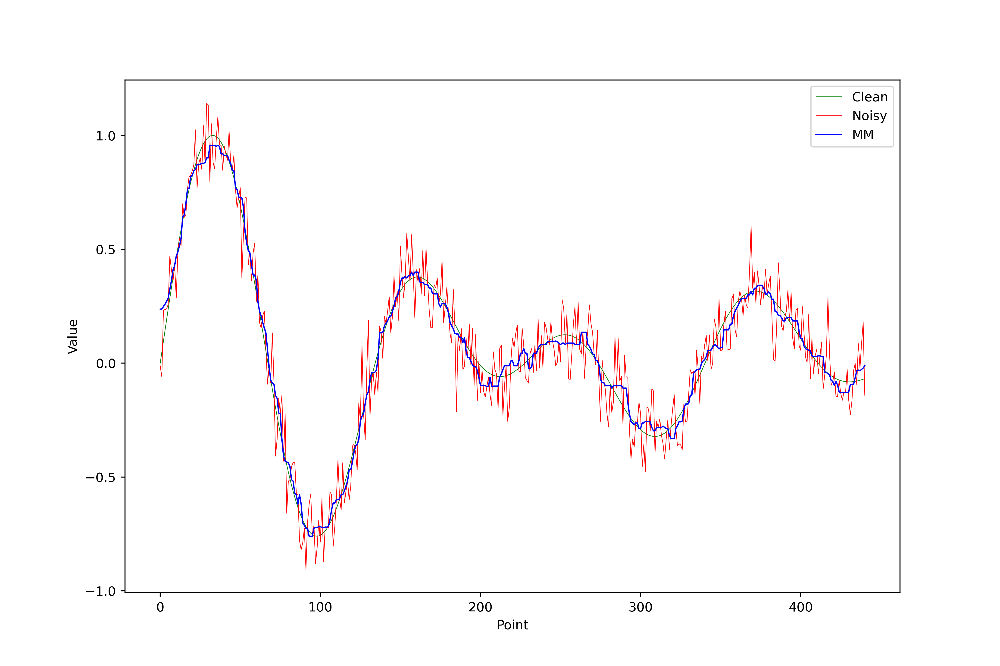
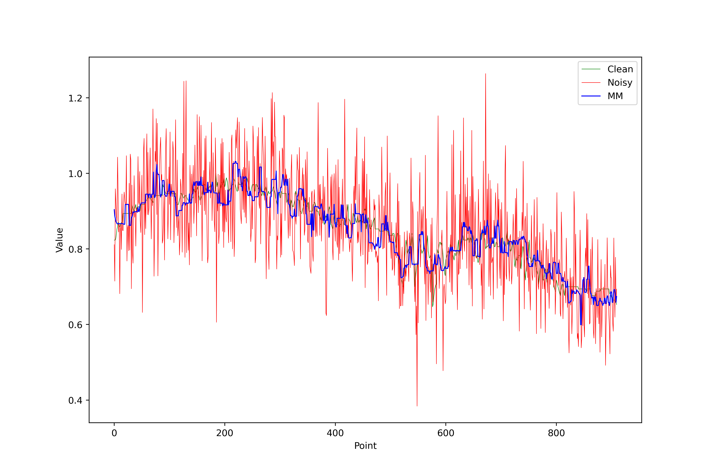

## L0 Gradient Minimization

Promotes constant regions (zero gradients).

**Energy Equation**:
$$ 
E(u) = \|\nabla u\|_0 + \lambda \|u - f\|_2^2
$$ 
where \( \|\nabla u\|_0 \) counts non-zero gradients.

**Parameters**:
- λ ≥ 0: Smoothness control
- `beta_max`: Maximum regularization parameter
- `beta_rate`: Beta increase rate
- `iterations`: Optimization iterations

**Filtered Results**:
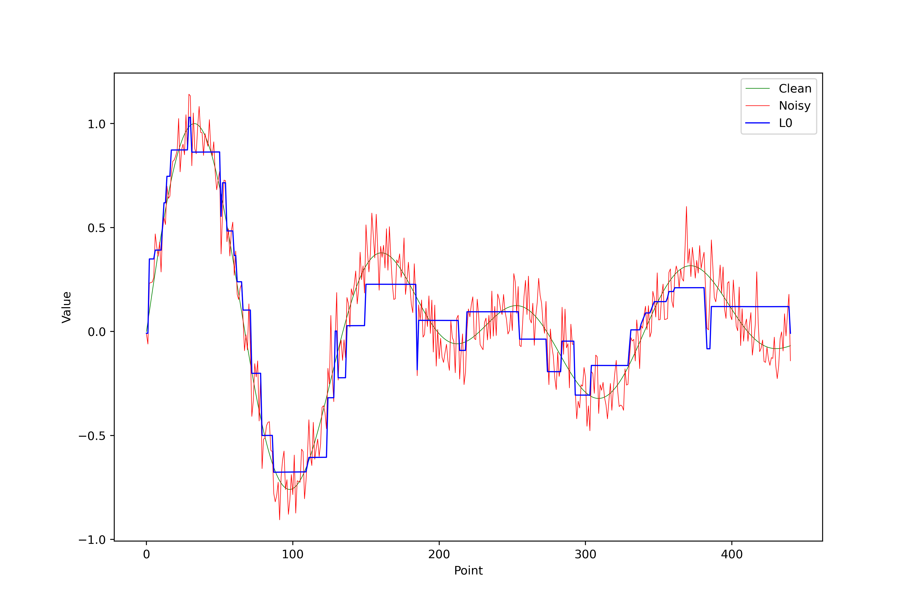


## Hampel Filter

Detects outliers using median and MAD (Median Absolute Deviation).

**Decision Equation**:
$$
y[i] = 
\begin{cases}
x[i], & \text{if } |x[i] - \text{median}(W)| \leq \kappa \cdot \text{MAD}(W) \\
\text{median}(W), & \text{otherwise}
\end{cases}
$$

**Parameters**:
- `window_size`: Window size W
- `nsigma` (κ): MAD multiplier threshold (typical: 3σ ≈ 3 × 1.4826 × MAD)

**Filtered Results**:
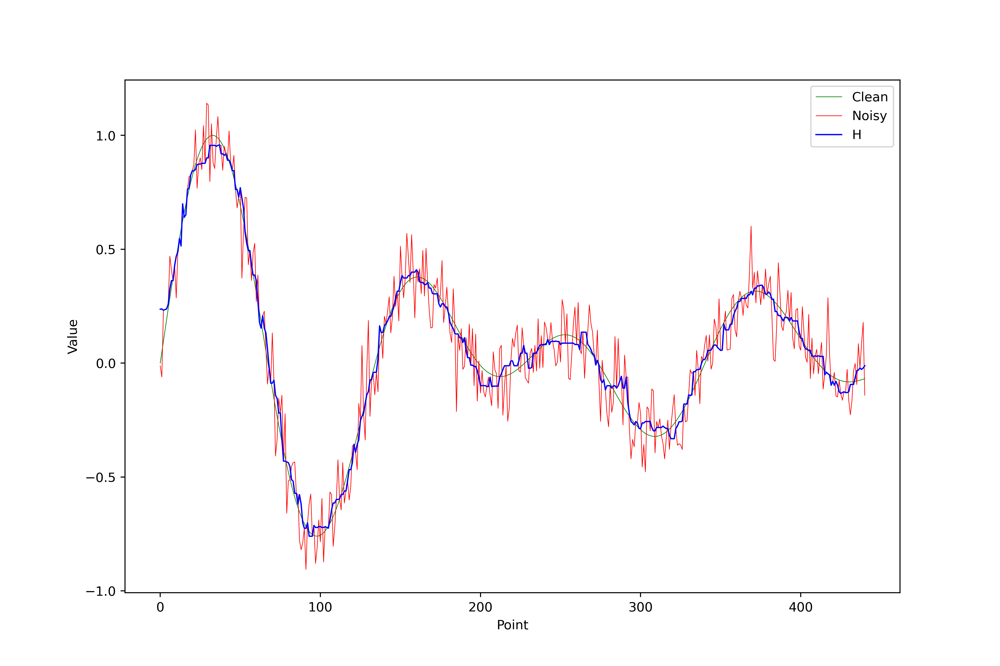


## Hampel Variant Filter

Optimized Hampel version approximating MAD using secondary median filter.

**Decision Equation**:
$$
y_t =
\begin{cases} 
x_t, & \text{if } |x_t - m_t| \leq t \cdot S_{t_m} \\
m_t, & \text{otherwise}
\end{cases}
$$
where:
- $$ m_t $$: Median in main window
- $$ S_t $$: Approximate MAD (median-filtered deviations)
- $$ t $$: Threshold (equivalent to κ in classic Hampel)

**Parameters**:
- `window_size`: Main window size
- `nsigma`: Outlier detection threshold
- `aux_window`: MAD approximation window size

**Advantages**:
- 30-50% faster than classic Hampel
- Similar outlier robustness
- Ideal for long/real-time signals

**Filtered Results**:
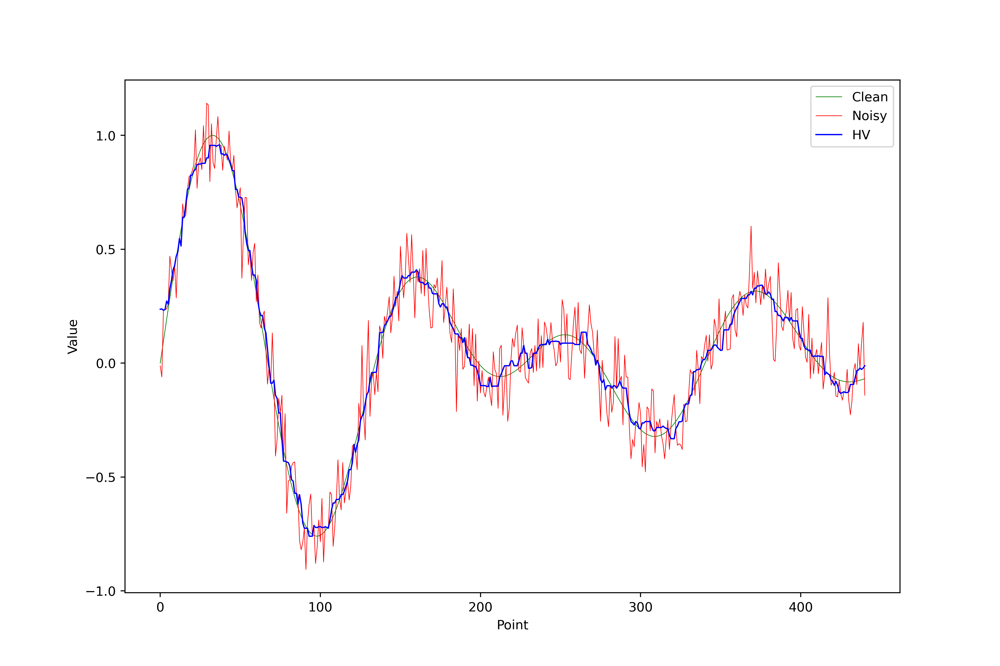


# Comparison

Some methods aren't designed for denoising, making universal quality metrics less meaningful. However, we apply PSNR/MSE to core methods: Moving Average, Moving Median, Hampel, Hampel Variant, TV, L0, and Exponential.

## MSE (Mean Squared Error)
$$
\text{MSE} = \frac{1}{N} \sum_{i=1}^N (y[i] - \hat{y}[i])^2
$$

## PSNR (Peak Signal-to-Noise Ratio)
$$
\text{PSNR} = 10 \cdot \log_{10} \left( \frac{\max(y)^2}{\text{MSE}} \right),
$$

where $$ \max(y) $$ is signal peak value (e.g., 1 for normalized signals).

## Noise Model
Our mathematical noise model combines:
- Gaussian noise
- Impulse noise
- Non-linear noise from laser scanning

Noise and spikes are added via:

```cpp
std::vector<double> addNoiseAndSpikes(const std::vector<double>& clean_signal, double noise_level = 0.1, double spike_probability = 0.01, double spike_amplitude_max = 0.5) {
    std::vector<double> noisy_signal = clean_signal;  // Copy clean signal
    std::default_random_engine generator;
    std::normal_distribution<double> noise(0.0, noise_level);
    std::uniform_real_distribution<double> spike_prob_dist(0.0, 1.0);
    std::uniform_real_distribution<double> spike_amplitude_dist(0.0, spike_amplitude_max);

    for (size_t i = 0; i < clean_signal.size(); ++i) {
        noisy_signal[i] += noise(generator);  // Add Gaussian noise
        if (spike_prob_dist(generator) < spike_probability) {  // Add spike
            double spike_amplitude = spike_amplitude_dist(generator);
            noisy_signal[i] += spike_amplitude;
        }
    }
    return noisy_signal;
}
```

The additive noise model (apart from the non-linear noise inherent to the profile scan) is:

$$
y_i = x_i + \eta_i + s_i,
$$

where:  
- $$\eta_i \sim \mathcal{N}(0, \sigma^2)$$: Gaussian noise  
- $$s_i$$: Spike term (0 or amplitude $$A \sim \mathcal{U}(0, A_{\text{max}})$$)

## Results

We test methods on a C Major chord signal and a real laser-scanned profile.

### C Major Chord

A C Major chord combines frequencies:

| Note | Frequency (Hz) |
|------|----------------|
| C    | 261.63         |
| E    | 329.62         |
| G    | 392.00         |

Generated in C++ as:

```cpp
std::vector<double> generateChordSignal(double duration_ms, double sample_rate = 44100.0) {
    int size = static_cast<int>((duration_ms / 1000.0) * sample_rate);
    double freq_C = 261.63, freq_E = 329.63, freq_G = 392.00;
    std::vector<double> signal(size);
    
    for (int i = 0; i < size; ++i) {
        double t = i / sample_rate;
        signal[i] = std::sin(2*M_PI*freq_C*t) + std::sin(2*M_PI*freq_E*t) + std::sin(2*M_PI*freq_G*t);
    }
    return signal;
}
```

Clean vs. noisy 10ms signal:  

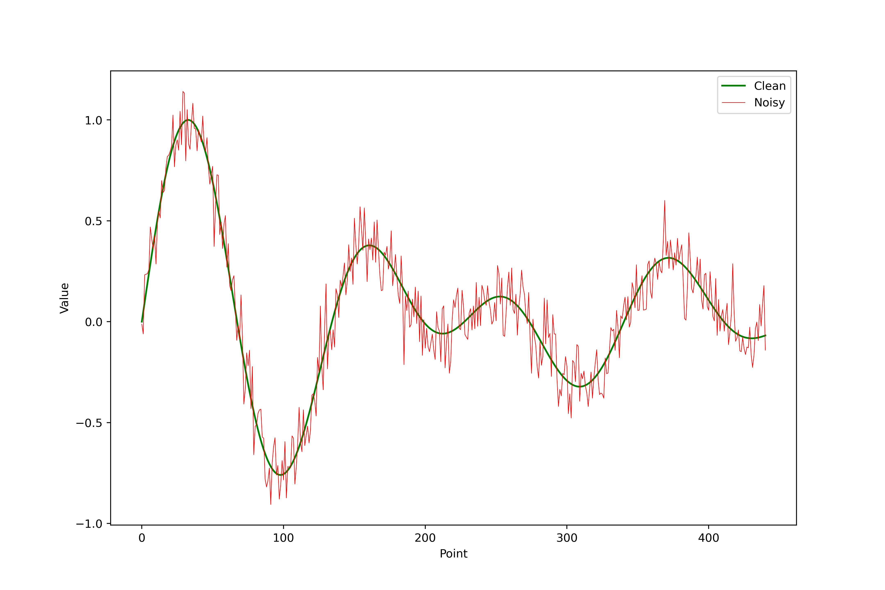

Audio Samples:  

- Clean: \`<audio controls><source src="../assets/blog_data/2025-05-01-1d-filtering/acorde_do_mayor.wav"></audio>\`  
- Noisy: \`<audio controls><source src="../assets/blog_data/2025-05-01-1d-filtering/acorde_do_mayor_ruido.wav"></audio>\`  
- Median-filtered: \`<audio controls><source src="../assets/blog_data/2025-05-01-1d-filtering/acorde_do_mayor_filtrado.wav"></audio>\`  

### Quantitative Comparison

| Method           | PSNR (dB) | MSE         |
|------------------|-----------|-------------|
| Moving Average   | 29.927    | 0.001017    |
| Moving Median    | 27.9873   | 0.001590    |
| Hampel           | 27.6265   | 0.001727    |
| Hampel Variant   | 27.8575   | 0.001638    |
| TV               | 27.477    | 0.001788    |
| L0               | 18.6888   | 0.013525    |
| Exponential      | 23.2828   | 0.004696    |

Surprisingly for the author, the best method (under these highly controlled conditions) is Moving Average .

### Laser Profile

Noisy laser profile (additional synthetic noise added):  


The visual filtering results are shown in their respective sections. Since we lack ground-truth data for this signal, traditional metrics like PSNR aren't applicable, but we could evaluate the filtering quality through 'unsupervised' (talking in ML argot) approaches such as Stein's risk estimators, entropy analysis, or noise stationarity measurements. A proper evaluation would need to consider both noise suppression and feature preservation characteristics specific to our profilometry application, leaving this as valuable future work requiring careful methodological development.

# Conclusion

Parameter tuning is critical for optimal performance. Methods with fewer parameters (e.g., Moving Average) offer practicality but may lack flexibility for highly degraded signals. TV/L0 priors favor piece-wise constant solutions, making them suitable for step-like signals (e.g., TTL pulses) but less ideal for smooth signals. The exponential filter introduces inherent delay, useful for prediction but suboptimal for denoising. A detailed case study is needed to bound each method's capabilities under varying degradation types/levels.

# References

- L0 Smoothing: http://www.cse.cuhk.edu.hk/leojia/projects/L0smoothing/index.html

# TODO 

- Savitzky-Golay Filter.
- L1-Trend Filtering (solve with CVXPY): https://www.cvxpy.org/examples/applications/l1_trend_filter.html.  
- TV-1D Filter Theory: https://github.com/benchopt/benchmark_tv_1d  .
- Evaluate profile filtering.
- Cite Hampel Variant Article when published
