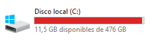
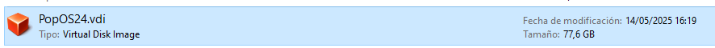
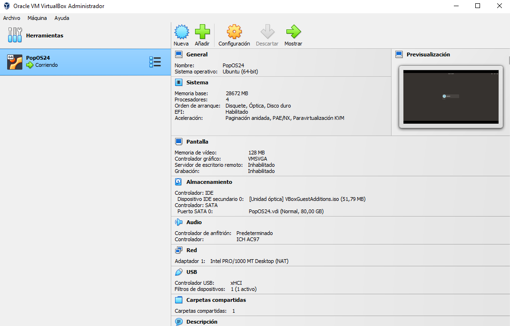
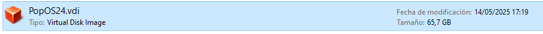

  
 
# Introducción

Cada vez es menos frecuente quedarse sin espacio en el disco duro. Mi portátil del trabajo, un Dell de 1,86 GB de almacenamiento, cumple en un espacio muy reducido expectativas que hace no tanto tiempo parecían imposibles. 


Los orígenes del almacenamiento electrónico se remontan a 1947 con el tubo Williams-Kilburn en la Universidad de Manchester, un sistema que utilizaba tubos de rayos catódicos para almacenar apenas un puñado de bits como puntos luminosos en la pantalla, en cuestión de milisegundos. Otros sistemas ROM almacenaban datos prácticamente en cuerdas de cobre que podrían tejerse manualmente; un proceso que podía durar meses (véase el Apollo Guidance Computer de 1960, con 72 KB de almacenamiento). En la década de 1950 se introdujeron otras ideas tecnológicas pioneras para este fin, como la memoria de línea de retardo de mercurio del EDSAC (1949), la memoria magnética de núcleo del MIT (1953) o el revolucionario RAMAC 305 de IBM (1956), que introdujo el concepto del disco duro con sus 50 platillos magnéticos capaces de almacenar 5 millones de caracteres.

La evolución, desde las memorias de núcleo magnético y los tambores de los años 50, pasando por los discos Winchester, los disquetes, los CDs, los primeros discos duros de GB, las memorias flash y los SSD, hasta llegar al almacenamiento masivo virtualizado y en la nube, ha multiplicado la capacidad y dividido la escala hasta alcanzar a superar la Ley de Moore. Como comparación, el primer dico duro de 1 TB (HDD) anunciado por Hitachi Global Storage Technologies en 2009, el Hitachi Deskstar 7K1000 que usaba platos de 200 GB y 3,5 pulgadas y rotaba a unos 7200 rpm era, en comparación con el primer HDD de la historia, el IBM RAMAC 350 de 3,75 MB, de 1959), tenía unas trescientas mil veces más capacidad y era miles de veces más pequeño. Y de esto ya hace más de 15 años.

A continuación se muestra un listado, consultado en [1], que evidencia la tendencia lineal y, últimamente, exponencial de la progresión de las capacidades de almacenamiento:

| Período | Año | Tecnología | Capacidad | Características |
|---------|-----|------------|-----------|----------------|
| **Décadas 1950-1960: Los Fundamentos** | | | | |
| | 1956 | RAMAC 305 | 5 MB | 50 platillos magnéticos |
| | 1962 | IBM 1311 | 2 MB | Discos removibles de 6 platillos |
| | 1962 | IBM 1401 con CRAM | 5.5 MB | 256 tarjetas magnéticas |
| | 1965 | IBM 2314 | 29 MB | Unidad removible |
| **Década 1970: Consolidación Tecnológica** | | | | |
| | 1973 | IBM 3340 Winchester | 280 MB | Cadena de unidades |
| | 1974 | IBM 3850 | 236 GB | Sistema de cintas robotizado |
| | 1975 | DEC RL01 | 5-10 MB | Formato mejorado |
| **Década 1980: Democratización del Almacenamiento** | | | | |
| | 1980 | Seagate ST506 | 5 MB | Primer HDD para microcomputadoras |
| | 1981 | Sony 3½" floppy | 1.44 MB | Formato compacto |
| | 1984 | IBM 3480 | 200 MB | Cartuchos de cinta |
| | 1987 | Conner CP340A | 40 MB | Estableció estándar 3.5" |
| **Década 1990: Era del Almacenamiento Masivo** | | | | |
| | 1990 | IBM 9345 | 1-1.5 GB | Cabezales magneto-resistivos |
| | 1994 | CompactFlash | 2 GB | Formato removible |
| | 1995 | DVD | 4.7 GB | Disco óptico |
| | 1999 | IBM Microdrive | 170-340 MB | Formato ultra-compacto |
| **Siglo XXI: Explosión Exponencial** | | | | |
| | 2000 | USB Flash drives | 8 MB - varios TB | Almacenamiento portátil |
| | 2003 | Blu-ray | 25-50 GB | Disco óptico alta definición |
| | 2009 | Primer HDD 1 TB | 1 TB | Hitachi Deskstar 7K1000 |
| | 2006-2007 | Almacenamiento en nube | Ilimitada | Capacidad prácticamente ilimitada |
| | 2025 | Actualidad | 22 TB / 100 TB | HDDs comerciales / SSDs |

Paralelamente, la evolución hacia el almacenamiento virtualizado y en la nube, iniciada con Amazon Web Services (2006) y servicios como Dropbox (2007), permite la abstracción de la capacidad física real mediante la creación de volúmenes lógicos que pueden expandirse dinámicamente, optimizar el uso del espacio disponible y distribuir la información a través múltiples dispositivos de manera transparente para el usuario. Empresas como Backblaze, con 1,9 EB o Wasabi, con 1 EB de capacidad de almacenamiento total, siendo relativamente pequeñas, evidencian esto. Y empresas gigantes que proporcionan servicios en la nube como AWS, Azure o GCP, fácilmente pueden tener cien veces más que las primeras (o podrían llegar a combinar zettabytes de almacenamiento, entre todas).

Actualmente, la capacidad de almacenamiento disponible para usuarios individuales se mide en terabytes y petabytes, mientras que las organizaciones gestionan exabytes de información, algo inimaginable hace tiempo. Además, este crecimiento exponencial continúa acelerándose con tecnologías emergentes como el almacenamiento cuántico y los sistemas de archivo distribuidos a escala planetaria. Esta progresión, desde los 3.75 MB del RAMAC hasta los sistemas actuales de múltiples exabytes, es definitivamente _algo_.

# Virtualización

Oracle VM VirtualBox es un potente software de virtualización de sistemas operativos que, como muchos otros, permite crear sistemas operativos dentro de otros, _ad infinitum_. Nos permite, por ejemplo, usar Linux dentro de Windows para utilizar su kernel, o incluso un Android, para usar aplicaciones móviles. 

Este tipo de sofware de virtualización utiliza formatos de imagen de disco virtual para almacenar discos virtuales, que es como un disco duro dentro de un archivo que contiene el sistema operativo, las aplicaciones y, en general, el sistema de ficheros de la máquina virtual. Otros formatos, alguno preferible si se usan otros software, son VMDK (de VMware), VHD (de Microsoft Hyper-V) o QCOW2 (de QEMU).

El formato VDI (Virtual Desktop Infrastructure) es uno de los más recurridos y el que se emplea en este post. VDI funciona ofreciendo una versión digitalizada del escritorio de un computador, que se ejecuta en un servidor y al que puede acceder desde cualquier dispositivo que tenga acceso a su red.



# Caso de uso

Me he quedado sin espacio (a penas unos MB) en mi sitema host windows, y tengo una máquina virtual con un PopOs24 de 80 GB en total; así que le disminuiré un poco el tamaño, pues no basta con desintalar cosas de dentro de la distro. virtual, obvimente (pues no hay espacio en el anfitrión), ni basta solo con hacer un "resize" (e.g. coin GParted) como se podría hacer para ampliarlo, sino que es necesario liberar espacio dentro de la máquina virtual, rellenar el espacio libre con ceros y luego compactar el disco. O sea, mi objetivo primordial es conseguir liberar y/o ampliar intrínsecamente espacio sea como sea.



El flujo es el siguiente:
1. Creamos el archivo de ceros → esto sobrescribe el espacio libre con ceros (los ceros son comprimibles, a diferencia de los datos arbitrarios o aleatorios).
2. Lo borramos → el sistema lo marca como espacio libre o "disponible" otra vez, pero ahora está físiamente lleno de ceros en el espacio virtual, por lo que el hipervisor entiende como que datos comprimibles, que podemos no necesitar.
3. VirtualBox (u otros hipervisores) pueden detectar bloques de ceros y optimizarlos. Así, al compactar con `VBoxManage --compact`, VirtualBox detecta estos bloques de ceros y, reemplazándolos simplemente por metadatos que dicen "aquí hay X bytes de ceros", libera ese espacio físico en el disco.

Primero limpiaremos espacio irrelevante de Ubuntu (liberar espacio del disco):

```bash
sudo apt clean && sudo apt autoremove
```

Y también es recomendable eliminar archivos grandes innecesarios, vaciar la papelera y eliminar archivos temporales. A continuación algunos trucos para eliminar espacio muchas veces innecesario:

```bash
rm -rfv ~/.cache/thumbnails
cd ~/.local/share/Trash && rm -rf *
sudo apt-get autoclean && sudo apt-get clean && sudo apt-get autoremove
LANG=C snap list --all | while read snapname ver rev trk pub notes; do if [[ $notes = *disabled* ]]; then sudo snap remove "$snapname" --revision="$rev";fi; done
sudo journalctl --vacuum-time=3d
pip cache purge && rm -rf ~/.cache/pip  # Eliminar caché de pip
sudo apt clean      			# Borrar los paquetes descargados
sudo apt autoclean  			# Borrar paquetes obsoletos
sudo apt autoremove 			# Borrar dependencias no usadas
rm -rf ~/.cache/*   			# Eliminar cachés generales del usuario
rm -rf ~/.cache/thumbnails/* 		# Eliminar caché de thumbnails (si usas entorno gráfico como GNOME/KDE)
npm cache clean --force 		# Eliminar caché de npm
sudo rm -rf /tmp/* 			# Limpiar archivos temporales
sudo journalctl --vacuum-time=7d 	# Limpiar logs antiguos (opcional)
```

Ver espacio liberado antes y después con:
```bash
alejandro@pop-os:~/.local/share/Trash$ df -h
Filesystem      Size  Used Avail Use% Mounted on
tmpfs           2.8G  1.5M  2.8G   1% /run
efivarfs        256K  211K   41K  85% /sys/firmware/efi/efivars
/dev/sda3        74G   55G   16G  79% /
tmpfs            14G     0   14G   0% /dev/shm
tmpfs           5.0M     0  5.0M   0% /run/lock
/dev/sda1      1020M  189M  832M  19% /boot/efi
/dev/sda2       4.0G  2.5G  1.6G  62% /recovery
shared_folder   477G  465G   12G  98% /media/sf_shared_folder
tmpfs           2.8G  176K  2.8G   1% /run/user/1000
/dev/sr0         52M   52M     0 100% /media/alejandro/VBox_GAs_7.0.222
```

Supongamos que tengo 20 GB libres y quiero dejar libres 8 GB, entonces creamos un archivo de 12 GB para que se comprima solo ese tamaño posteriormente y nos quede este espacio de "reserva" de 8 GB (puede tardar): 
```bash
sudo dd if=/dev/zero of=~/zero.fill bs=1M count=12288
```

Esto rellena parte del espacio libre con rea un archivo de ceros de 12 GB (no se llena el disco, solo una parte).

Una vez creado y escrito, lo borramos:
```bash
rm ~/zero.fill
```

Ahora apagar la VM y compactar el disco desde el sistema anfitrión (abriendo Powershell como administrador):
```powershell
PS C:\Archivos de programa\Oracle\VirtualBox>                      
./VBoxManage modifymedium "C:\Users\Alejandro\VirtualBox VMs\PopOS24\PopOS24.vdi" --compact
>> 0%...10%...20%...30%...40%...50%...60%...70%...80%...90%...100% 
```

En efecto, tras la compresión, el .vdi pesa 12 GB menos, consiguiendo nuestro propósito:



O quizá la solución desde un principio era usar contenedores, no máquinas virtuales...

# Referencias

- https://www.computerhistory.org/timeline/memory-storage/
