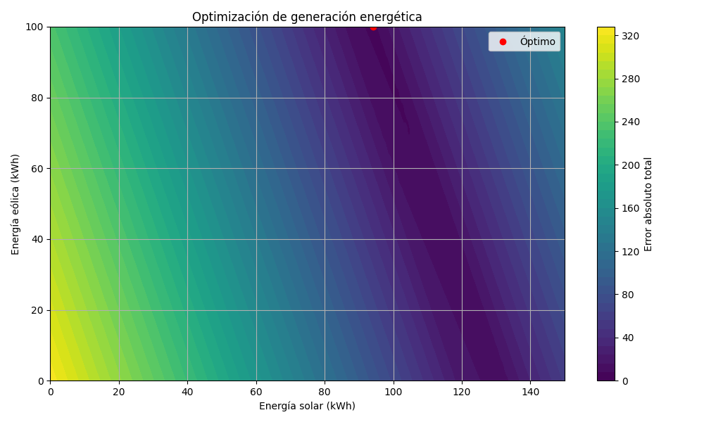

# Introducción

La optimización convexa busca (muchas veces) lo mismo que los modelos de aprendizaje, pero lo hace de una manera más estructurada, trazable y matemáticamente rigurosa. Mientras que aquellos funcionan como "caja negra", en la optimización convexa defines explícitamente una función objetivo convexa y restricciones también convexas. Esto te asegura que cualquier mínimo local sea, al mismo tiempo, un mínimo global.

La ventaja es que permite diseñar soluciones óptimas con garantías teóricas sólidas, sin necesidad de entrenamiento. Además, son altamente interpretables, explicables, y proporcionan respuestas altamente confiables en tiempo real, lo que es mandatorio en muchos sectores, como el industrial o en sistemas críticos. Aunque en cierto modo la ausencia de tiempo de entrenamiento se suple con la necesidad de contar con un bagaje teórico fundamentado y la capacidad de realizar una modelazación matemática robusta del problema. 

En este post aplicaremos optimización convexa a eficiencia energética, donde el objetivo es mejorar la situación actual sin perder el control de los resultados ni de las acciones que se quieren tomar. Llevado a un caso concreto, el enfoque se centra en optimizar la combinación de fuentes renovables disponibles para cubrir una demanda energética observada (medida directamente), respetando los límites físicos de generación y minimizando la diferencia total (en valor absoluto) entre lo generado y lo demandado.

# Implementación

**Contexto ejemplar**: una microred (una red eléctrica de pequeña escala que puede estar conectada a la red principal o funcionar de forma independiente para suministrar energía a un área específica) urbana en una zona semiindustrial dispone de una planta fotovoltaica y un parque eólico, cuyas capacidades reales de producción están monitorizadas mediante sensórica en tiempo real. También se cuenta con el registro histórico de la demanda energética horaria. En este escenario, se busca optimizar cuánta energía generar de cada fuente durante una ventana de planificación corta (por ejemplo, las próximas 3 horas), para que la energía total generada se aproxime lo mejor posible a la demanda observada recientemente.

Esto es útil para redes que no tienen almacenamiento, o tienen almacenamiento limitado, donde la generación debe adaptarse lo más posible al consumo para evitar pérdidas o desequilibrios de red. Recuérdese que es importante tratar de igualar generación y demanda porque la electricidad (en estas redes) no se puede almacenar (por tanto debe consumirse al instante) y un desbalance causa inestabilidad (alteraciones de frecuencia), apagones, etc. 

**Formulación matemática**:

Queremos resolver el siguiente problema de optimización:

$$
\text{Minimizar: } \sum_{i=1}^n |A_i x - y_i|
$$

$$
\text{s.a. } l_j \leq x_j \leq u_j \quad \forall j \in \{1,2\}
$$

- $$ x \in \mathbb{R}^2 $$: cantidad de energía que queremos generar de cada tecnología (solar $$x_0$$, eólica $$x_1$$), constantes durante el horizonte de optimización.
- $$ A_i $$: vector con coeficientes de producción para cada fuente en el periodo $$i$$, basada en los datos medidos (o estimada de un forecast de la producción horaria).
- $$ y_i $$: demanda real observada en el periodo $$i$$.
- $$ l_j, u_j $$: límites físicos de producción para cada tecnología.

Esto quiere decir: queremos encontrar un **valor fijo de producción para cada fuente** (por simplicidad operativa), que cubra bien una serie de demandas reales pasadas, ponderadas por las eficiencias horarias medidas (o estimadas).

Podemos ver que estamos optimizando una norma L1 (función objetivo consistente en la suma de diferencias absolutas), que es más robusta a valores atípicos que la norma euclídea. Aunque convexa, no es diferenciable en todo el dominio, pero esto a nosotros aquí no nos importa.

## Ejemplo de datos fidedignos

Basado en datos reales simplificados de operación de una microred:

| Periodo | Solar estimada (coef.) | Eólica estimada (coef.) | Demanda (kWh) |
|---------|-------------------------|--------------------------|----------------|
| 1       | 0.80                    | 0.25                     | 95             |
| 2       | 0.85                    | 0.30                     | 110            |
| 3       | 0.90                    | 0.35                     | 120            |

Los coeficientes indican la **eficiencia estimada o factor de conversión** de la planta en ese periodo (por ejemplo, por radiación o viento previsto/medido). No tienen por qué sumar 1 entre solar y eólica, pues representan eficiencia individual absoluta. Los coeficientes se computarían dividiendo la energía realmente generada en un periodo (medida en kWh por sensórica) entre la capacidad nominal instalada de la fuente. Por ejemplo, si una planta solar de 150 kW genera 120 kWh en una hora, su coeficiente es 120 kWh ÷ 150 kW = 0.8 (factor de utilización o eficiencia horaria).

Es decir, estamos simulando que estos coeficientes nos vienen _ya calculados_ en todo momento. En la realidad, deberían ser computados en tiempo real mediante sensores, antes de "enviarlos" al modelo optimizador.

Se considera que usar coeficientes es más intersante que los kWh crudos porque representan qué fracción de la capacidad instalada está realmente disponible (por culpa de condiciones climáticas, mantenimiento... lo que sea); es decir, el modelo optimiza _qué proporción de la capacidad usar_, no optimiza _lo que ya se ha generado_. Por ejemplo, si hay 150 kW instalados pero hoy solo puedes usar el 80 % (coef. 0.8), se puede generar hasta 120 kWh. El modelo entonces decide si conviene usar los 120 kWh, o menos.

Definimos los límites físicos de producción/generación de cada tecnología:

- Solar: $$ x_0 \in [0, 150] \ kW$$
- Eólica: $$ x_1 \in [0, 100] \ kW$$

La matriz A y el vector y quedan así:

```python
A = [
    [0.80, 0.25],
    [0.85, 0.30],
    [0.90, 0.35],
]
y = [95, 110, 120]
```

Cada fila $$Ai$$​ se multiplica por el vector de decisiones $$x=[x0​,x1​]$$ para obtener la energía generada efectiva en ese periodo.

## Reformulación con variables auxiliares

Para manejar el valor absoluto (función no diferenciable en $$x = 0$$), introducimos variables auxiliares $$ei$$​ que satisfacen:

$$
ei​≥Ai​x−yi​, \ ei​≥−(Ai​x−yi​)
$$

El modelo final es convexo y lineal, resoluble con herramientas estándar. El código que emplea Pyomo para formular y resolver el problema está disponible [aquí](https://github.com/agarnung/computerVisionMiscellaneous/tree/main/2025-07-15-convex-optimization-I).

A continuación se muestra el resultado de la optimización; con tonos azulados las zonas mínimas; punteada en rojo se muestra en 2D la solución encontrada (habría que verificar si el espacio de búsqueda con esta formulación realizada, que lo parece, realmente es una parábola 3D o un paraboloide hiperbólico).



# Conclusión

Este ejemplo muestra cómo la optimización convexa puede implementarse de forma completamente fidedigna y trazable para aplicaciones reales en eficiencia energética. No usamos predicciones arbitrarias ni suposiciones artificiales: todo parte de datos reales o medidos directamente por la infraestructura. El modelo es bello, sencillo, robusto, con matemáticas sólidas y resultados interpretables y puede escalarse a escenarios con más tecnologías, periodos o restricciones adicionales (costes, emisiones, etc.).

# Referencias

- [Explicaciones introductorias a la programación matemática real de Gurobi](https://www.gurobi.com/resources/math-programming-modeling-basics/)  
- [Ejemplos en Google Colab de Gurobi](https://www.gurobi.com/jupyter_models/)
- [The CP-SAT Primer](https://d-krupke.github.io/cpsat-primer/00_intro.html)
