Lets talk about NeRF. 

# Introduction

Neural Radiance Fields (NeRF) is a novel technique (i.e., about 3-4 years old) that completely revolutionized the world of 3D graphic rendering. I can predict, not lightly, that in the coming years it will be rare for new implementations of graphic renderers, especially in digital twins and AR/VR, to function with triangles/meshes, but rather with concepts like those presented by NeRF or primitives like those of Gaussian Splatting (which we'll leave for another post).

Imagine that your scene, your real object, could be modeled by weights, like those of a neural network. And not just from one view, but the object/scene from ALL possible views is modeled by your network. This is what NeRF does: it models the continuous distribution (function) of color and opacity (i.e., point density) along all rays (line from the optical center to the pixel) in all possible views of the scene.

It is much more similar to ray tracing than to usual rasterization, where what is seen of the scene in the foreground is "painted" or discretized. And, because of this, it is notably slower. But only in its original version, as Instant NGP (Neural Graphics Primitives) exists, which drastically reduces training time [insert link].

To learn much more about the very interesting theory of NeRF, see [this resource from Computerphile](https://www.youtube.com/watch?v=wKsoGiENBHU).

# Nerfstudio

Now let's talk about how to implement an application with this technique. There is this great tool, Nerfstudio [insert link], which might be the most used currently for this purpose. And it doesn't just implement NeRF, but other techniques like flavors of Gaussian Splatting. We proceed to download it from [here](https://docs.nerf.studio/quickstart/installation.html).

An introduction to NeRF that I like is given by Antonio Torralba et al. in their [book](https://visionbook.mit.edu/nerf.html#sec-nerfs-nerf_section). In essence, NeRF is a way to parameterize a **radiance field** using a neural network, typically an MLP (*Multilayer Perceptron*), which estimates the density and color for each point in space. This model learns a continuous function of 3D space from 2D images.

Furthermore, NeRF incorporates positional encodings (like those in *transformers*) to model high-frequency variations in the data, allowing for a much more detailed representation of geometry and appearance.

Nerfstudio provides us with an accessible interface to work with this entire pipeline, from data capture to model training and interactive visualization of the result.

## Installation on Linux (failed)

Initially, I will try to use WSL on Windows 10 to play with Nerfstudio. Let's go to the Nerfstudio GitHub repo. They mention that we need an NVIDIA graphics card with CUDA installed to access accelerated graphics processing functions. Okay, I have the card.

```bash
alejandro@DESKTOP-AIFFN1L:~$ nvidia-smi

+-----------------------------------------------------------------------------------------+
| NVIDIA-SMI 565.65                 Driver Version: 566.07         CUDA Version: 12.7     |
|-----------------------------------------+------------------------+----------------------|
| GPU  Name                 Persistence-M | Bus-Id          Disp.A | Volatile Uncorr. ECC |
| Fan  Temp   Perf          Pwr:Usage/Cap |           Memory-Usage | GPU-Util  Compute M. |
|                                         |                        |               MIG M. |
|=========================================+========================+======================|
|   0  NVIDIA GeForce RTX 3050 ...    On  | 00000000:01:00.0   On  |                N/A   |
| N/A   52C    P8              3W /  75W  |  272 MiB / 4096 MiB   |     0%     Default    |
|                                         |                        |                N/A   |
+-----------------------------------------+------------------------+----------------------+

+-----------------------------------------------------------------------------------------+
| Processes:                                                                              |
|  GPU   GI   CI        PID   Type   Process name                              GPU Memory |
|        ID   ID                                                               Usage      |
|=========================================================================================|
|  No running processes found                                                             |
+-----------------------------------------------------------------------------------------+
```

[The folks at NVIDIA](https://www.youtube.com/watch?v=K9anz4aB0S0) ensure CUDA is highly backward compatible; I could safely use Nerfstudio with my CUDA 12.7. But Nerfstudio [recommends](https://github.com/NVlabs/tiny-cuda-nn/issues/331) Torch 2.1.2 with CUDA 11.8., so we will use an Anaconda (or Conda) environment within the Linux system (as recommended) and, even if a different version of CUDA is used, Python and other libraries like PyTorch, one of the great advantages of using virtual/conda environments is that it allows isolating specific versions of these, without affecting the main system or other environments.

Following the [official installation guide](https://docs.nerf.studio/quickstart/installation.html):

Install conda. Or better, Miniconda, which is the light version of conda, and will be sufficient. See [installation guide](https://www.anaconda.com/docs/getting-started/miniconda/install#linux):

```bash
mkdir -p ~/miniconda3
wget https://repo.anaconda.com/miniconda/Miniconda3-latest-Linux-x86_64.sh -O ~/miniconda3/miniconda.sh
bash ~/miniconda3/miniconda.sh -b -u -p ~/miniconda3
rm ~/miniconda3/miniconda.sh
echo 'export PATH="$HOME/miniconda3/bin:$PATH"' >> ~/.bashrc
source ~/.bashrc
```

To check it's installed:

```bash
alejandro@DESKTOP-AIFFN1L:~/miniconda3$ conda --version
conda 25.3.1   
```

Create the conda environment:

```bash
conda create -n nerfstudio python=3.8 -y
```

Activate the environment and update pip to the latest available version:

```bash
conda activate nerfstudio   
python -m pip install --upgrade pip
```

Install cuda-toolkit 11.8 from the NVIDIA channel:

```bash
conda install -c "nvidia/label/cuda-11.8.0" cuda-toolkit -y
```

Install PyTorch 2.1.2 with CUDA 11.8 (precompiled binaries):

```bash
pip install torch==2.1.2+cu118 torchvision==0.16.2+cu118 --extra-index-url https://download.pytorch.org/whl/cu118
```

If there are issues, Install the CUDA Toolkit for WSL [like here](https://github.com/NVlabs/tiny-cuda-nn/issues/331):

```bash
wget https://developer.download.nvidia.com/compute/cuda/11.8.0/local_installers/cuda_11.8.0_520.61.05_linux.run
sudo sh cuda_11.8.0_520.61.05_linux.run
```

One then need to edit his `~/.bashrc` file, and add:

```bash
export PATH=/usr/lib/wsl/lib:$PATH
export PATH=/usr/local/cuda-11.8/bin:$PATH
export LD_LIBRARY_PATH=/usr/lib/wsl/lib:$LD_LIBRARY_PATH
```

And dependencies:

```bash
pip install ninja git+https://github.com/NVlabs/tiny-cuda-nn/#subdirectory=bindings/torch
sudo apt install ffmpeg
conda install -c conda-forge colmap
```

Check that COLMAP 3.8 with CUDA is successfully installed:

```bash
colmap -h
```

Verify installation:

```bash
python -c "import torch; print(torch.__version__); print(torch.cuda.is_available())"
>> 2.1.2+cu118
>> True  
```

> Tip:
>
> Conda allows saving the environment with `conda env export > environment.yml`

We can install Nerfstudio as a package:

```bash
pip install nerfstudio
```

Or from source:

```bash
git clone https://github.com/nerfstudio-project/nerfstudio.git```
cd nerfstudio
pip install --upgrade pip setuptools
pip install -e .
```

## Scanning Our Room

We will use our own data, following [this tutorial](https://docs.nerf.studio/quickstart/custom_dataset.html).

We recorded a video of our room, from a mobile phone, in any format. It is important that the movements are smooth and preferably we always point more or less to the center of the room, and vary the height of the phone in Z "quite a bit", for example from hip to shoulders smoothly.


Now, using this script, we keep "n" frames from the video and save them in the folder `to_reconstruct`

```py
import cv2
import os
import sys
import numpy as np

def extract_n_frames(video_path, output_dir="to_reconstruct", n=10):
    # Create output directory
    os.makedirs(output_dir, exist_ok=True)

    # Open the video
    cap = cv2.VideoCapture(video_path)
    if not cap.isOpened():
        print(f"Error: Cannot open video '{video_path}'")
        sys.exit(1)

    total_frames = int(cap.get(cv2.CAP_PROP_FRAME_COUNT))
    frame_indices = np.linspace(0, total_frames - 1, n, dtype=int)

    print(f"Total frames in video: {total_frames}")
    print(f"Extracting {n} frames at positions: {frame_indices}")

    current_frame = 0
    extracted = 0

    while cap.isOpened():
        ret, frame = cap.read()
        if not ret:
            break

        if current_frame in frame_indices:
            filename = os.path.join(output_dir, f"frame_{extracted:03d}.png")
            cv2.imwrite(filename, frame)
            extracted += 1

        current_frame += 1

    cap.release()
    print(f"{extracted} frames saved in folder '{output_dir}'.")

# Example parameters
if __name__ == "__main__":
    video_path = "./data/input.mp4"
    extract_n_frames(video_path, output_dir="./data/to_construct", n=50)
```

```bash
python3 extract_frames number=50 input=./video.mp4 output=./frames/
```

Process our data (we can provide both videos and images) into the format required by Nerfstudio:

```bash
ns-process-data images --data ./to_construct --output-dir ./colmap_processed
```

What this command does is use COLMAP, which is a very complete classic multiview reconstruction pipeline, which it uses as a first step before NeRF comes into play.

## Troubleshooting

In my case, the above failed (a core dump abort occurred, impossible to trace), probably because I was using WSL 1 and not having graphics support (GLX), or something similar, so we will try another way to run Nerfstudio.

Specifically, it gives this error, which means COLMAP relies on OpenGL for visualization and GPU-based feature extraction:

```bash
qt.glx: qglx_findConfig: Failed to finding matching FBConfig...
Could not initialize GLX
Aborted (core dumped)
```

which means COLMAP couldn't find or initialize an appropriate OpenGL context via GLX. This usually happens in headless environments (e.g., remote servers or Docker containers) where there's no display server (X11).

We will try to fix it. To do this, we will try to update WSL 1 to 2 and enable graphics capabilities in WSL 2. A link to another post where we do this is provided.

The COLMAP installation guide recommends the following dependencies:

```bash
sudo apt-get install \
    git \
    cmake \
    ninja-build \
    build-essential \
    libboost-program-options-dev \
    libboost-graph-dev \
    libboost-system-dev \
    libeigen3-dev \
    libflann-dev \
    libfreeimage-dev \
    libmetis-dev \
    libgoogle-glog-dev \
    libgtest-dev \
    libgmock-dev \
    libsqlite3-dev \
    libglew-dev \
    qtbase5-dev \
    libqt5opengl5-dev \
    libcgal-dev \
    libceres-dev
```

To compile with CUDA support, also install Ubuntu’s default CUDA package:

```bash
# Uninstall colmap if installed
pip uninstall -y colmap

# Install CUDA tools
sudo apt-get install -y \
    nvidia-cuda-toolkit \
    nvidia-cuda-toolkit-gcc
```

Install support for BLAS operations (like `sgemm`):

```bash
sudo apt-get update
sudo apt-get install -y libblas-dev liblapack-dev gfortran libopenblas-dev
```

Download and compile SuiteSparse 5.10.1 or higher:

```bash
cd /tmp
git clone https://github.com/DrTimothyAldenDavis/SuiteSparse.git
cd SuiteSparse
make -j$(nproc)
sudo make install
```

Configure and compile COLMAP:

```bash
git clone https://github.com/colmap/colmap.git
cd colmap
mkdir build
cd build
cmake .. -GNinja
ninja
sudo ninja install
```

Or, if it gives an error, and if you want to avoid compiling SuiteSparse yourself, you can make Ceres (used by COLMAP) use a modern version of SuiteSparse installed from Conda:

```bash
conda install -c conda-forge suitesparse ceres-solver
```

And then run cmake with:

```bash
cmake .. -GNinja -DCMAKE_PREFIX_PATH=$CONDA_PREFIX
```

> Note:
>
> I was unable to follow from this point, so the rest is omitted...

## Clean slate...

Let's uninstall everything we did above.

To completely uninstall everything related to the Nerfstudio installation in WSL and free up space, run these commands in order:

1. Remove the conda environment:

```bash
conda deactivate
conda env remove --name nerfstudio
```

2. Remove Miniconda3 and its configuration:

```bash
rm -rf ~/miniconda3
sed -i '/miniconda3/d' ~/.bashrc
```

3. Remove installed system packages

```bash
sudo apt remove -y --purge ffmpeg colmap nvidia-cuda-toolkit nvidia-cuda-toolkit-gcc
sudo apt autoremove -y --purge
```

4. Remove manual CUDA installations:

```bash
sudo rm -rf /usr/local/cuda-11.8
```

5. Remove cloned repositories and data:

```bash
rm -rf ~/nerfstudio
rm -rf ~/SuiteSparse
rm -rf ~/colmap
rm -rf ~/data/to_construct ~/colmap_processed
```

6. Clean package cache:

```bash
conda clean --all -y
pip cache purge
```

7. Remove related environment variables (edit ~/.bashrc and remove these lines):

```bash
nano ~/.bashrc
# Eliminar las líneas que contengan:
# - /usr/lib/wsl/lib
# - /usr/local/cuda-11.8
# - miniconda3
```

To free up disk space in WSL after everything, from PowerShell in Windows:

```powershell
wsl --shutdown
diskpart
# In the diskpart console:
select vdisk file="C:\Users\<your_user>\AppData\Local\Packages\<WSL_distro>\LocalState\ext4.vhdx"
compact vdisk
exit
```

If one wants to completely remove WSL and start from scratch:

```powershell
wsl --unregister Ubuntu
```

## Installation on Windows

I was unable to get it running on WSL, so we will do it directly on Windows, even if it's more outdated; let's see if we have better luck. We follow [this tutorial](https://docs.nerf.studio/quickstart/installation.html).

My characteristics are:

```bash
(instant-ngp) C:\Users\Alejandro\Documents\proyectos\nerf\instant-ngp>nvcc --version
nvcc: NVIDIA (R) Cuda compiler driver
Copyright (c) 2005-2025 NVIDIA Corporation
Built on Wed_Apr__9_19:29:17_Pacific_Daylight_Time_2025
Cuda compilation tools, release 12.9, V12.9.41
Build cuda_12.9.r12.9/compiler.35813241_0
```

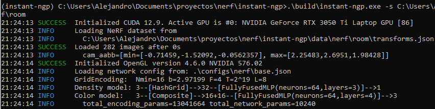

Install [Git](https://git-scm.com/downloads/win) and download the [Visual Studio](https://visualstudio.microsoft.com/es/downloads/) Build Tools from [here](https://visualstudio.microsoft.com/es/visual-cpp-build-tools/) with Desktop Development with C++ enabling components "MSVC v143 - VS 2022 C++ x64/x86 Build Tools" and "MSVC 142 for Visual Studio 2019". And we configure VS environment variables:

```powershell
"C:\Program Files\Microsoft Visual Studio\2022\Community\VC\Auxiliary\Build\vcvars64.bat"
```

Install [Miniconda](https://www.anaconda.com/docs/getting-started/miniconda/install#power-shell) with:

```powershell
wget "https://repo.anaconda.com/miniconda/Miniconda3-latest-Windows-x86_64.exe" -outfile ".\Downloads\Miniconda3-latest-Windows-x86_64.exe"
```

Run the installer and follow the default steps. Open an Anaconda Prompt terminal and run:

```bash
(base) C:\Users\Alejandro>
    conda create -n nerfstudio python=3.8 -y
    conda activate nerfstudio
```

Install dependencies:

- PyTorch with CUDA 12.1:

```bash
pip install torch==2.2.2+cu121 torchvision==0.17.2+cu121 torchaudio==2.2.2 --extra-index-url https://download.pytorch.org/whl/cu121
```

- CUDA Toolkit 12.1 (not necessary?):

```bash
conda install -c "nvidia/label/cuda-12.1.0" cuda-toolkit -y
```

- TinyCUDA-NN (Specific for one´s GPU):

First, we must find our CUDA architecture (example: RTX 3050 = 86). The table of CUDA architectures is available [here](https://docs.nerf.studio/quickstart/installation.html#note) and [there](https://developer.nvidia.com/cuda-gpus).

```bash
set TCNN_CUDA_ARCHITECTURES=86  # Reemplaza "86" por tu valor
pip install ninja git+https://github.com/NVlabs/tiny-cuda-nn/#subdirectory=bindings/torch
```

Install NerfStudio:

```bash
pip install nerfstudio
```

Verify installation:

```bash
ns-train --help
```

Process images/video we recorded:

```bash
ns-process-data video --data C:\ruta\al\video.mp4 --output-dir C:\ruta\a\los\datos_procesados
```

Train a Nerfacto model with normal prediction (in case we want to do surface reconstruction later):

```bash
ns-train nerfacto --data C:\ruta\a\los\datos_procesados --pipeline.model.predict-normals True
```

Opening the URL that appears in the console (e.g., http://127.0.0.1:7007/) when starting shows a web viewer displaying the model training in real time, with customizable parameters.

And to visualize the results after finishing the experiment:

```bash
ns-viewer --load-config C:\ruta\output\nerfacto\config.yml
```

# Gaussian Splatting

The authors of Nerfacto also implement a version of Gaussian Splatting, [SplatFacto](https://docs.nerf.studio/nerfology/methods/splat.html).

Instead of installing colmap, we download the binaries and specify their location with environment variables:

```
# Run these commands in the Anaconda Prompt console for the colmap call to work temporarily in that terminal while in use.

set PATH=%PATH%;C:\Users\Alejandro\Documents\proyectos\nerf\COLMAP-3.7-windows-cuda\bin
set PATH=%PATH%;C:\Users\Alejandro\Documents\proyectos\nerf\COLMAP-3.7-windows-cuda\lib
```

First, we process the data into the required format and run COLMAP (SfM and bundle adjustment):

```bash
ns-process-data video --data cin.mp4 --output-dir C:\Users\Alejandro\Documents\proyectos\nerf\instant-ngp\data\nerf\cin\processed_data_nerfstudio
```

And then you can train with `https://docs.nerf.studio/nerfology/methods/splat.html` and visualize on the web, as before.

```bash
ns-train splatfacto --data C:\Users\Alejandro\Documents\proyectos\nerf\instant-ngp\data\nerf\cin\processed_data_nerfstudio
```

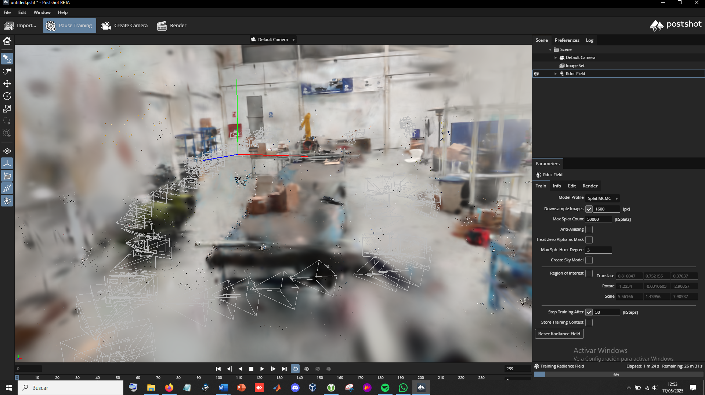

*There wasn't enough time for the rendered scene, from which I took the screenshot, otherwise it would look much better (see images from the final experiment for demonstration)*

Final result:


Large splats (3D ellipsoids) can be seen in areas where there are more errors or data losses. The reconstruction could have been improved with more time, slower videos, avoiding parallel movement, performing a more circular movement around the target, a small preprocessing step to remove noise, smaller scenes, etc. However, the result is not unsatisfactory considering the waves that have been recorded.

# Instant-NeRF

We follow the tutorial written at https://github.com/bycloudai/instant-ngp-Windows?tab=readme-ov-file, and [Youtube](https://www.youtube.com/watch?v=Ls6d3bygHNM).

The command to run the fox test, after compiling it:

```bash
(instant-ngp) C:\Users\Alejandro\Documents\proyectos\nerf\instant-ngp>.\build\instant-ngp.exe -s C:\Users\Alejandro\Documents\proyectos\nerf\instant-ngp\data\nerf\fox
```

We place our own video in `C:\Users\Alejandro\Documents\proyectos\nerf\instant-ngp\data\nerf\room`.

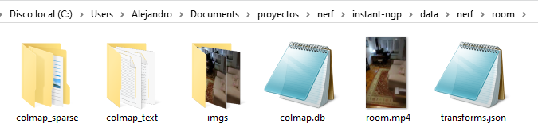

Extract, limiting to 5 fps, frames from the video with ffmpeg (200 frames is a good number):

```bash
(instant-ngp) C:\Users\Alejandro\Documents\proyectos\nerf\instant-ngp\data\nerf\room>ffmpeg -i room.mp4 -r 12 imgs/img_%04d.png
```

Convert from "frames" to colmap format:

```bash
(instant-ngp) C:\Users\Alejandro\Documents\proyectos\nerf\instant-ngp\data\nerf\room>python ..\..\..\scripts\colmap2nerf.py --colmap_matcher exhaustive --run_colmap --aabb_scale 16 --images imgs/  
```

Once COLMAP finishes, it generates the json with the intrinsic and extrinsic parameters of each camera. This is what we had before in the fox/ folder. We do the same as before:

```bash
(instant-ngp) C:\Users\Alejandro\Documents\proyectos\nerf\instant-ngp>.\build\instant-ngp.exe -s C:\Users\Alejandro\Documents\proyectos\nerf\instant-ngp\data\nerf\room
```

Additionally, you can save the current state as a backup to recover it and continue from there if you want to train more later or save the rendering configurations, in base.ingp, from the interface. And we can also convert to mesh with multiple options, even calculating normals or computing slices of the generated occupancy grid.

And we see the training results in real time!:

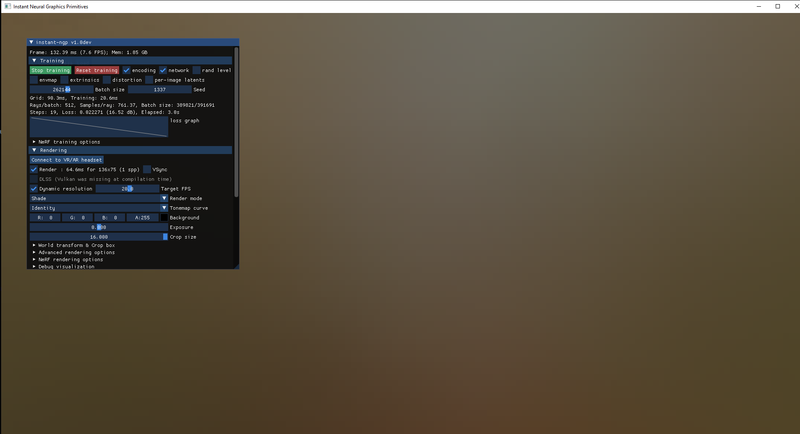
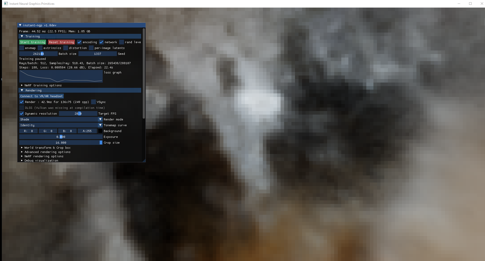
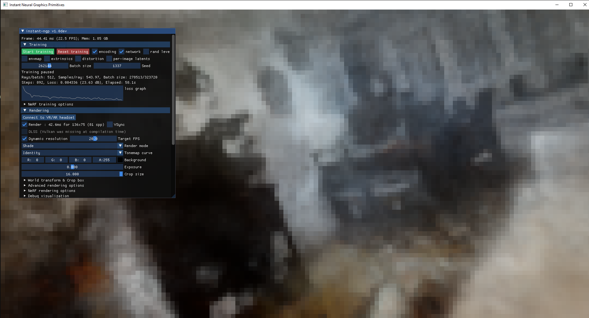
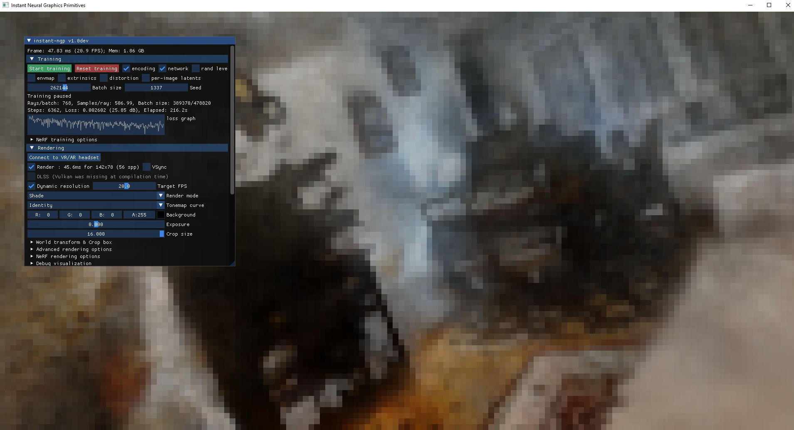

We can stop, resume training, modify graphical visualization parameters, crop the useful areas being visualized, etc.   

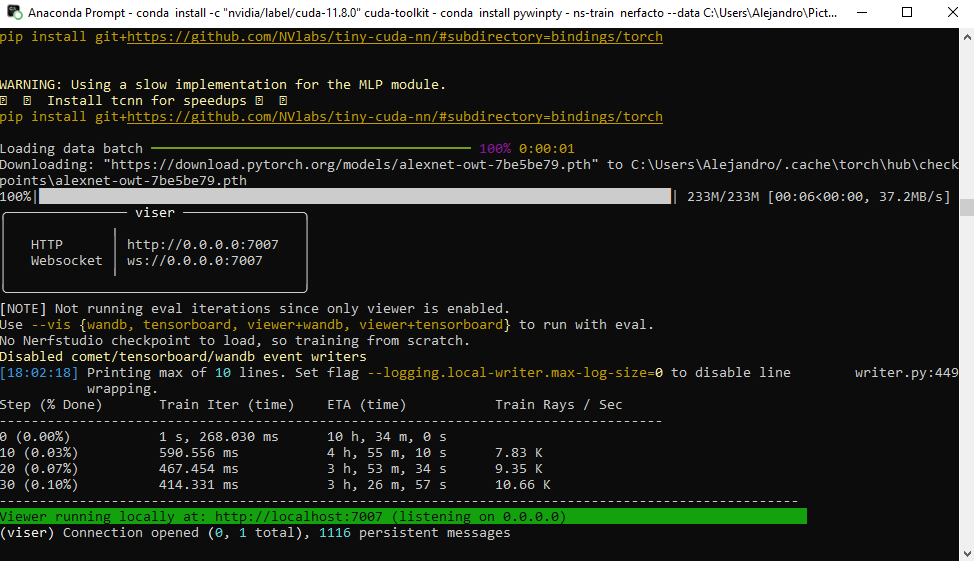
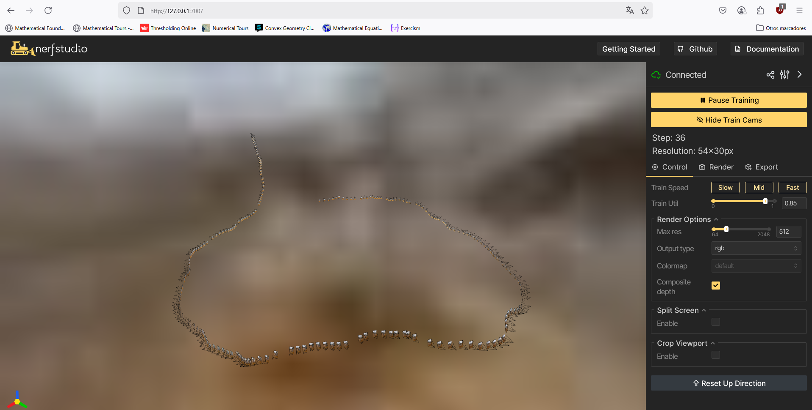
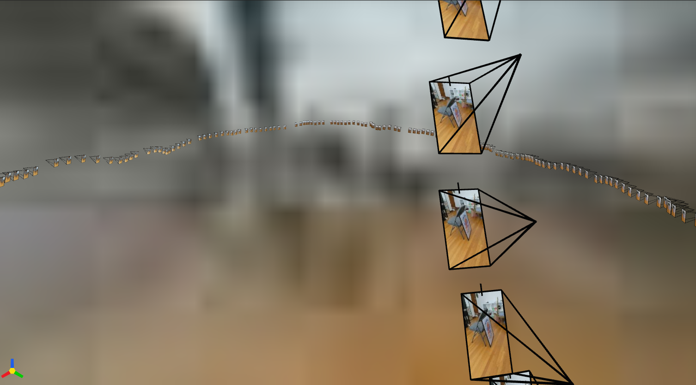
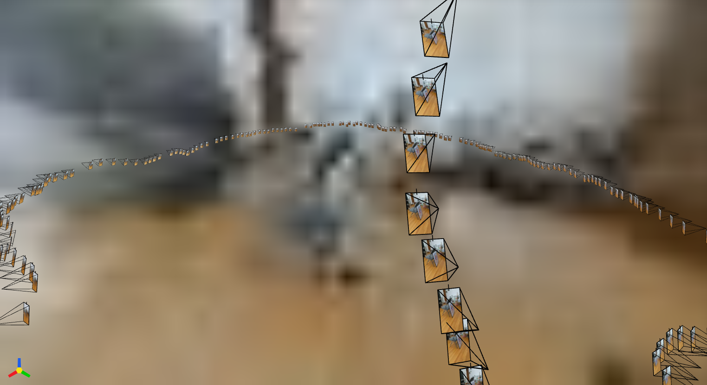

A few more viewpoints:

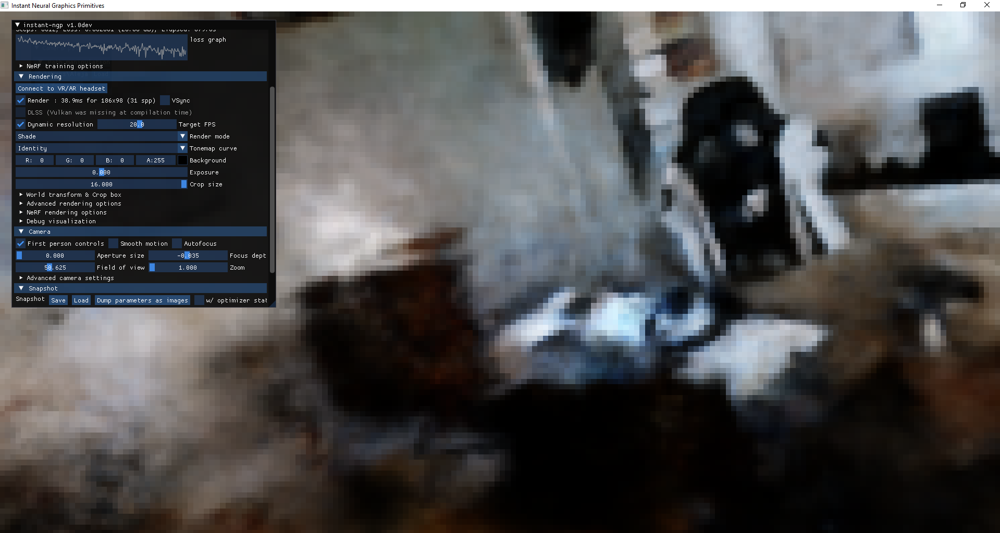
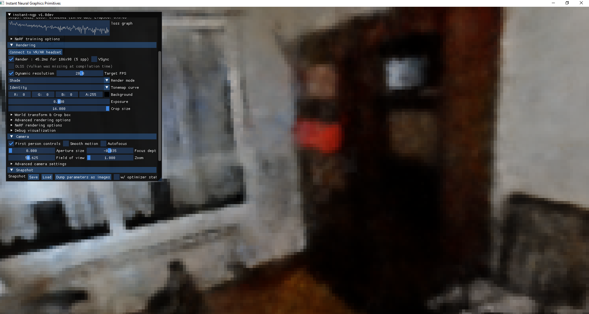
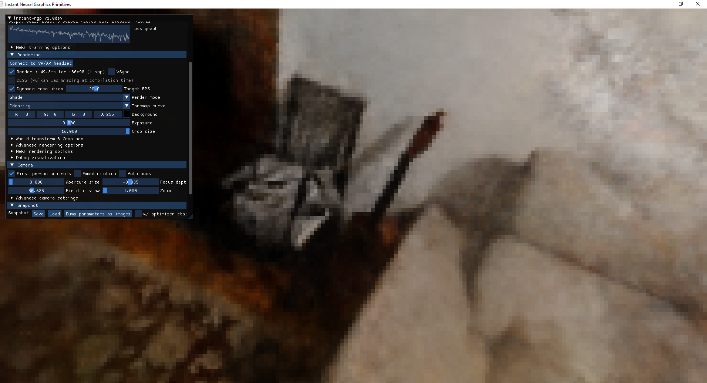
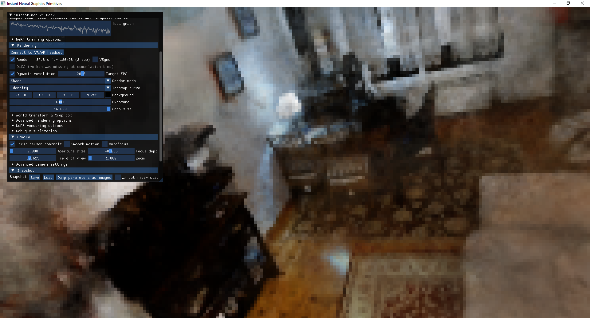

> Note:
>
> We can take advantage of DLSS (Deep Learning Super Sampling) with Vulkan, which is an NVIDIA image scaling technology that uses artificial intelligence to improve the quality and performance of games on GeForce RTX graphics cards. We need Tensor cores, available in that type of card. We might need to [install drivers](https://www.nvidia.com/en-us/drivers/results/).

The result is not very satisfactory because my images had a lot of noise, some degree of motion blur, artifacts, and the lens is broken, a dark environment, etc. So we only reached about 27 dB, and it could be better, but we are satisfied with the test performed.

We can also render the scene and export a "virtual tour" of our reconstruction. To export the render, see [Rendering custom camera path](https://github.com/bycloudai/instant-ngp-Windows?tab=readme-ov-file)

# Object Scanning

Now let's be a bit more detailed or conservative and use NeRF to scan a smal object (e.g., protoboard from a personal project I'm doing).

Input (2D images from video):


Output (3D radiance field):


Nerfstudio also allows us to generate the 3D mesh or voxelized silces by exporting it directly from the tool. Since the results of surface reconstruction and voxelization slices are not their main purpose, it is better to export the splats, the point cloud, or the radiance field itself to use another tool for reconstruction, such as MeshLab, Open3D, or Poisson reconstruction, ball pivoting, or similar techniques.

# Conclusions

NeRF, Gaussian Splatting or other radiance fields, rendering equation-like... technique represent a revolutionary leap in 3D digitization and representation. By combining fidelity with efficiency, they have redefined how scenes can be captured, rendered, and experienced — paving the way for a future where these models could dominate immersive technologies and even 3D reconstruction pipelines or graphics rendering, from virtual reality or video games to digital twins.

# References

- [Nerfstudio - Using custom data](https://docs.nerf.studio/quickstart/custom_dataset.html)
- [How to Make 3D Models from NeRFs using Nerfstudio](https://www.youtube.com/watch?v=h5EWiRRxYEQ)
- [Como instalar NERF en Windows + Tutorial + Ejemplos + Recomendaciones](https://www.youtube.com/watch?v=Ls6d3bygHNM)
- [Como instalar NERFStudio en Windows - Usa varios NERF de forma fácil](https://www.youtube.com/watch?v=4ZgbpsC6MyI)
- [window11, is it possible to install tiny-cuda-nn?](https://github.com/NVlabs/tiny-cuda-nn/issues/443)
