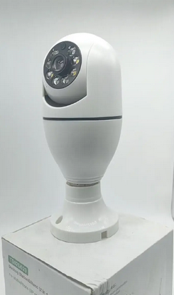
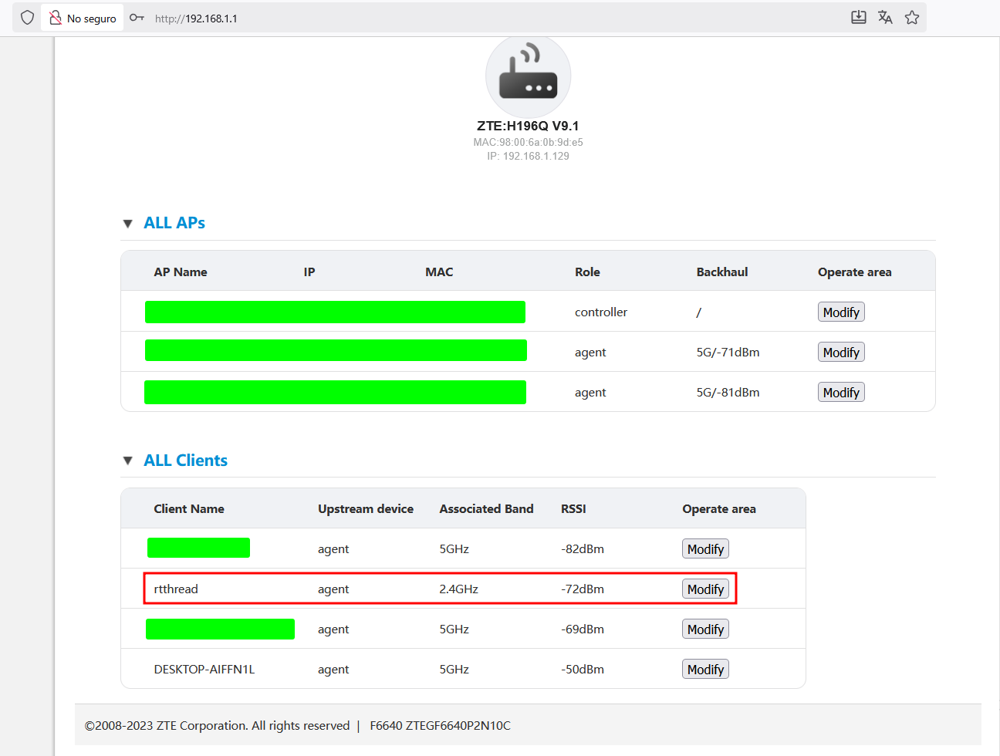
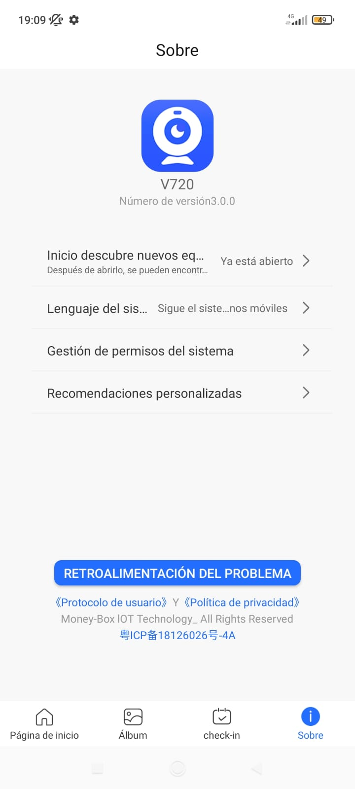
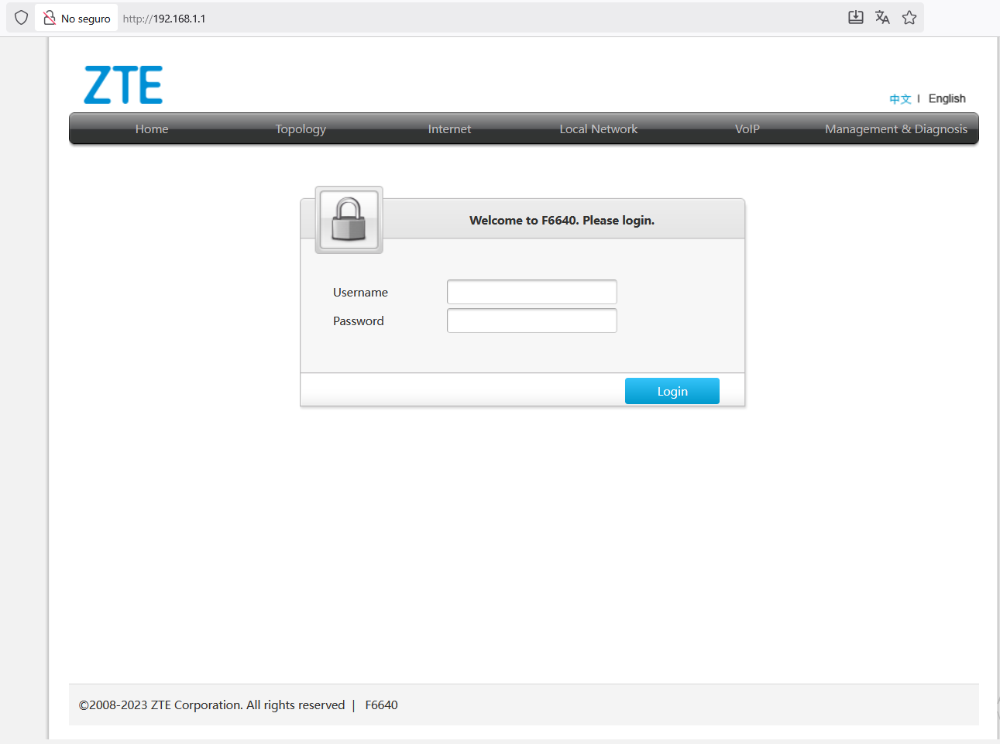
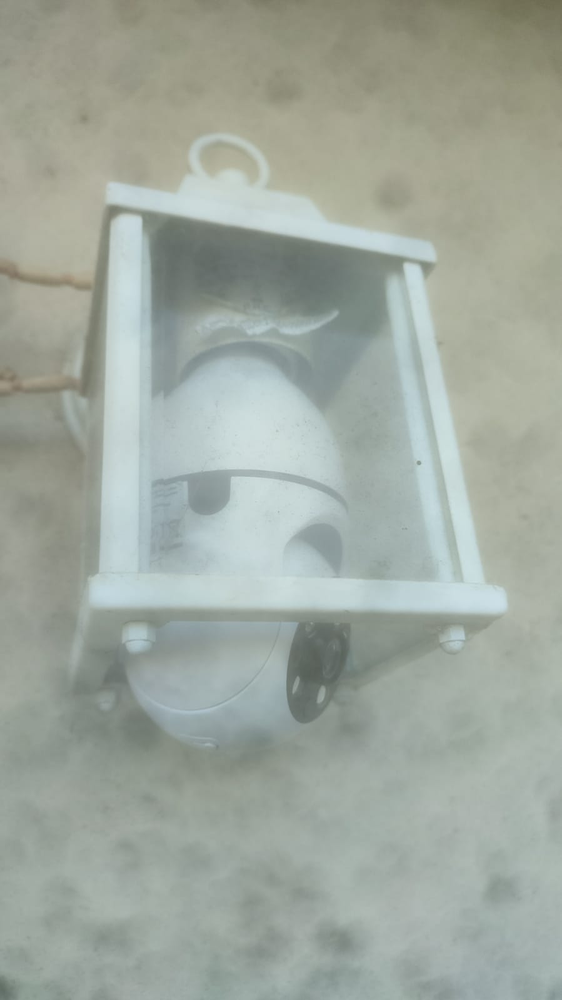
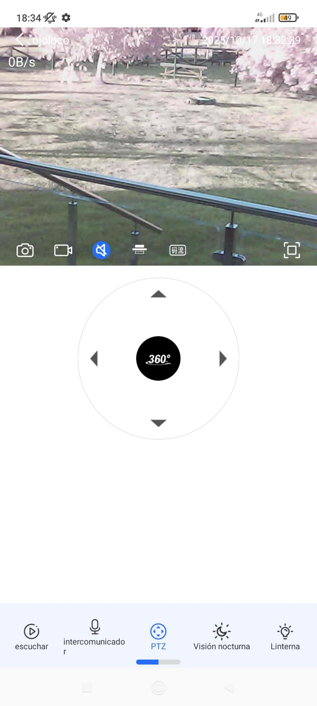

Let's explore practical and secure low-cost home surveillance options.

---

# Introduction

After weighing many options — **DIY Raspberry Pi cameras**, **solar IP cams**, **commercial "plug-and-play" cameras**, even **contracted surveillance services** — this post kicks off a small series about *realistic, budget-friendly home surveillance setups*.

In this first entry, I'll cover the **"casual commercial"** route: an off-the-shelf Wi-Fi camera one can find [online](https://es.aliexpress.com/i/1005009621892310.html) (I bought it on Wallapop), managed entirely through a mobile app.

Other (future) posts will cover the DIY (RasPi Cam) and solar setups, among others.

---

# The device: a V720 E27-type camera

I picked up a **cheap 10 € E27 screw-base camera** (light-bulb style) on Wallapop.
It connects to the **V720 app**, made by *广州钱柜物联科技有限公司*, which has **5 M+ downloads**.



---

## What I discovered when connecting it

Setup was simple: connect the camera to the 2.4 GHz Wi-Fi and link it in the app.
From my router's web panel (`http://192.168.1.1/`) I noticed the camera runs **RT-Thread**, a lightweight real-time OS used in many IoT devices.



---

## Security observations

While convenient, these low-cost cameras share a few recurring issues:

* Default or weak passwords.
* Cloud connections to unknown third-party servers.
* Outdated firmware or hidden backdoors.
* Unencrypted local services (HTTP / RTSP) and risky UPnP behavior.



---

# Options I considered

1. **Just connect it to my main Wi-Fi.**
   – Fast and easy, but it exposes my entire home network to any camera flaw.

2. **Use an ESP32 as an isolated gateway.**
   – Cool idea on paper (camera → ESP32 → router),
   but **not worth it in practice**: the ESP32 lacks true routing/firewall features,
   and adding it can *increase* the attack surface.

   > **Note:** I dropped this approach after testing; the ESP32 is great for prototyping,
   > but not for continuous IoT video bridging and a vulnerability dressed as an isolating gateway.

3. **Network isolation at the router level.**
   – The solution I kept: manage everything from the router,
   creating a dedicated network just for cameras.

---

# Router configuration

Accessed via `http://192.168.1.1/`
(First step: changed the default credentials to a strong, unique password.)



### Recommended steps to apply

1. **Changed the admin credentials.**
   It is important to never leave factory defaults active.

2. **Disabled remote / WAN management.**
   The admin panel must be accessible only from inside the LAN.

3. **Updated the router firmware.**
   Critical for patching known vulnerabilities.

4. **(Optional) Created a dedicated "Camera" SSID / VLAN.**
   Devices on this network can't see my laptops or phones.
   *Client / AP isolation enabled.*

5. **(Optional) Blocked Internet access for that VLAN.**
   Only local communication with my NVR is allowed.

6. **Disabled UPnP and WPS.**
   These can open ports or pair devices automatically — unsafe defaults.

7. **Forced WPA2 / WPA3 encryption.**
   Using a long, unique passphrase.

---

## (Optional) Basic firewall rules (concept)

The goal would be the following:

* **Deny all** outbound traffic from the camera network to the Internet.
* **Allow only** camera → NVR (local) traffic.

```bash
# Example (OpenWRT / iptables)
iptables -I FORWARD -s 192.168.3.0/24 -o eth0 -j REJECT
iptables -I FORWARD -s 192.168.3.0/24 -d 192.168.1.100 -p tcp --dport 554 -j ACCEPT
```

> **Tip:** order matters — specific ALLOWs first, then the general DENY.

---

## Optional: Cellular connectivity, motion detection & edge AI

Besides using local Wi-Fi, it's also possible to equip or pair the camera with **cellular connectivity** (SIM card via 4G/LTE, NB-IoT, or LTE-M). This allows recording or sending alerts even when Wi-Fi is down — or as a fully independent channel.

### Technical overview

A setup like this can work with:

* A **cellular module** connected to the camera or to a small **gateway** (ESP32, Raspberry Pi, etc.).
* A **local buffer** to store short clips or frames before upload.
* **Motion detection** handled locally (basic pixel-difference or bounding-box detection).

This way, one can run a **lightweight AI model** (e.g., TinyYOLO, MobileNet-SSD...) to filter out irrelevant motion — only sending alerts when humans or unusual objects are detected, nested with a simple alert system can send photos directly via Telegram, e.g.:

```
https://api.telegram.org/bot<YOUR_TOKEN>/sendPhoto?chat_id=<CHAT_ID>&photo=<FILE>
```

Or other push alerts like Firebase or Pushover.

---

## Legal note (Spain)

Under Spanish and EU privacy law (AEPD guidelines), **indoor home cameras** used strictly within your private property are generally considered **domestic use**.
That means:

* No need for a public notice sign if the camera doesn't record public areas or neighbors.
* Don't capture audio conversations or external zones (street, shared areas).
* Community or business installations do require signage and compliance with full GDPR/LOPD protocols.

*Summary:*

> If your camera records only inside your home and doesn't capture other people's private areas or the public street, you're typically not required to display a surveillance notice.
> Always disable audio recording and maintain secure access credentials.

---

## Power setup: light socket or dedicated outlet

Currently, the camera is powered from an **existing E27 light socket**, which provides 230 V AC. It's a simple plug-and-play setup since the device behaves like a standard bulb.

### Electrical basics (Spain / EU)

* **Voltage:** 230 V AC, 50 Hz
* **Phase (L):** brown/black — live
* **Neutral (N):** blue — return
* **Earth (PE):** green/yellow — safety ground

The camera consumes aprox. 5.8 W and internally converts AC to DC. The **earth** wire doesn't carry current — it's purely a safety path in case of faults.

### Moving the camera elsewhere

One can extend power from a nearby junction box:

1. Take **L and N** from a lighting circuit (10 A breaker).
2. Add **PE** to the new socket or metal housing.
3. Use an **insulated enclosure** for connections.
4. Test polarity and insulation before re-energizing.

> **Safety tip:** Work only with the circuit powered off with electrical insulating gloves (**IEC 60903**).
> Permanent wiring must comply with Spain's **REBT** standard (grounding, RCD protection, proper insulation, etc.).

### Practical alternative

Of course, if one doesn't want to modify the fixed wiring:

* Use a **lamp extension with a switch**, or
* An **E27-to-Schuko adapter** plugged into a standard outlet.

---

# Conclusion

## Results and impressions

* The camera now works securely **remotely** an the configuration is local.
* The main home network stays partially **isolated and safe**.

> For a 10 € gadget, it does its basic job fine —
> as long as it's treated as an *inherently untrusted device*.
> Isolation is the single most effective control.

Among all considered approaches, the **commercial Wi-Fi camera + router-level isolation** may represent the best balance between **cost, convenience, and security**.

> Upcoming posts will explore:
> – A solar-powered standalone camera build.
> – A fully local encrypted Raspberry Pi camera.
> – Integration with Home Assistant/AI/IoT through VPN access.

Finally, Ojoloco looks like this:





As a curiosity, it would be possible and even advisable to add additional infrared LEDs to greatly improve night vision, making them turn on by connecting (“splicing”) them to an additional power source and a switch, or something similar, at the input of the existing ones. As shown in [this video](https://www.youtube.com/watch?v=L9mwGeDAxhk&list=FLY-ZiZ-ClyNsc4osNBfF2lA&index=30).

---

# References

* Router login / credentials guides:
  [https://router-network.com/zte-router-login](https://router-network.com/zte-router-login)
  [https://bandaancha.eu/foros/zte-zxhn-f6640-contrasena-administracion-1750092](https://bandaancha.eu/foros/zte-zxhn-f6640-contrasena-administracion-1750092)

* RT-Thread camera discussion:
  [Popular A9 Mini Wi-Fi Camera & the HA Challenge – Home Assistant Community](https://community.home-assistant.io/t/popular-a9-mini-wi-fi-camera-the-ha-challenge/230108?page=8)

* General home-network hardening:
  – CISA guidelines (UPnP / IoT)
  – Consumer Reports: Use WPA3 & keep firmware updated
  
* [AEPD Guides](https://www.aepd.es/en/guides-and-tools/guides)
  
* [Popular A9 Mini Wi-Fi Camera & the HA Challenge – Home Assistant Community](https://community.home-assistant.io/t/popular-a9-mini-wi-fi-camera-the-ha-challenge/230108?page=8)
