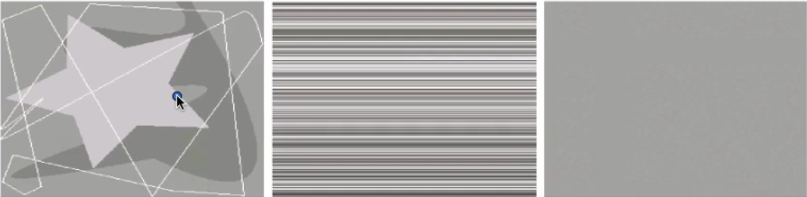
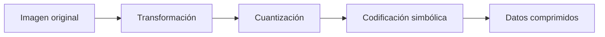
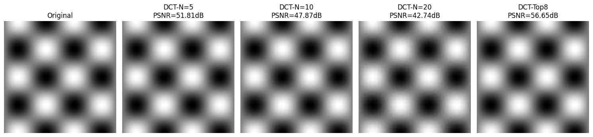
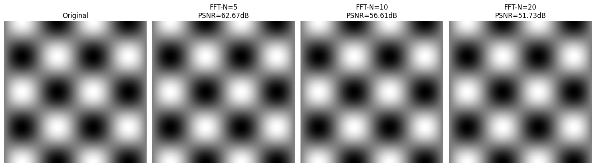
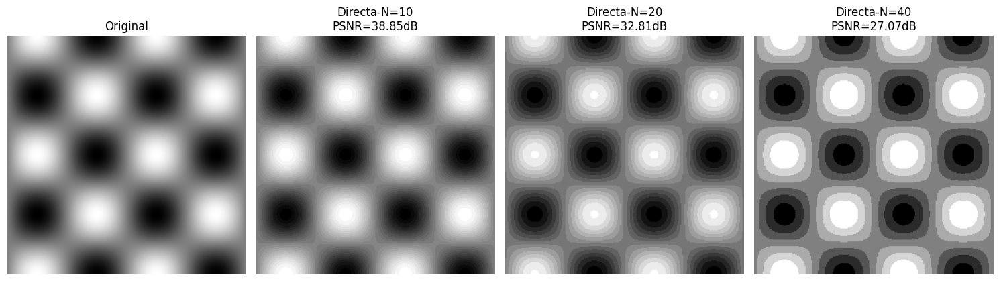
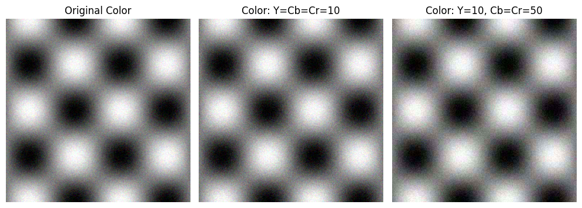
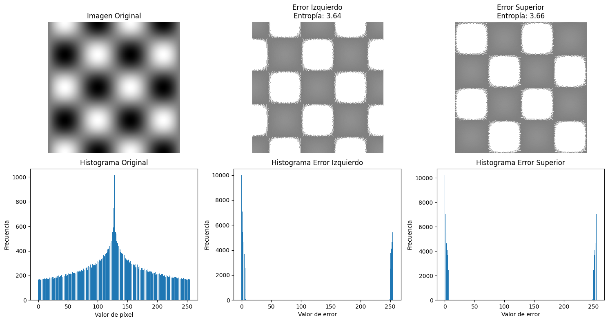

## Introducción: ¿por qué comprimir? 

Imagina almacenar un vídeo de 2 horas con imágenes de 1000×1000 píxeles en color, a 30 FPS, con 8 bits de resolución por canal. La cuenta sería:

$$
1000 × 1000 × 24 bits × 30 FPS × 60 segundos × 120 minutos = 648 GB
$$

¡Una barbaridad! Y la pregunta clave es: _¿realmente necesitamos tantos datos?_

En muchos casos, la respuesta es **NO**. Consideremos estos ejemplos:

- **Imagen de líneas blancas**: Puede representarse con unos pocos bits en lugar de todos los bits necesarios para almacenar la foto sin comprimir. Además, solo tiene 4 colores, por lo que sobran 252 colores (de 256 posibles).
- **Imagen con colores constantes por línea**: Solo necesitamos almacenar el color de cada fila, sobrando todos los bits de cada columna.
- **Imagen de un solo color**: Solo se requieren 8 bits para almacenar esa imagen, i.e. ese color.

La **compresión explota la redundancia** en los datos para reducir su tamaño sin comprometer significativamente la calidad percibida. JPEG es un estándar de compresión **con pérdida** (a diferencia de JPEG-LS o PNG, que son sin pérdida), lo que significa que sacrificamos algo de información para lograr mayores tasas de compresión.

## Fundamentos teóricos de la compresión 

### Flujo genérico de compresión

1. **Transformación**: Convertimos la imagen a un dominio más adecuado para la compresión. El objetivo es reducir la cantidad de bloques a transmitir, idealmente a uno o unos pocos, mediante una transformación reversible que permita una reconstrucción de la imagen con calidad aceptable, algo difícil en el dominio espacial pero posible en un dominio transformado.
2. **Cuantización**: Introducimos pérdida controlada de información. Al aplicar cuantización en el dominio transformado se logra una mayor compresión, a costa de introducir pérdida de información, ya que la cuantización es el paso que más error genera y, al mismo tiempo, el que más permite comprimir.
3. **Codificación Simbólica**: Representamos los datos de forma eficiente usando teoría de información. Finalmente, los valores se codifican simbólicamente usando teoría de la información, en particular la codificación de Huffman, que explota la redundancia de la imagen asignando códigos binarios más cortos a los símbolos más probables y más largos a los menos probables, logrando así compresión sin pérdida adicional.

JPEG, específicamente:
1. Divide la imagen en bloques de 8×8 píxeles.
2. Aplica la Transformada Discreta del Coseno (DCT) a cada bloque.
3. Cuantiza los coeficientes en el dominio frecuencial.
4. Aplica codificación Huffman para la codificación simbólica.
5. Transmite principalmente los coeficientes distintos de cero, aprovechando la redundancia para lograr compresión.

### Medición del error

Para evaluar la calidad de la compresión, usamos el **Error Cuadrático Medio (MSE)**:

$$MSE = (1/N) \cdot Σ(Fi - \tilde{F}i)^2$$

Donde $$Fi$$ es el valor original y $$\tilde{F}i$$ es el valor reconstruido.

## Transformada de Coseno Discreta (DCT)

### ¿Por qué DCT y no otra transformada?

JPEG usa DCT en lugar de otras transformadas como:

- **KLT (Karhunen-Loève)**: Es óptima (minimiza el MSE) pero **depende de la imagen**, requiriendo cálculos específicos para cada imagen.
- **DFT (Transformada de Fourier)**: Asume **periodicidad** en la señal, lo que causa discontinuidades en los bordes de los bloques.
- Etc.

La **DCT** asume simetría de espejo en los contornos, más natural para imágenes, y **sus coeficientes no dependen de la imagen**.

### Base matemática

La DCT bidimensional para un bloque 8×8 se define como:

$$
F(u,v) = \frac{1}{4} C(u)C(v) \sum_{x=0}^{7} \sum_{y=0}^{7} f(x,y) 
\cos\left(\frac{(2x+1)u\pi}{16}\right) 
\cos\left(\frac{(2y+1)v\pi}{16}\right)
$$

$$
C(u) =
\begin{cases} 
\frac{1}{\sqrt{2}}, & \text{si } u=0 \\[1mm]
1, & \text{si } u=1,\dots,7
\end{cases}, \quad
C(v) =
\begin{cases} 
\frac{1}{\sqrt{2}}, & \text{si } v=0 \\[1mm]
1, & \text{si } v=1,\dots,7
\end{cases},
$$

donde:
- $$f(x,y)$$ es el valor del píxel en posición $$(x,y)$$.
- $$F(u,v)$$ son los coeficientes DCT.

### ¿Por qué bloques de 8×8?

Empíricamente se demostró que 8×8 es un buen compromiso:

1. **Suficientemente pequeño** para que la condición Markoviana sea probable (la DCT se aproxima bien a la KLT).
2. **Eficiencia computacional**: Es más barato hacer muchas DCT pequeñas que una grande.
3. **Resultados visuales**: Usando solo el 25% de las bases DCT, la reconstrucción con bloques 8×8 es casi idéntica a usar toda la imagen.

> [!TIP] Desde un punto de vista intuitivo, una imagen es Markoviana si el comportamiento de cada píxel puede explicarse completamente a partir de sus vecinos, de modo que no es necesario conocer el resto de la imagen.

## Cuantización

### Cuantización uniforme

JPEG utiliza cuantización uniforme (que es un caso trivial de la cuantización óptima Max-Lloyd cuando no conoces la distribución de probabilidad de entrada), porque es simple y eficiente:

$$F_{quant}(u,v) = round(F(u,v) / Q(u,v))$$

Donde $$Q(u,v)$$ es la matriz de cuantización. El decodificador, recíprocamente al encoder, reconstruye:

$$F_{reconstruido}(u,v) = F_{quant}(u,v) \cdot Q(u,v)$$

### Matriz de cuantización JPEG estándar

$$Q = \begin{bmatrix}
16 & 11 & 10 & 16 & 24 & 40 & 51 & 61 \\
12 & 12 & 14 & 19 & 26 & 58 & 60 & 55 \\
14 & 13 & 16 & 24 & 40 & 57 & 69 & 56 \\
14 & 17 & 22 & 29 & 51 & 87 & 80 & 62 \\
18 & 22 & 37 & 56 & 68 & 109 & 103 & 77 \\
24 & 35 & 55 & 64 & 81 & 104 & 113 & 92 \\
49 & 64 & 78 & 87 & 103 & 121 & 120 & 101 \\
72 & 92 & 95 & 98 & 112 & 100 & 103 & 99
\end{bmatrix}$$

Esta matriz está diseñada para:
- **Preservar bajas frecuencias** (valores más pequeños en la esquina superior izquierda).
- **Descartar altas frecuencias** (valores más grandes en la esquina inferior derecha).

### Factor de calidad o escala

La compresión se controla escalando la matriz $$Q$$:

$$Q_{escalada} = Q \cdot (factor_{escala} / 50)$$

- **Factor pequeño** → Menos compresión → Mayor calidad.
- **Factor grande** → Más compresión → Menor calidad.

### Cuantización óptima (Max-Lloyd)

Aunque JPEG usa cuantización uniforme por simplicidad, la **cuantización Max-Lloyd** es óptima cuando conocemos la distribución de probabilidad de los datos:

1. **Adapta los niveles de cuantización** a la densidad de probabilidad.
2. **Pone más niveles donde hay más valores** (mayor probabilidad).
3. **Minimiza el error cuadrático medio** de forma iterativa.

## Codificación Huffman y Teoría de la Información 

### Fundamentos de la codificación Huffman

**Objetivo**: Crear códigos de longitud variable donde los símbolos más frecuentes tengan códigos más cortos.

**Algoritmo**:
1. Ordenar símbolos por probabilidad descendente.
2. Combinar los dos símbolos menos probables en un nuevo nodo.
3. Repetir hasta tener un solo nodo raíz.
4. Asignar códigos (0/1) recorriendo el árbol desde la raíz.

### Ejemplo de construcción

Supongamos 6 símbolos con probabilidades:

$$a_2: 0.4, a_8: 0.3, a_6: 0.1, a_1: 0.1, a_4: 0.05, a_3: 0.05$$

1. **Paso 1**: Combinar a4(0.05) y a3(0.05) → nuevo nodo con 0.1.
2. **Paso 2**: Ordenar: a2(0.4), a8(0.3), a6(0.1), a1(0.1), nodo(0.1).
3. **Paso 3**: Combinar a6(0.1) y a1(0.1) → nuevo nodo con 0.2.
4. **Continuar** hasta formar el árbol completo.

### Propiedades

- **Libre de prefijos**: Ningún código es prefijo de otro.
- **Óptima** para distribuciones de probabilidad conocidas.
- **Longitud promedio**: $$L = Σ p_i \cdot l_i$$ (donde $$l_i$$ es la longitud del código para el símbolo $$i$$ [ver siguiente ecuación]).

### Entropía y límite teórico

La **entropía** $$H(S)$$ define el límite inferior de compresión:

$$H(S) = - Σ p_i \cdot log₂(p_i)$$

Según el **primer teorema de Shannon**, podemos alcanzar asintóticamente esta longitud de codificación. Huffman se aproxima a este límite pero está limitado por requerir longitudes enteras.

> [!IMPORTANT] La entropía cuantifica la cantidad mínima promedio de bits necesarios para codificar los símbolos de un mensaje. Mediante la codificación Huffman podemos aproximarnos a esta longitud de manera esperada para cada símbolo.

### Codificación en zig-zag

Antes de aplicar Huffman, JPEG ordena los coeficientes DCT en **zig-zag**:

1. Comienza en la esquina superior izquierda (DC, frecuencia 0).
2. Recorre en diagonal hacia las frecuencias más altas.
3. Cuando encuentra una secuencia de ceros, usa **codificación RLE** (Run-Length Encoding).
4. Se detiene cuando los coeficientes restantes son todos cero (marcado con un "0" final).

## JPEG para imágenes en color

### Espacio de color YCbCr

JPEG convierte RGB a YCbCr:

$$Y  =  0.299R + 0.587G + 0.114B \quad \text{(Luminancia)}$$

$$Cb = -0.168736R - 0.331264G + 0.5B + 128$$

$$Cr =  0.5R - 0.418688G - 0.081312B + 128$$

**Ventajas**:
- **Separación luminancia/crominancia**: El ojo humano es más sensible a detalles en luminancia.
- **Permite mayor compresión** en componentes cromáticas (submuestreo).

### Submuestreo de crominancia

Los esquemas más comunes:
- **4:4:4**: Sin submuestreo (misma resolución para Y, Cb, Cr).
- **4:2:2**: Resolución horizontal reducida a la mitad.
- **4:2:0**: Resolución horizontal y vertical reducidas a la mitad (más común).

## Alternativas y extensiones del JPEG

### JPEG vs otros formatos

| Formato | Tipo | Aplicación Principal | Ventajas |
|---------|------|---------------------|----------|
| **JPEG** | Con pérdida | Fotografía digital | Alta compresión, amplia compatibilidad |
| **JPEG-LS** | Sin pérdida | Imágenes médicas, archivo | Compresión sin pérdida eficiente |
| **PNG** | Sin pérdida | Gráficos web, capturas | Transparencia, compresión sin pérdida |
| **WebP** | Ambos | Web moderno | Mejor compresión que JPEG, animación |
| **HEIC/HEIF** | Con pérdida | Fotografía móvil | Mejor compresión que JPEG, múltiples imágenes |

### JPEG 2000

Mejoras sobre JPEG original:.
- Usa **wavelets** en lugar de DCT.
- **Compresión progresiva** (calidad incremental).
- **Mejor manejo de bordes** y áreas de texto.
- **Soporte para compresión sin pérdida**.

### Limitaciones y artefactos JPEG

1. **Bloqueo (blocking)**: Bordes visibles entre bloques 8×8.
2. **Ringin (anillamiento)**: Oscilaciones cerca de bordes nítidos.
3. **Pérdida de detalle fino**: En altas compresiones.
4. **No ideal para gráficos** con bordes nítidos.

## Experimentos y resultados

> [!IMPORTANT] Código fuente
>
> El código de este post está disponible en: [computerVisionMiscellaneous](https://github.com/agarnung/computerVisionMiscellaneous/blob/main/2025-12-27-JPEG/JPEG.ipynb).

En esta sección presentamos los resultados de una implementación básica de JPEG realizada sobre una imagen sintética de 256×256 píxeles. Los experimentos cubren diferentes métodos de compresión y análisis de predictores.

### JPEG con DCT (diferentes métodos)

Se implementó la compresión JPEG estándar dividiendo la imagen en bloques de 8×8 píxeles no superpuestos, aplicando la DCT bidimensional y luego cuantizando los coeficientes. Se probaron tres métodos diferentes:

#### Cuantización con N=5

Se aplicó cuantización dividiendo cada coeficiente por N=5, redondeando al entero más próximo y multiplicando de nuevo por N. Este método produce una compresión aproximada de 9410.60:1 con un PSNR de 51.81 dB.

#### Cuantización con N=10

Aumentando el factor de cuantización a N=10, se obtiene una mayor compresión (3796.13:1) pero con menor calidad (PSNR de 47.87 dB).

#### Conservación de los 8 Coeficientes Más Grandes

En lugar de cuantizar todos los coeficientes, se conservaron únicamente los 8 coeficientes más grandes (del total de 64) y se redondearon al entero más próximo. Este método logra la mejor calidad (PSNR de 56.65 dB) con una compresión de 28654.30:1.

### Compresión con FFT

Se repitió el proceso anterior pero utilizando la Transformada Rápida de Fourier (FFT) (i.e. una DFT eficiente) en lugar de la DCT. Con N=10, se obtuvo un PSNR de 56.61 dB y una compresión de 28390.53:1, resultados muy similares al método DCT con Top 8 coeficientes.

### Compresión Directa (Sin Transformada)

Se realizó la compresión sin aplicar ninguna transformada, simplemente cuantizando directamente la imagen original. Con N=20, se obtuvo un PSNR de 32.81 dB y una compresión de 118.53:1. Este método muestra claramente la importancia de la transformada en el proceso de compresión JPEG.

### JPEG para imágenes en color

Se implementó JPEG para imágenes en color utilizando la conversión RGB a YCbCr. La compresión se realizó de forma independiente en cada uno de los tres canales (Y, Cb, Cr).

#### Compresión con relación constante

Primero se aplicó la misma relación de compresión para los tres canales:

#### Compresión aumentada en crominancia

Manteniendo constante la relación de compresión para el canal Y (luminancia), se aumentó la compresión de los dos canales de crominancia (Cb y Cr). Esto aprovecha la menor sensibilidad del ojo humano a los cambios de color, permitiendo mayor compresión sin pérdida perceptible significativa de calidad.

### Análisis de predictores y entropía

Se analizaron predictores para **compresión sin pérdidas**, donde el objetivo es reducir la redundancia espacial en imágenes. La **condición markoviana** establece que el valor de un píxel depende principalmente de sus vecinos inmediatos, no de píxeles distantes. Los predictores explotan esta propiedad estimando cada píxel a partir de valores ya conocidos, generando **errores de predicción** que suelen ser pequeños y concentrados alrededor de cero.

> [!TIP] ¿Qué es la entropía?
>
> La entropía de Shannon mide la incertidumbre promedio o información contenida en una fuente de datos. En términos simples:
>    - Alta entropía = mucha incertidumbre, datos impredecibles, difícil de comprimir.
>    - Baja entropía = poca incertidumbre, datos predecibles, fácil de comprimir.
>
> Fórmula: $$H = -Σ p_i \cdot log_2(p_i)$$, donde $$p_i$$ es la probabilidad de cada símbolo.
>
> Ejemplo práctico:
>    - Imagen original: entropía alta (valores variados, difícil predecir).
>    - Errores de predictor: entropía baja (muchos valores cerca de 0, fáciles de predecir).

**La clave es que estos errores tienen menor entropía que los valores originales** porque:
1. **Distribución más sesgada**: Los errores se agrupan cerca del cero.
2. **Menos incertidumbre**: Es más predecible que el error sea pequeño que grande.
3. **Codificación eficiente**: Valores pequeños requieren menos bits en esquemas de codificación entrópica.

Se compararon tres predictores:
1. **Predictor izquierdo**: Basado solo en el píxel (-1,0).
2. **Predictor superior**: Basado solo en el píxel (0,-1).
3. **Predictor promedio**: Combina (-1,0), (-1,-1) y (0,-1).

El predictor que produce **errores con menor entropía** elimina más redundancia y permite mejor compresión, identificándose mediante cálculo directo de la entropía de sus residuos.

#### Histogramas

#### Resultados de Entropía

Los resultados muestran que:

- **Entropía imagen original**: 7.8920 bits/píxel.
- **Entropía error predictor izquierdo**: 3.6395 bits/píxel.
- **Entropía error predictor superior**: 3.6567 bits/píxel.
- **Entropía error predictor promedio**: 3.0911 bits/píxel.

> [!NOTE] El predictor promedio es el mejor, ya que presenta la menor entropía (3.0911 bits/píxel), lo que indica que comprime mejor que los otros dos predictores. Esto tiene sentido porque al usar información de múltiples píxeles vecinos, puede hacer predicciones más precisas, reduciendo la variabilidad de los errores.

### Resumen comparativo

La siguiente tabla resume los resultados de los diferentes métodos de compresión probados:

| Método | PSNR (dB) | Compresión Aprox. |
|--------|-----------|-------------------|
| DCT-N=5 | 51.81 | 9410.60:1 |
| DCT-N=10 | 47.87 | 3796.13:1 |
| DCT-Top8 | 56.65 | 28654.30:1 |
| FFT-N=10 | 56.61 | 28390.53:1 |
| Directa-N=20 | 32.81 | 118.53:1 |

Los resultados demuestran que:
- La DCT es efectiva para la compresión, especialmente cuando se conservan selectivamente los coeficientes más importantes.
- La FFT produce resultados comparables a la DCT.
- La compresión directa sin transformada es significativamente menos eficiente.
- El método de conservar los Top 8 coeficientes logra el mejor equilibrio entre calidad y compresión.

## Conclusión

JPEG revolucionó la compresión de imágenes al encontrar un equilibrio óptimo entre:
1. **Eficiencia de compresión** (relación calidad/tamaño).
2. **Simplicidad computacional** (DCT + Huffman).
3. **Adaptación a la percepción humana** (mayor compresión en altas frecuencias).

> [!TIP] Nótese que por nuestro sistema visual, percibimos mejor cambios pequeños en luminancia que en color. Está, en parte, relacionado con que la distribución de los conos en nuestra retina está mucho más aglomerada alrededor de la fóvea.

Su diseño basado en bloques 8×8, DCT, cuantización adaptativa y codificación Huffman crea un sistema robusto que, décadas después de su creación, sigue siendo el estándar dominante para la compresión de imágenes fotográficas.

La comprensión profunda de JPEG no solo nos permite usar mejor este formato, sino que también proporciona las bases para entender algoritmos de compresión más modernos y desarrollar nuevas técnicas adaptadas a aplicaciones específicas.

## Referencias

- Sapiro, G. (s. f.). Image and video processing: From Mars to Hollywood with a stop at the hospital. Duke University. [Coursera](https://www.coursera.org/learn/image-processing).