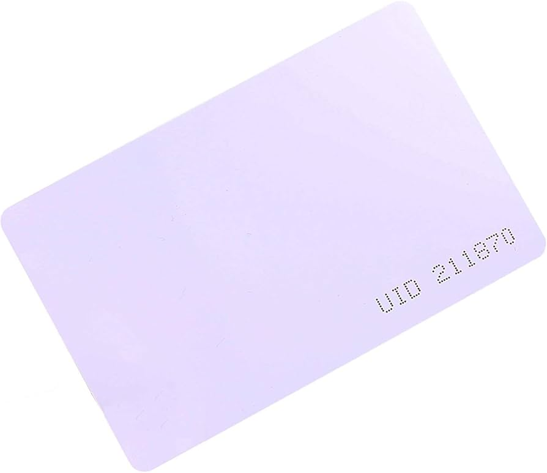

Eso es, en este post simplemente clonaremos una tarjeta RFID.

## TL;DR

El problema abordado se basa en una exploración inicial del hacking ético aplicado a tarjetas RFID de **13.56 MHz**, usando como caso de estudio una tarjeta antigua y propia, con un enfoque totalmente **educativo y autorizado**. El primer paso del análisis consiste en identificar qué tipo de tarjeta es, a qué frecuencia opera y qué estándar utiliza, ya que tecnologías comunes, como **MIFARE Classic** (basadas en **ISO 14443**), organizan su memoria en sectores protegidos por claves y son conocidas por presentar vulnerabilidades debido a su diseño antiguo.

Durante esta exploración aparece una limitación importante de hardware: lectores como el **RDM6300** funcionan a **125 kHz**, por lo que no son compatibles con tarjetas de 13.56 MHz. Esto obliga a considerar alternativas como los módulos **RC522** o **PN532**, que pueden integrarse con plataformas como **Arduino** o **Raspberry Pi**. Estas soluciones permiten aprender conceptos básicos como la lectura del **UID**, el acceso a bloques con claves conocidas y la clonación de tarjetas simples, aunque tienen limitaciones claras cuando se trata de auditorías de seguridad más profundas o ataques criptográficos reales.

Para un análisis más avanzado, es necesario recurrir a herramientas especializadas como **Proxmark3** o lectores NFC compatibles con **libnfc** en sistemas Linux, que permiten estudiar técnicas más complejas como la recuperación de claves, el sniffing de comunicaciones o el análisis de protocolos. Esta es la solución que nos funciona, finalmente.

En conjunto, esta exploración sirve para entender el alcance real del problema, comparar las capacidades y límites de cada herramienta y analizar las debilidades de tecnologías RFID antiguas desde un punto de vista práctico, ético y orientado al aprendizaje en seguridad informática.

## Teoría

### ¿Cómo funciona el RFID?

**RFID (Radio Frequency IDentification)** es una tecnología de identificación automática que utiliza **ondas de radio (campos electromagnéticos)** para comunicar un lector con una etiqueta o “tag” adherida a un objeto, sin necesidad de **contacto físico ni línea de vista directa**.

Un sistema RFID típico tiene tres partes:
* **Lector (interrogador):** emite la señal de RF.
* **Etiqueta (tag/transpondedor):** recibe energía y responde con su información (la cual tiene almacenada estáticamente).
* **Antenas:** tanto en lector como en tag para transmitir/recibir señales.

### 🔬 Principios físicos básicos

#### 1) **Campos electromagnéticos y ondas de radio**

RFID funciona usando **ondas de radio**, un tipo de radiación electromagnética gobernada por las [**ecuaciones de Maxwell**](https://es.wikipedia.org/wiki/Ecuaciones_de_Maxwell) y la [**inducción electromagnética de Faraday**](https://es.wikipedia.org/wiki/Ley_de_Faraday). Estas leyes describen cómo campos eléctricos y magnéticos variables transmiten energía a través del espacio y pueden inducir corrientes en conductores.

### ⚙️ Dos mecanismos físicos principales

#### 🧲 1) **Acoplamiento inductivo (cerca del lector)**

* Este principio se basa en el **campo magnético alternante** que genera el lector.
* La antena del tag (una bobina) **induce corriente por el cambio de campo magnético** (Ley de Faraday), lo cual **alimenta el chip del tag** y permite la comunicación.
* Es típico de frecuencias **bajas y medias** como **125 kHz o 13.56 MHz** y funciona en el **campo cercano** (corto alcance).
* El acoplamiento se parece a un [**transformador sin contacto físico o de acoplamiento**](https://www.orteanext.com/es/transformadores-y-reactores-de-bt/transformador-aislamiento-funcionamiento-ventajas-aplicaciones/).

#### 📡 2) **Backscatter (reflexión modulada)**

* En frecuencias más altas (UHF ~860‑960 MHz y microondas), la etiqueta NO genera su propia señal activa.
* En lugar de eso, **modula la reflexión de las ondas emitidas por el lector**: cambia la carga de su antena para alterar cuánta energía se refleja de vuelta.
* Este proceso se llama **modulación por reflexión** o **backscatter** (similar a lo que hace un radar).

### 💡 Teoría de transferencia de energía y datos

#### 🔹 **Pasivos vs. activos**

* En **tags pasivos**, **no hay batería**: la etiqueta **extrae energía del campo emitido por el lector** y la usa para alimentar el chip y responder.
* En **tags activos o semipasivos**, hay una batería que permite mayor alcance o funciones adicionales, pero sigue usándose la RF para comunicación.

### 📏 Física del campo (cercano vs. lejano)

| Región física | Mecanismo dominante | Alcance típico |
|--------------|---------------------|----------------|
| **Near‑field (campo cercano)** | Inductivo | Centímetros a ~1 m |
| **Far‑field (campo lejano)** | Backscatter | Varios metros y más |

*Campo cercano decae ~1/d³, lejano ~1/d² según la distancia y la frecuencia.*

## Práctica

> [!INFORMATION] 🔒 **Aspectos Legales:**
>
> Obviamente, este post es educativo y no se debe usar nada de esto para otros fines diferentes:
> - Solo clona tarjetas que poseas o tengas permiso para probar
> - No uses para evadir sistemas de seguridad
> - Ideal para pruebas de penetración autorizadas

### Usando Arduino

En [este post](https://naylampmechatronics.com/blog/22_tutorial-modulo-lector-rfid-rc522.html) se explica cómo **clonar tags RFID utilizando Arduino y el módulo lector RC522**, describiendo tanto el hardware como el software necesarios. Se parte de una configuración bastante accesible: una placa Arduino (Uno, Nano o Mega), el lector RC522, tags RFID originales y en blanco, además del cableado correspondiente. La interfaz de comunicación involucrada es SPI, entre el RC522 y Arduino. Se se usa la librería [**MFRC522**](https://github.com/miguelbalboa/rfid), que simplifica la lectura y escritura de datos en los tags compatibles.

Pero, a nivel de funcionamiento, este setup típico permite llevar a cabo un  **proceso básico de clonación**, que consiste en leer el UID del tag original, escribir ese mismo UID en un tag nuevo y, finalmente, verificar que ambos identificadores coinciden. El método no es suficiente para algunos tags que tienen el UID bloqueado por el fabricante y no permiten sobrescritura, o para usar ciertas funciones de escritura más avanzadas.

Con **mi setup concreto con tarjetas T5577 o EM410x de 125 kHz**, esto no va a funcionar, peus el **RC522 trabaja a 13,56 MHz** y está diseñado para tags tipo **MIFARE**, no para RFID de baja frecuencia (LF) como estos. Requerimos un lector/escritor distinto; a continuación veremos una opción que funcionó muy bien.

### Usando Proxmark

Tras mucho ensayo y error con diferentes aparatos, incluso tras haber intentado usar alguno de "solo lectura" como elemento de escritura, por puro despiste, trataré de realizar esta tarea empleando uno de los pequeños equipos más alabados y empleados en el mundo del pentesting casero, el Proxmark3; algo así como un Flipper más profesional.

Este es el cacharrillo:


Este dispositivo es capaz de leer, escribir, copiar (emular) y analizar tarjetas RFID e IC/ID, así como llaves NFC (13.56 MHz), incluso de realizar ataques de fuerza bruta, con fines éticos, por supuesto.

En concreto, debido al bajo presupuesto con el que se cuenta, usaremos una versión China del producto, que no tiene tan mala pinta según veo en la reseñas, [aquí disponible](https://es.aliexpress.com/item/1005005598628165.html?spm=a2g0o.order_list.order_list_main.41.3922194dxGdsWG&gatewayAdapt=glo2esp#nav-description). Lo importante de este clon es que es 512M, i.e. que usa un microcontrolador At91SAM7S512, que tiene 512 kilobytes (KB) de memoria flash para el firmware y programas internos, por lo que se puede cargar la versión 2.0, i.e. el firmware el oficial actualizado de la versión original. Otras versiones o clones usan un At91SAM7S256 tiene 256 KB de memoria flash, que no tiene capacidad suficiente como para cargar el firmware avanzado o actualizado.

Tiene una doble antena:
- Una de baja frecuencia (125 kHz) usada para tarjetas más antiguas o diferentes tipos (ID, HID, T55xx, Indala...)
- Otra para alta frecuencia (13,56 MHz), usada para tarjetas tipo MIFARE (S50, S70, etc.)

Cada tipo de tarjeta con las que venia el dispositivo:

| Nombre | Descripción | Fotografía | Enlace a AliExpress |
|--------|-------------|------------|----------------------|
| ID-5577 | Tarjeta RFID de **125 kHz**, regrabable y clonable. Basada en el chip **T5577**, permite emular múltiples protocolos LF (EM4100, HID, etc.). Muy usada en clonación de tarjetas de baja frecuencia. |  | [Comprar](https://www.amazon.es/sourcing-map-Proximidad-Regrabable-Contacto/dp/B09LCNN3XB?dib=eyJ2IjoiMSJ9.W2FXhPkKpuD7Q91BirA9RRqDftFD8w0Bqsyk45PNkqMUDOqiD7VDdcOFLcS5tR1-vNXuBSPbKEp_OBEWAj46gTBTDcPywNUhPwvg5VJsysj5XZ6TPHwa139gl9nn-eVMGsFmzrdutgNQ1n3D6Ay9yA.OjGWEUnTCCAKVEyJ3p9O-9gzmiYbDPsS4XY2I8Lkpas&dib_tag=se&keywords=id+5577&qid=1766601550&sr=8-5) |
| UID | Tarjeta RFID de **13,56 MHz** con **UID fijo**, solo identificador. No dispone de memoria útil ni autenticación; se usa en sistemas de acceso simples basados únicamente en el UID. |  | [Comprar](https://www.amazon.es/UHPPOTE-Modificable-Grabable-Reescribible-Programable/dp/B072QDTKLF) |
| CUID | Tarjeta de **13,56 MHz** con **UID modificable**, compatible con lectores MIFARE. Permite clonar el identificador de otras tarjetas, aunque con limitaciones de seguridad y compatibilidad. |  | [Comprar](https://www.amazon.es/YARONGTECH-Tarjeta-intercambiable-tarjetas-escribir/dp/B0CHLR64LH) |
| IC-M1 | Tarjeta **MIFARE Classic (13,56 MHz)** con memoria sectorizada y autenticación por claves. Permite almacenar datos y es común en control de accesos y transporte, aunque con seguridad hoy considerada débil. |  | [Comprar](https://www.amazon.es/tarjetas-blancas-gruesas-agujeros-tarjeta/dp/B0DLNF4VSX?dib=eyJ2IjoiMSJ9.cDlfNKw36AKRWgMaJ7wGGta102a6GQCg2I1mV8bbXUOmIqm8Nme0Yfc4OxW1io5it8830IFwiVb7H7KeUoLR7Pas4WQS7PnhjEEA_X8Nz8D90fF-JbbOEvYfgLK4h1Zn17s9a7gl8pwobm67oS5o_bFC6W3t0ZIQD5jNO0M3kGqIQJRbDE9Ge26BkNprN3lJOvwcFu3Da3M9dISsgUcrhZhm4qHRLQu3L9WrGlD4e98GH8umR--xLpsvKPLCHGF_xRNlDV-RPuqiowIjSbODvjanXOaAjWzKEJBbTv98BAc.vcLnNsJxp6zC3-XS-dk_V_OywAyLH28W_2sk3pUBKyM&dib_tag=se&keywords=ic+m1+tarjeta&qid=1766601505&sr=8-5) |

#### Descargando el software de Proxmark3

La manera más sencilla de manejar el dispositivo es descargando su [firmware y herramienta oficiales](https://github.com/Proxmark/proxmark3/wiki/Windows), incluyendo la instalación de los drivers USB (se usa USB-C para conectarlo al PC).

Una vez [instalada](https://github.com/Proxmark/proxmark3/wiki/Windows#development-environment-installation), para abrir la herramienta, ejecútese `proxmark3` (C:\Program Files (x86)\proxmark3\client\proxmark3.exe) desde la consola.

También se puede seguir el [tutorial de ICEMAN](https://lab401.com/es-es/blogs/academy/proxmark-3-windows-installation) y soltar en terminal los .bat que nos da, especificando el COMX en el que estemos. Es mucho más fácil.

#### Guía de Comandos Proxmark3 para Tarjetas 125 kHz

##### 📋 **COMANDOS PARA LEER TARJETAS 125 kHz**

###### **Detección y lectura básica:**

```bash
# Buscar cualquier tarjeta de baja frecuencia
lf search

# Leer tarjeta EM4100 específica
lf em 410x read

# Leer tarjeta HID
lf hid read

# Ver todas las lecturas almacenadas en memoria
lf em 410x list

# Leer tarjeta y mostrar detalles
lf em 410x reader
```

###### **Comandos de diagnóstico:**

```bash
# Verificar estado de antena LF
hw tune

# Medir voltaje de antena
lf measure

# Ver información del chip T55xx
lf t55xx detect
```

##### 📝 **COMANDOS PARA GRABAR/CLONAR TARJETAS**

###### **Clonación EM4100:**

```bash
# PASO 1: Leer tarjeta original
lf em 410x read
# Resultado ejemplo: 0417E614D8

# PASO 2: Verificar que se almacenó la lectura
lf em 410x list

# PASO 3: Colocar tarjeta T5577 en blanco y clonar
lf em 410x clone
```

###### **Escritura manual en T5577:**

```bash
# Configurar T5577 como EM4100
lf t55xx write --em 0417E614D8

# O usar el método específico
lf em 410x write 0417E614D8
```

###### **Comandos avanzados de escritura:**

```bash
# Borrar tarjeta T5577
lf t55xx wipe

# Configurar parámetros de tarjeta
lf t55xx config --em

# Escribir directamente en bloque específico
lf t55xx write -b 0 -d 0417E614D8
```

#### 🔧 **Flujo de Trabajo Completo para Clonar**

##### **1. Preparación:**

```bash
# Conectar Proxmark3
./client/proxmark3.exe COM3

# Verificar conexión
hw version

# Verificar antena
hw tune
```

##### **2. Leer tarjeta original:**

```bash
lf search
# Si detecta EM4100, luego:
lf em 410x read
# Anotar UID: 0417E614D8
```

##### **3. Preparar tarjeta destino:**

```bash
# Colocar tarjeta T5577 en blanco
lf t55xx detect
# Si está sucia o usada:
lf t55xx wipe
```

##### **4. Clonar:**

```bash
# Método automático (recomendado)
lf em 410x clone

# O método manual:
lf em 410x write 0417E614D8
```

##### **5. Verificar:**

```bash
lf search
lf em 410x read
# Debería mostrar el mismo UID
```

#### ⚠️ **Solución de Problemas Comunes**

##### **Si `lf em 410x clone` no funciona:**

```bash
# 1. Verificar que hay lectura previa
lf em 410x list

# 2. Si no hay datos, leer de nuevo
lf em 410x read

# 3. Usar método alternativo
lf t55xx write --em [UID]
```

##### **Si la tarjeta no se detecta:**

```bash
# Ajustar ganancia de antena
lf config

# Probar con diferentes posiciones
# La tarjeta debe estar centrada en la antena
```

#### 📊 **Información Importante del Proxmark3 512M**

##### **Características clave:**

> [!WARNING] ¡Que no te estafen! Asegúrate de que la versión o el clon que estás comprando sea realmente de 512KB flash (mínimo), si no, no cabrá el firmware bueno! 

- **512M** = Microcontrolador AT91SAM7S512 con 512KB flash (doble capacidad)
- **Doble antena integrada**: HF (13.56MHz) y LF (125kHz)
- **Voltajes de antena**: 30.41V @ 125kHz, 28.43V @ 13.56MHz
- **Alimentación**: 3.5-5.5V, 50-130mA (funciona con power bank)

##### **Limitaciones de Proxmarkv3:**

- ❌ No clona tarjetas bancarias “en vivo” (EMV = Europay, MasterCard y Visa): no puede clonar tarjetas de crédito o débito reales porque EMV usa chips con autenticación y criptografía dinámica.

- ❌ No clona cifrados avanzados: el Proxmark3 no puede romper ni duplicar sistemas que usan criptografía fuerte moderna correctamente implementada (EMV, AES, RSA, 3DES).

- ✅ Compatible con la mayoría de sistemas RFID comunes: el Proxmark3 puede leer, analizar, emular o clonar muchos sistemas RFID de acceso y transporte (125 kHz y 13,56 MHz) con seguridad débil o conocida.

- ✅ Funciona plenamente con el firmware Iceman, que amplía soporte, ataques y protocolos RFID/NFC.

- ⚠️ Puede realizar ataques de fuerza bruta con limitaciones: el Proxmark3 permite fuerza bruta únicamente contra sistemas RFID con claves cortas o cifrados débiles, siendo ineficaz o inviable contra claves largas, protección por intentos o criptografía moderna.

#### 💡 **Consejos Prácticos**

1. **Posicionamiento**: Mantén la tarjeta centrada en la antena LF (generalmente lado derecho)
2. **Distancia**: 0-2cm máximo entre tarjeta y antena
3. **Verificación**: Siempre prueba la tarjeta clonada en el lector original
4. **Compatibilidad**: Las T5577 son las más versátiles para clonación 125kHz

#### Clonando la tarjeta 125 kHz de la puerta de mi trabajo 

Mi código final; comentar que para las sencillas e.g. 10 kHz sin seguridad basta con leer y escribir, pero que puede ser necesario hacer ataques si están protegidas (e.g. 14,65 MHz cifradas, etc.)

**Resultados de lectura y clonación de mi tarjeta EM410x**:

Comandos y salida del dispositivo:
```bash
[=] Checking for known tags...
[=]
[+] EM 410x ID ************
[+] EM410x ( RF/64 )
[=] -------- Possible de-scramble patterns ---------
[+] Unique TAG ID      : ************
[=] HoneyWell IdentKey
[+]     DEZ 8          : ********
[+]     DEZ 10         : **********
[+]     DEZ 5.5        : ****.*****
[+]     DEZ 3.5A       : ***.*****
[+]     DEZ 3.5B       : ***.*****
[+]     DEZ 3.5C       : ***.*****
[+]     DEZ 14/IK2     : **************
[+]     DEZ 15/IK3     : ***************
[+]     DEZ 20/ZK      : ********************
[=]
[+] Other              : ********_***_********
[+] Pattern Paxton     : ******** [0x********]
[+] Pattern 1          : ******** [0x********]
[+] Pattern Sebury     : **** *** ********  [0x**** 0x** 0x*******]
[+] VD / ID            : *** / **********
[+] Pattern ELECTRA    : **** ********
[=] ------------------------------------------------

[+] Valid EM410x ID found!
[=] Couldn't identify a chipset
```

**Leer tarjeta**:

```bash
[usb] pm3 --> lf em 410x read
[+] EM 410x ID ************
```

**Clonar tarjeta**:

```bash
lf em 410x clone --id ************
```

**Verificar tarjeta clonada** (información potencialmente sensible tapada):

```bash
[usb] pm3 --> lf search

[=] Note: False Positives ARE possible
[=] Checking for known tags...
[=]
[+] EM 410x ID ************
[+] EM410x ( RF/64 )
[=] -------- Possible de-scramble patterns ---------
[+] Unique TAG ID      : ************
[=] HoneyWell IdentKey
[+]     DEZ 8          : ********
[+]     DEZ 10         : **********
[+]     DEZ 5.5        : ****.*****
[+]     DEZ 3.5A       : ***.*****
[+]     DEZ 3.5B       : ***.*****
[+]     DEZ 3.5C       : ***.*****
[+]     DEZ 14/IK2     : **************
[+]     DEZ 15/IK3     : ***************
[+]     DEZ 20/ZK      : ********************
[=]
[+] Other              : ********_***_********
[+] Pattern Paxton     : ******** [0x********]
[+] Pattern 1          : ******** [0x********]
[+] Pattern Sebury     : **** *** ********  [0x**** 0x** 0x*******]
[+] VD / ID            : *** / **********
[+] Pattern ELECTRA    : **** ********
[=] ------------------------------------------------

[+] Valid EM410x ID found!
```

## Ideas y notas  

*(Cosas a añadir, curiosidades, teoría, otras opciones...)*

- **Experiencias con Flipper Zero** (bueno para lo básico, dispositivo multiusos)  
  https://www.reddit.com/r/hacking/comments/10e72et/flipper_zero_worth_it/

- **Proxmark3 (PM3)**: opción más profesional que Flipper Zero  
  Herramienta tanto de hardware como de software  
  https://es.aliexpress.com/item/1005007070773372.html

- **Nota importante**: la tarjeta que se intenta clonar es de **125 kHz**  
  Datasheet HID Global: `HID-Global_World-tag_datasheet.pdf`

- **Otras opciones**:  
  - [Flipper Zero](https://flipperzero.one/) para pruebas básicas  
  - Proxmark3 para usuarios avanzados, especialmente con **Kali Linux**  
    https://es.aliexpress.com/item/4001126619892.html  
    Guía en Kali Linux: https://blog.thehackingday.com/2021/02/primeros-pasos-con-la-proxmark3-en-kali.html

## Referencias

- [PN532 NFC RFID Module Tutorial | Interfacing PN532 with Arduino in UART, I2C & SPI Mode](https://www.youtube.com/watch?v=PXE8nsXh4eg)
- [Leer, grabar o emular tags NFC con Arduino y PN532](https://www.luisllamas.es/arduino-nfc-pn532/#conexion-por-i2c)
- [Interfacing PN532 NFC RFID Module with Arduino](https://how2electronics.com/interfacing-pn532-nfc-rfid-module-with-arduino/)
- [Proxmark3 Easy Iceman RFID – Unboxing, Setup & Using](https://www.youtube.com/watch?v=cSZE3buFyi4)
- [Introduction of Radio Frequency Identification (RFID)](https://www.geeksforgeeks.org/computer-networks/introduction-of-radio-frequency-identification-rfid/)
- [Working principle of RFID (illustrated)](https://en1.fongwah.com/dt_testimonials/rfid-2)
- [The “How” of RFID Systems](https://advantech-inc.com/the-how-of-rfid-systems/)
- [Inductive and Backscatter Coupling](https://rfid4u.com/rfid-basics-resources/inductive-and-backscatter-coupling/)
- [¿Qué es la RFID y cómo funciona? Principios, funcionamiento y aplicaciones de la identificación por radiofrecuencia](https://www.trace-id.com/es/que-es-la-rfid-y-como-funciona-principios-funcionamiento-y-aplicaciones-de-la-identificacion-por-radiofrecuencia/)
