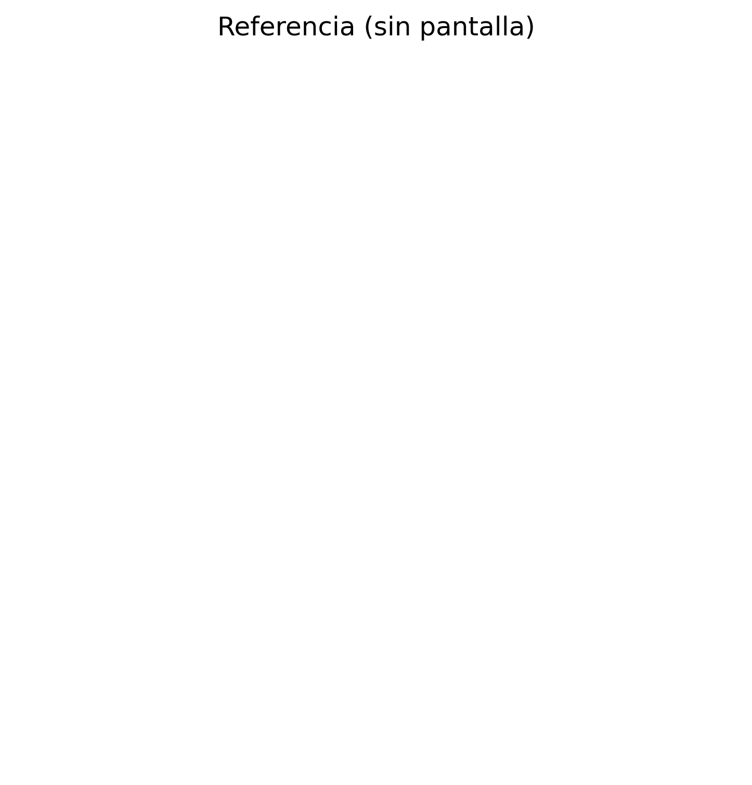
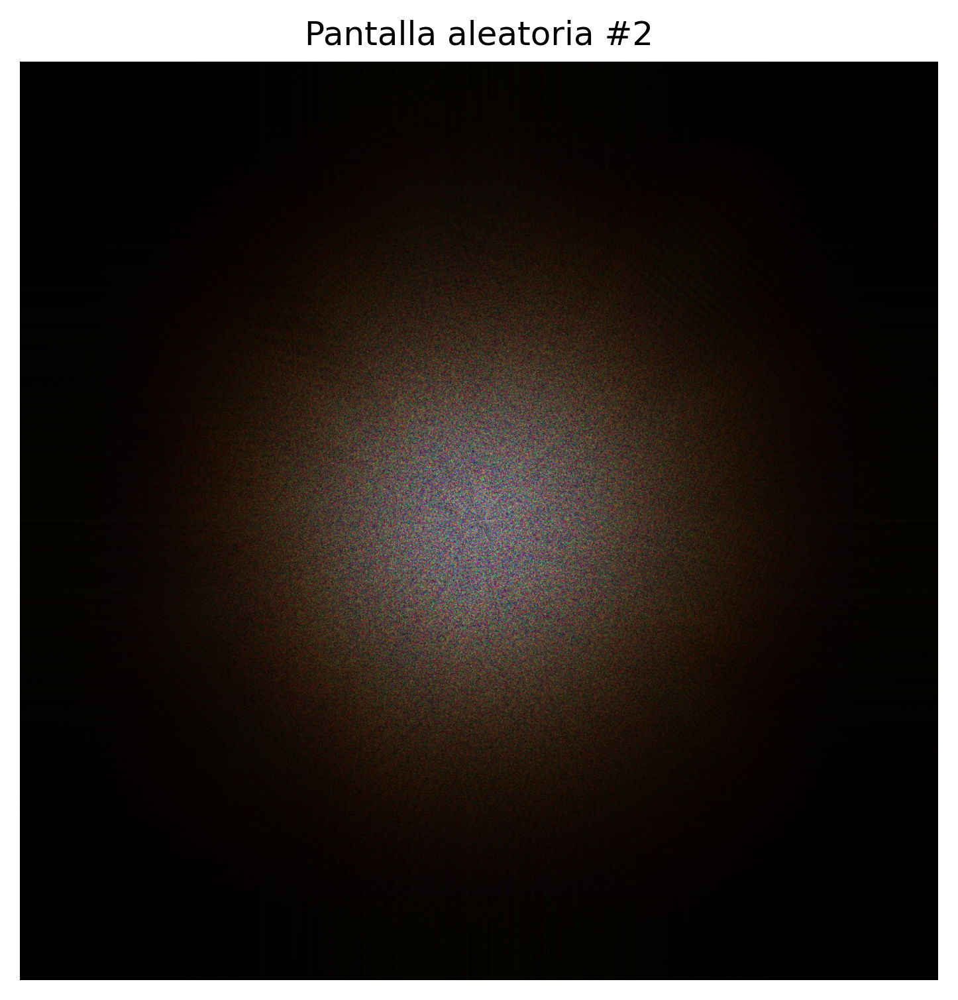
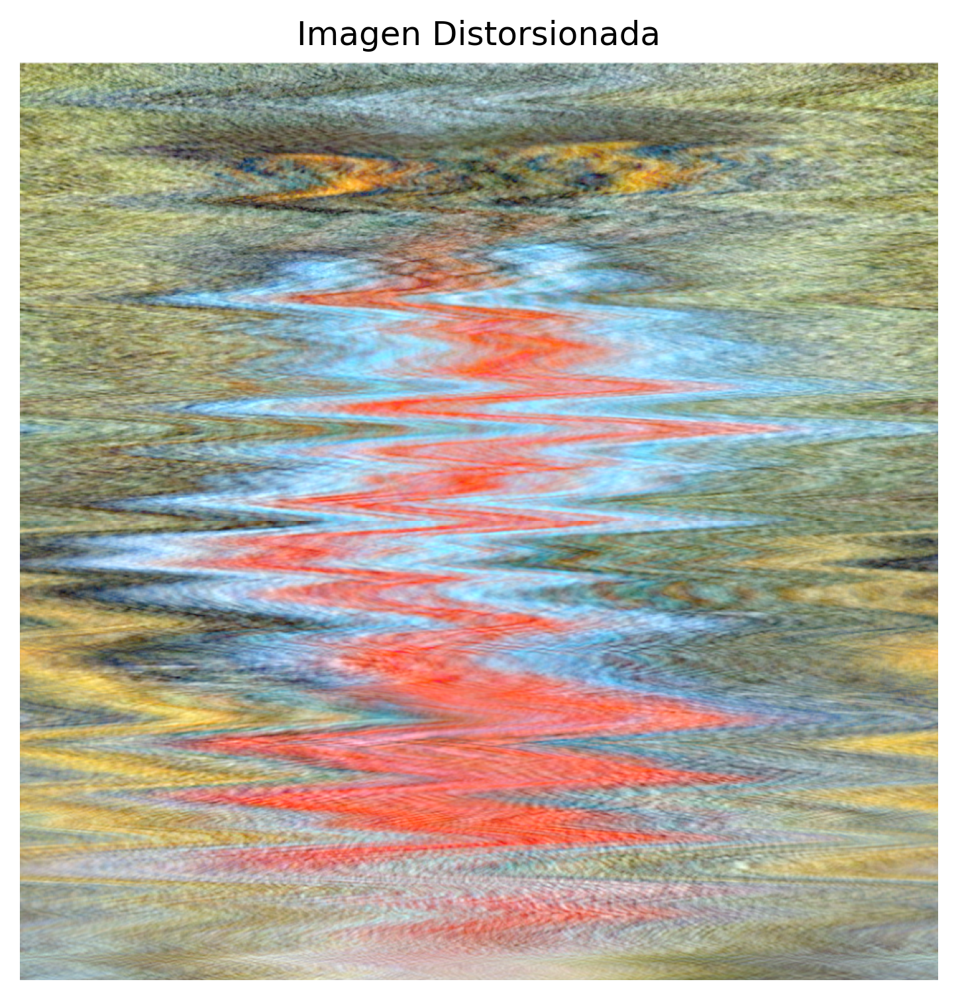

## Introducción

El otro día me paré a pensar en la ducha algo diario y trivial: al ver la luz de la bombilla a través de la mampara, que estaba empañada de vaho, la veía rodeada de una aureola multicolor muy difusa, como un _lense flare_; miré por una parte de la mampara que no estaba mojada y veía la luz normal. ¿Por qué pasa esto? Puedes pensar (con suerte) que por la refracción de la luz, o algo parecido. Y van por ahí los tiros, más o menos, ¿pero qué pasa realmente a bajo nivel? Pues vamos a investigarlo un poco...

> [!TIP]
> El _lense flare_ es un efecto óptico que ocurre frecuentemente en las cámaras cuando una fuente de luz brillante o fuerte entra directamente en el objetivo (entrando con ángulos no deseados, no enfocándose en el sensor), rebotando en los elementos del vidrio y la superficie interna del objetivo, creando destellos, halos, manchas, neblinas, etc.

<table>
<tr>
<td></td>
<td></td>
</tr>
<tr>
<td></td>
<td></td>
</tr>
</table>

Antes de explicar qué está pasando realmente, conviene aclarar qué **no** es este fenómeno:

- **No es un arcoíris**: el arcoíris requiere gotas grandes (~1 mm) con reflexión interna y ángulos geométricos fijos (~40-42°). Aquí las gotas son demasiado pequeñas y no hay orden geométrico.
- **No es solo refracción**: aunque hay refracción, no es el mecanismo dominante.
- **Tampoco es difracción pura ideal**: no es una red o rejilla periódica con órdenes definidos, sino una difracción estadística/aleatoria.

## Explicación física: **dispersión y difracción por microestructuras de agua**

### Mecanismo principal

El vaho depositado en la superficie de la mampara **no es una película continua** de agua, sino una **población de microgotas** con:

- Radios típicos: **1–20 μm** (micras, no nanómetros; es decir, **mucho mayores** que la longitud de onda de la luz visible, que es 400-700 nm).
- Es prácticamente una distribución **aleatoria**.
- La densidad (y, por tanto, separación media entre las microgotas) es variable según temperatura.

> [!NOTE] La [densidad del agua](https://blog.wika.com/es/files/2017/12/cambio-densidad-blog-wika.jpg) disminuye al aumentar la temperatura (las moléculas se separan y expanden), alcanzando su máximo a 3,98 °C; por debajo de esto y hasta el punto de congelación, la densidad también disminuye, (permitiendo que el hielo flote), mientras que la humedad (el vapor de agua) es mucho menos densa que el agua líquida (y por eso tiende a subir).

Esta configuración actúa como un **campo de obstáculos dispersores** (no una superficie óptica lisa). Cada gota hace **tres cosas a la vez**: _refracta_ la luz al entrar y salir, _refleja_ una pequeña fracción en su superficie y _dispersa_ la luz en muchas direcciones.

### Análisis teórico

**Dispersión de Mie (el régimen físico dominante)**:

Como las gotas son **mucho mayores** que la longitud de onda ($$\lambda$$), el régimen físico dominante es la **dispersión de Mie** (no de [Rayleigh](https://www.youtube.com/watch?v=bUfNxC_kl0Y&t=105s), porque las gotas no son mucho más pequeñas que $$\lambda$$). Esto implica que hay una fuerte dependencia con la dispersión **angular** (no isotrópica en la práctica). Esto significa que la luz dispersada no se distribuye de manera uniforme en todas las direcciones, lo que genera patrones como halos o coronas coloreadas con patrones no simétricos. Cada microgota actúa como un centro dispersor, generando ondas secundarias.

**Difracción estadística/aleatoria**:

Sí hay difracción, pero no es una red periódica (no hay órdenes definidos como en una rejilla de difracción clásica), sino que es una difracción estadística/aleatoria. Por eso no se ven anillos nítidos, sino una aureola suave. La relación angular típica es:

$$\theta \sim \frac{\lambda}{a},$$

donde $$a$$ es el tamaño típico de gota.

**Por qué aparecen colores (dispersión angular dependiente de $$\lambda$$)**:

El **azul** ($$\lambda$$ corta) se dispersa/difracta a **ángulos mayores** que el rojo (porque tiene una longitud de onda más corta y una frecuencia más alta). El **rojo** ($$\lambda$$ larga) queda más lejos del centro (en los bordes), al contrario que el azul. Esto crea un centro blanquecino y bordes azulados/rojizos difusos. O sea, como en una [corona solar](https://upload.wikimedia.org/wikipedia/commons/c/c7/Solar_eclipse_1999_4.jpg), pero en versión reducida.

> [!NOTE] La corona solar (como fenómeno atmosférico) se produce por la difracción de la luz solar al pasar por diminutas gotas de agua o cristales de hielo en nubes delgadas (altocúmulos, cirrocúmulos), creando anillos de colores pastel concéntricos alrededor del Sol, a diferencia de la corona del Sol (la atmósfera externa), visible solo en eclipses totales y causada por el plasma.

Las microgotas introducen desfases aleatorios en el frente de onda, distorsionando la imagen de la fuente luminosa y destruyendo la imagen puntual

## Reflexión y refracción en el fenómeno

Es importante destacar que el fenómeno observado involucra tanto **reflexión** como **refracción** de la luz. Cuando la luz de la bombilla LED (luz artificial de bajo consumo) incide sobre las microgotas de agua:

- **Reflexión**: parte de la luz se refleja en la superficie de las gotas, siguiendo la ley de reflexión donde el ángulo de incidencia iguala al ángulo de reflexión.
- **Refracción**: otra parte de la luz se refracta al entrar y salir de las gotas de agua, cambiando de dirección debido a la diferencia en el índice de refracción entre el aire ($$n \approx 1$$) y el agua ($$n \approx 1.33$$).

Estass bombillas típicamente emiten luz en el rango de **450-650 nm**, con un pico alrededor de **550-570 nm** (luz blanca cálida) o **450-470 nm** (luz blanca fría). Este espectro de longitudes de onda es crucial para el fenómeno de difracción observado, ya que diferentes longitudes de onda se difractan en ángulos distintos, produciendo la separación de colores en la aureola.

El consumo típico de estas bombillas LED oscila entre **5-15 W** para iluminación doméstica, siendo significativamente más eficientes que las bombillas incandescentes (e.g. 50 W). La eficiencia energética de los LED también influye en la calidad espectral de la luz emitida, lo que puede afectar sutilmente la apariencia del fenómeno de difracción observado.

> [!WARNING]
> En la ducha se está más cerca de **Fresnel / campo cercano** que de Fraunhofer (que sería una aproximación lejana e idealizada). Cuando la mampara está seca, la superficie ópticamente plana no introduce modulaciones de fase significativas, por lo que se observa la imagen nítida de la fuente luminosa.

Cabe decir que este fenómeno es demostrable mediante simulaciones de óptica de Fourier, modelando la mampara empañada como un filtro de fase y amplitud aleatorio. En resumen: **la luz se desordena al atravesar el vaho y ese desorden separa los colores**.

> [!NOTE] Fresnel y Fraunhofer se refieren a dos tipos de difracción de la luz, que se distinguen por la distancia entre el obstáculo/apertura y la pantalla: la Difracción de Fresnel (campo cercano) ocurre a distancias finitas y presenta patrones complejos (como líneas de Fresnel), mientras que la Difracción de Fraunhofer (campo lejano) ocurre a distancias muy grandes (o usando lentes para simularlas) y simplifica el análisis, resultando en patrones más conocidos como el [disco de Airy](data:image/jpeg;base64,/9j/4AAQSkZJRgABAQAAAQABAAD/2wCEAAkGBwgHBgkIBwgKCgkLDRYPDQwMDRsUFRAWIB0iIiAdHx8kKDQsJCYxJx8fLT0tMTU3Ojo6Iys/RD84QzQ5OjcBCgoKDQwNGg8PGjclHyU3Nzc3Nzc3Nzc3Nzc3Nzc3Nzc3Nzc3Nzc3Nzc3Nzc3Nzc3Nzc3Nzc3Nzc3Nzc3Nzc3N//AABEIAFwAXAMBIgACEQEDEQH/xAAcAAACAgMBAQAAAAAAAAAAAAACAwQFAAEHCAb/xAAqEAACAgEDAwQCAQUAAAAAAAABAgADEQQSIQUGMRMiQVEyYSMHFDOBkf/EABQBAQAAAAAAAAAAAAAAAAAAAAD/xAAUEQEAAAAAAAAAAAAAAAAAAAAA/9oADAMBAAIRAxEAPwDiAG48w8ACZ4EWSWOBA2zZ8TAjNG11fcZlVgKFML0BMa8fED1m+oBGgQGqI8QhcR5EYtqtAjcr5EMMDHsgYcSO6FDAxk+oHIjEbPBmyuTABzk4EbTXxkxdY3NJDHasDVlgQcRddb3H9TKUN1n6lvTUtSZOIEarQADmPGjT9Rd+uCtsrG4/qAo19g3LU2IDX0SnxId+iZOVjjqdRQf56yB9yXVbXenGIFMjshw0cQHEfrdMMEiQ6WIO0wFuu0wwciMuXIkbOID9OJmoPxCp/GLt/wAggWHT6gFzN9QuYYrr/JuI7RjFYiK19Tqtat4zA+r7P7U/u9llqZJ+50zR9l1eiP4h4hdiaWr0K+BOmaeisVDgeIHF+4+y6xUxFY/5OS9T0VnSdaVwQhM9V9f01ZpbgTz9/UjToljlQM5gfOnFtWZTahfTulpoSTQMyB1Ae/8A3A15SRXGGMlV/hI9n5mA2g8Qb+GBmqGwYy5dy8QLHQvmsRGpJ0+sru+AeYnQ3bTtMsbqlvr+4HUuxOv1imsFhOo6XrlXpD3DxPKui1ur6VZlCSgM+l03flqV7WZs4gds7i69UKW94nBe9+pjXao1oc5MDqvduq1wKVbjmVOn072WG6/ljAk6dPToAMq9c26zEstVaK0IEqObLc/EBy8JI1h9xklzhZEPJgb/ABaSkYMsQwyJqt9pgFYhRtyyZpNZjhokEOIt6flYFwHrtHODBOmpPwJULZbX9xg1lg+4FqtVVfjEXdqVQcESsbU2N4zA2vYfcYBXXNc2B4h1oFXmYiBBAtsxwIA3PngQFXiaUbjkxo4gCjTGTPIi/B4jFJgCGKmOW4HzFkAiLMCXuUzNqSKGI+Zm9vuBK9omjYBI24n5moDHtJ8QQpY8zFAh5gZwogFuZpiTMUZED//Z) para aperturas circulares, siendo un caso particular más simple de la de Fresnel.

## Bonus - script

Vamos a hacer [un script](https://github.com/agarnung/computerVisionMiscellaneous/tree/main/2026-10-01-casual-physics-diffuse-light) que emule el fenómeno mediante óptica de Fourier.

> [!TIP]
> La luz es una onda, no solo rayos. Imagínese tirar una piedra a un estanque: se forman ondas circulares que se expanden. La luz hace algo similar, pero en 3D y mucho más rápido. Cada componente de color de la luz es como una piedra de diferente tamaño: azul = piedra pequeña (ondas muy juntas, alta frecuencia), rojo = piedra grande (ondas más separadas, baja frecuencia).

Consideramos una **fuente puntual coherente monocromática** que emite un frente de onda plano:

```py
delta[N//2, N//2] = 1.0 # fuente puntual ideal
```

Esta fuente atraviesa una **pantalla delgada** situada en el plano $$(x,y)$$:

```py
rgb = np.zeros((N, N, 3))
```

Esta pantalla representa la **mampara empañada**, modelada como una **pantalla de fase aleatoria**, i.e., que no absorbe luz (**transmitancia** ≈ 1) y en la que se introduce **desfase espacialmente variable** debido a microgotas de agua.

> [!TIP]
> Cada microgota de agua actúa como un "badén" para la luz. La luz viaja más lento en agua que en aire (aire: velocidad ≈ 300000 km/s; agua: velocidad ≈ 225000 km/s). Si la luz encuentra un charco, parte pasa por aire (rápido) y parte por agua (lento), creando un desfase. Cuando se empaña un cristal, no se forman gotas perfectamente ordenadas: hay gotas grandes, pequeñas, juntas, separadas. Es impredecible dónde estará exactamente cada gota, por eso el patrón es aleatorio.

**Campo óptico antes de la pantalla**:

El campo complejo (una forma muy conveniente de representar una onda electromagnética como es la luz) incidente se escribe como:

$$U_0(x,y) = A_0 \cdot e^{ikz}$$

```py
field = np.exp(1j * phase) # Aplicar las gotas al vidrio: U = 1 * e^{iφ}
```

> [!IMPORTANT]
> **Desglose de la ecuación**: $$U_0$$ es "la luz en este punto" (como decir "el nivel de agua" en un en depósito), $$A_0$$ representa "cómo de fuerte" es la luz (altura máxima de las olas), $$e^{i...}$$ es una manera de representar la onda (circular), $$i$$ sirve para decir "hay fase" (pues añade periodicidad a las señales con vectores complejos en el [plano de Argand](https://es.wikipedia.org/wiki/Plano_complejo)), $$k$$ es "cuántas oscilaciones por metro" (e.g. si $$k$$ es grande, las ondas están muy apretadas) y $$z$$ es "cuánto has avanzado" (distancia desde donde se inició la onda). Piénsese en un resorte que gira: en $$z=0$$ apunta a las 12:00, en $$z=\lambda/4$$ apunta a las 3:00, en $$z=\lambda/2$$ apunta a las 6:00. $$e^{ikz}$$ es la manera elegante de decir: "según cuánto avances ($$z$$), el resorte gira un ángulo $$k \cdot z$$".

Como solo nos interesa la dependencia transversal, tomamos $$U_0(x,y) = 1$$ (onda plana normalizada).

> [!NOTE]
> **¿Por qué se simplifica a $$U_0 = 1$$?** Nos basta con conocer el cambio relativo. En la vida real, la luz viene de la bombilla: $$U = A_0 e^{ikz}$$. En la mampara ($$z=0$$): $$e^{ik \cdot 0} = e^0 = 1$$. Normalizamos diciendo $$A_0 = 1$$ porque nos da igual el brillo absoluto. El resultado es que $$U_0(x,y) = 1$$ en todo el plano de la mampara (de aquí partimos).

**Pantalla de fase aleatoria (mampara con vaho)**:

La mampara introduce un **retardo de fase** $$\phi(x,y)$$, de modo que el campo transmitido es:

$$U(x,y) = U_0(x,y) \cdot e^{i\phi(x,y)} = e^{i\phi(x,y)}$$

**Origen físico de $$\phi(x,y)$$**:

Cada microgota de agua de altura $$h(x,y)$$ introduce un [retardo óptico](https://rua.ua.es/server/api/core/bitstreams/7bd4aff3-605d-4468-997c-a73abfa9027a/content):

$$\phi(x,y) = k \cdot (n_\text{agua} - n_\text{aire}) \cdot h(x,y)$$

> [!TIP]
> **Traducción de la ecuación**: $$\phi$$ = cuánto retraso tiene la luz, $$k = 2\pi/\lambda$$ (qué tan sensible es al retraso), $$n_\text{agua} - n_\text{aire} = 1.33 - 1 = 0.33$$ (cuánto más lento es el agua), $$h(x,y)$$ = altura de la gota. En resumen: $$\phi = \text{(sensibilidad)} \times \text{(ralentización)} \times \text{(espesor)},$$

donde $$k = \frac{2\pi}{\lambda}$$ y $$n_\text{agua} \approx 1.33$$.

La función $$h(x,y)$$ es **aleatoria y suave**, debido a la distribución estadística de gotas, los tamaños del orden de micras y la  ausencia de periodicidad.

En el script, esto se modela como:

$$\phi(x,y) \sim \text{Gaussiana filtrada}$$

```py
phase = gaussian_filter(np.random.randn(N, N), sigma=sigma_phase)
phase = 2*np.pi * phase / np.std(phase)
```

> [!NOTE]
> En el script, los retardo ópticos de la retícula de microgotas se simula creando ruido blanco (como TV sin señal) y luego suavizándolo con un filtro gaussiano para simular gotas redondeadas. El patrón aleatorio suave representa la distribución estadística de las microgotas en la mampara.

**Propagación: plano lejano ([Fraunhofer](https://luz.izt.uam.mx/wikis/mediawiki/index.php/Optica:_Difraccion_de_Fraunhofer#:~:text=Podemos%20decir%20que%20el%20patr%C3%B3n%20de%20difracci%C3%B3n,2%20%CF%80%20u%20x%20d%20u%20.))**

En el régimen de **[Fraunhofer](https://www.redalyc.org/pdf/849/84927487043.pdf)** (asumámoslo en este ejemplo), el campo observado en ángulos $$(\theta_x, \theta_y)$$ es proporcional a la transformada de Fourier del campo en la pantalla (**[función pupila](https://www.google.com/url?sa=t&source=web&rct=j&opi=89978449&url=https://dialnet.unirioja.es/descarga/articulo/2794156.pdf&ved=2ahUKEwjJoe_aufqRAxWlSvEDHR2LC9UQFnoECBsQAQ&usg=AOvVaw0XCigMB64MgaNhrDBSaIRa)**):

$$U_\infty(f_x, f_y) \sim \mathcal{F}\left\{U(x,y)\right\},$$

donde las frecuencias espaciales están relacionadas con los ángulos:

$$f_x = \frac{\cos\theta_x}{\lambda}, \quad f_y = \frac{\cos\theta_y}{\lambda},$$

relación a la que se llega si se tiene en cuenta la [magnitud del vector de onda](https://es.wikipedia.org/wiki/Vector_de_onda) $$\vec{k} = \frac{2\pi}{\lambda}\mathbf{k}$$ para una onda propagándose por espacio bidimensional.

> [!TIP]
> **¿Qué es realmente la [Transformada de Fourier](https://media4.obspm.fr/public/VAU/instrumentacion/optica/rayo/difraccion-fourier/APPRENDRE.html)?** Es un "prisma matemático": convierte un **patrón espacial** en su **patrón de frecuencias**, mostrando cómo se dispersa la luz. Las frecuencias espaciales $$f_x, f_y$$ indican el tamaño de los detalles. Detalles finos → $$f_x$$ grande → ángulos de dispersión grandes. Detalles gruesos → $$f_x$$ pequeño → ángulos pequeños. Otra analogía: como un acorde en un piano, Fourier separa las “notas” de un patrón espacial.

**Intensidad observada**:

El ojo o la cámara miden **intensidad** (), no campo complejo:

$$I(f_x, f_y) = \left|\mathcal{F}\left\{e^{i\phi(x,y)}\right\}\right|^2$$

```python
fft = np.fft.fftshift(np.fft.fft2(field)) # Transformada de Fourier
intensity = np.abs(fft)**2 # Medir la intensidad (lo que ve el ojo)
```

> [!NOTE]
> **¿Por qué esto explica el halo que aparece?** Paso a paso: 1) La mampara seca tiene superficie lisa → Fourier(1) = todo en un punto (la bombilla se ve nítida). 2) La mampara empañada tiene millones de microgotas → cada gotita desvía la luz un poquito, desviaciones aleatorias en todas direcciones, Fourier(patrón aleatorio) = manchas en muchos ángulos. 3) ¿Por qué se ve como halo y no como manchas? El ojo está lejos → integra muchas manchas, ves un promedio estadístico = corona difusa.

> [!TIP]
> La razón por la cual se calcula la magnitud de la transformada de Fourier con el cuadrado del valor absoluto es que la intensidad (e.g. que llega los sistemas de medición) de una onda está relacionada con la energía transmitida, que energía es proporcional al cuadrado de la amplitud de la onda, lo que revela la potencia o energía de cada componente de frecuencia (se conecta directamente con el [Teorema de Parseval](https://es.wikipedia.org/wiki/Relaci%C3%B3n_de_Parseval)).

**Caso de referencia: SIN pantalla (mampara seca)**:

Si no hay vaho:

$$\phi(x,y) = 0 \quad\Rightarrow\quad U(x,y) = 1$$

Su transformada de Fourier es:

$$\mathcal{F}\{1\} = \delta(f_x, f_y)$$

o, de forma equivalente (según la convención usada):

$$\mathcal{F}\{\delta(x,y)\} = \text{constante}$$

> [!NOTE]
> Sin vaho, la superficie es perfectamente lisa. **La transformada de Fourier de una constante es un delta** (toda la energía concentrada en un punto) **o una constante**(intensidad uniforme). Esto significa que se ve la bombilla nítida, sin distorsiones ni halos.

El resultado físico supone: intensidad uniforme, sin estructura y sin color:



**Aparición del halo (difracción estadística)**:

Cuando $$\phi(x,y)$$ es aleatoria, se destruye la coherencia espacial, el frente de onda se fragmenta y la energía se redistribuye angularmente.

El ancho angular característico cumple:

$$\theta \sim \frac{\lambda}{a},$$

donde $$a$$ es el tamaño típico de las microgotas. Esto produce una **corona difusa** (no anillos nítidos).

**Dependencia con la longitud de onda (color)**:

Para cada longitud de onda:

$$I_\lambda(\theta) = \left|\mathcal{F}\left\{e^{i\phi(x,y)}\right\}\right|^2$$

pero el mapeo ángulo–frecuencia depende de $$\lambda$$:

$$\theta = \lambda f$$

> [!TIP]
> **¿Por qué azul afuera, rojo adentro?** Imagínense dos pelotas: una de tenis ($$\lambda$$ grande, rojo) y una canica ($$\lambda$$ pequeña, azul). Se tiran contra una pared con hoyos del mismo tamaño. La canica (azul) pasa por hoyos pequeños y rebota mucho (ángulos grandes). La pelota de tenis (rojo) solo pasa por (menos) hoyos grandes y rebota poco (ángulos pequeños). Es deicr: $$\theta$$ (ángulo) = $$\lambda$$ (tamaño) × $$f$$ (fineness del patrón).

En el script, para cada color (R, G, B), se calcula la escala según su longitud de onda (azul: _scale_ ≈ 0.7 → se expande más; rojo: _scale_ ≈ 1.2 → se expande menos).

Por eso el **azul** se dispersa a ángulos mayores y el **rojo** queda más cerca del centro (inicio de la onda).

En el script esto se simula reescalando el patrón:

```python
wavelengths = {
    "R": 650e-9,
    "G": 550e-9,
    "B": 450e-9
}

scale = λ / λ_ref # Escalar el patrón según la longitud de onda
resized = zoom(intensity, scale, order=31)
```

Y luego se recorta o se hace padding al tamaño original, simulando, de nuevo, cómo distintas longitudes de onda inciden de manera distinta en cada microgota.

> [!IMPORTANT] ¿Por qué se divide entre una longitud de onda de referencia?
> La división entre la longitud de onda actual (`λ`) y la longitud de onda de la luz verde (`λ_ref = wavelengths["G"]`) ajusta la escala espacial de la imagen para cada color, simulando cómo las ondas de diferentes "colores" impactan visualmente la imagen, ya que cada una tiene una escala espacial diferente.
> Al tomar la luz verde como referencia, las imágenes para los otros colores (rojo y azul) se ajustan proporcionalmente para mantener un tamaño adecuado según las propiedades de cada longitud de onda, simulando de manera realista cómo se verían los patrones de interferencia o difracción para cada color de luz.

**Composición RGB**:

> [!NOTE]
> El script calcula el patrón de difracción para cada color (rojo, verde, azul) por separado, cada uno con su propia longitud de onda. Luego se combinan en una imagen RGB para visualizar el resultado final con colores.

```py
for i, lam in enumerate(wavelengths.values()):
    # ...
    rgb[..., i] = resized
``` 

La imagen final es:

$$I_\text{RGB}(x,y) = \begin{bmatrix}I_{\lambda_R}(x,y) \\ I_{\lambda_G}(x,y) \\ I_{\lambda_B}(x,y)\end{bmatrix},$$

añadiendo corrección gamma para visualización:

$$I_\text{vis} = I_\text{RGB}^{\gamma}$$

> [!NOTE]
> La corrección gamma ajusta el brillo para que se vea correctamente en pantallas, ya que estas no responden linealmente a la intensidad de la luz.

```python
gamma = 0.35 # para visualización
plt.imshow(img**gamma)
```

<table>
<tr>
<td></td>
<td></td>
<td></td>
</tr>
</table>

### ¿Y cómo se vería un objeto real?

Para simular cómo se vería una imagen real (en RGB) a través de una pantalla difusa (mampara), el proceso seguido consiste en:

1. Convertir la imagen al dominio de Fourier, representando su contenido en frecuencias espaciales.

2. Generar una fase aleatoria para simular la distorsión de la luz al pasar por la pantalla.

3. Aplicar la fase aleatoria a la imagen en Fourier (mediante un [producto de Hadamard](https://en.wikipedia.org/wiki/Hadamard_product_(matrices)) entre la imagen en Fourier y la fase aleatoria), afectando cómo la luz de cada color (rojo, verde, azul) se propaga.

4. Después de aplicar la distorsión, regresar al dominio espacial para obtener la imagen distorsionada.

```py
fft_img = np.fft.fftshift(np.fft.fft2(img_resized))
field_expanded = np.stack([field] * 3, axis=-1)
fft_img_distorted = fft_img * field_expanded
img_distorted = np.abs(np.fft.ifft2(np.fft.ifftshift(fft_img_distorted)))**2
```

<table>
<tr>
<td></td>
<td></td>
</tr>
</table>

Menuda simulación, _¿eh?_.

**Conexión directa con el fenómeno físico**:

| Simulación         | Fenómeno físico                  |
| ------------------ | -------------------------------- |
| Pantalla de fase   | Microgotas de agua               |
| $$\phi(x,y)$$      | [Espesor óptico](https://cloudatlas.wmo.int/es/optical-thickness.html) del vaho          |
| FFT                | Propagación de la luz            |
| Intensidad angular | Imagen en la retina              |

> [!IMPORTANT]
> **Al observar el fenómeno a través de la mampara**: 1) La bombilla emite luz blanca (todos los colores) → nuestro $$U_0 = 1$$ para cada color. 2) La mampara tiene millones de microgotas → el $$\phi(x,y)$$ aleatorio. 3) Cada color "ve" las gotas de diferente tamaño relativo → azul: las gotas parecen grandes (relativo a $$\lambda$$), rojo: las gotas parecen pequeñas. 4) La difracción depende de (tamaño de gota)/($$\lambda$$) → misma gota: difracta más al azul, menos al rojo. 5) Resultado en la retina: centro = mezcla de todos → blanquecino, borde externo = solo azul difractado suficiente → azulado, borde intermedio = verde y algo de rojo → halo completo.

> [!WARNING]
> **Limitaciones del modelo**: Para mantener el modelo mínimo: no se ha incluido (a propósito) dispersión de Mie explícita ni campo cercano (Fresnel), entre otros. Aun así, el fenómeno principal ya aparece.

## Conclusión

El efecto observado es una **corona cromática difusa** producida principalmente por **dispersión de Mie y difracción estadística** en microgotas de agua (1-20 μm), con **contribuciones locales de refracción y reflexión**. La coloración surge de la **dependencia angular de la dispersión/difracción con la longitud de onda** y la difusividad se debe a la distribución estadística de tamaños y posiciones de las gotas, que destruyen la imagen puntual de la fuente y la redistribuyen angular y aleatoriamente.

La idea final es que...

$$\boxed{\text{...la aureola no es más que la transformada de Fourier del desorden.}}$$

Intuitivamente: $$\text{Halo} = \text{Fourier}(\text{Luz Blanca} \times e^{i \times \text{Aleatoriedad Gotas}})$$. Donde: Luz Blanca = 1 (simplificado), Aleatoriedad Gotas = $$\phi(x,y)$$ aleatorio, Fourier = propagación a la pared/retina, $$i$$ = el truco matemático para "retrasos".

Las microgotas desordenan la luz y cada color se desordena de forma diferente porque tiene diferente "tamaño" (longitud de onda). La mampara no crea color, redistribuye ángulos. Y el ángulo depende de $$\lambda.$$

## Referencias

- [Densidad del agua](https://blog.wika.com/es/files/2017/12/cambio-densidad-blog-wika.jpg)

- [Dispersión de Rayleigh](https://www.youtube.com/watch?v=bUfNxC_kl0Y&t=105s)

- [Corona solar](https://upload.wikimedia.org/wikipedia/commons/c/c7/Solar_eclipse_1999_4.jpg)

- [Retardo óptico](https://rua.ua.es/server/api/core/bitstreams/7bd4aff3-605d-4468-997c-a73abfa9027a/content)

- [Difracción de Fraunhofer](https://luz.izt.uam.mx/wikis/mediawiki/index.php/Optica:_Difraccion_de_Fraunhofer)

- [Difracción de Fraunhofer (PDF)](https://www.redalyc.org/pdf/849/84927487043.pdf)

- [Función pupila](https://dialnet.unirioja.es/descarga/articulo/2794156.pdf)

- [Plano complejo (Argand)](https://es.wikipedia.org/wiki/Plano_complejo)

- [Vector de onda](https://es.wikipedia.org/wiki/Vector_de_onda)

- [Transformada de Fourier en óptica](https://media4.obspm.fr/public/VAU/instrumentacion/optica/rayo/difraccion-fourier/APPRENDRE.html)

- [Teorema de Parseval](https://es.wikipedia.org/wiki/Relación_de_Parseval)

- [Producto de Hadamard](https://en.wikipedia.org/wiki/Hadamard_product_(matrices))

- [Espesor óptico](https://cloudatlas.wmo.int/es/optical-thickness.html)

- [Repositorio de scripts](https://github.com/agarnung/computerVisionMiscellaneous/2026-09-01-casual-physics-diffuse-light)
