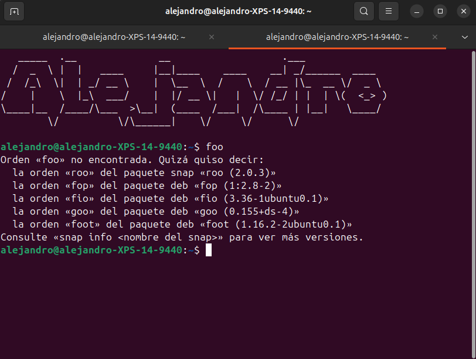

Cada vez que instalo una distribución de Linux para uso frecuente, suelo crear varios aliases, atajos y utilidades que me han servido a lo largo de los años. Vamos a comentar algunos y registrarlos para "copiar y pegarlos" la próxima vez:

> [!IMPORTANT] 
> Por cierto, [chequea el video](https://www.youtube.com/watch?v=mfv0V1SxbNA) con Linus y Linus construyendo el PC _perfecto_ 🙂.

### Liberar Espacio en Disco

> [!NOTE] 
> Los comandos `du`, `rm`, `apt`, `snap` y `journalctl` son herramientas del sistema de archivos y gestión de paquetes de Linux. Modificar `.bashrc` afecta al entorno de shell del usuario actual.

Muchas veces, después de eliminar descargas, documentos e imágenes redundantes, aún necesitamos liberar espacio. Estos aliases ayudan a gestionar ese problema:

Agrega al archivo `~/.bashrc`:

```bash
# Muestra los 10 archivos/directorios más grandes en el directorio actual
alias ducks='du -cks * | sort -rn | head'
```

```bash
# Elimina la caché de miniaturas generadas por gestores de archivos (GNOME/Thunar/Nemo)
alias limpiaThumbnails='rm -rfv ~/.cache/thumbnails'
```

```bash
# Vacía la papelera del usuario (Trash) según estándar XDG
alias limpiaBasura='cd ~/.local/share/Trash && rm -rf *'
```

```bash
# Limpia caché de paquetes APT y elimina dependencias innecesarias
alias limpiaCache='sudo apt-get autoclean && sudo apt-get clean && sudo apt-get autoremove'
```

```bash
# Elimina versiones antiguas de paquetes Snap que están deshabilitadas
alias limpiaSnaps='LANG=C snap list --all | while read snapname ver rev trk pub notes; do if [[ $notes = *disabled* ]]; then sudo snap remove "$snapname" --revision="$rev"; fi; done'
```

```bash
# Reduce el tamaño de los logs del systemd journal a solo los últimos 3 días
alias limpiaJournals='sudo journalctl --vacuum-time=3d'
```

```bash
# Ejecuta todas las limpiezas anteriores en secuencia
alias limpiaTodo='limpiaThumbnails && limpiaBasura && limpiaCache && limpiaSnaps && limpiaJournals'
```

### Alias útiles

> [!NOTE] 
> `chown` cambia el propietario de archivos, `du` mide uso de disco, `export -f` hace funciones disponibles en subshells.

Agrega al archivo `~/.bashrc`:

```bash
# Cambia recursivamente el propietario de archivos/directorios al usuario actual
alias mio='sudo chown $(whoami):$(whoami) -R .'
```

```bash
# Función para ver el tamaño de directorios ordenados por uso (no alias)
function lsize { 
    du -h --max-depth=1 "$1" | sort -rh 
}
export -f lsize
```
### Seguridad: Protección contra `rm -rf /`

> [!WARNING] 
> Modificar comandos del sistema en `/usr/bin/` requiere permisos root y puede romper el sistema. Puedes considerar usar un alias o función en su lugar.

```bash
# Alternativa más segura (agregar al ~/.bashrc en lugar de modificar /usr/bin/rm):
alias rm='rm -i' # Pide confirmación antes de eliminar
```

Si aún quieres la protección mediante wrapper, crea un script en `/usr/local/bin/rm`:
.
```bash
#!/bin/bash
# Protección contra eliminación recursiva forzada del sistema de archivos raíz
if [[ "$*" =~ \-[rf]*\s*/ ]]; then
    echo "[ERROR] Comando prohibido: rm $*"
    echo "Use 'rm --preserve-root' o elimine rutas específicas explícitamente."
    exit 1
else
    /bin/rm "$@"
fi
```

> [!NOTE] 
> En sistemas modernos, `rm --preserve-root` es la protección estándar. Considera usar `alias rm='rm --preserve-root'` en su lugar.

### Personalización del terminal

Por supuesto, también suelo personalizar mi bash (o tu _zsh_ o lo que uses tú) con un heades de echo de strings en el bashrc, usando [esta web](https://patorjk.com/software/taag/#p=display&f=Graffiti&t=Type+Something+&x=none&v=4&h=4&w=80&we=false):

Agrega esto al final de tu ~/.bashrc para mostrar un encabezado al abrir el terminal:

```bash
echo "   _____  .__              __                   .___              "
echo "  /  _  \ |  |   ____     |__|____    ____    __| _/______  ____  "
echo " /  /_\  \|  | _/ __ \    |  \__  \  /    \  / __ |\_  __ \/  _ \ "
echo "/    |    \  |_\  ___/    |  |/ __ \|   |  \/ /_/ | |  | \(  <_> )"
echo "\____|__  /____/\___  >\__|  (____  /___|  /\____ | |__|   \____/ "
echo "        \/          \/\______|    \/     \/      \/               "
echo "                                                                  "
```



> [!TIP] 
> Puedes usar `neofetch` o `screenfetch` para mostrar información del sistema con estilo ASCII. Instálalo con `sudo apt install neofetch`.

### nvidia-smi-full

A veces necesito saber quién ejecuto, o el comando completo que lanzó un proceso que está ocupando/consumiendo GPU. Para no tener que lanzar `ps -fp <ID_PROCESO>` o similares, podemos capturar la salida de `nvidia-smi` y mejorarla:

Creamos el archivo del script:

```bash
sudo nano /usr/local/bin/nvidia-smi-full
```

Pegamos esto dentro:

```bash
#!/bin/bash

nvidia-smi

echo
echo "===================== FULL PROCESS COMMANDS (SORTED BY GPU MEM) ====================="
printf "%-5s %-8s %-10s %-6s %-12s %s\n" "GPU" "PID" "USER" "TYPE" "GPU-MEM" "FULL COMMAND"
echo "---------------------------------------------------------------------------------------"

nvidia-smi | awk '
/Processes:/ {inproc=1; next}
inproc && /^\|/ && $2 ~ /^[0-9]+$/ && $5 ~ /^[0-9]+$/ {
    gpu=$2
    pid=$5
    type=$6
    mem=$(NF-1)
    gsub("MiB","",mem)
    print gpu","pid","type","mem
}
' | sort -t',' -k4 -nr | while IFS=',' read -r gpu pid type mem; do

    user=$(ps -o user= -p "$pid" 2>/dev/null)

    if [[ -r /proc/$pid/cmdline ]]; then
        cmd=$(tr '\0' ' ' < /proc/$pid/cmdline)
        [[ -z "$cmd" ]] && cmd="[kernel thread or exited]"
    else
        cmd="[not accessible]"
    fi

    printf "%-5s %-8s %-10s %-6s %-12s %s\n" \
        "$gpu" "$pid" "$user" "$type" "${mem}MiB" "$cmd"

done
```

Finalmente le damos permisos de ejecución:

```bash
sudo chmod +x /usr/local/bin/nvidia-smi-full
```

La salida será algo así:

```bash
agarnung@chomsky:~$ nvidia-smi-full
Thu Feb 19 10:24:42 2026
+-----------------------------------------------------------------------------------------+
| NVIDIA-SMI 580.126.09             Driver Version: 580.126.09     CUDA Version: 13.0     |
+-----------------------------------------+------------------------+----------------------+
| GPU  Name                 Persistence-M | Bus-Id          Disp.A | Volatile Uncorr. ECC |
| Fan  Temp   Perf          Pwr:Usage/Cap |           Memory-Usage | GPU-Util  Compute M. |
|                                         |                        |               MIG M. |
|=========================================+========================+======================|
|   0  NVIDIA RTX A6000               Off |   00000000:01:00.0 Off |                  Off |
| 30%   25C    P8              5W /  300W |   40874MiB /  49140MiB |      0%      Default |
|                                         |                        |                  N/A |
+-----------------------------------------+------------------------+----------------------+
|   1  NVIDIA RTX A6000               Off |   00000000:08:00.0 Off |                  Off |
| 30%   23C    P8             15W /  300W |   36109MiB /  49140MiB |      0%      Default |
|                                         |                        |                  N/A |
+-----------------------------------------+------------------------+----------------------+
+-----------------------------------------------------------------------------------------+
| Processes:                                                                              |
|  GPU   GI   CI              PID   Type   Process name                        GPU Memory |
|        ID   ID                                                               Usage      |
|=========================================================================================|
|    0   N/A  N/A            1971      G   /usr/lib/xorg/Xorg                       18MiB |
|    0   N/A  N/A            2187      G   /usr/bin/gnome-shell                     14MiB |
|    0   N/A  N/A         1533058      C   VLLM::EngineCore                      40532MiB |
|    0   N/A  N/A         3041554      C   /app/llama-server                       262MiB |
|    1   N/A  N/A            1971      G   /usr/lib/xorg/Xorg                        4MiB |
|    1   N/A  N/A         1531689      C   /opt/app-root/bin/python3               844MiB |
|    1   N/A  N/A         1533062      C   VLLM::EngineCore                      31434MiB |
|    1   N/A  N/A         1533154      C   VLLM::EngineCore                       1728MiB |
|    1   N/A  N/A         1533200      C   VLLM::EngineCore                       1742MiB |
|    1   N/A  N/A         3041554      C   /app/llama-server                       300MiB |
+-----------------------------------------------------------------------------------------+
===================== FULL PROCESS COMMANDS (SORTED BY GPU MEM) =====================
GPU   PID      USER       TYPE   GPU-MEM      FULL COMMAND
---------------------------------------------------------------------------------------
0     1533058  root       C      40532MiB     VLLM::EngineCore
1     1533062  root       C      31434MiB     VLLM::EngineCore
1     1533200  root       C      1742MiB      VLLM::EngineCore
1     1533154  root       C      1728MiB      VLLM::EngineCore
1     1531689  leon       C      844MiB       /opt/app-root/bin/python3 /opt/app-root/bin/docling-serve run
1     3041554  root       C      300MiB       /app/llama-server --host 127.0.0.1 --port 35927 --sleep-idle-seconds 600 --alias Qwen3-0.6B-Q5_K_M --model /models/Qwen3-0.6B-Q5_K_M.gguf
0     3041554  root       C      262MiB       /app/llama-server --host 127.0.0.1 --port 35927 --sleep-idle-seconds 600 --alias Qwen3-0.6B-Q5_K_M --model /models/Qwen3-0.6B-Q5_K_M.gguf
0     1971     gdm        G      18MiB        /usr/lib/xorg/Xorg vt1 -displayfd 3 -auth /run/user/120/gdm/Xauthority -nolisten tcp -background none -noreset -keeptty -novtswitch -verbose 3
0     2187     gdm        G      14MiB        /usr/bin/gnome-shell
1     1971     gdm        G      4MiB         /usr/lib/xorg/Xorg vt1 -displayfd 3 -auth /run/user/120/gdm/Xauthority -nolisten tcp -background none -noreset -keeptty -novtswitch -verbose 3
```

(ahora muestra el comando real de `/proc/PID/cmdline` que lanzó el proceso [tanto de computación—**C**—, como gráfico—**G**—(e.g. `/usr/lib/xorg/Xorg`)] y los ordena por consumo de GPU descencentemente).

#### Usuario no root

Si no tenemos acceso como superusuario al sistema, sino que somos un usuario más del equipo, podemos igualmente definir un archivo para scripts propios, solo que hay que añadirlo luego al [`PATH`](https://rootsudo.wordpress.com/2014/04/06/el-path-la-ruta-de-linux-variables-de-entorno/):

Creamos nuestra carpeta de scripts en nuestro `home`:

```bash
mkdir -p ~/bin
```

Creamos y pegamos ahí el script, como antes, y le damos permisos de ejecución. Luego añadimos la ruta al archivo de configuración de nuestro shell:

```bash
echo 'export PATH=$HOME/bin:$PATH"' >> ~./bashrc && source ~/.bashrc 
```

Tras esto, cualquier script que pongamos en `~/bin` y marquemos como ejecutable (`chmod +x`) se podrá llamar desde cualquier lugar.

Aunque si no queremos tocar el `PATH`, también podríamos ejecutarlo con la ruta completa, e.g. `$ ~/bin/nvidia-smi-full`

## Recarga la Configuración

Después de editar `~/.bashrc`, ejecuta:

```bash
source ~/.bashrc
# O simplemente cierra y reabre el terminal
```

> [!WARNING] 
> Nunca ejecutes comandos `rm -rf` con rutas que no hayas verificado. Considera usar `trash-cli` (`sudo apt install trash-cli`) para mover archivos a la papelera en lugar de eliminarlos permanentemente.

## ...

Se irán añadiendo más...
