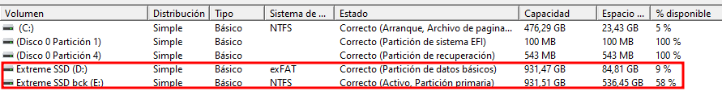
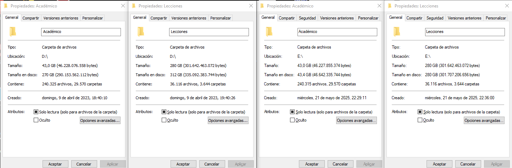

## Cronología de tecnologías de almacenamiento

El almacenamiento digital ha evolucionado significativamente desde los primeros sistemas. Comprender esta evolución ayuda a entender por qué ciertas prácticas de mantenimiento son necesarias:

- **HDDs (1956 - presente)**: Los discos duros mecánicos utilizan platos magnéticos giratorios para almacenar datos. Son sensibles a campos magnéticos externos y pueden sufrir desmagnetización con el tiempo.

- **SSDs (1991 - presente)**: Las unidades de estado sólido emplean celdas de memoria flash NAND. La tecnología ha evolucionado desde SLC (Single-Level Cell) hasta QLC (Quad-Level Cell), cada una con diferentes características de velocidad, durabilidad y retención de datos.

- **Futuro**: Aunque [Intel Optane](https://www.lenovo.com/es/es/glossary/optane-memory/?srsltid=AfmBOop1ZBZK9SlIgdmDFF4-0JNFFPzxjRejJ3pcizGo6Fw6zRoGeWoK) fue discontinuado, tecnologías emergentes como [MRAM](https://www.techno-science.net/es/noticias/mram-memoria-informatica-del-futuro-finalmente-aqui-N26725.html) (Magnetoresistive RAM), [ReRAM](https://www.profesionalreview.com/2022/08/20/reram/) (Resistive RAM) y [almacenamiento holográfico](https://es.wikipedia.org/wiki/Memoria_hologr%C3%A1fica) prometen nuevas capacidades.

Para entender mejor cómo funcionan los SSDs a nivel electrónico, recomiendo los videos de [Branch Education en YouTube](https://www.youtube.com/results?search_query=how+ssd+works) que explican en detalle la estructura interna y el funcionamiento de estas unidades.

## Por qué leer todos los archivos de un disco

Tiene sentido realizar una lectura completa de todos los archivos de un disco (HDD/SSD) periódicamente por varias razones importantes:

**Prevención de "bit rot"**: En HDDs tradicionales, los datos almacenados magnéticamente pueden degradarse con el tiempo si no se acceden regularmente. Los campos magnéticos pueden debilitarse gradualmente.

**Refresh de celdas NAND**: En SSDs, las celdas de memoria flash almacenan electrones. Con el tiempo, especialmente en celdas TLC y QLC, estos electrones pueden fugarse, causando pérdida de datos. La lectura periódica activa los circuitos de corrección de errores (ECC).

**Detección temprana de fallos**: Al leer todo el disco, puedes identificar sectores problemáticos o bloques defectuosos antes de que fallen completamente, permitiendo realizar backups preventivos.

## Cómo funciona el proceso de lectura

### Para HDDs (discos duros mecánicos)

Los datos se almacenan magnéticamente en platos giratorios. Con el tiempo, los campos magnéticos pueden debilitarse debido a la desmagnetización natural. La lectura periódica "refresca" la señal magnética al activar los cabezales de lectura, lo que ayuda a mantener la integridad de los datos.

### Para SSDs (unidades de estado sólido)

Utilizan celdas de memoria flash NAND que almacenan electrones en celdas de memoria. Los electrones pueden fugarse con el tiempo, especialmente en tecnologías de mayor densidad como TLC (Triple-Level Cell) y QLC (Quad-Level Cell). La lectura activa los circuitos de corrección de errores (ECC), que pueden detectar y corregir errores menores antes de que se vuelvan críticos.

## Recomendaciones importantes

**Para SSDs**: No es recomendable abusar de este proceso, ya que cada operación de lectura/escritura consume ciclos de vida limitados de las celdas NAND. Sin embargo, una lectura periódica es beneficiosa para activar la [corrección de errores](https://www.kingston.com/es/ssd/data-protection).

**Frecuencia recomendada**:

- **HDDs**: cada 6-12 meses.
- **SSDs**: cada 1-2 años (o usar TRIM periódico como alternativa).

**Otras alternativas posiblemente mejores**:

- **Para HDDs**: usar `badblocks -svn /dev/sdX` para verificar la integridad del disco.
- **Para SSDs**: usar `fstrim -v /` en Linux o la optimización de unidades en Windows para mantener el rendimiento.

> [!IMPORTANT] 
> Este proceso bastaría realizarlo unas 2 veces al año, como máximo. No es necesario ejecutarlo con mayor frecuencia.

## Scripts de lectura segura

Se pueden desarrollar scripts que, además de cumplir el propósito de "engrasar" las puertas del dispositivo de almacenamiento, cuente cierta protección para impedir leer o escribir letras críticas del sistema, evitando accidentes que podrían ralentizar o afectar al sistema operativo sobre el que se monte la unidad de memoria.

### Identificar la unidad de almacenamiento

Antes de ejecutar los scripts, necesitamos identificar qué unidad se quiere inspeccionar.

**En Linux**:

```bash
# Listar todos los discos y particiones
lsblk

# Ver información detallada de discos
sudo fdisk -l

# Ver puntos de montaje
df -h

# Ver solo discos (no particiones)
lsblk -d -o NAME,SIZE,TYPE,MODEL
```

El comando `lsblk` mostrará algo como:
```
NAME   MAJ:MIN RM   SIZE RO TYPE MOUNTPOINT
sda      8:0    0 465.8G  0 disk 
├─sda1   8:1    0   512M  0 part /boot/efi
├─sda2   8:2    0   100G  0 part /
└─sda3   8:3    0 365.3G  0 part /mnt/datos
```

En este ejemplo, `/mnt/datos` sería el punto de montaje a usar con el script.

> [!NOTE]
> Si quisiéramos verlo desde la WSL, una opción simple es `cd /mnt && dh -f`, con lo que veríamos el nombre de las unidades que monta Windows automáticamente. Si no, tendríamos que [montar en la WSL manualmente la unidad](https://learn.microsoft.com/es-es/windows/wsl/wsl2-mount-disk) desde Windows; así veríamos el dispositivo como un disco real (`/dev/sdX`) desde la WSL.

**En Windows**:

```powershell
# Listar todas las unidades
Get-PSDrive -PSProvider FileSystem

# Ver información detallada
Get-Volume

# Ver letras de unidad disponibles
[System.IO.DriveInfo]::GetDrives() | Where-Object {$_.IsReady} | Select-Object Name, DriveType, TotalSize, AvailableFreeSpace
```

Que mostraría algo como:

```powershell
Name           Used (GB)     Free (GB) Provider      Root                                               CurrentLocation
----           ---------     --------- --------      ----                                               ---------------
C                 460,21         16,08 FileSystem    C:\                                                Users\Alejandro
D                   2,16         55,15 FileSystem    D:\
```

### Protecciones implementadas

**Para Windows**:

- Bloqueo de C: (sistema) → rechazo automático.
- Bloqueo de A: y B: (disquetes) → por precaución.
- Detección de Windows/Program Files/Users → doble verificación.
- Dos confirmaciones separadas → evita pulsaciones accidentales.
- Verificación de existencia → no falla en unidades inexistentes.

**Para Linux**:

- Bloqueo de /, /boot, /etc, /usr, /var → rutas críticas del sistema.
- Bloqueo del dispositivo raíz → detecta si está en el mismo disco que /.
- Advertencia en /home → opcional, requiere confirmación extra.
- Verificación de espacio libre → evita problemas si está lleno.
- Dos confirmaciones + advertencias explícitas.

### [Script para Linux](../assets/blog_data/2026-02-12-digital-storage/read_storage_in_linux.sh)

```bash
#!/bin/bash
# Lector seguro con BLOQUEO de particiones del sistema
# IMPOSIBLE ejecutar sobre /, /boot, /home, etc.

TARGET="$1"
[ -z "$TARGET" ] && echo "Uso: $0 /punto/montaje" && exit 1
[ ! -d "$TARGET" ] && echo "Error: $TARGET no existe." && exit 1

# ========== LISTA NEGRA DE DIRECTORIOS PROHIBIDOS ==========
SYSTEM_PATHS=("/" "/boot" "/boot/efi" "/etc" "/usr" "/var" "/lib" "/lib64")
HOME_PATH="/home"
ROOT_DEVICE=$(findmnt -n -o SOURCE /)

# ========== VERIFICACIÓN 1: No es ruta del sistema? ==========
for sys_path in "${SYSTEM_PATHS[@]}"; do
    if [ "$TARGET" = "$sys_path" ] || [[ "$TARGET" == "$sys_path"/* ]]; then
        echo "❌ ERROR CRÍTICO: $TARGET es una ruta del sistema operativo" >&2
        echo "   Esto podría PARALIZAR tu sistema" >&2
        exit 1
    fi
done

# ========== VERIFICACIÓN 2: No es /home? (opcional pero recomendado) ==========
if [ "$TARGET" = "$HOME_PATH" ] || [[ "$TARGET" == "$HOME_PATH"/* ]]; then
    echo "⚠️  ADVERTENCIA: $TARGET está en /home" >&2
    echo "   Continuar podría ralentizar tus programas activos" >&2
    read -p "¿Continuar de todos modos? (SOLO 'SI'): " CONFIRM
    [ "$CONFIRM" != "SI" ] && exit 1
fi

# ========== VERIFICACIÓN 3: No es el dispositivo raíz? ==========
TARGET_DEVICE=$(findmnt -n -o SOURCE "$TARGET" 2>/dev/null || echo "unknown")
if [ "$TARGET_DEVICE" != "unknown" ] && [ "$TARGET_DEVICE" = "$ROOT_DEVICE" ]; then
    echo "❌ BLOQUEO: $TARGET está en el dispositivo raíz ($ROOT_DEVICE)" >&2
    echo "   Esto afectaría TODO el sistema operativo" >&2
    exit 1
fi

# ========== VERIFICACIÓN 4: Espacio libre (no < 1%) ==========
USED_PCT=$(df --output=pcent "$TARGET" | tail -1 | tr -dc '0-9')
FREE_PCT=$((100 - USED_PCT))

if [ "$FREE_PCT" -lt 1 ]; then
    echo "❌ ERROR: Menos del 1% de espacio libre en $TARGET" >&2
    echo "   Libera espacio antes de continuar" >&2
    exit 1
fi

# ========== CONFIRMACIÓN FINAL ==========
echo "=== CONFIRMACIÓN DE SEGURIDAD ==="
echo "Punto de montaje: $TARGET"
echo "Dispositivo: $TARGET_DEVICE"
echo "Espacio libre: $FREE_PCT%"
echo ""
echo "⚠️  ÚLTIMA ADVERTENCIA:"
echo "   • Tiempo estimado: VARIAS HORAS"
echo "   • Solo LECTURA - CERO modificaciones"
echo "   • Puede ralentizar la unidad temporalmente"
echo ""

read -p "¿ESTÁS SEGURO? (escribe 'CONFIRMAR'): " CONFIRM1
[ "$CONFIRM1" != "CONFIRMAR" ] && echo "Cancelado." && exit 0

read -p "¿REALMENTE para $TARGET? (escribe 'SI' otra vez): " CONFIRM2
[ "$CONFIRM2" != "SI" ] && echo "Cancelado." && exit 0

# ========== EJECUCIÓN ==========
echo "[INICIANDO] Lectura segura de $TARGET ..."

TOTAL_FILES=$(find "$TARGET" -type f ! -path "*/.snapshots/*" ! -path "*/lost+found/*" 2>/dev/null | wc -l)

if [ "$TOTAL_FILES" -eq 0 ]; then
    echo "No hay archivos que leer."
    exit 0
fi

echo "Archivos a leer: $TOTAL_FILES"

COUNTER=0
while IFS= read -r FILE; do
    COUNTER=$((COUNTER + 1))

    if [ $((COUNTER % 100)) -eq 0 ]; then
        PCT=$((COUNTER * 100 / TOTAL_FILES))
        echo -ne "Progreso: $PCT% ($COUNTER/$TOTAL_FILES)\r"
    fi

    # LECTURA SEGURA con dd (solo lectura)
    dd if="$FILE" of=/dev/null status=none 2>/dev/null || true

done < <(
    find "$TARGET" -type f \
        ! -path "*/.snapshots/*" \
        ! -path "*/lost+found/*" \
        2>/dev/null
)

echo ""
echo "✅ Proceso completado. $TOTAL_FILES archivos leídos."
```

Para ejecutarlo:

**Script de Linux (`.sh`)**:

```bash
# 1. Haz el script ejecutable
chmod +x read_storage_in_linux.sh

# 2. Ejecuta con el punto de montaje (NO uses /, /boot, /home directamente)
sudo ./read_storage_in_linux.sh /mnt/datos

# Ejemplo con unidad externa montada en /media/usuario/disco
sudo ./read_storage_in_linux.sh /media/usuario/disco
```

> [!WARNING] 
> Nunca ejecutes estos scripts en la unidad del sistema operativo (C:\ en Windows, / en Linux). El script de Linux tiene protecciones integradas, pero siempre verifica el punto de montaje antes de ejecutar.

### [Script para Python](../assets/blog_data/2026-02-12-digital-storage/read_storage.py) (multiplataforma)

```python
import os
import time
from tqdm import tqdm

def read_all_files(root_dir):
    # Obtener lista total de archivos
    print("Buscando todos los archivos...")
    all_files = []
    for root, dirs, files in os.walk(root_dir):
        for file in files:
            file_path = os.path.join(root, file)
            all_files.append(file_path)
    
    # Leer cada archivo con barra de progreso
    print(f"Leyendo {len(all_files)} archivos...")
    for file_path in tqdm(all_files, unit='file'):
        try:
            with open(file_path, 'rb') as f:
                # Leer el archivo en bloques para no saturar memoria
                while True:
                    chunk = f.read(1024*1024) # 1MB = 1048576 bits por chunk
                    if not chunk:
                        break
        except (PermissionError, IOError) as e:
            # Ignorar archivos inaccesibles
            pass

if __name__ == "__main__":
    import sys
    if len(sys.argv) != 2:
        print("Uso: python disk_refresh.py /ruta/al/disco")
        sys.exit(1)
    
    start_time = time.time()
    read_all_files(sys.argv[1])
    end_time = time.time()
    
    print(f"\nProceso completado en {end_time - start_time:.2f} segundos")
```

Para ejecutarlo:

```bash
# 1. Asegúrate de tener tqdm instalado (e.g. en un entorno virtual)
pip install tqdm

# 2. Ejecuta el script (funciona en Linux, Windows y macOS)
python read_storage.py /ruta/al/disco

# Ejemplo en Linux
python read_storage.py /mnt/datos

# Ejemplo en Windows
python read_storage.py D:\

# Ejemplo en macOS
python read_storage.py /Volumes/DiscoExterno
```

> [!NOTE] 
> El término "chunks" (o "trozos" en español) en el script se refiere a la técnica de leer archivos en porciones pequeñas en lugar de cargarlos completamente en memoria. Esto es especialmente importante cuando se trabaja con archivos grandes o muchos archivos.
>
> **¿Por qué usar chunks?**
> - **Eficiencia de memoria**: evita saturar la RAM al no cargar archivos completos.
> - **Robustez**: permite manejar archivos extremadamente grandes que podrían causar problemas si se leen de una vez.
> - **Flexibilidad**: puedes ajustar el tamaño del chunk según las necesidades.

## Bonus: Formatos de disco y tamaño en disco

Haciendo un backup de mi SSD me di cuenta de algo interesante: tras comparar y sincronizar unidireccionalmente todos los archivos de mi SSD (formato específico) a mi HDD (formato diferente), el primero pesaba casi el doble que el segundo, aun teniendo los mismos archivos.

Y es que el formato en que esté el disco importa significativamente.





### Diferencia entre tamaño y tamaño en disco

**¿Qué significan esos dos valores?**

- **Tamaño**: es la suma real de los bytes usados por los archivos (por ejemplo, 43 MB).
- **Tamaño en disco**: es el espacio físico ocupado en el disco, teniendo en cuenta que cada archivo usa bloques fijos. En el ejemplo, 270 MB.

**¿Por qué el "tamaño en disco" puede ser mucho mayor?**

**1. Muchísimos archivos pequeños**: el sistema de archivos (NTFS, exFAT, etc.) asigna espacio en "clústeres" (por ejemplo, 64 KB por archivo). Si tienes miles de archivos pequeñísimos (como logs, metadatos, mini archivos de configuración), cada uno puede ocupar un clúster entero aunque solo pese 1 KB. Ejemplo: 10,000 archivos de 1 KB en un sistema con clústeres de 64 KB = 10,000 × 64 KB = 640 MB en disco, aunque el "tamaño real" sea solo 10 MB.

**2. Tamaño de clúster muy grande**: si el disco está formateado con un tamaño de clúster alto (por ejemplo, 64 KB o más), desperdicias más espacio con archivos pequeños.

**3. Archivos comprimidos que se expanden al ocupar disco**: algunos archivos están comprimidos (por ejemplo, backups, archivos temporales) y su tamaño lógico es pequeño, pero el sistema les asigna mucho más espacio en disco.

**4. Permisos o journaling**: algunos sistemas de archivos mantienen información extra (como permisos, journaling, datos extendidos), que también ocupa espacio aunque no se cuenta en el "tamaño" lógico.

**¿Cómo investigarlo?**

Para ver exactamente qué archivos están generando esa diferencia:

- **En Windows**: usar [WinDirStat](https://windirstat.net/) o [TreeSize Free](https://www.jam-software.com/treesize).
- **En macOS**: usar `du -sh` y `Get Info` en Terminal, o apps como [DaisyDisk](https://daisydiskapp.com/).
- **En Linux**: comando útil:
  ```bash
  du -sh carpeta # tamaño lógico  
  du -sh --apparent-size carpeta # tamaño real
  ```

**¿Qué poder hacer para enmendarlo?**

- Verificar si hay archivos pequeños en masa.
- Considerar reformatear con un tamaño de clúster más pequeño si es necesario.
- Usar [compresión NTFS](https://www.softzone.es/2016/08/31/la-compresion-ntfs-windows-realizarla/) si el disco está lleno y muchos archivos son redundantes (**lo que me sirvió**).
- Eliminar archivos temporales o inútiles (por ejemplo, .log, .tmp, .bak).
