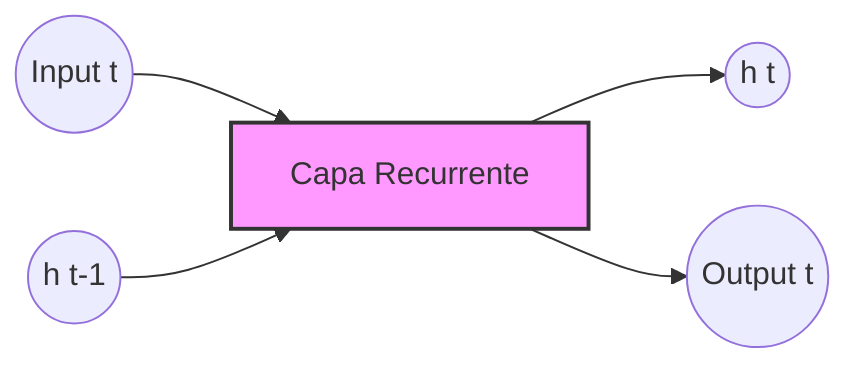
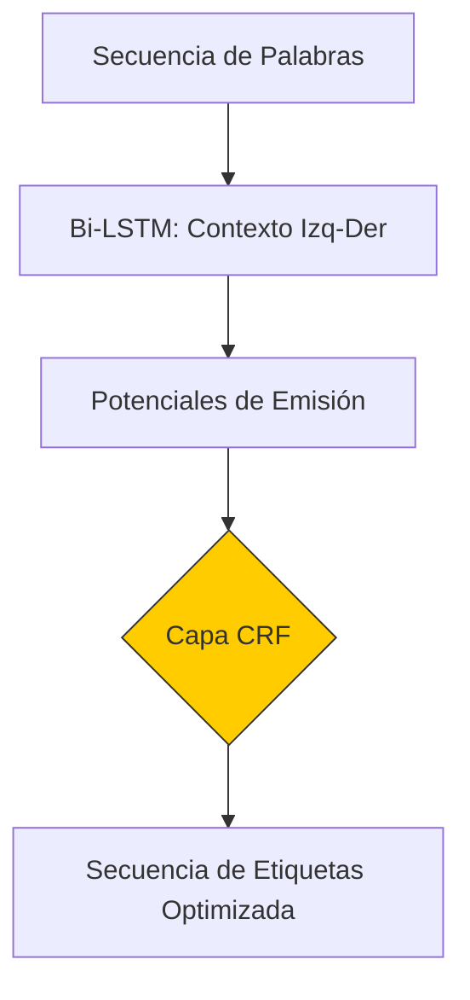
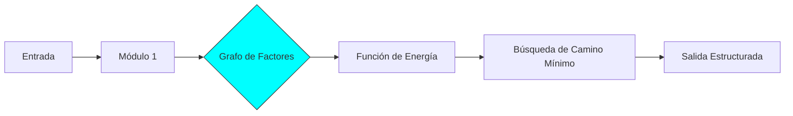
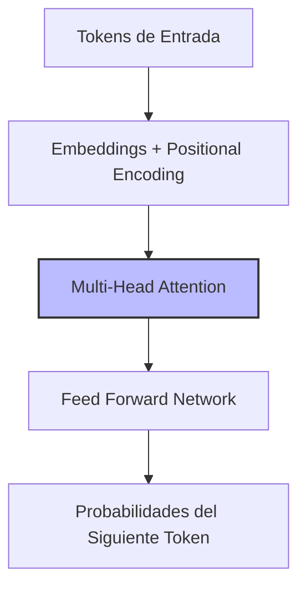

Hoy en día, el flujo estándar para interactuar con la mayoría de modelos de lenguaje grandes (LLMs) es usar `requests` con la API de OpenAI (principalmente) o servicios similares. Pero esto no es desde hace mucho (bueno, [ni los LLM](https://en.wikipedia.org/wiki/Large_language_model#History) son de hace mucho). En este post visitaremos brevísimamente cuáles eran los "estándares" antes y cómo ha ido evolucionando la forma de programar e interactuar con los modelos de lenguaje.

Aunque realmente se puede resumir en que no hubo un único estándar _per se_, pero sí una evolución que podemos dividir en varias etapas claras.

## Pre-2018: antes de los LLMs modernos

Antes de 2018 (aproximadamente), **no existía un "estándar LLM"** porque no existían LLMs como servicio. Lo habitual era trabajar con:

* **Modelos locales**: ejecutados directamente en tu máquina.
* **Librerías específicas por framework**: cada framework tenía su propia interfaz.
* **APIs directas**: llamadas a funciones en Python (NLTK, Gensim, Scikit-learn, spaCy...) o C++ (MITIE, Dlib, OpenNLP...), sin HTTP ni JSON.

O sea, se trabajaba alrededor de librerías que se centraban más en el ** _feature engineering_** manual y modelos estadísticos o predictivos de **n-gramas**, o **redes neuronales** relativamente poco pesadas computacionalmente, a diferencia de los modelos basados en **Transformers** actuales.

Por ejemplo, en la época, entre otras técnicas muy utilizadas destacan:

* [**word2vec**](https://lamyiowce.github.io/word2viz/): para manejo de embeddings de palabras, sin arquitectura de lenguaje. U otros modelos como **seq2seq** usando LSTM.
* [**GloVe**](https://www-nlp.stanford.edu/projects/glove/): aprendizaje no supervisado para obtener embeddings globales de palabras, modelos estáticos.
* [**fastText**](https://github.com/facebookresearch/fastText?tab=readme-ov-file): "library for efficient learning of word representations and sentence classification".
* **RNNs/[LSTMs](https://direct.mit.edu/neco/article-abstract/9/8/1735/6109/Long-Short-Term-Memory?redirectedFrom=fulltext)/[Bidirectional-LSTMs](https://www.researchgate.net/publication/349277064_Bidirectional_LSTM_Networks_for_Improved_Phoneme_Classification_and_Recognition)/[GRU](https://arxiv.org/abs/1406.1078)** como predecesores de los Transformers/LLMs: modelos recurrentes con arquitecturas diseñadas manualmente o, en algunos casos, combinadas con modelos probabilísticos como [CRF](https://dl.acm.org/doi/10.5555/645530.655813) o [grafos de factores](http://yann.lecun.com/exdb/publis/pdf/lecun-06.pdf) o [GTNs](http://yann.lecun.com/exdb/publis/pdf/lecun-98.pdf), que podía resultar en sistemas bastante complejos.

> [!IMPORTANT] Lejos de estar obsoletas, muchas de estas herramientas son idóneas hoy día, incluso con todos los avances "académicos" y en _benchmarks_, para ejecutar modelos de lenguaje y aplicaciones de PLN en dispositivos de muy bajas prestaciones, o en tiempo real, o cuando no se dispone de grandes conjuntos de datos.

Las interfaces típicamente eran programáticas o por [línea de comandos (CLI)](https://fasttext.cc/docs/en/cheatsheet.html#content), del estilo:

```python
# Python API directa
> model.generate(tokens)
```

```bash
# CLI
$ fairseq-generate
```

Es decir, no se usaba HTTP, JSON, servicios remotos ni nada similar (al menos en general). Todo era local y directo.

## 2018-2020: con transformers pero aún en fase de investigación

Con la llegada de [**BERT (_Bidirectional Encoder Representations from Transformers__)**](https://www.ultralytics.com/glossary/bert-bidirectional-encoder-representations-from-transformers) (2018) y [**GPT-2**](https://es.wikipedia.org/wiki/GPT-2) (2019), aparecieron los transformers modernos, pero el estándar _de facto_ seguía siendo **llamadas a librerías, no a servicios.**

Aunque antes de los Transformers de [_Attention is All You Need_](https://arxiv.org/abs/1706.03762), ya se habría [introducido la atención](https://arxiv.org/abs/1409.0473) como un parche para mejorar las LSTMs en traducción. 

Los frameworks que más se usaban era, aun así:, **Hugging Face transformers** y **PyTorch / TensorFlow**.

De nuevo con una interfaz típica:

```python
tokenizer(text)
model(input_ids)
```

La escena seguía igual:

* Los modelos corrían en tu máquina.
* Eran _stateless_ (i.e. sin estado, sin memoria de conversación).
* No había conversación ni prompts largos.
* Todo era local y bajo tu control.

## 2020-2022: primeros LLMs como servicio (OpenAI GPT-3)

Aquí ya nació el cambio importante, con el lanzamiento de [**GPT-3**](https://es.wikipedia.org/wiki/GPT-3) en 2020, cuando OpenAI introdujo el concepto de LLM como servicio.

Con esto, se empezó a adoptar el nuevo estándar propuesto: **HTTP + JSON sobre REST**, que no surgió por consenso de la industria, sino porque **OpenAI lo impuso** y así siguió haciéndolo la comunidad, desarrollador tras desarrollador.

Ahora el uso del modelo se convertía en algo abstraíble, desligado a tu máquina, del tipo:

```txt
POST /v1/completions

{
  "prompt": "Once upon a time",
  "max_tokens": 100
}
```

Pero aún no había streaming "serio", herramientas (_tools_), ni _function calling_.

Y probablemente **REST** se eligió por simplicidad o comodidad, no por ser lo mejor técnicamente. Otras opciones a HTTP/REST pudieron ser gRPC (_Google Remote Procedure Call_), WebSockets o Message queues (Kafka, RabbitMQ...).

## 2023-2024: entran las "requests"

Aquí ya se consolida lo que hoy día podríamos llamar "el flujo de requests". Comúnmente mezclándolos con _frameworks_ de orquestación como LangChain/LangGraph, LlamaIndex..., _backends_ como vLLM, proxies como LiteLLM, etc.

Es un estándar moderno que tiene múltiples características que lo hacen ventajoso respecto a los anteriores:

* **HTTP**: protocolo universal.
* **JSON**: formato de datos estándar.
* **Stateless**: cada petición es independiente.
* **Autenticación por token**: Uso de API keys para uso seguro de agentes como servicios.
* **Streaming por SSE**: _Server-Sent Events_ para respuestas en tiempo real (ir mandándolas de la que se va pensando/generando, no esperar a finalizar...).

Por ejemplo:

```txt
POST /v1/chat/completions
```

Y probablemente acogió tanto éxito porque funciona desde cualquier lenguaje (mayor) y desde `curl`, también detrás de proxies, es fácil de versionar y es un protocolo que parece universal.

### Endpoints comunes de OpenAI `/v1/`

* **`/v1/completions`** (Legacy): para modelos antiguos no ajustados para chat (como modelos base GPT-3) para completar prompts de texto crudo.
* **`/v1/chat/completions`**: el estándar para IA conversacional moderna, manejando mensajes estructurados (_system_, _user_, _assistant_) y reteniendo contexto.
* **`/v1/responses`**: la última unificación, diseñada para inputs multimodales (texto/imágenes) y características avanzadas de agentes como _tool use_ y _reasoning_.

> [!TIP] 
> ¿Y por qué el `/v1/` en los endpoints?
>
> Parece arbitrario, pero el `/v1/` en endpoints como `/v1/completions` simplemente significa **version 1**, indicando la primera iteración mayor de ese diseño de API específico.

## ¿Por qué no hubo un estándar formal, tipo SQL?

Bien es cierto que el campo evolucionó tan rápido (cada mes traía cambios o avances que incluían el _hype_ de parecer fundamentales) que quizá por eso se estandarizó esta solución y no se desarrollaron otras a gran escala. Así que cada empreas tiró por su lado, y nadie se preocupó en mejorar un estándar que ya pareció muy aceptable, sino continuar la "carrera" de la IA por el lado que mejor pudiera, e.g. OpenAI → chat, Anthropic → IA constitucional, Google → herramientas, Meta → inferencia local, Microsoft → nube... Cabe la pena mencionar los [MCP de Anthropic](https://modelcontextprotocol.io/docs/getting-started/intro), intento no fallido de estandarizar la adición de plugins a los agentes conversacionales.

## Pequeña tabla comparativa...

...del "estándar" de cada época: 

| Época | Interfaz dominante |
|-------|-------------------|
| Pre-2018 | API local (Python/C++) |
| 2018-2020 | HuggingFace / PyTorch |
| 2020-2022 | REST `/completions` |
| 2023-hoy | REST `/chat` (+ _tools_ + _streaming_...) |

> [!NOTE]
> _Stateless_ vs _stateful_.
>
> **Stateless** significa que una aplicación trata cada petición de forma independiente, sin recordar interacciones pasadas (sin "memoria"), haciéndola altamente escalable y tolerante a fallos (e.g. APIs REST, servidores web). La desventaja es que el desarrollador tiene que ocuparse de enviar todo el historial en cada petición si quiere usar chat con memoria, lo que aumenta drásticamente el uso de tokens. 
> **Stateful** significa que la aplicación retiene información (estado) de peticiones previas, requiriendo almacenamiento en el servidor para contexto, llevando a gestión de sesión más fácil pero escalado complejo (e.g. bases de datos, servidores de correo, banca).
>
> Los LLMs modernos como servicio son típicamente **stateless** en el nivel de API, aunque podrían mantener contexto dentro de una conversación mediante el historial de mensajes (siendo la manera correcta de pasar el historial mediante las _request_ exactas, i.e. especificando _assistant_, _user_ y resto de etiquetas...).

## Bonus: Flujo de procesamiento de los modelos en NLP

A continuación se muestran unos diagramas muy minimalistas que ilustran las diferentes maneras de las que los distintos modelos de procesamiento de lenguaje manipulan los datos, a un alto nivel:

### 1. RNN / LSTM (Arquitectura Recurrente)
El concepto clave aquí es el **bucle de retroalimentación** y el estado oculto ($$h_t$$) que viaja a través del tiempo.



### 2. Bi-LSTM + CRF (Etiquetado de Secuencias)
Este era el estándar para NER (_Named Entity Recognition_) ("Alejandro escribe este post" => Alejandro = `PERSON`, etc.). La Bi-LSTM extrae contexto en ambas direcciones y el CRF asegura que la secuencia de etiquetas final sea "legal" (tenga coherencia global).



> [!NOTE]
> El Problema del **Sesgo de Etiqueta (_Label Bias_)**
>
> ¿Por qué era necesario el CRF?
>
> Los modelos que deciden la etiqueta de cada palabra de forma independiente (como una RNN simple con Softmax) sufren de "visión de túnel". Un **CRF** soluciona esto al no mirar solo la palabra actual, sino la transición entre etiquetas. Por ejemplo, en una tarea de nombres propios, el CRF "sabe" que después de una etiqueta `B-PER` (Inicio de persona) es muy probable que venga un `I-PER` (Continuación de persona) y nunca un `B-LOC` (Inicio de lugar) a mitad de un apellido. Esto optimiza la **secuencia global** mediante la minimización de una función de energía, un concepto que **LeCun** defendió en sus *Energy-Based Models*. 
>
> Este problema se vuelve irrelevante con los modelos de hoy día, desde luego, pues sustituyendo la optimización global de etiquetas (CRF) por una atención global de entrada básicamente, pasamos de "corregir los errores al final" a "entender tan bien el contexto que no cometemos el error desde el principio".

### 3. Factor Graphs / GTN
Basado en el [paper de 1998](http://yann.lecun.com/exdb/publis/pdf/lecun-98.pdf) de Yann LeCun. Es un flujo donde diferentes módulos (como una CNN para caracteres o **ConvNet**) se combinan mediante una función de energía para encontrar/optimizar el camino de menor coste.



### 4. Transformers (Atención Paralela)
A diferencia de las RNNs, aquí no hay flechas que vuelvan atrás; todo se procesa en paralelo mediante la matriz de atención.



## Referencias

* [OpenAI API Documentation](https://platform.openai.com/docs/api-reference)
* [Stack Overflow: OpenAI v1 completions vs v1 chat completions](https://stackoverflow.com/questions/76192496/openai-v1-completions-vs-v1-chat-completions-end-points)
* [Hugging Face Transformers](https://huggingface.co/docs/transformers)
* [Neural Networks: Zero to Hero](https://www.youtube.com/playlist?list=PLAqhIrjkxbuWI23v9cThsA9GvCAUhRvKZ)