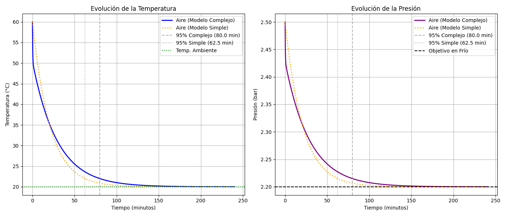

## ¿Por qué hay más presión cuando se calientan las ruedas?

Es bien sabido (véase [la susodicha pregunta](https://practicatest.com/preguntas/qB/la-presion-de-los-neumaticos-es-correcta-despues-de-un-viaje-se-da-cuenta-de-que-han-aumentado-la-presion-que-debe-de-hacer/ZZyXoA===) de la que me surgió esta cuestión) que al aumentar la temperatura de las ruedas, tras un buen trayecto en coche (por ejemplo), a causa de la fricción entre estas y el suelo, la presión de los neumáticos (i.e. la presión del aire en su interior) aumenta y, por tanto, aumenta el riesgo de reventón, aparecen deformaciones y es recomendable dejar enfriar los neumáticos un tiempo prudencial. 

Pero, _¿por qué pasa esto?_

Este fenómeno se explica mediante principios termodinámicos, el comportamiento de los gases y las propiedades de los materiales. Revisemos algo de teoría física fundamental.

### Ley de los gases ideales: relación presión-temperatura

La ley de los gases ideales nos dice:

$$
P V = n R T,
$$

donde $$P$$ es la presión del gas, $$V$$ es el volumen que ocupa en su continente (e.g. el del neumático), $$n$$ son los moles de gas (aquí aire) en el neumático, $$R$$ es la constante universal de los gases y $$T$$ es la temperatura absoluta del gas (en Kelvin; desde el [cero absoluto](https://es.wikipedia.org/wiki/Cero_absoluto)).

> [!WARNING]
> Un **gas ideal** es un modelo teórico de partículas sin volumen ni atracción entre sí. Aunque en la realidad no existen, los gases nobles (como el helio) y el aire se comportan como tales en condiciones normales de presión y temperatura. El aire deja de serlo (incluso bajo asunciones débiles) solo bajo frío o presión extremos.
> Por eso, aunque el aire no es un gas ideal perfecto, a las [presiones típicas de los neumáticos](https://www.oponeo.es/herramientas/presion-neumaticos?srsltid=AfmBOoqjxPaim2s-_QEo5JbNUNM285R05hqBRcsbxhHglhKduTuicwrs) (30–35 psi, es decir 2,0–2,4 bar) y temperaturas moderadas, su comportamiento se aproxima al modelo ideal.

El proceso físico experimentado es el siguiente: al [rodar](https://www.prontubeam.com/articulos/2025-09-26-Explicacion-fundamentos-teoria-rodadura), la fricción entre el neumático y el pavimento, junto a la deformación cíclica (a períodos regulares) de la goma, genera calor ($$Q$$). Esto eleva la temperatura del aire dentro del neumático ($$T \uparrow$$). Si suponemos que el volumen ($$V$$) del neumático no varía significativamente (debido a su rigidez estructural y a que el continente es estanco), un aumento de $$T$$ implica un aumento proporcional de $$P$$, ya que $$n$$ y $$R$$ son constantes. Es decir, la presión aumenta de manera natural.

Por ejemplo, si la temperatura aumenta de 20 °C (293 K) a 50 °C (323 K), la presión se incrementa en un factor de $$323/293 \approx 1{,}1$$, es decir, un 10 % (suponiendo volumen constante).

Pero dejándolo enfriar, $$P$$ volvería a valores inferiores (camino inverso) y al medir en frío se comprobaría que que vuelve a la normalidad.

> [!NOTE]
> Algunos neumáticos se pueden [hinchar con nitrógeno](https://www.continental-neumaticos.es/b2c/tire-knowledge/nitrogen-in-tires/), lo que aumenta la vida útil y minimiza la variación de presión en comparación con el aire, pues el nitrógeno tiene menor permeabilidad (las moléculas son más grandes y por tanto escapan más lentamente a través del caucho) y es menos susceptible a cambios de humedad y oxidación de la llanta, ya que es un gas seco (i.e. que no contiene moléculas de H2O).
> Con respecto al [tamaño molecular](https://www.youtube.com/watch?v=7z4E1Vzoeu4), el nitrógeno (N2) tiene moléculas de aprox. 300 picómetros y el oxígeno (O2) de aprox. 292 picómetros.

### Restricciones materiales: elasticidad del caucho

Hay un matiz en cuanto a la expansión térmica del [neumático](https://www.oponeo.es/blog/temperatura-de-los-neumaticos): los materiales del neumático (caucho, acero, fibras...) se [dilatan con el calor](https://www.grainingf1.com/como-funciona-el-caucho-en-los-neumaticos/), aumentando ligeramente $$V$$. Sin embargo, la estructura rígida del neumático limita esta expansión, haciendo que el efecto dominante siga siendo el aumento de $$P$$ por $$T \uparrow$$.

El caucho es un material viscoelástico:

- Al calentarse, se vuelve más flexible o suave, pero su capacidad para mantener la forma bajo presión evita una expansión significativa.

- La energía térmica también aumenta la agitación de las moléculas de aire, incrementando la frecuencia de colisiones con las paredes del neumático ($$P \uparrow$$).

## Proceso de enfriamiento

_¿Y cuánto tardará en volver a presión normal?_ Esto depende de varios factores:

1. Velocidad de enfriamiento y presión inicial del aire interno (nos guía la termodinámica).
2. Propiedades térmicas del material del neumático (nos guía la ciencia de materiales).
3. Condiciones ambientales (o de contorno; temperatura exterior, viento, etc.).

### Enfriamiento interno

El aire dentro del neumático pierde calor siguiendo un decaimiento exponencial, modelado aproximadamente por la [ley del enfriamiento de Newton](http://www.sc.ehu.es/sbweb/fisica/estadistica/otros/enfriamiento/enfriamiento.htm) como:

$$
T(t) = T_\mathrm{ambiente} + (T_\mathrm{inicial} - T_\mathrm{ambiente})\, e^{-k t},
$$

donde $$T(t)$$ es la temperatura del aire en el tiempo $$t$$, $$k$$ es la constante de enfriamiento (depende del material y el entorno) y $$t$$ es el tiempo transcurrido.

La presión, bajo el supuesto de volumen aproximadamente constante, se ajusta según la [ley de Gay-Lussac](https://www.educaplus.org/gases/ley_gaylussac.html) ($$P \propto T$$ a $$V$$ cte.), por lo que:

$$
P(t) = P_\mathrm{frío}\,\frac{T(t)}{T_\mathrm{frío}}.
$$

> [!NOTE]
> La ley de Gay-Lussac establece que la presión de un volumen fijo de gas es directamente proporcional a su temperatura (en Kelvin).

Esto constituye una **solución simplificada del modelo de enfriamiento del neumático**, que asume que la masa del neumático es mucho mayor que la del aire y que la temperatura del neumático cambia lentamente comparada con la del aire.

### Conductividad térmica del material

La [conductividad térmica](https://es.wikipedia.org/wiki/Conductividad_t%C3%A9rmica) es un factor que afecta al tiempo de enfriamiento del neumático. Se refiere a la capacidad intrínseca de un material para conducir calor; cuanto menor conductividad tenga, más aislante es y cuanto mayor conductividad tenga, mejor transmite el calor. El caucho, como la mayoría de los [materiales no metálicos](https://hyperphysics.gsu.edu/hbasees/Tables/thrcn.html), tiene una conductividad térmica [bastante baja](http://cte-web.iccl.es/materiales.php?a=18) (aprox. 0,1–0,2 W/(m·K)), lo que lo hace mal conductor (y por eso los disipadores electrónicos son metálicos).

> [!NOTE]
> ¿Y entonces por qué los termos son de metal, si un material no metálico evitaría mejor el "escape" del calor? Pues es que no son de metal enteramente: suelen tener pared interna metálica y externa, pero estando separadas por un vacío que reduce conducción y convección; incluso a veces hay un cristal interior para aportar la deseada baja conductividad. El metal básicamente aporta robustez.

Así, la transferencia de calor desde el aire interno al exterior se ve ralentizada usando un neumático como material continente. Los refuerzos metálicos pueden ayudar a disipar calor, pero solo parcialmente.

### Condiciones ambientales

Aunque secundarias, son condiciones de contorno que pueden afectar al proceso. Por ejemplo, una temperatura exterior baja (e.g. 10 °C) aceleraría el enfriamiento (mayor diferencia térmica o gradiente). El viento aumentaría la convección y reduciría el tiempo de enfriamiento. Y la exposición al sol o al asfalto caliente lo ralentizaría.

## Modelo termodinámico

Con todo esto, nuestro objetivo es estimar cuánto tardará el neumático en enfriarse, digamos, hasta temperatura ambiente, i.e.: predecir el tiempo que tarda en volver a su presión "en frío".

Modelamos el neumático como dos subsistemas acoplados:

1. Aire interno (masa $$m_\mathrm{aire}$$, calor específico $$c_\mathrm{aire}$$).
2. Estructura del neumático (masa $$m_\mathrm{neum}$$, calor específico $$c_\mathrm{neum}$$).

> [!NOTE]
> [Calor específico](https://areacooling.com/es/glosario-de-terminos-hvac/calor-especifico): cantidad de calor para elevar 1 kg en un grado Kelvin. Si requiere mucha energía para calentar, el calor específico es alto.

El [calor fluye](https://daniilopez10.wordpress.com/segundo-corte/conduccion-conveccion-y-redaccion/) desde el aire interior hacia la estructura del neumático y luego al ambiente.

### Conducción a través de la goma

El flujo de calor $$\dot{Q}_\mathrm{cond}$$ a través de la pared del neumático (espesor $$L$$, área $$A$$, conductividad $$k$$) está dado por la [ley de Fourier](http://www.sc.ehu.es/sbweb/fisica_/transporte/cond_calor/conduccion/conduccion.html):

$$
\dot{Q}_\mathrm{cond} = \frac{k A}{L}\,(T_\mathrm{aire} - T_\mathrm{neum}).
$$

Balance para el aire (pérdida de calor por conducción igual a disminución de energía interna):

$$
\dot{Q}_\mathrm{cond} = - m_\mathrm{aire}\, c_\mathrm{aire}\,\frac{\mathrm{d}T_\mathrm{aire}}{\mathrm{d}t}.
$$

Combinando con Fourier:

$$
\frac{\mathrm{d}T_\mathrm{aire}}{\mathrm{d}t} = -\frac{k A}{m_\mathrm{aire}\, c_\mathrm{aire}\, L}\,(T_\mathrm{aire} - T_\mathrm{neum}) \quad \text{(ecuación 1).}
$$

El signo negativo indica que $$T_\mathrm{aire}$$ disminuye con el tiempo si $$T_\mathrm{aire} > T_\mathrm{neum}$$.

### Convección en la superficie exterior

El calor disipado al ambiente $$\dot{Q}_\mathrm{conv}$$ sigue la ley de Newton:

$$
\dot{Q}_\mathrm{conv} = h\, A\,(T_\mathrm{neum} - T_\mathrm{ambiente}),
$$

donde $$h$$ es el coeficiente de convección (depende del viento, geometría, etc.).

Balance para la estructura del neumático: recibe calor del aire ($$\dot{Q}_\mathrm{cond}$$) y lo pierde por convección ($$\dot{Q}_\mathrm{conv}$$):

$$
\dot{Q}_\mathrm{cond} - \dot{Q}_\mathrm{conv} = m_\mathrm{neum}\, c_\mathrm{neum}\,\frac{\mathrm{d}T_\mathrm{neum}}{\mathrm{d}t}.
$$

Sustituyendo $$\dot{Q}_\mathrm{cond}$$ y $$\dot{Q}_\mathrm{conv}$$:

$$
\frac{\mathrm{d}T_\mathrm{neum}}{\mathrm{d}t} = \frac{k A}{m_\mathrm{neum}\, c_\mathrm{neum}\, L}\,(T_\mathrm{aire} - T_\mathrm{neum}) - \frac{h A}{m_\mathrm{neum}\, c_\mathrm{neum}}\,(T_\mathrm{neum} - T_\mathrm{ambiente}) \quad \text{(ecuación 2).}
$$

### Sistema completo

Sin simplificaciones adicionales y considerando todas las interacciones térmicas y masas, se obtiene un sistema acoplado de ecuaciones diferenciales para $$T_\mathrm{aire}(t)$$ y $$T_\mathrm{neum}(t)$$.

Definiciones útiles:

$$
\alpha = \frac{k A}{m_\mathrm{aire}\, c_\mathrm{aire}\, L}, \quad
\beta = \frac{k A}{m_\mathrm{neum}\, c_\mathrm{neum}\, L}, \quad
\gamma = \frac{h A}{m_\mathrm{neum}\, c_\mathrm{neum}}.
$$

Una forma linealizada del acoplamiento puede escribirse como:

$$
\frac{\mathrm{d}}{\mathrm{d}t}
\begin{pmatrix} T_\mathrm{aire} \\ T_\mathrm{neum} \end{pmatrix}
=
\begin{pmatrix} -\alpha & \alpha \\ \beta & -(\beta + \gamma) \end{pmatrix}
\begin{pmatrix} T_\mathrm{aire} \\ T_\mathrm{neum} \end{pmatrix}
+
\begin{pmatrix} 0 \\ \gamma\, T_\mathrm{ambiente} \end{pmatrix}.
$$

(la matriz exacta depende de cómo se linealicen los acoplamientos; lo anterior es un esquema típico de dos nodos térmicos.)

## Simulación

Podemos simular este modelo térmico para ver qué pasaría si dejáramos una rueda a **60 °C** enfriarse al **ambiente** (supuesto **20 °C** en el script), **quieta**, durante **2 horas** de ventana de cálculo (el código recorre más tiempo en la malla temporal).

El código usa **SciPy** (`odeint`) y **NumPy**; compara un **modelo acoplado de dos nodos** (aire + neumático) con un **modelo simple de Newton** (una sola exponencial). La **presión** se obtiene de la **ley de Gay-Lussac** a volumen casi constante:

```py
import numpy as np
from scipy.integrate import odeint
import matplotlib.pyplot as plt

# --- PARÁMETROS COMUNES ---
T_amb = 20 + 273.15      # Temperatura ambiente (20 °C en Kelvin)
T_inicial_aire = 60 + 273.15 # Neumático caliente tras viaje (60 °C)
T_inicial_neum = 50 + 273.15 # Goma caliente (50 °C)
P_frio_target = 2.2      # Presión recomendada en frío (bar)

# Tiempo de simulación
t = np.linspace(0, 4 * 3600, 1000) # horas en segundos

# --- 1. MODELO COMPLEJO (DOS NODOS) ---
A = 0.6                  # Área de contacto térmica (m^2)
L = 0.02                 # Espesor del caucho (2 cm)
k_caucho = 0.15          # Conductividad térmica (W/m·K)
h_conv = 10              # Coeficiente convección aire quieto (W/m^2·K)
m_aire = 0.1             # Masa de aire estimada (kg)
c_aire = 718             # Calor específico aire a V cte (J/kg·K)
m_neum = 10.0            # Masa del neumático (kg)
c_neum = 1050            # Calor específico del caucho (J/kg·K)

# Coeficientes del sistema de EDOs
alpha = (k_caucho * A) / (m_aire * c_aire * L)
beta = (k_caucho * A) / (m_neum * c_neum * L)
gamma = (h_conv * A) / (m_neum * c_neum)

# --- MODELO MATEMÁTICO ---
def modelo_termico(y, t):
    T_a, T_n = y
    # dT_aire/dt = -alpha * (T_aire - T_neum)
    dTa_dt = -alpha * (T_a - T_n)
    # dT_neum/dt = beta * (T_aire - T_neum) - gamma * (T_neum - T_ambiente)
    dTn_dt = beta * (T_a - T_n) - gamma * (T_n - T_amb)
    return [dTa_dt, dTn_dt]

# Resolución
sol = odeint(modelo_termico, [T_inicial_aire, T_inicial_neum], t)
T_aire_complejo = sol[:, 0]

# Cálculo de la Presión (Ley de Gay-Lussac: P1/T1 = P2/T2)
# P(t) = P_frio * (T_aire(t) / T_ambiente)
P_compleja = P_frio_target * (T_aire_complejo / T_amb)

# --- 2. MODELO SIMPLE (NEWTON) ---
# Usamos un k_newton ajustado para que la pendiente inicial sea similar
k_newton = 0.0008 
T_newton = T_amb + (T_inicial_aire - T_amb) * np.exp(-k_newton * t)
P_newton = P_frio_target * (T_newton / T_amb)

# --- CÁLCULO DEL 95% DEL ENFRIAMIENTO ---
# El régimen permanente es T_amb. El 95% de la caída es: T_inicial - 0.95*(T_inicial - T_amb)
umbral_T = T_inicial_aire - 0.95 * (T_inicial_aire - T_amb)

# Encontrar el índice donde se cruza el umbral
idx_complejo = np.where(T_aire_complejo <= umbral_T)[0][0]
idx_newton = np.where(T_newton <= umbral_T)[0][0]

t_95_complejo = t[idx_complejo] / 60  # en minutos
t_95_newton = t[idx_newton] / 60      # en minutos

# --- VISUALIZACIÓN UNIFICADA ---
plt.figure(figsize=(14, 6))

# Gráfica de Temperaturas
plt.subplot(1, 2, 1)
plt.plot(t/60, T_aire_complejo - 273.15, 'b-', label='Aire (Modelo Complejo)', linewidth=2)
plt.plot(t/60, T_newton - 273.15, 'orange', linestyle='dotted', label='Aire (Modelo Simple)', linewidth=2)
plt.axvline(x=t_95_complejo, color='gray', linestyle='--', alpha=0.6, label=f'95% Complejo ({t_95_complejo:.1f} min)')
plt.axvline(x=t_95_newton, color='gray', linestyle=':', alpha=0.6, label=f'95% Simple ({t_95_newton:.1f} min)')
plt.axhline(y=T_amb-273.15, color='green', linestyle=':', label='Temp. Ambiente')
plt.title('Evolución de la Temperatura')
plt.xlabel('Tiempo (minutos)')
plt.ylabel('Temperatura (°C)')
plt.legend()
plt.grid(True)

# Gráfica de Presión
plt.subplot(1, 2, 2)
plt.plot(t/60, P_compleja, 'purple', label='Aire (Modelo Complejo)', linewidth=2)
plt.plot(t/60, P_newton, 'orange', linestyle='dotted', label='Aire (Modelo Simple)', linewidth=2)
plt.axvline(x=t_95_complejo, color='gray', linestyle='--', alpha=0.6, label=f'95% Complejo ({t_95_complejo:.1f} min)')
plt.axvline(x=t_95_newton, color='gray', linestyle=':', alpha=0.6, label=f'95% Simple ({t_95_newton:.1f} min)')
plt.axhline(y=P_frio_target, color='black', linestyle='--', label='Objetivo en Frío')
plt.title('Evolución de la Presión')
plt.xlabel('Tiempo (minutos)')
plt.ylabel('Presión (bar)')
plt.legend()
plt.grid(True)

plt.tight_layout()
plt.savefig('simulation_wheel_all.png')
```

Y el resultado se ve gráficamente:



En el **modelo de Newton** (una sola exponencial para el aire), el enfriamiento parece **uniforme**. El criterio del **95 %** del salto térmico hasta **temperatura ambiente** sugiere del orden de **~62,5 min** para estar cerca del objetivo de **~2,2 bar** en frío (según el umbral definido en el script).

En el **modelo acoplado** (**dos nodos**: aire + neumático), la curva del aire se **aplana** al cabo de unos minutos porque la **goma** (y la estructura) siguen **calientes** y limitan cuánto puede bajar el aire. Eso alarga el tiempo respecto al modelo simple en **~28 %** (en este ejemplo: del orden de **~80 min** frente a **~62,5 min** para el mismo criterio del **95 %**).

En el modelo acoplado, el **aire interno** pierde temperatura rápido al inicio, pero el ritmo lo frena la **goma** y el **acero** del neumático: actúan como **reserva térmica** o **suelo térmico** (el aire no se enfría más rápido de lo que el contacto con esa masa caliente permite).

El sistema tarda en acercarse al **equilibrio** con el ambiente; damos por bueno un estado **cercano al régimen permanente** cuando se alcanza el **95 %** del camino hacia **temperatura ambiente**, con **convección** moderada (aire quieto en el script).

Estos resultados muestran que **medir la presión en caliente** tras un viaje da una **lectura alta** respecto al valor **en frío**. Si se **purga aire** para bajar a **2,2 bar** caliente, al enfriarse la **presión** puede quedar por debajo de lo seguro (p. ej. **~1,9 bar**), empeorando **consumo** (**resistencia a la rodadura**, mayor **área de contacto**) y **riesgo de hidroplaneo**.

La **baja conductividad térmica del caucho** explica en buena parte que el enfriamiento no sea instantáneo: es un **aislante** que retiene calor.

El **modelo de dos nodos** es más fiel que el **Newton** simple porque el **aire** no intercambia calor solo con el **exterior**, sino con la **estructura** del neumático, que tiene **inercia térmica** propia.

Si usáramos **solo Newton**, **ignoraríamos la masa** del neumático y el hecho de que el calor atraviesa el **caucho**: sería como una **capa invisible** sin acumulación de calor.

En **Newton** la temperatura cae como una **única exponencial**; no aparece el **freno** que sí da la **curva acoplada** cuando la estructura sigue caliente. El modelo simple **no modela** que entre el aire y el ambiente frío hay **varios kilogramos** de material caliente.

Por tanto, el **tiempo de espera** calculado solo con **Newton** puede **subestimar** lo que hace falta; el **modelo completo** incorpora la **geometría térmica** relevante del caso.

Si nos quisiérmos poner quisquillosos, también podríamos añadir al modelo: efecto de **radiacón** (a altas temperaturas, el neumático irradia como cuerpo negro una cantidad no despreciable de calor hacia el suelo y el entorno, no solo por convección), de la **humedad** del aire real del neumático, **convección natural Vs. forzada** (aumentaría el valor de $$h$$, e.g. a 20-30 W/(m^2·K) si hay viento) o incluso considerar que el interior de la goma está más caliente que el exterior (incorporación de la **ecuación de calor en derivadas parciales** para añadir dependencia espacial o análisis del **número de Biot** para estudiar el comportamiento de la transferencia de calor).

## Referencias

- [Transmisión de calor. Apuntes](https://publicaciones.uniovi.es/catalogo/publicaciones/-/asset_publisher/pW5r/content/transmision-de-calor-apuntes-1;jsessionid=F8940E5968C12E3FCD67A7162F62F581?redirect=%2Fcatalogo%2Fpublicaciones%3Fp_p_id%3D101_INSTANCE_pW5r%26p_p_lifecycle%3D0%26p_p_state%3Dnormal%26p_p_mode%3Dview%26p_p_col_id%3Dcolumn-1%26p_p_col_pos%3D1%26p_p_col_count%3D5%26_101_INSTANCE_pW5r_c1nntag%3Dpublicacion%252C%26p_r_p_564233524_tag%3D%26_101_INSTANCE_pW5r_delta%3D12%26_101_INSTANCE_pW5r_keywords%3D%26_101_INSTANCE_pW5r_advancedSearch%3Dfalse%26_101_INSTANCE_pW5r_andOperator%3Dtrue%26cur%3D37) 