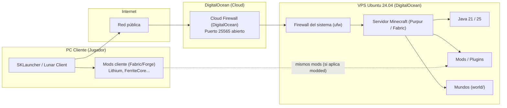
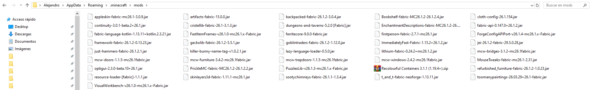
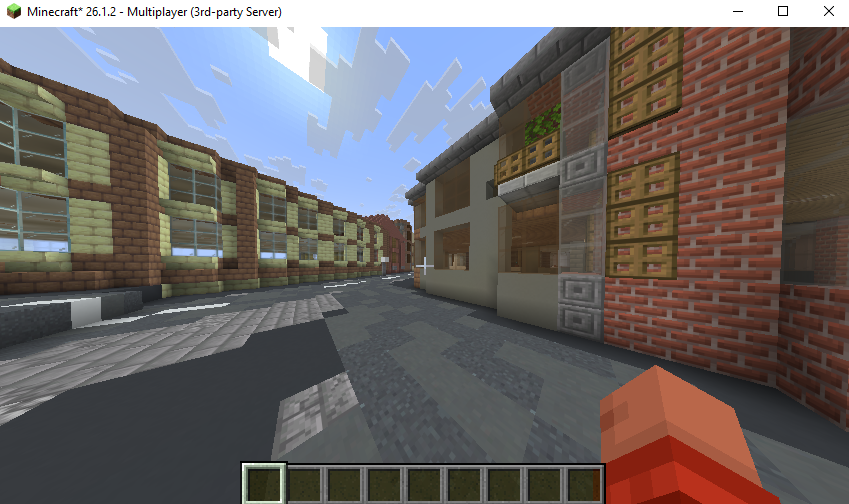

Antes de nada: en el **último apartado** relataré los pasos que di personalmente para levantar mi servidor... el resto es información de contexto.

Este post resume opciones, requisitos, diferencias entre posibles arquitecturas, software recomendado y otros aspectos para levantar un server de Minecraft propio.

## Introducción

Me interesaba aprovechar mi **Raspberry Pi** como servidor de minecraft, pero no sé si sería una opción suficientemente potente. Un **servidor de Minecraft Java** en SBCs de este tipo he visto que suele quedarse corto para experiencias fluidas en versiones recientes, pues el motor gráfico depende mucho del **rendimiento de un solo núcleo** de la CPU y de RAM acotada. Así que conviene mirar **hosting gratuito**, **un PC viejo** u **hosting de pago** para una experiencia cómoda con muchods mods o jugadores.

_¿Qué hosting gratuito (de terceros) hay?:_

Varias plataformas ofrecen instancias gratuitas pensadas para partidas casuales.

| Plataforma | Idea |
|------------|------------|
| **Aternos** | Muy popular; mods y plugins con asistente web. Suele exigir **encender el servidor** desde la web; si queda vacío un rato, **apagar** para ahorrar recursos. |
| **ScalaCube** | Plan gratuito con **un** servidor y **ranuras** limitadas. |
| **Minehut** | Similar a Aternos; configuración rápida y enfoque en comunidades pequeñas. |

La **ventaja** es que es gratis (?) y no se mantiene una máquina consumiendo energía eléctrica en casa, pero el claro **inconveniente** es la falta de flexibilidad, el bajo rendimiento y disponibilidad acotada, además de colas o apagados automáticos habituales.

_¿Y con un servidor en nuestro propio PC (self-hosted)?:_

Se puede ejecutar el servidor **en el mismo ordenador** desde donde se juega y **cerrarlo** cuando no se use. Básicamente hay que tener presentes varios conceptos:

- **Software**: está contenido en archivo `.jar` (comprimido de código fuente Java) oficial o forks **optimizados** (e.g. **Paper** o **Purpur**), no solo el vanilla, más plugins si se quiere menos lag.
- **RAM**: si se juegas y sirve a la vez, conviene **16 GB** o más en el equipo; al servidor suele asignársele del orden de **4–6 GB** según mods y jugadores.
- **CPU**: importa la **velocidad por núcleo**; muchos núcleos lentos no compensan un solo núcleo rápido para el hilo principal del servidor.
- **Amigos/clientes fuera de la LAN**: hace falta **reenviar un puerto** (típicamente **25565**) en el router, o usar **túneles** (**Tailscale**, **Cloudflare Tunnel**, **ngrok**, etc.) o VPN si no se quiere tocar el router.

Y naturalmente se puede usar un host distinto para alojar servidor y entrar como cliente; de hecho, la opción que elegí finalmente es aprovechar una VPS que tenía para otros menesteres y construir un servidor ligero en ella. Ver más adelante.

_¿Qué software usar para el servidor?:_

- **Paper** (o **Purpur**, basado en Paper): estándar para Java con **plugins**; muchas optimizaciones respecto al "jar" vanilla.
- **Vanilla oficial**: válido para pruebas; en hardware limitado o con muchos jugadores suele ir peor que Paper.
- **Versiones del juego**: para **máximo rendimiento** en PCs modestos suelen citarse **1.12.2** o **1.16.5** (ecosistema de mods/plugins maduro y menor carga que las últimas). Para **contenido nuevo**, la línea **1.21.x**, **26.1.2** o la última estable si el hardware aguanta.

**Forge, Fabric y mods:**

- **Plugins** (vía Bukkit/Paper): cambian reglas del servidor sin que el cliente lleve mods (salvo packs de recursos); e.g. protecciones, `/home`...
- **Forge**: cargador clásico de **mods** pesados; servidor y **todos** los clientes deben llevar los **mismos** mods y versiones.
- **Fabric**: cargador más ligero, muy usado en mods modernos y packs técnicos ligeros; mismas condiciones que Forge.

Si simplemente se quiere usar **vanilla con plugins**, no se necesita Forge.

_Pasos mínimos (esquema):_

1. Instalar una **JDK** adecuada a la versión del servidor.
2. Descargar el **.jar** (e.g. PaperMC o PurpurMC o vanilla) y colocarlo en una carpeta dedicada.
3. Arrancar una vez, aceptar **EULA** editando `eula.txt` (`eula=true`).
4. Ajustar `server.properties` (puerto, `online-mode`, dificultad, etc.).
5. Si hay jugadores remotos: **NAT** en el router (**25565/TCP**) o **túnel/VPN**.
6. Opcional: **firewall** en el SO (**ufw** en Linux) permitiendo solo lo necesario; en no premium (offline), puede incluirse **plugin de login**.

_¿Y dónde alojarlo?:_

La **velocidad** aquí importa; el sitio del servidor marca el límite de **TPS** (ticks por segundo), la latencia y capacidad de chunks.

- **CPU**: Minecraft Java se apoya fundamentalmente en **un núcleo de procesador rápido**; un PC de sobremesa suele ganar a una **Raspberry Pi** en mundos con redstone, muchos mobs o generación de terreno simultánea.
- **RAM**: pocos GB se agotan rápido con mods o muchos jugadores explorando.
- **Disco**: en una Pi, una **microSD** lenta es un cuello de botella; un **SSD** (USB en Pi o NVMe en PC) ayuda mucho a guardar chunks.

Una **Pi** puede valer para **pocos amigos** y mundo **ligero** con **Paper** y almacenamiento razonable, pero para **muchas mods** o muchos jugadores, un **PC potente** o hosting dedicado rinde más.

_¿Sobre la seguridad?:_

- **No abrir más puertos** de los necesarios; preferir **VPN** o **túnel** si no se quiere IP pública expuesta.
- **No premium**: **AuthMe** (o similar) y contraseñas.
- **Copias de seguridad** del mundo (`world`) antes de actualizar versiones o modpacks.

## **DIY**: mi solución

Relataré la solución que elegí para levantar mi server personal.

Queremos que sea un servidor muy ligero, pues irá en una VPS de Ubuntu 24.04 (LTS) con 4 GB de RAM SSD de Digital Ocean. Así que usaremos [Purpur](https://purpurmc.org/) (una versión muy optimizada de Minecraft).

> [!NOTE]
> La configuración mínima para un servidor de Minecraft es ~2 GB de RAM (recomendado 4–6 GB para estabilidad en pequeñas comunidades y 8–16 GB con mods o alta carga de jugadores), al menos 10–20 GB de almacenamiento para Vanilla (≥ 50 GB si hay mods, plugins o backups frecuentes) y almacenamiento SSD preferiblemente NVMe frente a SATA debido a su menor latencia y mayor rendimiento en carga de chunks y operaciones de E/S del mundo.

Actualizamos el sistema:

```bash
sudo apt update && sudo apt full-upgrade -y
```

Instalamos Java 21 (para versiones de Purpur modernas, com la 1.21.11):

```bash
sudo apt install openjdk-21-jdk -y
```

Creamos una carpeta dedicada e instalamos ahí el servidor:

```bash
cd /opt && mkdir servidor && cd servidor_miecraft
wget -q -O purpur.jar https://api.purpurmc.org/v2/purpur/1.21.11/2568/download
```

Ejecutar el servidor por primera vez y aceptar el EULA (abriéndolo luego con `nano eula.txt` y cambiando `false` a `true`):

```bash
# Se puede meter en un un shell script: $ echo -e "java -Xmx2G -Xms2G -jar purpur.jar nogui" > start.sh && chmod +x start.sh && start.sh
# java => Usar Java como motor para arrancarlo
# -Xms2G => Memoria RAM inicial (lo que reserva al arrancar)
# -Xmx2G => Memoria RAM máxima (el límite del que no puede pasar)
# -jar purpur.jar => El archivo "ejecutable" del servidor
# nogui= Desactiva la ventana visual para ahorrar recursos en el VPS
java -Xmx2G -Xms2G -jar purpur.jar nogui
```

En `server.properties` se especifica el puerto a abrir para que los clientes entren al servidor; por defecto es el 25565. Por clarificar, esta es la arquitectura de red:

 Esta es su arquitectura de red:



En este caso, el acceso al servidor funciona de forma directa a través de Internet: el jugador se conecta desde su cliente (SKLauncher o Lunar Client) a la IP pública de la VPS usando el puerto 25565 (o el que queramos usar) y ese tráfico primero pasa por el firewall en la nube de DigitalOcean, que actúa como primera barrera y solo deja entrar lo que se haya permitido y, después, llega a la propia máquina, donde el firewall interno de Ubuntu (ufw) vuelve a filtrar y permite únicamente el tráfico necesario hacia el servidor de Minecraft; si ambas capas lo autorizan, la conexión llega finalmente al proceso de Java (Purpur o Fabric), que es el que ejecuta el servidor, gestiona los mundos, plugins o mods y responde al jugador, todo sin VPNs ni túneles intermedios, solo con exposición controlada del puerto y filtrado en dos niveles.

Recomendable también crear un script `stop.sh` para parar el servidor: `fuser -k 25565/tcp`. Si el servidor se cierra mal, puede crear un archivo de bloqueo que hay que eliminar manualmente: `rm /opt/servidor_minecraft/foo_world/session.lock`.

¿Qué podemos hacer para aumentar la seguridad de la solución, ya que abrimos un puerto? Podemos hacer uso del firewall de la VPS de Digital Ocean y configurar unas reglas de entrada (_inbound rules_) mínimas: SSH (TCP en puerto 22, con 0.0.0.0/0 de origen o, mejor, mi IP) y Minecraft (TCP en puerto 25565, con 0.0.0.0/0 como origen o, mejor, las IPs de solamente los que entrarán al server [aunque es útil más bien si tienen IP fija o se está dentro de una VPN tipo Tailscale]).

Este firewall de DigitalOcean protege actuando como una primera barrera en Internet, i.e. todo el tráfico que intenta llegar a tu VPS pasa antes por ese filtro, y solo se permite lo que se haya definido (e.g. el puerto 25565 para Minecraft y el 22 para SSH), bloqueando automáticamente el resto; así se reduce la superficie de ataque, evitando accesos a servicios que no deberían ser públicos y haciendo que muchos escaneos o intentos de conexión ni siquiera lleguen al servidor, complementándose luego con el firewall interno y las propias medidas de Minecraft, como la whitelist (ver más adelante).

Y, además, configurar una segunda capa de seguridad con `ufw` (opcional pero recomendable) en la propia VPS:

```bash
sudo ufw allow 22/tcp
sudo ufw allow 25565/tcp
sudo ufw enable
```

Y como medida final, activar la **whitelist** (seguridad a nivel de Minecraft), que es una lista de jugadores autorizados a entrar al servidor: cuando se activa (`white-list=true` en `server.properties`), solo los nombres que se añadan manualmente (con comandos como `whitelist on` más `whitelist add <usuario>` desde la consola del servidor) pueden conectarse; cualquier otro intento, aunque conozca la IP y el puerto, será rechazado por el propio servidor.

> [!WARNING]
> El firewall únicamente filtra conexiones de red entrantes al puerto 25565, mientras que la integridad y seguridad del servidor frente a exploits o tráfico malicioso dentro del protocolo Minecraft dependen del software del servidor y sus mecanismos de control de acceso como whitelist, autenticación y versiones actualizadas.

> [!TIP]
> Para optimizar aún más, en `server.properties`, bajar el `view-distance` a 4 o 6.

E importante; si se va a usar un cliente de prueba (verión de Minecraft) "no-oficial", cambiar en `server.properties` el `online-mode` a `false`.

Para probar la conexión sin sobrecargar el PC podemos usar clientes diseñados especificamente par potenciar el rendimiento y los FPS; [**Lunar Client**](https://www.lunarclient.com/) es uno de los más usados para cuentas Premium (i.e. logueándose con la cuenta asociada al juego comprado a Microsoft / Mojang) y muy seguro, con más de 75 mods integrados para fluidez. Si no, una de las opciones más usadas para los del Mar Caribe es [**SKLauncher**](https://skmedix.pl/) (no otras como TLauncher, [desde luego](https://www.youtube.com/watch?v=fpNM3Ox9FOc)).

Si optamos por SKLauncher (ver [tutorial](https://www.youtube.com/watch?v=wc4tTqil2no)), simplemente tenemos que entrar en modo offline, crear una nueva instalación, elegir la misma versión que la instalada en el servidor (e.g. 1.21.11) y opcionalmente configurar atributos avanzados como la RAM máxima, etc. Y darle a Guardar y a Jugar.

Una vez abierto, en Multijugador, darle a Añadir servidor y poner la IP de la VPS (seguramente el firewall se queje y haya que dar permiso a redes privadas). Podemos abrir una segunda instancia de SKLauncher y entrar con otro nombre para ver que el multijugador funciona. Y ya estaría.

Los mundos, bloques, inventario de jugadores, etc. se guardan en el propio servidor, en la carpeta `worlds/` y otras. Aunque paremos el servidor (comando `stop`), la información queda persistentemente guardada:

```bash
root@servidor:/opt/servidor_minecraft# ls
banned-ips.json      commands.yml  libraries        plugins     server.properties  version_history.json  world_nether
banned-players.json  config        logs             pupur.jar   spigot.yml         versions              world_the_end
bukkit.yml           eula.txt      ops.json         purpur.jar  start.sh           whitelist.json
cache                help.yml      permissions.yml  purpur.yml  usercache.json     world
```

Si quisiéramos mods, podríamos usar Forge o Fabric en lugar de Purper, que solo soporta plugins ligeros dentro (solamente) del servidor. Entonces podríamos subir los archivos .jar de los mods a la carpeta `/mods` (e.g. por scp), debiendo instalar también los mismos mods en SKLauncher para poder entrar.

> [!TIP]
> E.g. comando para copiar mods por scp al VPS desde la WSL de Windows (los .jar también deben estar en la carpeta cliente para que e.g. SKLauncher los tenga en cuenta al entrar en el mundo):

```bash
scp /mnt/c/Users/Alejandro/AppData/Roaming/.minecraft/lithium-fabric-0.24.1+mc26.1.2.jar \
    /mnt/c/Users/Alejandro/AppData/Roaming/.minecraft/ferritecore-9.0.0-fabric.jar \
    root@server:/opt/servidor_minecraft/mods/
```

Para usar [Fabric](https://fabricmc.net/use/server/) (el clásico y más recomendado, al ser más rápido y consumir menos RAM):

```bash
# Actualizamos al Java 25 que requiere actualmente Fabric
sudo apt update && sudo apt install openjdk-25-jdk -y

# E.g. para Minecraft version 26.1.2, Fabric Loader Version 0.19.1 e Installer Version 1.1.1
curl -OJ https://meta.fabricmc.net/v2/versions/loader/26.1.2/0.19.1/1.1.1/server/jar 
cp fabric-server-mc.26.1.2-loader.0.19.1-launcher.1.1.1.jar fabric-server-launcher.jar && rm fabric-server-mc.26.1.2-loader.0.19.1-launcher.1.1.1.jar

nano start.sh # Cambiar purpur.jar por fabric-server-launch.jar
```

O sea, se debe descargar el archivo .jar de [Fabric API](https://www.curseforge.com/minecraft/mc-mods/fabric-api/files/all?page=1&pageSize=20&version=26.1.2&gameVersionTypeId=4&showAlphaFiles=hide) y meterlo en la carpeta `/mods` tanto del VPS como de tu PC; este es el "traductor" que permite que los demás mods hablen con Minecraft. Ver la [Fabric API](https://www.curseforge.com/minecraft/mc-mods) para repositorios de mods.

Luego, en SKLauncher, seleccionar la opcion Fabric Loader al crear nueva instalación, y copiar los .jar de los mods en la carpeta `%appdata%/.minecraft/mods` (e.g., para Windows). Para optimizar la experiencia, varios mods recomendados son Lithium (optimiza las físicas y la IA), FerriteCore (reduce el uso de RAM) y Starlight (arregla el motor de iluminación para evitar lag al cargar chunks). Los mods en cliente (cualquier cliente que entre al multijugador) y servidor deben ser exactamente los mismos, más dependencias necesarias. Todo suele estar disponible en [CurseForge](https://www.curseforge.com/).



Como curiosidad: en Windows, los mundos se guardan en `%appdata%/.minecraft/saves`; podemos crear mundos enteros a partir de Google Maps mediante la herramienta _open source_ [ARNIS](https://arnismc.com/). Está interesante, cuanto menos. Luego enviar los archivos del mundo comprimidos en un .zip, por ejemplo (solo los archivos dentro suyo, no la carpeta principal) para descomprimirlos en el servidor. Minecraft solo puede tener ejecutando un mundo a la vez, así que tenemos que especificar en el servidor cuál queremos usar:

```bash
# Desde nuestro PC
scp /mnt/c/Users/Alejandro/AppData/Roaming/.minecraft/saves/foo_world/foo_world.zip \
    root@server:/opt/servidor_minecraft/
```

```bash
# Desde el servidor
sudo apt install unzip -y

unzip foo_world.zip -d world && rm .zip

nano server.properties
```

Y editar `server.properties` para cambiar `level-name=foo_world` para jugar en el mundo deseado.

Finalmente relanzar. Si hay problemas al visualizar, acudir a las [FAQs](https://github.com/louis-e/arnis/wiki/FAQ#the-generation-finished-but-theres-nothing-in-the-world):



## Referencias

- [Paper](https://papermc.io/) (servidor con plugins).
- [EULA de Minecraft](https://www.minecraft.net/en-us/eula).