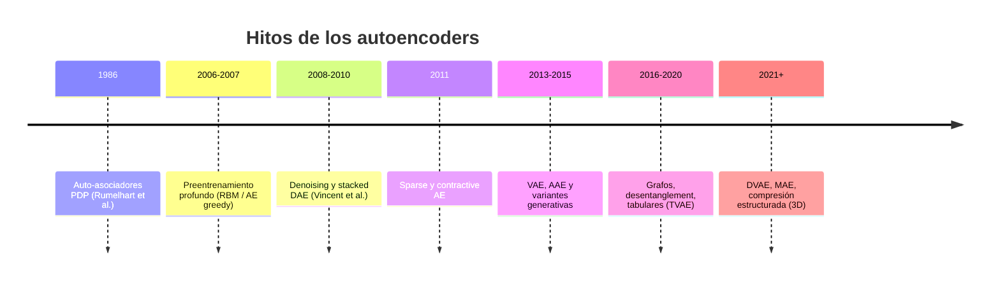

Los [autoencoders](https://en.wikipedia.org/wiki/Autoencoder) (AE) son [redes neuronales](https://en.wikipedia.org/wiki/Neural_network_%28machine_learning%29) que aprenden a comprimir datos y luego reconstruirlos. Nacieron como herramienta de [representación no supervisada](https://en.wikipedia.org/wiki/Unsupervised_learning) y hoy abarcan desde [reducción de dimensionalidad](https://en.wikipedia.org/wiki/Dimensionality_reduction) hasta [modelos generativos](https://en.wikipedia.org/wiki/Generative_model) de secuencias, [grafos](https://en.wikipedia.org/wiki/Graph_neural_network) o incluso [activos 3D](https://www.mdpi.com/2076-3417/13/10/5925). En este post recorreremos fugazmente su **historia**, explicaremos por qué un AE puede degenerar en la [**función identidad**](https://en.wikipedia.org/wiki/Identity_function), dibujaremos una **taxonomía simplificada** de los principales tipos de arquitectura con referencias y comentaremos su papel en [**detección de anomalías**](https://en.wikipedia.org/wiki/Anomaly_detection), en particular en [mantenimiento predictivo](https://en.wikipedia.org/wiki/Predictive_maintenance) (PdM) sin fallos etiquetados.
    
**TL;DR**:

- Un AE minimiza el error de reconstrucción entre entrada $$\mathbf{x}$$ y salida $$\hat{\mathbf{x}}$$ tras reconstruir una representación en [espacio latente](https://en.wikipedia.org/wiki/Latent_space) $$\mathbf{z}$$.
- Sin restricciones suficientes, puede aprender la [**función identidad**](https://en.wikipedia.org/wiki/Identity_function) (copiar la entrada) en lugar de estructura útil, pues eso minimiza dicho error; pero esta solución no nos vale y por tanto debemos imponer ciertas restricciones, en la red, sobre la función de transformación aprendida.
- Las variantes añaden [**cuello de botella**](https://en.wikipedia.org/wiki/Bottleneck_%28network%29), **ruido**, [**dispersión**](https://en.wikipedia.org/wiki/Sparse_coding) (_sparsity_), [**contracción**](https://icml.cc/2011/papers/455_icmlpaper.pdf), [**probabilidad**](https://arxiv.org/abs/1312.6114) o **arquitectura especializada** [convolucional](https://en.wikipedia.org/wiki/Convolutional_neural_network), [recurrente](https://en.wikipedia.org/wiki/Recurrent_neural_network), [grafo](https://en.wikipedia.org/wiki/Graph_neural_network) o [máscaras](https://arxiv.org/abs/2111.06377), entre otras.
- En [**detección de anomalías**](https://en.wikipedia.org/wiki/Anomaly_detection), se entrena solo con datos normales; un error de reconstrucción alto indica comportamiento fuera de lo aprendido (i.e. fuera de lo normal).

## Breve historia

### Orígenes: auto-asociación y backpropagation sin profesor

El concepto de [**auto-asociador**](https://en.wikipedia.org/wiki/Autoassociative_memory) aparece en el marco de [*Parallel Distributed Processing*](https://direct.mit.edu/books/monograph/4424/Parallel-Distributed-Processing-Volume) (PDP): [Rumelhart, Hinton y Williams (1986)](https://direct.mit.edu/books/monograph/4424/Parallel-Distributed-Processing-Volume) propusieron aprender representaciones internas propagando el error entre entrada y salida utilizando la propia entrada como señal objetivo, es decir, sin etiquetas externas, usando los propios datos como "profesor". El objetivo es el mismo que hoy: transformar $$\mathbf{x}$$ en $$\hat{\mathbf{x}}$$ con la menor distorsión posible, pero extrayendo estructura en capas ocultas mediante [**backpropagation**](https://en.wikipedia.org/wiki/Backpropagation).

### Renacimiento del aprendizaje profundo (2006–2010)

Tras años en los que entrenar redes profundas desde pesos aleatorios era inestable, [Hinton et al. (2006)](https://proceedings.neurips.cc/paper_files/paper/2006/file/5da713a690c067105aeb2fae32403405-Paper.pdf) popularizaron el **preentrenamiento capa a capa** con [Restricted Boltzmann Machines](https://en.wikipedia.org/wiki/Restricted_Boltzmann_machine) (RBM). [Bengio et al. (2007)](https://papers.nips.cc/paper/3048-greedy-layer-wise-training-of-deep-networks) demostraron que el mismo principio [**greedy layer-wise**](https://papers.nips.cc/paper/3048-greedy-layer-wise-training-of-deep-networks) funciona sustituyendo cada capa por un AE: cada nivel aprende una representación comprimida y alimenta al siguiente. [Vincent et al. (2008)](https://dl.acm.org/doi/10.1145/1390156.1390294) introdujeron el [**denoising autoencoder**](https://en.wikipedia.org/wiki/Autoencoder#Denoising_autoencoder) (DAE), obligando a reconstruir la entrada limpia a partir de una versión corrupta; [Vincent et al. (2010)](https://www.jmlr.org/papers/volume11/vincent10a/vincent10a.pdf) apilaron varios [stacked DAE](https://www.jmlr.org/papers/volume11/vincent10a/vincent10a.pdf) como bloques de representación profunda.

### Regularización explícita y modelos generativos (2011–2015)

[Rifai et al. (2011)](https://icml.cc/2011/papers/455_icmlpaper.pdf) propusieron el [**contractive autoencoder**](https://icml.cc/2011/papers/455_icmlpaper.pdf) (CAE), penalizando la sensibilidad del codificador a pequeñas perturbaciones. [Ng (2011)](https://web.stanford.edu/class/cs294a/sparseAutoencoder.pdf) formalizó la [**dispersión**](https://en.wikipedia.org/wiki/Sparse_coding) en capas sobredimensionadas. [Kingma y Welling (2013)](https://arxiv.org/abs/1312.6114) publicaron el [**variational autoencoder**](https://en.wikipedia.org/wiki/Variational_autoencoder) (VAE), que modela el latente como distribución y optimiza un [límite variacional](https://en.wikipedia.org/wiki/Evidence_lower_bound) (ELBO [_Evidence Lower Bound_]). [Makhzani et al. (2015)](https://arxiv.org/abs/1511.05644) añadieron un discriminador [**adversarial autoencoder**](https://arxiv.org/abs/1511.05644) (AAE) para alinear el latente con un [prior](https://en.wikipedia.org/wiki/Prior_probability) arbitrario.

### Especialización por dominio (2016–hoy)

Desde entonces la literatura explota variantes por tipo de dato: [convolucionales](https://en.wikipedia.org/wiki/Convolutional_neural_network) para imagen, [recurrentes](https://en.wikipedia.org/wiki/Recurrent_neural_network) para series, en [grafos](https://arxiv.org/abs/1611.07308) (GAE/VGAE), con [máscaras](https://arxiv.org/abs/2111.06377), e.g. MAE de [He et al., 2022](https://arxiv.org/abs/2111.06377), [tabulares](https://arxiv.org/abs/1907.00503) (TVAE), [dinámicos](https://arxiv.org/abs/2008.12595) para secuencias (DVAE) y compresión estructurada para generación 3D con [Sparse Compression VAE](https://arxiv.org/abs/2512.14692). La revisión de [Berahmand et al. (2024)](https://doi.org/10.1007/s10462-023-10662-6) ofrece una taxonomía actualizada; este post condensa esa línea temporal en una guía concisa.

## El autoencoder básico (vanilla AE)

Un AE consta de tres piezas:

1. [**Encoder**](https://en.wikipedia.org/wiki/Autoencoder) $$f_\theta$$: comprime la entrada $$\mathbf{x}$$ en $$\mathbf{z} = f_\theta(\mathbf{x})$$.
2. [**Cuello de botella**](https://en.wikipedia.org/wiki/Bottleneck_%28network%29) (_bottleneck_): almacena la representación latente.
3. [**Decoder**](https://en.wikipedia.org/wiki/Autoencoder) $$g_\theta$$: reconstruye $$\hat{\mathbf{x}} = g_\theta(\mathbf{z})$$.

El entrenamiento minimiza una pérdida de reconstrucción, típicamente el [error cuadrático medio](https://en.wikipedia.org/wiki/Mean_squared_error) (MSE) u otra más robusta:

$$
\mathcal{L}_{\mathrm{AE}}(\theta) = \frac{1}{n}\sum_{i=1}^{n} \|\mathbf{x}_i - \hat{\mathbf{x}}_i\|^2 = \frac{1}{n}\sum_{i=1}^{n} \|\mathbf{x}_i - g_\theta(f_\theta(\mathbf{x}_i))\|^2.
$$

Para datos binarios o probabilísticos se usa la [entropía cruzada binaria](https://en.wikipedia.org/wiki/Cross_entropy) (BCE). El [**stacked autoencoder**](https://papers.nips.cc/paper/3048-greedy-layer-wise-training-of-deep-networks) (SAE) encadena varios AE entrenados capa a capa: la salida del nivel $$k$$ alimenta el nivel $$k+1$$, lo que permite extraer jerarquías multiescala de características sin etiquetas.

## Por qué un AE puede aprender la función identidad

La [**función identidad**](https://en.wikipedia.org/wiki/Identity_function) ocurre cuando la red reconstruye $$\mathbf{x}$$ copiándolo casi literalmente, sin capturar estructura estadística útil. No es un fallo de implementación, sino el mínimo trivial de $$\mathcal{L}_{\mathrm{AE}}$$ cuando la capacidad del modelo es demasiado alta respecto a la restricción impuesta.

### Subcompleto vs. sobredimensionado

| Tipo | Dimensión del latente | Riesgo de identidad | Mecanismo de control |
|------|----------------------|---------------------|----------------------|
| **Subcompleto** (_undercomplete_) | $$\dim(\mathbf{z}) < \dim(\mathbf{x})$$ | Bajo si el cuello es estrecho | La compresión fuerza a descartar información; no puede memorizar todo |
| **Sobredimensionado** (_overcomplete_) | $$\dim(\mathbf{z}) > \dim(\mathbf{x})$$ | Alto sin regularización | Hace falta esparsidad, ruido, contracción u otra penalización |

En un AE **subcompleto**, el cuello de botella actúa como [regularizador](https://en.wikipedia.org/wiki/Regularization_%28mathematics%29) estructural: la red debe elegir qué conservar. En uno **sobredimensionado**, hay suficientes grados de libertad para que encoder y decoder aprendan un paso casi invertible "neurona a neurona". Por eso [Berahmand et al., 2024](https://doi.org/10.1007/s10462-023-10662-6) y [Sakar & Kocaman, 2022](https://pmc.ncbi.nlm.nih.gov/articles/PMC9287259/) insisten en que la capacidad debe ir acompañada de restricciones explícitas.

### Otras causas prácticas

- **Demasiadas capas o neuronas** respecto al tamaño y diversidad del conjunto de entrenamiento.
- **Entrenamiento prolongado** sin [early stopping](https://en.wikipedia.org/wiki/Early_stopping) en datos donde memorizar es más barato que generalizar.
- **Ausencia de ruido o prior** en el latente cuando el dominio no obliga a comprimir.

Las variantes que siguen son, esencialmente, respuestas que afrontan este problema.

## Taxonomía de tipos de autoencoders

La siguiente tabla resume las familias más citadas. Cada fila apunta al mecanismo que evita la identidad trivial o amplía las capacidades del modelo de AE base.

| Familia | Idea clave | Pérdida / restricción extra | Referencia representativa |
|---------|-----------|---------------------------|---------------------------|
| Vanilla AE | Reconstrucción directa | Cuello estrecho (subcompleto) | [Rumelhart et al. (1986)](https://direct.mit.edu/books/monograph/4424/Parallel-Distributed-Processing-Volume) |
| Stacked AE | AE apilados capa a capa | Preentrenamiento no supervisado | [Bengio et al. (2007)](https://papers.nips.cc/paper/3048-greedy-layer-wise-training-of-deep-networks) |
| Sparse AE | Pocas neuronas activas a la vez | Penalización KL de esparsidad | [Ng (2011)](https://web.stanford.edu/class/cs294a/sparseAutoencoder.pdf) |
| k-sparse AE | Solo las $$k$$ activaciones mayores | Top-$$k$$ en capa oculta | [Makhzani & Frey (2014)](https://arxiv.org/abs/1312.5663) |
| Denoising AE (DAE) | Reconstruir $$\mathbf{x}$$ desde $$\tilde{\mathbf{x}}$$ corrupto | $$\mathcal{L}(\mathbf{x}, g(f(\tilde{\mathbf{x}})))$$ | [Vincent et al. (2008)](https://dl.acm.org/doi/10.1145/1390156.1390294) |
| Marginalized DAE (mDAE) | Corrupción analítica marginalizada | Múltiples vistas ruidosas | [Chen et al. (2012)](https://arxiv.org/abs/1206.4683) |
| Contractive AE (CAE) | Representación estable ante $$\delta\mathbf{x}$$ | $$\|J_f(\mathbf{x})\|_F^2$$ | [Rifai et al. (2011)](https://icml.cc/2011/papers/455_icmlpaper.pdf) |
| Laplacian AE | Suavidad en el [manifold](https://en.wikipedia.org/wiki/Manifold_hypothesis) | [Grafo laplaciano](https://en.wikipedia.org/wiki/Laplacian_matrix) sobre muestras | [Yang et al. (2010)](https://arxiv.org/abs/1006.5608) |
| Orthogonal AE | Filas de pesos casi ortogonales | $$\|WW^\top - I\|$$ | [Wang et al. (2015)](https://arxiv.org/abs/1504.00345) |
| $$L_{2,1}$$ robust AE | Esparsidad + robustez a outliers | Norma $$L_{2,1}$$ en latente | [Li et al. (2018)](https://arxiv.org/abs/1802.07123) |
| Variational AE (VAE) | Latente probabilístico $$q(\mathbf{z}\|\mathbf{x})$$ | ELBO = reconstrucción + KL | [Kingma & Welling (2013)](https://arxiv.org/abs/1312.6114) |
| $$\beta$$-VAE | Factorizar factores en latente | Peso $$\beta$$ en término KL | [Higgins et al. (2017)](https://openreview.net/forum?id=Sy2fzU9gl) |
| Adversarial AE (AAE) | Discriminador en el latente | [GAN](https://en.wikipedia.org/wiki/Generative_adversarial_network)-style en $$z$$ | [Makhzani et al. (2015)](https://arxiv.org/abs/1511.05644) |
| Wasserstein AE (WAE) | Distancia de transporte al prior | [Wasserstein](https://en.wikipedia.org/wiki/Wasserstein_metric) en latente | [Tolstikhin et al. (2018)](https://arxiv.org/abs/1711.01558) |
| Bayesian AE (BAE) | Incertidumbre en todos los pesos | Prior gaussiano en parámetros | [Yong & Brintrup (2022)](https://arxiv.org/abs/2204.02426) |
| Diffusion AE | Denoising progresivo en latente | Pérdida tipo [difusión](https://en.wikipedia.org/wiki/Diffusion_model) | [Preechakul et al. (2022)](https://arxiv.org/abs/2207.11202) |
| Convolutional AE (CAE) | Convoluciones en encoder/decoder | Preserva localidad espacial | [Masci et al. (2011)](https://arxiv.org/abs/1103.0398) |
| Conv-VAE | VAE + capas convolucionales | ELBO con convoluciones | [Sohn et al. (2015)](https://arxiv.org/abs/1506.05711) |
| ConvLSTM AE | Espacio + tiempo | Pérdida en secuencia 3D | [Shi et al. (2015)](https://arxiv.org/abs/1506.04214) |
| LSTM / GRU AE | Series temporales | MSE por paso temporal | [Nguyen et al. (2021)](https://arxiv.org/abs/2103.09532) |
| Bidirectional RNN AE | Contexto pasado y futuro | MSE bidireccional | [Marchi et al. (2015)](https://arxiv.org/abs/1502.04691) |
| Semi-supervised VAE | Latente condicionado a etiqueta $$y$$ | ELBO con $$q(y\|\mathbf{x})$$ | [Kingma et al. (2014)](https://arxiv.org/abs/1406.5298) |
| Disentangled VAE | Factores independientes | Estructura gráfica en latente | [Higgins et al. (2017)](https://openreview.net/forum?id=Sy2fzU9gl) |
| Graph AE (GAE) | Reconstrucción de aristas | $$\sigma(ZZ^\top)$$ vs. $$A$$ | [Kipf & Welling (2016)](https://arxiv.org/abs/1611.07308) |
| VGAE | VAE en grafos | ELBO sobre adyacencia | [Kipf & Welling (2016)](https://arxiv.org/abs/1611.07308) |
| Adversarial GAE | AAE en grafos | Reconstrucción + adversarial | [Pan et al. (2018)](https://arxiv.org/abs/1801.07698) |
| Graph attention AE | [Atención](https://en.wikipedia.org/wiki/Attention_%28machine_learning%29) sobre vecinos | Coeficientes $$a_{ij}$$ | [Salehi & Davulcu (2019)](https://arxiv.org/abs/1904.08035) |
| Masked AE (MAE) | Reconstruir parches enmascarados | MSE solo en tokens ocultos | [He et al. (2022)](https://arxiv.org/abs/2111.06377) |
| Graph MAE | MAE en nodos de grafo | Error coseno en features | [Hou et al. (2022)](https://arxiv.org/abs/2205.10803) |
| Contrastive MAE | Rama online + objetivo contrastivo | Reconstrucción + [InfoNCE](https://arxiv.org/abs/1807.03748) | [Huang et al. (2022)](https://arxiv.org/abs/2205.13137) |

### Autoencoders regularizados (detalle)

[**Sparse AE**](https://web.stanford.edu/class/cs294a/sparseAutoencoder.pdf): añade un término que empuja la activación media de las neuronas ocultas hacia un objetivo bajo, e.g. [divergencia KL](https://en.wikipedia.org/wiki/Kullback%E2%80%93Leibler_divergence) respecto a un prior de esparsidad. Obliga a repartir la información entre pocas unidades activas.

[**Denoising AE**](https://en.wikipedia.org/wiki/Autoencoder#Denoising_autoencoder): durante el entrenamiento se corrompe $$\mathbf{x}$$ con ruido gaussiano, [*dropout*](https://en.wikipedia.org/wiki/Dropout_%28neural_networks%29) de entradas o *masking*, y la red debe predecir la versión limpia. La reconstrucción ya no es trivial porque la entrada vista por el encoder difiere de la meta del decoder.

[**Contractive AE**](https://icml.cc/2011/papers/455_icmlpaper.pdf): penaliza la norma del [jacobiano](https://en.wikipedia.org/wiki/Jacobian_matrix_and_determinant) $$J_f(\mathbf{x}) = \partial f / \partial \mathbf{x}$$, haciendo el codificador **insensible** a perturbaciones locales, útil para representaciones que capturan el [manifold](https://en.wikipedia.org/wiki/Manifold_hypothesis) de los datos normales.

### Autoencoders generativos

**[VAE](https://en.wikipedia.org/wiki/Variational_autoencoder)**: el encoder produce parámetros de $$q_\phi(\mathbf{z} \mid \mathbf{x})$$ (típicamente gaussiana); se muestrea $$\mathbf{z}$$ y el decoder modela $$p_\theta(\mathbf{x} \mid \mathbf{z})$$. La pérdida combina reconstrucción y $$\mathrm{KL}\bigl(q_\phi \,\|\, p(\mathbf{z})\bigr)$$. Permite muestrear del prior y estimar densidad aproximada (ventaja frente al AE determinista en detección de anomalías basada en probabilidad).

**[β-VAE](https://openreview.net/forum?id=Sy2fzU9gl)**: escala el término KL con $$\beta > 1$$ para favorecer representaciones más factorizadas (_disentangled_).

[**AAE**](https://arxiv.org/abs/1511.05644) / [**WAE**](https://arxiv.org/abs/1711.01558): imponen que el histograma de códigos latentes se parezca a un prior (gaussiano u otro) mediante un discriminador o una métrica de transporte, sin la penalización KL cerrada del VAE.

### Autoencoders por estructura de datos

- [**Convolucionales**](https://en.wikipedia.org/wiki/Convolutional_neural_network): respetan traslación en imagen/video; estándar en compresión, [inpainting](https://en.wikipedia.org/wiki/Inpainting) y detección visual de defectos.
- [**Recurrentes**](https://en.wikipedia.org/wiki/Recurrent_neural_network) (LSTM o GRU): codifican secuencias completas; el latente resume la trayectoria temporal (base de muchos trabajos en PdM multivariante).
- En **[grafos](https://en.wikipedia.org/wiki/Graph_neural_network)**: aprenden [embeddings](https://en.wikipedia.org/wiki/Word_embedding) de nodos que reconstruyen la matriz de adyacencia o atributos; útiles en redes de sensores con topología conocida.
- [**Masked**](https://arxiv.org/abs/2111.06377) (MAE): en visión, enmascaran parches y reconstruyen solo los ocultos; [preentrenamiento autosupervisado](https://en.wikipedia.org/wiki/Self-supervised_learning) a gran escala.

### Variantes tabulares y temporales (mencionadas en aplicaciones industriales)

[**TVAE**](https://arxiv.org/abs/1907.00503) (_tabular VAE_): [Xu et al. (2019)](https://arxiv.org/abs/1907.00503), dentro del ecosistema [Synthetic Data Vault](https://sdv.dev/), adaptan el VAE a columnas mixtas (continuas y categóricas) con transformaciones por feature y capas específicas de salida. Se usa para **síntesis de datos tabulares** y, por extensión, modelado de variables de proceso. Para detección de anomalías en tablas con outliers en entrenamiento, [**RTVAE**](https://arxiv.org/abs/2006.08204) de [Akrami et al., 2020](https://arxiv.org/abs/2006.08204) sustituye divergencias estándar por **β-divergence** (familia paramétrica de funciones de costo utilizada para medir la discrepancia entre dos distribuciones de probabilidad o matrices, que mediante un parámetro continuo β unifica métricas clásicas como la distancia euclídea y las divergencias de Kullback-Leibler e Itakura-Saito), manteniendo robustez frente a contaminación en los datos "normales".

[**DVAE**](https://arxiv.org/abs/2008.12595) (_dynamical variational autoencoder_): [Girin et al. (2021)](https://arxiv.org/abs/2008.12595) unifican modelos que combinan VAE con dinámica temporal, e.g. [VRNN](https://arxiv.org/abs/1412.6581) de [Chung et al., 2015](https://arxiv.org/abs/1412.6581), SRNN, DMM y KVAE, para secuencias de voz, movimiento o señales industriales muestreadas en el tiempo. El latente evoluciona según un [modelo de estados](https://en.wikipedia.org/wiki/State-space_representation); la reconstrucción captura dependencias que un AE estático por ventana ignora. Más material en el [tutorial DVAE](https://dynamicalvae.github.io/).

[**Sparse Compression VAE**](https://arxiv.org/abs/2512.14692): [Xiang et al. (2025)](https://arxiv.org/abs/2512.14692), en el trabajo [TRELLIS.2](https://arxiv.org/abs/2512.14692), aprenden un latente estructurado y **muy comprimido** sobre [voxeles sparse](https://en.wikipedia.org/wiki/Sparse_voxel_octree) 3D (representación O-Voxel), con downsampling espacial $$16\times$$. Ilustra la tendencia actual: VAE no como MLP genérico, sino como compresor alineado con la geometría del dominio (aquí, generación 3D nativa).

## Detección de anomalías con autoencoders

### Principio

En [detección de anomalías no supervisada](https://en.wikipedia.org/wiki/Anomaly_detection), el AE se entrena **solo con datos normales** (transacciones legítimas, piezas sin defecto, régimen estable de máquina). Aprende el [manifold](https://en.wikipedia.org/wiki/Manifold_hypothesis) del comportamiento habitual. Ante una observación anómala, el decoder (que nunca vio ese patrón) produce una reconstrucción pobre y el **error de reconstrucción** crece.

Pasos típicos:

1. **Entrenamiento normal**: minimizar $$\mathcal{L}$$ sobre el conjunto de referencia sano.
2. **Score**: $$s(\mathbf{x}) = \|\mathbf{x} - \hat{\mathbf{x}}\|^2$$, o MAE, BCE o [log-likelihood](https://en.wikipedia.org/wiki/Likelihood_function) del VAE.
3. **Umbral**: se fija con un [cuantil](https://en.wikipedia.org/wiki/Quantile) del score en validación (e.g. percentil 95 de datos normales).
4. **Alarma**: $$s(\mathbf{x}_{\mathrm{nuevo}}) > \tau$$.

### Ventajas en mantenimiento predictivo (PdM)

Cuando **no hay fallos etiquetados** pero sí un período largo de operación estable, un AE (o VAE) multivariante modela correlaciones entre decenas o cientos de sensores, qué combinaciones de temperatura, presión, vibración, velocidad... son coherentes en cada modo de trabajo y características complejas de alto nivel que abstraen la naturaleza intrínseca de los datos, que son difíciles de ver de otra manera o a simple vista. El error de reconstrucción actúa como **indicador de condición** sin clasificar tipos de fallo.

Ventajas frecuentemente citadas:

- No requiere ejemplos de fallo, solo datos nominales razonablemente representativos.
- Capta **dependencias no lineales** entre variables simultáneas.
- Se integra con umbrales adaptativos y ventanas temporales (en series, conviene AE recurrente o DVAE).

Limitaciones a tener en cuenta:

- Anomalías **muy parecidas** al normal pueden reconstruirse bien (falsos negativos).
- Cambios lentos de régimen (envejecimiento, estacionalidad...) pueden elevar el error global si no se reentrena o no se normaliza por contexto.
- [Outliers](https://en.wikipedia.org/wiki/Outlier) en el set de entrenamiento "normal" sesgan el manifold; por eso variantes **robustas** (DAE, RTVAE, $$L_{2,1}$$) son relevantes en planta.

### Elección de variante según el dato

| Dominio | Variante habitual | Motivo |
|---------|-------------------|--------|
| Series temporales multivariantes | [LSTM-AE](https://arxiv.org/abs/2103.09532), [GRU-AE](https://arxiv.org/abs/2103.09532), [DVAE](https://arxiv.org/abs/2008.12595) | Dependencias temporales |
| Tablas de sensores / [SCADA](https://en.wikipedia.org/wiki/SCADA) | AE denso, VAE, [TVAE](https://arxiv.org/abs/1907.00503), [RTVAE](https://arxiv.org/abs/2006.08204) | Mix continuo/categórico; robustez a outliers |
| Imagen (inspección) | [Conv-AE](https://arxiv.org/abs/1103.0398), [Conv-VAE](https://arxiv.org/abs/1506.05711) | Localidad espacial |
| Red de sensores con topología | [GAE](https://arxiv.org/abs/1611.07308) / [VGAE](https://arxiv.org/abs/1611.07308) | Estructura de grafo |
| Señal con régimen cambiante | [DVAE](https://arxiv.org/abs/2008.12595), ventanas + reentrenamiento | Dinámica explícita en latente |

## Resumen y línea temporal

Los autoencoders no son un único algoritmo sino una **familia** funamentada en la base de la reconstrucción de datos. El progreso en esta línea consiste en añadir restricciones que impidan la identidad trivial y en adaptar la arquitectura al tipo de dato. Para [detección de anomalías](https://en.wikipedia.org/wiki/Anomaly_detection) y [PdM](https://en.wikipedia.org/wiki/Predictive_maintenance), el AE clásico sigue siendo la referencia conceptual; en la práctica, DAE, VAE, variantes tabulares robustas o dinámicas suelen ofrecer mejor comportamiento cuando el ruido, la temporalidad o la mezcla de tipos de variable lo exigen.

## Referencias

- Rumelhart, D. E., Hinton, G. E., & Williams, R. J. (1986). Learning internal representations by error propagation. En *Parallel Distributed Processing*, vol. 1. [MIT Press](https://mitpress.mit.edu/9780262680539/parallel-distributed-processing/).
- Hinton, G. E., Osindero, S., & Teh, Y. W. (2006). A fast learning algorithm for deep belief nets. *Neural Computation*, 18(7). [PDF NeurIPS reprint](https://proceedings.neurips.cc/paper_files/paper/2006/file/5da713a690c067105aeb2fae32403405-Paper.pdf).
- Bengio, Y., Lamblin, P., Popovici, D., & Larochelle, H. (2007). Greedy layer-wise training of deep networks. *NeurIPS 19*. [MIT Press](https://papers.nips.cc/paper/3048-greedy-layer-wise-training-of-deep-networks).
- Vincent, P., Larochelle, H., Bengio, Y., & Manzagol, P. A. (2008). Extracting and composing robust features with denoising autoencoders. *ICML*. [ACM](https://dl.acm.org/doi/10.1145/1390156.1390294).
- Vincent, P., Larochelle, H., Lajoie, I., Bengio, Y., & Manzagol, P. A. (2010). Stacked denoising autoencoders. *JMLR*, 11. [PDF](https://www.jmlr.org/papers/volume11/vincent10a/vincent10a.pdf).
- Rifai, S., Vincent, P., Muller, X., Glorot, X., & Bengio, Y. (2011). Contractive auto-encoders: explicit invariance during feature extraction. *ICML*. [PDF](https://icml.cc/2011/papers/455_icmlpaper.pdf).
- Ng, A. (2011). Sparse autoencoder. *CS294A Lecture notes*. Stanford. [PDF](https://web.stanford.edu/class/cs294a/sparseAutoencoder.pdf).
- Kingma, D. P., & Welling, M. (2013). Auto-encoding variational Bayes. *ICLR*. [arXiv:1312.6114](https://arxiv.org/abs/1312.6114).
- Makhzani, A., Shlens, J., Jaitly, N., & Goodfellow, I. (2015). Adversarial autoencoders. [arXiv:1511.05644](https://arxiv.org/abs/1511.05644).
- Higgins, I., Matthey, L., Pal, A., et al. (2017). $$\beta$$-VAE: learning basic visual concepts with a constrained variational framework. *ICLR*. [OpenReview](https://openreview.net/forum?id=Sy2fzU9gl).
- Kipf, T. N., & Welling, M. (2016). Variational graph auto-encoders. [arXiv:1611.07308](https://arxiv.org/abs/1611.07308).
- He, K., Chen, X., Xie, S., Li, Y., Dollár, P., & Girshick, R. (2022). Masked autoencoders are scalable vision learners. *CVPR*. [arXiv:2111.06377](https://arxiv.org/abs/2111.06377).
- Xu, L., Skoularidou, M., Soria, C., & Veeramachaneni, K. (2019). Modeling tabular data using conditional GAN. *NeurIPS* (TVAE en Synthetic Data Vault). [arXiv:1907.00503](https://arxiv.org/abs/1907.00503).
- Akrami, M., Joshi, A., Li, M., et al. (2020). Robust variational autoencoder for tabular data with $$\beta$$ divergence. [arXiv:2006.08204](https://arxiv.org/abs/2006.08204).
- Girin, L., Leglaive, S., Bie, X., et al. (2021). Dynamical variational autoencoders: a comprehensive review. *Foundations and Trends in Machine Learning*, 15(1–2). [arXiv](https://arxiv.org/abs/2008.12595) · [Tutorial DVAE](https://dynamicalvae.github.io/).
- Chung, J., Kastner, K., Dinh, L., et al. (2015). A recurrent latent variable model for sequential data. *NeurIPS* (VRNN). [arXiv:1412.6581](https://arxiv.org/abs/1412.6581).
- Berahmand, K., Daneshfar, F., Salehi, E. S., et al. (2024). Autoencoders and their applications in machine learning: a survey. *Artificial Intelligence Review*, 57, 28. [DOI](https://doi.org/10.1007/s10462-023-10662-6).
- Sakar, C. O., & Kocaman, D. (2022). Autoencoders reloaded. *Engineering Applications of Artificial Intelligence*. [PMC](https://pmc.ncbi.nlm.nih.gov/articles/PMC9287259/).
- Xiang, J., Chen, X., Xu, S., et al. (2025). Native and compact structured latents for 3D generation (Sparse Compression VAE, TRELLIS.2). [arXiv:2512.14692](https://arxiv.org/abs/2512.14692).
- Baldi, P. (2012). Autoencoders, unsupervised learning, and deep architectures. *ICML Workshop*. [PDF](http://proceedings.mlr.press/v27/baldi12a/baldi12a.pdf).
