## Introducción

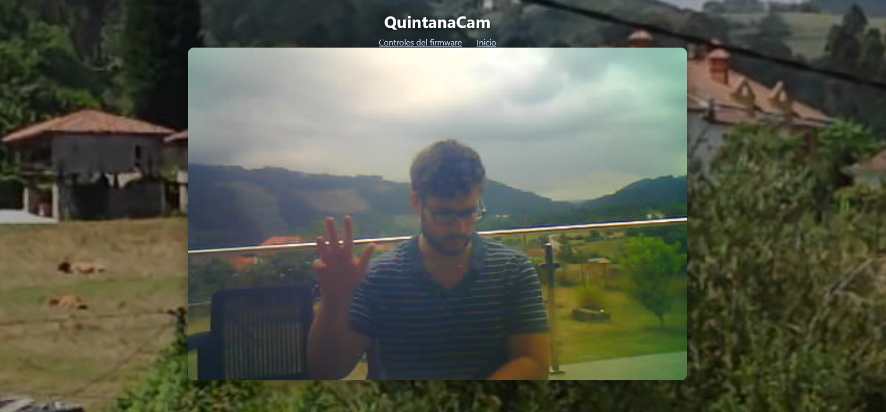

En la línea de [nuestro otro post](./casual-commercial-surveillance) en el que instalábamos una cámara comercial barata para vigilar nuestro jardín, aquí lo abordamos desde otra perspectiva: un **ESP32-CAM** ([Ai-Thinker](https://es.aliexpress.com/item/1005006299363624.html?gatewayAdapt=glo2esp), OV2640, antena 2,4 GHz externa, programador [ESP32-CAM-MB](https://electronicaelfaro.com/modulo-esp32-cam-mb)) como nodo de cámara, y una **Orange Pi One** en casa como **servidor** — no hay app móvil propia; el acceso remoto es por **navegador web** a través de **VPN** ([Tailscale](https://tailscale.com/)), con un portal (`quintanacam`) que sirve el stream y, aparte, los controles del firmware. En el nodo exterior probamos alimentación con **panel solar** (y, en una iteración futura, **batería** para cubrir la noche); de momento el prototipo va cableado/regulado de forma sencilla, como veremos más adelante.

## Integración

### Diseño eléctrico / electrónico

**Conexionado:**

El cableado mínimo del nodo de vigilancia (ESP32-CAM) queda así:

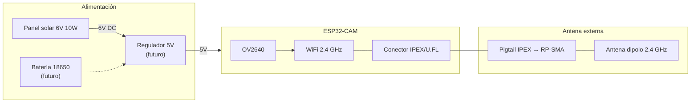

- **Alimentación:** el ESP32-CAM trabaja a **5 V** por el pin `5V`–`GND` (o vía el programador ESP32-CAM-MB durante el desarrollo). En el prototipo actual alimentamos directamente desde el panel, sin batería intermedia; ver el apartado de dimensionamiento.
- **Antena:** el _pigtail_ IPEX/U.FL va al conector de la placa; hay que **puentear la antena de traza** de fábrica antes de usar la externa.
- **Masa común:** unir `GND` del panel, del regulador y del ESP32.

**Panel fotovoltaico:**

Me compré [este panel de 10 W](https://es.aliexpress.com/item/1005008539414434.html?spm=a2g0o.productlist.main.5.2cd0njJAnjJAl3&algo_pvid=7d1a1242-9fa7-4523-9c2a-c49b3fb510d4&algo_exp_id=7d1a1242-9fa7-4523-9c2a-c49b3fb510d4-4&pdp_ext_f=%7B%22order%22%3A%22258%22%2C%22eval%22%3A%221%22%2C%22fromPage%22%3A%22search%22%7D&pdp_npi=6%40dis%21EUR%2127.04%2111.76%21%21%21210.89%2191.71%21%40210385db17745376333318835ead80%2112000048437118944%21sea%21ES%216234875547%21X%211%210%21n_tag%3A-29919%3Bd%3Ad4437884%3Bm03_new_user%3A-29895%3BpisId%3A5000000203060216&curPageLogUid=y6IDGNDAbcBD&utparam-url=scene%3Asearch%7Cquery_from%3A%7Cx_object_id%3A1005008539414434%7C_p_origin_prod%3A) para alimentar el ESP32. Ya os adelanto que fue un pequeño fracaso.

> NOTA: Un condensador electrolítico de **≥1000 µF** entre `5V` y `GND` ayuda a absorber los picos de corriente del WiFi; no sustituye a una batería para la noche, pero reduce reinicios durante el día.

**Comunicación inalámbrica:**

Conectaremos una [antena de 2,4 GHz](https://es.aliexpress.com/item/1005006096629990.html?spm=a2g0o.productlist.main.5.5f59z6lAz6lAz7&algo_pvid=8d82d2ec-8647-48e3-916e-621fbb3089f7&algo_exp_id=8d82d2ec-8647-48e3-916e-621fbb3089f7-4&pdp_ext_f=%7B%22order%22%3A%2277%22%2C%22eval%22%3A%221%22%2C%22fromPage%22%3A%22search%22%7D&pdp_npi=6%40dis%21EUR%214.20%211.40%21%21%2132.74%2110.96%21%40211b813f17756776005768327e5ecf%2112000035739823846%21sea%21ES%216234875547%21X%211%210%21n_tag%3A-29919%3Bd%3Ad4437884%3Bm03_new_user%3A-29895&curPageLogUid=otMpSc9RTQGq&utparam-url=scene%3Asearch%7Cquery_from%3A%7Cx_object_id%3A1005006096629990%7C_p_origin_prod%3A) (i.e. compatible con Wi-Fi, Bluetooth y ZigBee) al ESP32 para aumentar su rango de conexión WLAN fácilmente. Concretamente, es una antena dipolo de media onda con conector **RP-SMA** y cable **_pigtail_** (en un extremo **SMA** y en otro **IPEX** [**U.FL**; un conector minúsculo que va a la placa]). El ESP32 ya vienen con una [**antena de traza**](https://www.pcbmay.com/wp-content/uploads/2023/04/What-is-a-PCB-Trace-Antenna.jpg) incorporada, que es como una pegatina plana, pero da una conexión pobre (tiene poca ganancia) y no vale para varios metros de distancia ni entorno adverso (e.g. no es orientable), y rebota en las paredes de la carcasa en que la metamos (sea de metal o de plástico muy grueso). Hay que tener mucho cuidado, son elementos [**muy delicados**](https://www.youtube.com/watch?v=UWl8xmvoXqY). Es importante notar que debemos [**romper** la conexión](https://www.youtube.com/watch?v=aBTZuvg5sM8&t=2s) de la antena de traza para usar la exterior eliminando la resistencia de la placa y puenteándola, si no, la señal se repartirá entre ambas y será contraproducente.

**Dimensionamiento de potencia consumida:**

Estimación orientativa para decidir si el panel de 10 W basta (spoiler: para streaming continuo, no):

| Modo de operación | Corriente @ 5 V | Potencia |
|---|---|---|
| Deep sleep | 10–200 µA | ~0,001 mW |
| WiFi activo (idle) | 80–120 mA | 0,4–0,6 W |
| Streaming + cámara | 180–240 mA | 0,9–1,2 W |
| Pico de transmisión WiFi | 400–500 mA | 2,0–2,5 W |

El panel de 10 W, en condiciones reales de exterior (suciedad, ángulo, nubes), entrega unos **6–7 W útiles** en el mejor caso. Eso alimenta el streaming de día, pero **no cubre la noche** ni los picos de 500 mA sin un buffer (condensador grande o, mejor, batería).

Regla práctica para 24/7 con streaming continuo:

- Panel: mínimo 5 W (muy justo), recomendable **10 W+** con batería.
- Batería: **2000–3000 mAh** a 3,7 V (con módulo de carga solar tipo CN3065, no un TP4056 suelto).
- Regulador: salida estable de **5 V / ≥1 A** con condensador de desacople (≥1000 µF en 5 V–GND).

#### BOM

Con precios orientativos:

| Componente | Cant. | Precio aprox. | Enlace / tienda |
|---|---|---|---|
| ESP32-CAM Ai-Thinker (OV2640) | 1 | 8–10 € | [TiendaTec](https://www.tiendatec.es/electronica/placas-de-desarrollo/2072-esp32-cam-placa-esp32-con-camara-ov2640-wifi-bt-8472496025850.html), [ElectroHobby](https://www.electrohobby.es/esp32/484-esp32-cam-ov2640.html) |
| Programador ESP32-CAM-MB | 1 | 4,95 € | [Electrónica El Faro](http://electronicaelfaro.com/modulo-esp32-cam-mb) |
| Antena 2,4 GHz RP-SMA + pigtail IPEX | 1 | 1,40–4 € | [AliExpress](https://es.aliexpress.com/item/1005006096629990.html) |
| Panel solar 6 V 10 W | 1 | 11–12 € | [AliExpress](https://es.aliexpress.com/item/1005008539414434.html) |
| Filamento PLA Matte (~50 g, carcasa) | 1 | ~1 € | Bambu A1 Mini (coste material) |
| Orange Pi One (1 GB) | 1 | regalo / 53–88 € | [Turibot](https://www.turibot.es/orange-pi-one-h3-similar-a-la-raspberry), [ErreBi](https://errebishop.com/es/ordenadores-y-microcontroladores/9790-orange-pi-one-con-1-gb-de-ram.html) |
| microSD SanDisk Ultra 32 GB | 1 | 12–24 € | [Kelkoo](https://www.kelkoo.es/gtin/00619659184179), [Coditek](https://www.coditek.es/Tarjeta-memoria-SanDisk-Ultra-microSDHC-A1-32GB-120MB-s-Adapt-SDSQUA4-P297859.html) |
| Fuente 5 V ≥1,5 A (Orange Pi) | 1 | ~0 € | Reciclada de casa |
| Tailscale (plan gratuito) | — | 0 € | [tailscale.com](https://tailscale.com) |
| Condensador electrolítico ≥1000 µF | 1 | ~0,50 € | Tienda de componentes |
| **Total nodo ESP32 (prototipo)** | | **~26–32 €** | Sin Orange Pi ni batería |
| **Total sistema completo** | | **~90–120 €** | Si se compra la Orange Pi |

### Diseño mecánico

Encontré [este diseño](https://makerworld.com/es/models/175379-esp32-cam-case-ball-joint-mount#profileId-325686) gratuito muy guapo y básicamente esto usaré (con unas modificaciones en Blender para el agujero de la antena), impreso con mi Bambu A1 Mini en Pla Matte azul.

### Software

Probaremos a usar PlatformIO, que tiene [integración](https://docs.platformio.org/en/latest/integration/ide/vscode.html#installation) en VSCode-like IDEs.

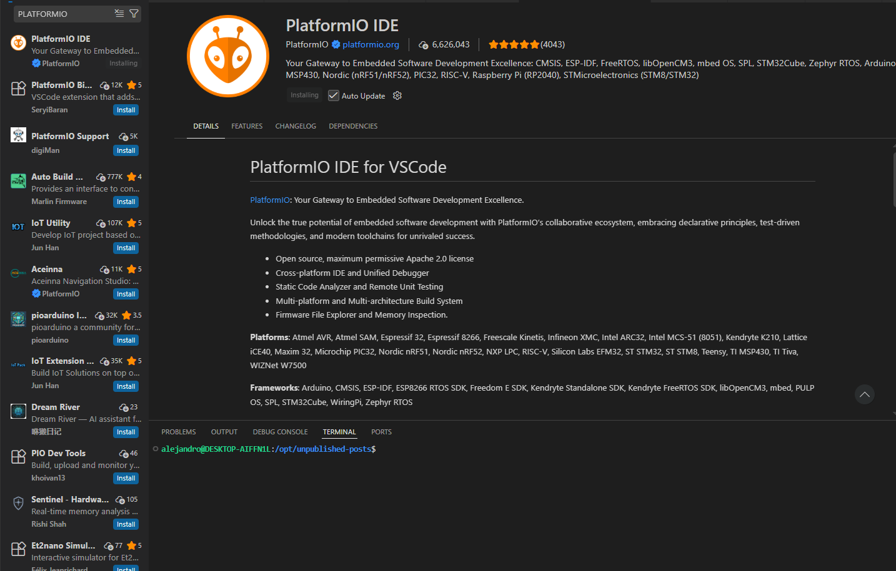

Para probar la cámara, grabaremos [este código](https://randomnerdtutorials.com/esp32-cam-video-streaming-face-recognition-arduino-ide/) (que además implementa reconocimiento de rostos) de ejemplo.

> [!NOTE]
> El ejemplo arriba mencionado utiliza el framework [ESP-WHO](https://github.com/espressif/esp-who), que usa redes neuronales MTCNN y MobileNet para la detección de rostros, extrayendo en tiempo real vectores de características faciales que se comparan con una base de datos local almacenada en la PSRAM del microcontrolador (por ejemplo). El ejemplo original ya no lo soporta, pero hay otros ejemplos modernos [como este](https://www.sunfounder.com/blogs/news/esp32-cam-face-recognition-building-a-reliable-end-to-end-pipeline) muy interesantes que muestran casos de uso exitosos totalmente en el borde y _end-to-end_.

Tenemos que crear un nuevo proyecto con PlatformIO (inicializarlo desde la _Comand Palette_) ([qué hacer](https://community.platformio.org/t/vs-code-stuck-on-initializing-platformio-core-when-opening-sidebar-tab/33013) o [qué hacer](https://github.com/platformio/platformio-core-installer/issues/152) si no termina de inicializar [a mi no me funcionó desde la WSL]) [...].

> [!WARNING]
> Frena. No hay manera de que consiga hacer funcionar PlatformIO en Windows ahora mismo y no estoy para perder el tiempo. Me paso a Arduino IDE para programar y ya está.

**_Cambiamos a Arduino IDE_**

En `Archivo => Preferencias => Gestor de URLs Adicionales de Tarjetas` asegurarse de tener: `https://raw.githubusercontent.com/espressif/arduino-esp32/gh-pages/package_esp32_index.json`. Y en `Herramientas => Placa => Gestor de tarjetas` elegir e instalar "esp32" de Espressif Systems.

Cargamos el ejemplo de demo dedse `Archivo > Ejemplos > ESP32 > Camera > CameraWebServer`; descomentamos la macro correspondiente a nuestra placa (`#define CAMERA_MODEL_AI_THINKER`). Y más abajo también debemos definir el SSID (_Service Set Identifier_) y la clave de nuestra WiFi (`const char* ssid = "NombreDeTuRed";` y `const char* password = "PasswordDeTuRed";`)

Como placa (en herramientas), elegimos **AI Thinker ESP32-CAM** y viendo [sus](https://www.espboards.dev/esp32/esp32cam/) [especificaciones](https://vdoc.ai-thinker.com/en/esp32-cam), elegimos: CPU Frequency `240MHz`, Flash Mode `QIO`, Flash Frequency `80MHz`, Partition Scheme `Huge APP` (Importante, si no, el código no cabe) y como Puerto seleccionamos el COM en el que apareció al conectar la placa o el adaptador FTDI si no la programamos directamente por USB.

Y cargamos el código, pulsando corto una vez el botón Reset cuando veamos `Connecting.......` en la terminal. Luego, cuando acabe, abrir el monitor serie a 115200 baudios, pulsar el botón Reset de la placa y se verá la dirección IP del dashboard para ver la grabación en vivo; abrir desde nuestro navegador; en cualquier dispositivo o máquina conectado a la misma (W)LAN:

```bash
WiFi connected
Camera Ready! Use 'http://192.168.1.24' to connect
```

(podremos especificar la IP deseada estáticamente).

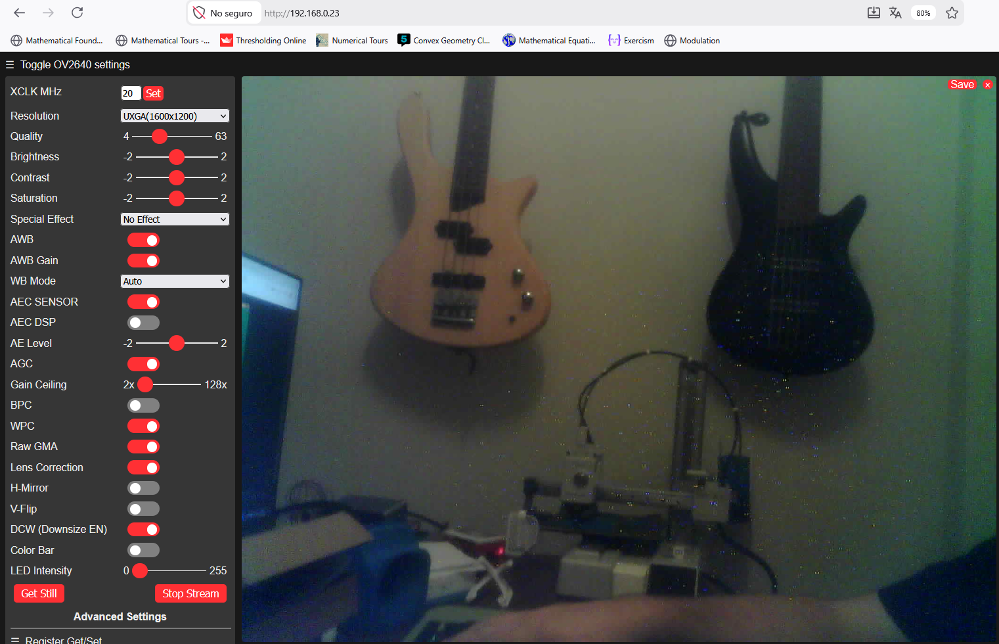

El ejemplo es bastante robusto y da una interfaz muy personalizable (resolución, procesamiento simple de imagen, ganancia y correción de lente, etc.), por lo que le haremos unos cambios mínimos y será lo que usemos como capa de control.

> [!NOTE]
> **¿El stream va más lento que el caballo del malo?** En un ESP32-CAM + OV2640 lo razonable son ~15–25 FPS; si se a 2–3 FPS, se recomienda:
> 1. **Resolución** ↓ — de HVGA (480×320) a **QVGA** (320×240) o **QQVGA** (160×120); es lo que más sube FPS.
> 2. **Quality** (JPEG) en **20–30**; valores muy bajos (4–10) = más calidad pero más lenta la compresión.
> 3. **XCLK** (_external clock_ del sensor) a 20 MHz (máximo habitual).
> 4. Dejar **AWB** (_Auto White Balance_), **AEC** (_Auto Exposure Control_) y **AGC** (_Auto Gain Control_); apagar lo superfluo: **Raw GMA** (gamma en crudo, aunque habilitarlo mejora sustancialmente la calidad visual), **Lens Correction**, **WPC** (_White Pixel Correction_), **BPC** (_Black Pixel Correction_). En escena brillante, subir **AE Level** (_Auto Exposure Level_, compensación de exposición) (y activar la regulación de exposisión con AE DSP, aunque baja los FPS) a **+2** mejoró bastante la imagen ya que era una escena brillante y con alto rango dinámico.
> 5. WiFi **2,4 GHz** con buena señal (o antena externa); lejos del AP el MJPEG se ahoga.
> 6. En código, **PSRAM** (_Pseudo-Static RAM_) + doble buffer: `config.fb_count = 2;` y `config.grab_mode = CAMERA_GRAB_LATEST;`.

Lo que pasa es que si se corta la alimentación, o si hay un pico de corriente y la placa se apaga momentáneamente, el ESP32 puede que se reinicie con una nueva IP (aunque el servidor se vuelva a lanzar, pues el código está en memoria flash) y tendremos que averiguarla para conectarnos a ella. La solución es fijar una **IP estática en el propio firmware** (no hace falta reservarla por DHCP en el router: el ESP32 la anuncia al asociarse por WiFi y deja de pedir IP al DHCP).

Para hacer esto, antes del `WiFi.begin(ssid, password);` añadimos:

```csharp
IPAddress local_IP(192, 168, 1, 24); // La IP deseada de la cámara
IPAddress gateway(192, 168, 1, 1);   // IP del router (p. ej. 192.168.1.1)
IPAddress subnet(255, 255, 255, 0);
if (!WiFi.config(local_IP, gateway, subnet)) {
Serial.println("Error configurando IP Estática");
}
```

La IP debe estar en el rango del router (p. ej. `192.168.1.x` con gateway `192.168.1.1`). Conviene elegir una fuera del pool DHCP del router (o reservarla en _Static Lease_, DHCP _Bind_..., aunque no hace falta) para que ningún otro equipo reciba por error la misma IP. Si cambiara tras un reinicio o migración, hay que reconfigurar Tailscale y Nginx.

Aparte, lo ideal sería conectarnos al servicio desde otra red, pero esto requiere algún intermediario (PC o RPi, por ejemplo) corriendo un túnel Ngrok o Cloudflare apuntando a la IP del ESP32, o incluso Tailscale, pues tratar de montar un Wireguard para ESP32 consumiría demasiada memoria, que al ESP32 no le sobra por estar procesando ininterrumpidamente JPEG.

## Centralita

Así pues, usaremos una [Orange Pi One](http://www.orangepi.org/html/hardWare/computerAndMicrocontrollers/details/Orange-Pi-One.html) (que suelen ofrecer mayor rendimiento bruto [CPU y GPU] que las Raspberry Pi) que me han regalado como máquina que centraliza el streaming con acceso privado mediante servidor VPN.  

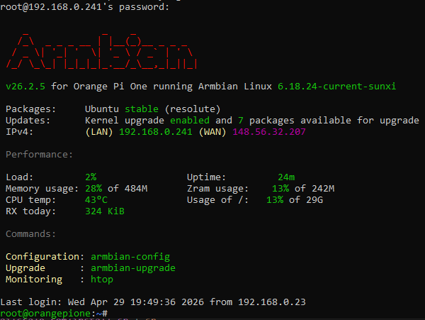

> [!NOTE]
> Por cierto, usé [este modelo](https://makerworld.com/es/models/200533-orange-pi-one-screwless-case?from=search#profileId-224685) de Maker World para empaquetarla, pintado con acrílicos.

Para [alimentarla](https://www.reddit.com/r/OrangePI/comments/1mn96q1/orange_pi_pc_1gb_h3_what_power_supply/?solution=2d85d0a0309c3bd02d85d0a0309c3bd0&js_challenge=1&token=bbbe4bf1c9a2b5160829c4be34da58618e61f2069b38d65f141cc6f8570f23be&jsc_orig_r=), uso un conector de de barril es de 4.0 mm exterior / 1.7 mm interior (centro pasivo) y una fuente de alimentación (convertidor AC-DC) de 5 V y 1,55 A que encontré por casa (recomiendan rango entre 1500 ÷ 2000 mA).

Le instalé un [Armbian 26.2.5 XFCE](https://armbian.com/es/boards/orangepione) (basado en Ubuntu 26.04 LTS) y para programarla la conecté al router por cable Ethernet (LAN) y localicé su IP mediante `nmap -sn 192.168.1.0/24` desde mi PC (o el rango concreto de mi red local), conectado a la misma red (por WiFi; es indiferente), para entrar por SSH. A veces [dan problemas](https://forum.armbian.com/topic/1435-boot-orange-pi-one-from-usb/) para entrar por SSH durante la quema del SO, pero a mi me fue bien a la primera.

`nmap -sn` solo dice qué IPs responden: **no etiqueta** cuál es la Orange Pi. Descartamos las que ya conocemos (e.g. `.1` == router, `.24` == ESP32) y, de entre el resto, la identificamos así:
- En el panel del router → clientes DHCP / dispositivos conectados: buscar el hostname `orangepi` / `orangepione` (Armbian) o la MAC del Ethernet.
- O probar SSH con cada candidata: `ssh root@192.168.1.XXX` (Armbian suele pedir cambiar la contraseña en el primer login).
- Si se tiene pantalla/teclado en la placa: `hostname -I` imprime su IP al instante.
- O filtrar por metadatos (hostname DNS / fabricante MAC; `sudo` hace falta para ver la MAC): `sudo nmap -sn 192.168.1.0/24 | grep -iE -B2 -A1 'orange|xunlong|allwinner'` (suele encajar el hostname Armbian [`orangepi...`] o el OUI de Xunlong/Allwinner).

Aquí sí la IP suele venir por DHCP: una reserva en el router (o IP estática en Armbian) es opcional y solo útil si quieres SSH/Nginx siempre en la misma IP LAN; aunque con Tailscale + MagicDNS (`quintanacam`) no hace falta, porque el acceso remoto va por el nombre de la tailnet, no por la IP del Ethernet. Si más adelante cambias de router y la Pi quedó con IP fija de la subred anterior, ver el tip al final del checklist (_¿Cambias de casa o de router?_).

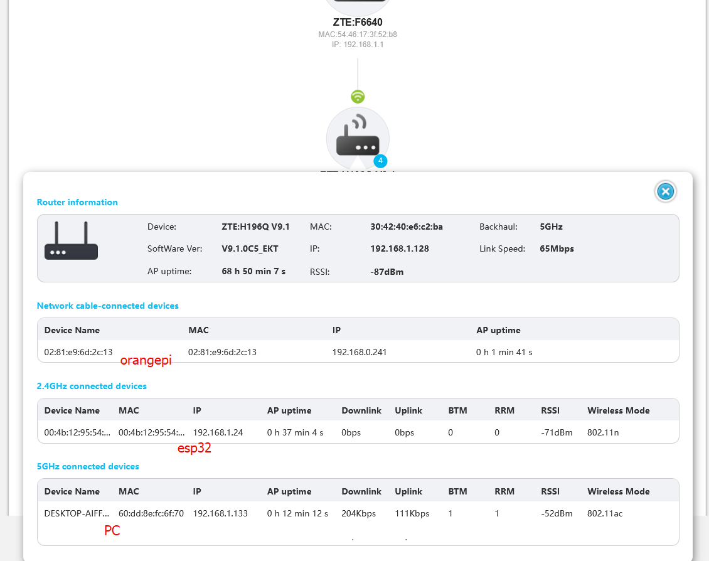

Tras entrar por primera vez, me descargué el cliente Remmina para entrar por escritorio remoto (protocolo RDP [_Remote Desktop Protocol_]) (válido para Linux, Windows y MacOS), que solo requiere instalar `xrdp` en el servidor y activar el servicio con `sudo systemctl start xrdp`.  

La idea es que la Orange Pi actúa como un **enrutador de subred**, de manera que sea un nodo de la red que sirva como puerta de enlace de la red para conectar todos los dispositivos de una subred (de interés) de la red privada física (de la casa) con otra red (e.g. yo desde el exterior u otra ciudad)

Y voy a aprovechar que ya tengo una cuenta en Tailsclae, que para el plan gratis permite nada más y nada menos que hasta 100 dispositivos en una única red (_tailnet_) para un máximo de 3 usuarios. Para instalar Tailscale en la Orange Pi, ejecutamos el [script oficial](https://tailscale.com/docs/install/linux):

```bash
curl -fsSL https://tailscale.com/install.sh | sh
```

Y tras instalar, iniciar el servicio y obtener el enlace de autenticación para loguearse desde (cualquier) navegador y añadir el dispositivo a la red tailnet:

```bash
sudo tailscale up
```

Una vez registrado, tendremos la Orange Pi añadida a la red privada con su respectiva IP privada asignada:

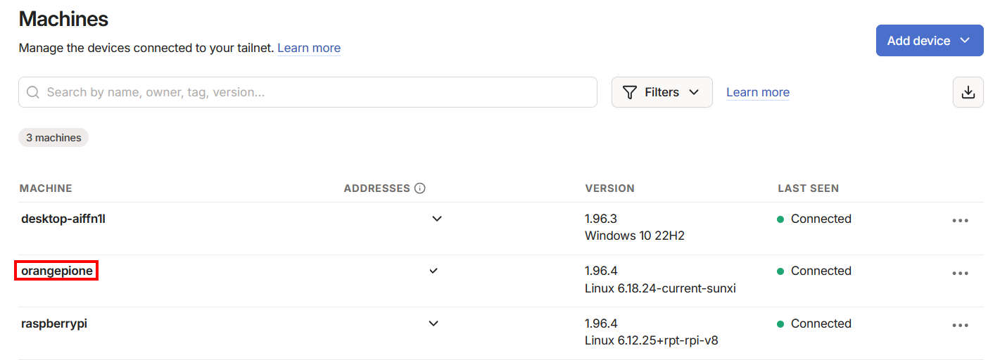

> [!NOTE]
> Desambiguación:
> Cuando estás en casa, accedes al ESP32 directamente por su IP local (e.g. `192.168.1.24`) y no hace falta nada más. Pero cuando estás fuera, tu móvil no puede ver esa red privada. Entonces, con Tailscale activo (en el móvil), tu móvil “pregunta” dentro de esa red virtual quién sabe llegar a esa IP... y la Orange Pi responde que ella sabe y hace de puente.
> La Orange Pi está conectada a **dos redes a la vez**: la red local y la red de Tailscale. Por eso puede recibir tráfico seguro desde fuera y pasarlo al (y desde el) ESP32 como si se estuviera en casa, sin abrir puertos ni complicarse con el router.

Ahora debemos configurar la Orange Pi como **enrutador de subred**, de manera que la Orange Pi le diga a Tailscale: "oye, si alguien pregunta por la IP local del ESP32, dirígemelo a mí". Esto es necesario para **conectarnos a dispositivos en los que no podemos instalar Tailscale**, precisamente como nuestro ESP32.

1. **Habilitar permanentemente el IP Forwarding en el kernel de Linux**, necesario para redirigir tráfico (permitir que el SO reenvíe paquetes de datos entre diferentes interfaces de red, actuando como router o pasarela [_gateway_])[:](https://archeando.wordpress.com/2013/09/23/el-sysctl-lo-cualo-lo-que/)

```bash
# Crear archivo de configuración para persistencia tras reinicios
echo 'net.ipv4.ip_forward = 1' | sudo tee -a /etc/sysctl.d/99-tailscale.conf
echo 'net.ipv6.conf.all.forwarding = 1' | sudo tee -a /etc/sysctl.d/99-tailscale.conf

# Aplicar los cambios inmediatamente sin reiniciar
sudo sysctl -p /etc/sysctl.d/99-tailscale.conf
```

Sin esto, Linux no deja a la Orange Pi actuar como puente entre Tailscale (`tailscale0`) y Ethernet (`eth0`).

2. **Anunciar la IP específica del ESP32**. En lugar de abrir el rango completo (e.g. `192.168.1.0/24`), utilizaremos la notación `/32` (un solo host, no toda la subred), que le dice a Tailscale que la Orange Pi solo ofrece acceso al ESP32:

```bash
sudo tailscale up --advertise-routes=192.168.1.24/32 --snat-subnet-routes
```

> `--snat-subnet-routes` hace que el ESP32 vea la Orange Pi como origen del tráfico (no la IP Tailscale del móvil). Sin esto, el ESP32 intenta responder al router y la conexión suele fallar.

Para que el comando persista tras reinicios, crea `/etc/systemd/system/tailscale-up.service` o usa un script en `/var/lib/tailscale/`; lo más simple es añadir el flag al arranque:

```bash
sudo tailscale set --advertise-routes=192.168.1.24/32 --snat-subnet-routes
```

Y autorizar la ruta en el panel de tailscale, que no la activa automáticamente (por seguridad: tú decides qué subredes confías). Para esto hay que buscar la Orange Pi en la lista de dispositivos => _Edit route settings_ y activar la ruta específica en el apartado _Subnet routes_. Asegurarse de que la opción _Approve all_ esté desactivada para mantener el control manual.

### Nginx y portal web

La Orange Pi hace de **proxy inverso** con contraseña y sirve el portal (`/`, `/cam/`, `/panel/`). El ESP32 manda el MJPEG en el **puerto 81**; Nginx lo expone en `/stream` y `/cam/` lo muestra con un `` (sin JavaScript del firmware, sin CORS ni `sub_filter`). Los controles del firmware viven aparte en `/panel/` (para vídeo se usa `/cam/`, no el botón **Stream** del panel, que daba problemas cuando no se accedía directamente en local al ESP32).

**1. Instalar Nginx y crear usuario** (e.g. `cam`):

```bash
sudo apt update
sudo apt install nginx apache2-utils
sudo htpasswd -c /etc/nginx/.htpasswd-cam cam
```

**2. Copiar la imagen de fondo:**

```bash
sudo mkdir -p /var/www/quintanacam
sudo cp ~/Imagenes/background_quintana.jpg /var/www/quintanacam/
```

**3. Crear los tres HTML** en `/var/www/quintanacam/` (`login.html`, `index.html`, **`panel.html`** — si falta este último, `/panel/` devuelve 404). Contenido en el apartado siguiente.

Tras crearlos:

```bash
sudo chown -R www-data:www-data /var/www/quintanacam
ls -la /var/www/quintanacam/login.html /var/www/quintanacam/index.html /var/www/quintanacam/panel.html
```

### Archivos HTML del portal

Al entrar en `http://quintanacam/` se ve la pantalla de bienvenida (sin contraseña). Desde ahí se enlaza a `/cam/` (streaming) o `/panel/` (controles); ambas rutas piden `cam` + contraseña.

`/var/www/quintanacam/login.html` (pantalla de entrada — es lo que se ve al abrir `http://quintanacam/`):

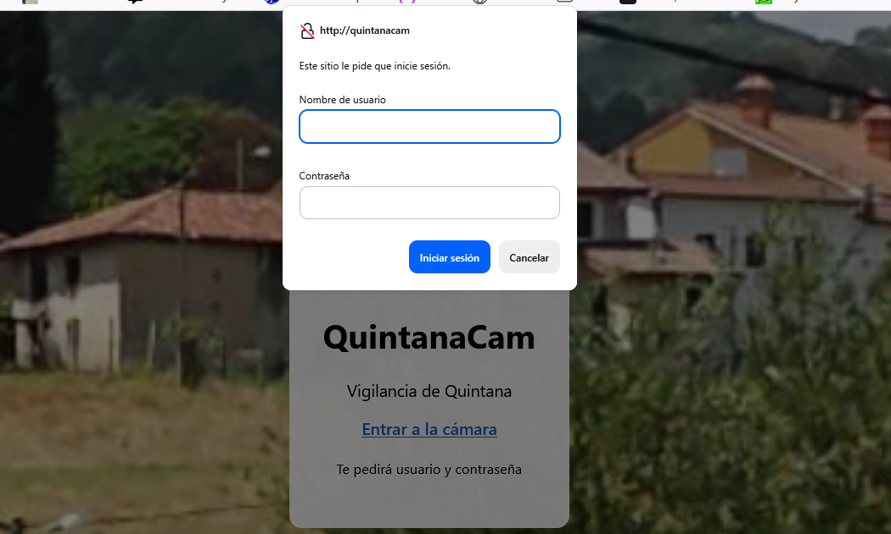

```html
<!DOCTYPE html>
<html lang="es">
<head>
  <meta charset="utf-8">
  <meta name="viewport" content="width=device-width, initial-scale=1">
  <title>QuintanaCam — Acceso</title>
  <style>
    body {
      margin: 0;
      min-height: 100vh;
      display: flex;
      align-items: center;
      justify-content: center;
      background: url('/background_quintana.jpg') center / cover no-repeat fixed;
      font-family: system-ui, sans-serif;
    }
    .card {
      background: rgba(255,255,255,0.92);
      padding: 2rem;
      border-radius: 12px;
      text-align: center;
      max-width: 360px;
    }
    a { color: #1a5fb4; font-weight: 600; }
  </style>
</head>
<body>
  <div class="card">
    <h1>QuintanaCam</h1>
    <p>Vigilancia de Quintana</p>
    <p><a href="/cam/">Ver en vivo</a></p>
    <p><a href="/panel/">Controles del firmware</a></p>
    <p><small>Te pedirá usuario y contraseña</small></p>
  </div>
</body>
</html>
```

`/var/www/quintanacam/index.html` (vídeo en vivo en `/cam/` — solo frames, sin panel del ESP32):

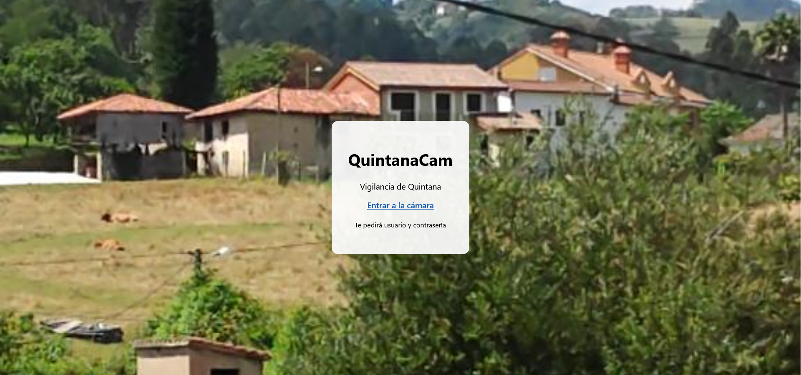

```html
<!DOCTYPE html>
<html lang="es">
<head>
  <meta charset="utf-8">
  <meta name="viewport" content="width=device-width, initial-scale=1">
  <title>QuintanaCam — En vivo</title>
  <style>
    * { box-sizing: border-box; }
    body {
      margin: 0;
      min-height: 100vh;
      background: url('/background_quintana.jpg') center / cover no-repeat fixed;
      display: flex;
      flex-direction: column;
      align-items: center;
      padding: 1rem;
      font-family: system-ui, sans-serif;
    }
    body::before {
      content: "";
      position: fixed;
      inset: 0;
      background: rgba(0, 0, 0, 0.35);
      z-index: 0;
    }
    h1, nav, #stream, .hint {
      position: relative;
      z-index: 1;
    }
    h1 {
      color: #fff;
      text-shadow: 0 2px 8px rgba(0,0,0,.6);
      margin-bottom: 0.5rem;
    }
    nav a {
      color: #cde4ff;
      margin: 0 0.5rem;
    }
    #stream {
      width: min(960px, 100%);
      max-height: 70vh;
      object-fit: contain;
      border-radius: 12px;
      box-shadow: 0 8px 32px rgba(0,0,0,.4);
      background: #111;
    }
    .hint {
      color: rgba(255,255,255,0.85);
      font-size: 0.9rem;
      margin-top: 0.75rem;
    }
  </style>
</head>
<body>
  <h1>QuintanaCam</h1>
  <nav><a href="/panel/">Controles del firmware</a> · <a href="/">Inicio</a></nav>
  
</body>
</html>
```

`/var/www/quintanacam/panel.html` (panel completo del ESP32 en `/panel/` [resolución, saturación, ganancia, efectos...]):

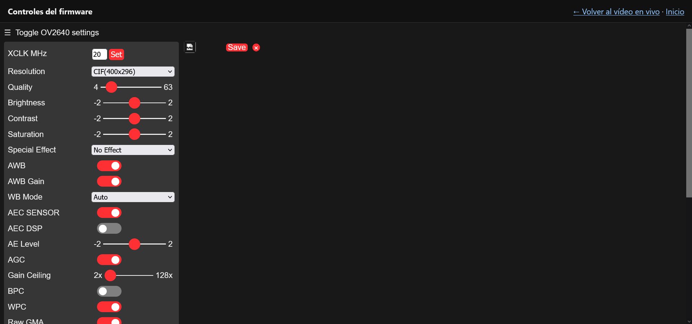

```html
<!DOCTYPE html>
<html lang="es">
<head>
  <meta charset="utf-8">
  <meta name="viewport" content="width=device-width, initial-scale=1">
  <title>QuintanaCam — Controles</title>
  <style>
    * { box-sizing: border-box; }
    body {
      margin: 0;
      min-height: 100vh;
      background: #1a1a1a;
      display: flex;
      flex-direction: column;
      font-family: system-ui, sans-serif;
    }
    header {
      display: flex;
      align-items: center;
      justify-content: space-between;
      gap: 1rem;
      padding: 0.75rem 1rem;
      background: #111;
      color: #eee;
      border-bottom: 1px solid #333;
    }
    header a { color: #8ec5ff; }
    #panel {
      flex: 1;
      width: 100%;
      min-height: 80vh;
      border: none;
      background: #000;
    }
  </style>
</head>
<body>
  <header>
    <strong>Controles del firmware</strong>
    <nav>
      <a href="/cam/">← Volver al vídeo en vivo</a>
      · <a href="/">Inicio</a>
    </nav>
  </header>
  <iframe id="panel" src="/esp32/" title="Panel ESP32-CAM"></iframe>
</body>
</html>
```

**4. Sitio `/etc/nginx/sites-available/quintanacam`** (después de crear los tres HTML):

```nginx
server {
    listen 80;
    server_name quintanacam quintanacam.casa orangepione;

    root /var/www/quintanacam;
    access_log off;
    error_log /var/log/nginx/quintanacam-error.log warn;

    auth_basic "QuintanaCam";
    auth_basic_user_file /etc/nginx/.htpasswd-cam;

    # Fondo del login (público)
    location = /background_quintana.jpg {
        auth_basic off;
        try_files /background_quintana.jpg =404;
    }

    location = / {
        auth_basic off;
        try_files /login.html =404;
    }

    location = /cam  { return 301 /cam/; }
    location = /cam/ { try_files /index.html =404; }

    location = /panel  { return 301 /panel/; }
    location = /panel/ { try_files /panel.html =404; }

    # MJPEG en vivo (usado por /cam/)
    location /stream {
        proxy_pass http://192.168.1.24:81/stream;
        proxy_http_version 1.1;
        proxy_set_header Host $host;
        proxy_read_timeout 300s;
        proxy_buffering off;
    }

    # Panel del firmware (iframe en /panel/)
    location /esp32/ {
        rewrite ^/esp32/(.*) /$1 break;
        proxy_pass http://192.168.1.24;
        proxy_http_version 1.1;
        proxy_set_header Host $host;
        proxy_read_timeout 300s;
    }

    # API del firmware (el JS del panel usa origin, sin prefijo /esp32/)
    location ~ ^/(control|status|capture|bmp|jpg|xclk|reg|greg|pll|resolution) {
        proxy_pass http://192.168.1.24;
        proxy_http_version 1.1;
        proxy_set_header Host $host;
        proxy_read_timeout 300s;
    }
}
```

**5. Activar y recargar:**

```bash
sudo ln -sf /etc/nginx/sites-available/quintanacam /etc/nginx/sites-enabled/
sudo rm -f /etc/nginx/sites-enabled/default
sudo nginx -t && sudo systemctl reload nginx
```

**6. Ajuste global en `/etc/nginx/nginx.conf`** (dentro del bloque `http { ... }`) para no desgastar la microSD:

```nginx
access_log off;
```

| URL | Qué ves |
|-----|---------|
| `http://quintanacam/` | Pantalla de bienvenida (sin contraseña) |
| `http://quintanacam/cam/` | Vídeo en vivo MJPEG (pide `cam` + contraseña) |
| `http://quintanacam/panel/` | Controles del firmware en iframe (misma contraseña) |

QR para acceder a la "aplicación":


### Alias amigable (tipo `quintanacam.com` en lugar de una IP)

Tailscale **no permite** añadir registros DNS arbitrarios en MagicDNS (e.g. inventar `quintanacam.com` sin más); si no se compra el dominio, lo recomendado es usar la opción A, que es lo más parecido a lo deseado.

| Opción | Cómo | ¿Hace falta comprar el dominio? |
|---|---|---|
| **A. MagicDNS (recomendado)** | En [admin.tailscale.com](https://login.tailscale.com/admin/machines) renombrar la Orange Pi a `quintanacam`. Con MagicDNS activo (DNS → MagicDNS ON), desde cualquier dispositivo en la tailnet: `http://quintanacam/` | No |
| **B. Nombre completo Tailscale** | `http://quintanacam.<tu-tailnet>.ts.net` | No |
| **C. `tailscale serve` + HTTPS** | En la Orange Pi: `sudo tailscale serve --bg http://127.0.0.1:80` → HTTPS automático en el nombre MagicDNS | No |
| **D. Dominio propio (`quintanacam.com`)** | Split DNS en Tailscale apuntando a un mini DNS (CoreDNS, Pi-hole...) **o** registro público A → IP Tailscale de la Orange Pi (solo accesible con tailnet activa) | Sí (para `.com` real) |


**Flujo con alias (opción A + Nginx):**

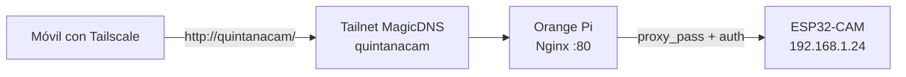

Desde fuera de casa: activar Tailscale en el móvil → abrir `http://quintanacam/` (si Nginx está en la Orange Pi y la ruta `/32` del ESP32 está aprobada, o acceder por la IP LAN de la Orange Pi si se anunció toda la subred).

Finalmente, para acceder al streaming sin Nginx, basta con instalar la app de Tailscale en el móvil, conectarse con la misma cuenta y activarla, para ingresar en el navegador la IP estática del ESP32:

```text
http://192.168.1.24
```

Con Nginx + alias: `http://quintanacam/` (usuario/contraseña del `htpasswd`).

### Cuidar la SD

Para que la tarjeta de memoria [SanDisk Ultra](https://es.aliexpress.com/item/1005007501610476.html), que contiene el SO de la Orange Pi, dure años, se recomienda mitigar la escritura constante, e.g.:

- Instalando `zram-tools` para manejar logs en RAM (evita que cada log del sistema degrade la microSD; la swap comprimida va a RAM en lugar de disco): `sudo apt install zram-tools`. Para verificar que funciona, deberíamos ver algo como:

```bash
root@orangepione:~# swapon --show
NAME       TYPE        SIZE  USED PRIO
/dev/zram0 partition 242.3M 46.5M    5

root@orangepione:~# zramctl
NAME       ALGORITHM DISKSIZE  DATA  COMPR TOTAL STREAMS MOUNTPOINT
/dev/zram1 zstd           50M  1.6M 393.7K  1.5M         /var/log
/dev/zram0 lzo-rle     242.3M 44.5M  15.2M 16.8M         [SWAP]
```

- Nginx con autenticación y sin logs de acceso: ver apartado anterior (`/etc/nginx/sites-available/quintanacam`).

## Checklist: montaje y acceso remoto desde cero

Recorre en orden la siguiente lista y tendrás el sistema montado al completo:

### A. ESP32-CAM (nodo cámara)

- [ ] Flashear `CameraWebServer` (Arduino IDE, placa **AI Thinker ESP32-CAM**, partición **Huge APP** — sin esta partición el sketch no cabe en flash)
- [ ] Definir `CAMERA_MODEL_AI_THINKER`, SSID y contraseña WiFi
- [ ] Configurar IP estática `192.168.1.24` en el sketch (`WiFi.config`; no hace falta reserva DHCP en el router)
- [ ] Verificar en monitor serie: `Camera Ready! Use 'http://192.168.1.24'`
- [ ] Desde un PC en la misma WiFi, abrir `http://192.168.1.24` y ver el stream
- [ ] (Opcional) Antena externa: puenteo de antena de traza + pigtail IPEX (más alcance, para el jardín, etc.)

### B. Orange Pi (centralita)

- [ ] Armbian instalado, Ethernet al router, SSH funcional (`nmap -sn` lista hosts; descartar `.1`/ESP32 y mirar hostname en el router o `ssh root@…` a las candidatas)
- [ ] IP LAN de la Orange Pi anotada (e.g. `192.168.1.134` por DHCP; útil en casa, pero con MagicDNS el acceso remoto no depende de ella)
- [ ] `sudo apt update && sudo apt upgrade`
- [ ] (Opcional) `sudo apt install zram-tools` (logs en RAM → menos desgaste de la microSD)
- [ ] Instalar Tailscale: `curl -fsSL https://tailscale.com/install.sh | sh`
- [ ] `sudo tailscale up` y autenticar en el navegador (añade la Orange Pi a tu red privada virtual)
- [ ] IP forwarding persistente (`/etc/sysctl.d/99-tailscale.conf`) — necesario para que la Orange Pi reenvíe tráfico del móvil hacia el ESP32
- [ ] `sudo tailscale set --advertise-routes=192.168.1.24/32 --snat-subnet-routes` (anuncia “sé llegar al ESP32”; SNAT para que el ESP32 pueda responder)
- [ ] En [admin Tailscale](https://login.tailscale.com/admin/machines) → Orange Pi → **Edit route settings** → aprobar `192.168.1.24/32` (sin este clic en el panel, la ruta no funciona)
- [ ] Activar **MagicDNS** en DNS → MagicDNS (resuelve `quintanacam` sin escribir IPs)
- [ ] (Opcional) Renombrar máquina a `quintanacam` para alias corto en el navegador

### C. Nginx (proxy + portal)

- [ ] `sudo apt install nginx apache2-utils`
- [ ] `sudo htpasswd -c /etc/nginx/.htpasswd-cam cam`
- [ ] Copiar `background_quintana.jpg` + crear `login.html`, `index.html`, `panel.html` en `/var/www/quintanacam/`
- [ ] Crear `/etc/nginx/sites-available/quintanacam` (config única del post: `/stream` + portal)
- [ ] `sudo ln -sf ... sites-enabled/` y `sudo nginx -t`
- [ ] `access_log off` en `nginx.conf`
- [ ] Probar `http://quintanacam/` → login, `/cam/` → vídeo, `/panel/` → controles

### D. Acceso remoto (fuera de casa)

- [ ] Tailscale instalado en el móvil/PC remoto, misma cuenta que la Orange Pi
- [ ] Tailscale **activo** (icono conectado; si está off, no ves la red de casa)
- [ ] Probar `http://192.168.1.24` en el navegador remoto (acceso directo al ESP32 vía subnet route)
- [ ] Si falla: revisar ruta aprobada en admin y `--snat-subnet-routes`
- [ ] Con Nginx: probar `http://quintanacam/` (MagicDNS) o `http://<IP-orange-pi>/` (proxy con contraseña)
- [ ] (Opcional) `sudo tailscale serve --bg http://127.0.0.1:80` (HTTPS automático en el nombre `.ts.net`)

> [!TIP]
> **¿Cambias de casa o de router?** Has de modificar someramente el firmware del ESP32 y la Orange Pi si cambia la red local o la IP de la cámara.
>
> **En el ESP32** (volver a flashear o subir el sketch):
> - `ssid` y `password` → WiFi de la nueva vivienda.
> - `local_IP`, `gateway` y `subnet` → adaptarlos al rango del router nuevo (p. ej. `192.168.1.24` y gateway `192.168.1.1`) y volver a flashear. No hace falta reserva DHCP en el router: la IP ya va fijada en el sketch; si el rango sigue siendo `192.168.1.x`, puedes reutilizar la misma `local_IP`.
>
> **En la Orange Pi (servidor):**
> - Preferible dejar Ethernet en **DHCP** (no IP fija en Armbian). Si en el router viejo le fijaste a mano una IP de otra subred (p. ej. `192.168.0.241` y el nuevo es `192.168.1.x`), el cable “conecta” pero el PC no la ve ni recibe DHCP: `nmap`/ping fallan y puedes confundir tu propia IP Windows con la de la Pi.
> - **Recuperación sin pantalla/teclado:** cable Ethernet directo PC ↔ Orange Pi; en el PC pon IP manual temporal en la subred vieja (p. ej. `192.168.0.10` / `255.255.255.0`, gateway vacío; comprueba con `ipconfig` que **no** sigues en `192.168.1.x`); `ssh root@192.168.0.241` (o la IP que muestre el router en “dispositivos por cable”); en la Pi pasa Ethernet a DHCP (`nmcli` / `nmtui`); devuelve el PC a DHCP automático y vuelve a enchufar la Pi al router; localiza la IP nueva con `nmap` descartando router, ESP32, mesh y **tu PC**.
> - Si ya estás en la subred buena y solo cambió la del ESP32: `/etc/nginx/sites-available/quintanacam` → sustituir `192.168.1.24` en los `proxy_pass`; `sudo nginx -t && sudo systemctl reload nginx`. Tailscale: `sudo tailscale set --advertise-routes=<IP_ESP32>/32 --snat-subnet-routes` y **aprobar** la ruta en [admin Tailscale](https://login.tailscale.com/admin/machines).
>
> El portal (`quintanacam`, `/cam/`, `/panel/`) y el usuario `cam` de Nginx **no cambian** si es la misma Orange Pi. Solo cambia la IP a la que el proxy apunta por dentro.

### Qué queda por hacer (estado del proyecto)

| Componente | En el post | ¿Implementado en hardware? |
|---|---|---|
| Alimentación solar 24/7 | Mejoras pendientes | Panel solo → falla de noche |
| Multicliente en el stream | [Mejoras pendientes](#varios-clientes-stream) | 1 espectador vía proxy al ESP32 |

## Conclusiones

Esta manera de configurar el acceso al streaming la considero buena porque nos da seguridad (no abrimos puertos de ningún router directamente, por tanto prevenimos ataques por fuerza bruta), simplicidad (no necesitamos configurar DDNS ni certificados SSL complejos, pues Tailscale ya cifra la conexión punto a punto) y robustez (la Orange Pi consume muy poco [menos de 1 A] y puede estar encendida 24/7 sin degradarse, a diferencia de un PC).

Bien es cierto que la cámara no funcionará de noche ni a horas vespertinas sin un módulo de batería (si es que está en el exterior); pero esto podríamos dejarlo como mejora para una futura actualización de nuestro próximo sistema de vigilancia casual.

## Referencias

- [ESP32 CAM Conexión y Configuración Desde Cero Paso a Paso](https://www.youtube.com/watch?v=6l_viCqZrz4&t=67s)
- [ESP32-CAM surveillance (YouTube)](https://www.youtube.com/watch?v=Ul0h5Maeoeg)
- [Carcasa ESP32-CAM (YouTube)](https://www.youtube.com/watch?v=GNP_wO85WBY)
- [Panel solar en cámara de seguridad (RedesZone)](https://www.redeszone.net/noticias/power/anadir-pequeno-panel-solar-camara-seguridad/)
- [Instalación solar CCTV (ICSeeCam)](https://www.icseecam.com/es/how-to-install-solar-cctv-camera/)
- [Alimentación ESP32 solar (Reddit)](https://www.reddit.com/r/esp32/comments/1js3q3p/what_should_i_use_to_power_a_esp32s3_wroom_n16r8/)
- [RaspiCam docs](https://www.raspberrypi.com/documentation/accessories/camera.html) · [raspi-cam-srv](https://github.com/signag/raspi-cam-srv) · [Sentry-Picam](https://github.com/TinkerTurtle/Sentry-Picam)

## Mejoras pendientes (próxima iteración)

Tareas concretas para cuando retome el prototipo:

### 1. Arreglar la alimentación solar

**Problema:** el panel de 10 W rinde ~6–7 W en la práctica; los picos de WiFi (hasta 500 mA) provocan reinicios.

**Opción A — Parche rápido:** soldar un condensador electrolítico de **≥1000 µF** entre `5V` y `GND` del ESP32 (o en el cable de alimentación, menos recomendable).

**Opción B — Solución definitiva:** montar la cadena completa:

```
Panel 6V → Módulo de carga solar (CN3065, no TP4056) → Batería 18650/LiPo 2000–3000 mAh → Regulador 5V ≥1A → ESP32
```

### 2. Hacer viable el funcionamiento 24/7

El patrón que falla: panel pequeño + WiFi siempre activo + sin _deep sleep_ + cargador simple → de día funciona, de noche muere.

**Estrategia:**

| Medida | Detalle |
|---|---|
| Deep sleep | Despertar cada 1–10 min, capturar/enviar, volver a dormir |
| Panel | Mínimo 5 W (justo), recomendable 10 W+ con batería |
| Batería | 2000–3000 mAh como buffer nocturno |
| Software | Apagar WiFi de noche o pasar a modo snapshot en lugar de streaming continuo |

### 3. Varios clientes viendo el stream a la vez
{: #varios-clientes-stream}

**Problema:** Nginx hace `proxy_pass` a `/stream` del ESP32 por cada espectador; el `CameraWebServer` apenas aguanta **un** cliente MJPEG (RAM/CPU/WiFi). El segundo se queda a tirones o no arranca. Nginx no reparte un único flujo: multiplica la carga en la cámara.

**Enfoque:** la Orange Pi consume el MJPEG **una** vez (ffmpeg / gstreamer) y lo redistribuye a N navegadores (HLS, RTMP o WebRTC), dejando al ESP32 una sola conexión upstream.

## Mejoras, versiones futuras e ideas

Notas condensadas de exploraciones paralelas y posibles evoluciones del sistema.

### v2 — Hardware y mecánica

- **Carcasa mejorada:** tapa exterior intercambiable (interior fija) para probar distintos sensores; montaje con doble cara, trípode o ball-joint; interior acolchado contra golpes y vibraciones. Modelos de referencia en [Thingiverse](https://www.thingiverse.com/thing:6106534), [MakerWorld](https://makerworld.com/es/models/175379-esp32-cam-case-ball-joint-mount) y [Printables](https://www.printables.com/).
- **Visión nocturna:** módulo IR o cámara con LED infrarrojo; sin esto, el sistema actual solo sirve de día.
- **Detección de movimiento en el borde:** YOLO / ESP-WHO para disparar capturas solo ante personas o animales, en lugar de streaming continuo. Referencia: [proyecto YOLOv8 en LinkedIn](https://www.linkedin.com/posts/rizwan-muzammal-9a3557299_myproject-yolov8-security-activity-7308388627292569601-CaVG).
- **Placas alternativas:** [OpenMV](https://www.linkedin.com/posts/jordanrlinn_openmv-llc-just-launched-two-new-edge-ai-ugcPost-7309264023936557056-lqz5) (YOLO en PCB), [Arducam Pico4ML](https://www.arducam.com/pico4ml-an-rp2040-based-platform-for-tiny-machine-learning/), ESP32-S3 con más PSRAM para modelos cuantizados o incluso un [LLM diminuto](https://github.com/AIWintermuteAI/esp32-llm).

### v2 — Software y conectividad

- **Multicliente:** restream en la Orange Pi (una sola lectura del ESP32 → HLS/RTMP/WebRTC a varios navegadores); ver [varios clientes viendo el stream a la vez](#varios-clientes-stream).
- **Modo híbrido:** streaming cuando hay red y usuario conectado; si no, grabación local por detección de movimiento.
- **MQTT + broker en la nube** (flespi.io, EMQX) como alternativa más robusta que HTTP directo ante cortes de WiFi; visualización vía Telegram Bot o Node-RED en la Orange Pi.
- **Framework Blynk** para app móvil propia sin desarrollar frontend: [tutorial](https://www.youtube.com/watch?v=34qj3b6AK4w), [servidor self-hosted](https://github.com/mariorht/blynk-server).
- **Proxy con contraseña** (Nginx) y aislamiento máximo del nodo central respecto a Internet abierta.
- Proyecto de referencia muy completo: [ESP32-Cam-Security-Node](https://github.com/zerneo85/ESP32-Cam-Security-Node).
- **PirateBox** como modo offline sin infraestructura de red.

### v3 — Otras arquitecturas de cámara

| Enfoque | Ventaja | Inconveniente |
|---|---|---|
| **Cámara IP comercial** (Hikvision, Dahua, ONVIF/RTSP) | Calidad, IR, PoE, fiabilidad | Coste, menos _hacker-friendly_ |
| **Cámara solar 4G** (Reolink, ieGeek, Eufy, Nivian...) | Autónoma, sin WiFi de casa | SIM de datos (2–15 GB/mes según uso); eSIM de fabricante ~11 €/mes vs SIM propia 2–7 €/mes |
| **LoRa / HC-12 (433 MHz)** | Largo alcance RF, bajo consumo | Muy poco ancho de banda; solo fotos/eventos, no vídeo |
| **4G + WebRTC** ([ejemplo Badillo](https://github.com/rbadillo/car-webrtc-public)) | Acceso remoto sin WiFi local | Complejidad y coste de datos |
| **Raspberry Pi + RaspiCam** | Ecosistema maduro, muchos repos | Más consumo y coste que ESP32 |

Para cámaras RTSP comerciales se puede reenviar el stream con [rtsp.me](https://rtsp.me/es/) o incrustarlo en web vía VLC/ActiveX ([StackOverflow](https://stackoverflow.com/questions/2245040/how-can-i-display-an-rtsp-video-stream-in-a-web-page)).