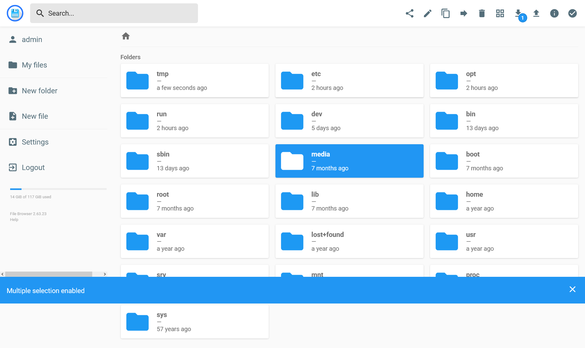

## Introducción



Tengo una [Raspberry Pi](https://www.raspberrypi.com/) en casa que uso como servidor: servicios sueltos, discos montados en `/media`, scripts, backups... El acceso habitual es por [SSH](https://en.wikipedia.org/wiki/Secure_Shell) desde el portátil, a veces por la red local y a veces por [Tailscale](https://tailscale.com/). Funciona, pero **mover, subir o reorganizar ficheros** desde el móvil o desde un navegador se vuelve un rollo: `scp`, `rsync`, montajes, apps de SFTP, firewall de Windows, etc.

La motivación de este post es precisamente **usar un gestor de archivos en el navegador** (ver, crear, borrar, editar y, sobre todo, **arrastrar ficheros** para copiarlos) apuntando a la Pi, sin abrir el router a Internet y sin escribir una web casera desde cero.

## El problema (en corto)

El flujo típico era:

1. Abrir una sesión SSH a la Pi.
2. Recordar rutas absolutas (`/home/...`, `/media/...`).
3. Para subir algo grande, montar `scp`/`rsync` o una app extra.
4. Desde fuera de casa, depender de Tailscale.

No es que SSH esté mal, sino que para **explorar y manipular ficheros**, para previsualizar imágenes y vídeos, etc., la interfaz natural hoy es el navegador. Así que busquemos si **ya existe** algo que haga exactamente eso.

Y sí: existe, e.g. [FileBrowser](https://github.com/filebrowser/filebrowser).

## Por qué FileBrowser (y no inventar la rueda)

[FileBrowser](https://github.com/filebrowser/filebrowser) es un gestor de archivos self-hosted: un binario (o contenedor Docker) que sirve una UI web sobre un directorio raíz. Subidas con drag and drop, previsualización, edición básica, usuarios y permisos. Justo el caso de uso.

**_Si el problema es genérico, alguien ya lo resolvió en GitHub_**. El repositorio original está en proceso, pero los releases y las imágenes Docker están disponibles; para un uso doméstico detrás de LAN/VPN es más que suficiente. Hay forks mantenidos más avanzados (e.g. FileBrowser Quantum), pero para este despliegue bastó la versión clásica.

## Despliegue mínimo

La instalación vive en un script `install.sh` pensado para ejecutarse **en la propia Pi**. Este descarga el binario para la arquitectura, inicializa la base de datos, crea el usuario admin, escribe la unit de [systemd](https://systemd.io/) y la arranca.

```bash
cd /opt/pi-filemanager
chmod +x install.sh
sudo bash ./install.sh / 8080
```

Con root `/` se puede navegar tanto por el home como por `/media` desde la misma UI, que era lo que más nos importaba. El puerto por defecto es `8080`. Login inicial con contraseña larga (FileBrowser exige al menos 12 caracteres): conviene cambiarla en Settings al entrar.

Desde el PC:

- LAN: `http://<IP-local>:8080`.
- Tailscale: `http://<IP-tailscale>:8080`.

## Qué hace `install.sh`

El script es deliberadamente corto. A grandes rasgos:

1. **Re-ejecuta con `sudo`** si hace falta, pero guarda el usuario real (`SUDO_USER`) para que el servicio no corra como root.
2. **Detecta la arquitectura** (`linux-arm64`, `armv7`, `amd64`...) y descarga el comprimido _tarball_ del release desde GitHub.
3. **Instala el binario** en `/opt/filebrowser`.
4. **Inicializa la DB** (`config init`), fija dirección `0.0.0.0`, puerto, raíz y método de auth.
5. **Crea el usuario admin** con contraseña configurable por `ADMIN_PASS`.
6. **Escribe** `/etc/systemd/system/filebrowser.service`, hace `daemon-reload` y `enable --now`.

Es decir: el script **ya incluye el servicio**. No hace falta pegar a mano un `.service` después, salvo que la instalación se quede a medias. El `install.sh` completo:

```bash
#!/usr/bin/env bash
set -euo pipefail

# Root `/` so you can browse /home/... and /media/...
ROOT_DIR="${1:-/}"
PORT="${2:-8080}"
INSTALL_DIR="/opt/filebrowser"
VERSION="2.63.23"
SERVICE_USER="${SUDO_USER:-$USER}"
# FileBrowser requires password length >= 12
ADMIN_PASS="${ADMIN_PASS:-Changeme12345}"

if [[ "$(id -u)" -ne 0 ]]; then
  echo "Re-running with sudo..."
  exec sudo bash "$0" "$@"
fi

if [[ "$SERVICE_USER" == "root" ]]; then
  echo "Run as a normal user with sudo, e.g.: sudo bash install.sh / 8080"
  exit 1
fi

case "$(uname -m)" in
  aarch64|arm64) ARCH="linux-arm64" ;;
  armv7l|armhf)  ARCH="linux-armv7" ;;
  x86_64|amd64)  ARCH="linux-amd64" ;;
  *) echo "Unsupported arch: $(uname -m)"; exit 1 ;;
esac

echo "==> Installing FileBrowser $VERSION ($ARCH)"
echo "    Root folder : $ROOT_DIR"
echo "    Port        : $PORT"
echo "    Run as user : $SERVICE_USER"

mkdir -p "$INSTALL_DIR"
TMP="$(mktemp -d)"
trap 'rm -rf "$TMP"' EXIT

URL="https://github.com/filebrowser/filebrowser/releases/download/v${VERSION}/${ARCH}-filebrowser.tar.gz"
echo "==> Downloading $URL"
curl -fsSL "$URL" -o "$TMP/fb.tgz"
tar -xzf "$TMP/fb.tgz" -C "$TMP"
install -m 755 "$TMP/filebrowser" "$INSTALL_DIR/filebrowser"

# Fresh DB + admin user — change password after first login
rm -f "$INSTALL_DIR/filebrowser.db"
"$INSTALL_DIR/filebrowser" config init --database "$INSTALL_DIR/filebrowser.db" >/dev/null
"$INSTALL_DIR/filebrowser" config set \
  --database "$INSTALL_DIR/filebrowser.db" \
  --address 0.0.0.0 \
  --port "$PORT" \
  --root "$ROOT_DIR" \
  --auth.method=json >/dev/null
"$INSTALL_DIR/filebrowser" users add admin "$ADMIN_PASS" --database "$INSTALL_DIR/filebrowser.db" --perm.admin >/dev/null

# Ensure service user can reach common media mounts
usermod -aG plugdev "$SERVICE_USER" 2>/dev/null || true

chown -R "$SERVICE_USER:$SERVICE_USER" "$INSTALL_DIR"

cat > /etc/systemd/system/filebrowser.service <<EOF
[Unit]
Description=FileBrowser web file manager
After=network.target

[Service]
Type=simple
User=$SERVICE_USER
Group=$SERVICE_USER
WorkingDirectory=$INSTALL_DIR
ExecStart=$INSTALL_DIR/filebrowser --database $INSTALL_DIR/filebrowser.db
Restart=on-failure
RestartSec=3

[Install]
WantedBy=multi-user.target
EOF

systemctl daemon-reload
systemctl enable --now filebrowser.service

IP_LAN="$(hostname -I 2>/dev/null | awk '{print $1}')"
echo
echo "OK — FileBrowser is running."
echo "  Open:  http://${IP_LAN}:${PORT}"
echo "  Also:  http://$(hostname):${PORT}  (or your Tailscale IP)"
echo "  Login: admin / $ADMIN_PASS   ← change this immediately in Settings"
echo "  Tip:   root is $ROOT_DIR — open /home/alejandro and /media from the UI"
echo
echo "Manage:"
echo "  sudo systemctl status filebrowser"
echo "  sudo systemctl restart filebrowser"
echo "  sudo journalctl -u filebrowser -f"
echo
echo "To expose another folder later:"
echo "  sudo $INSTALL_DIR/filebrowser config set --database $INSTALL_DIR/filebrowser.db --root /path"
echo "  sudo systemctl restart filebrowser"
```

Comandos útiles una vez levantado:

```bash
sudo systemctl status filebrowser
sudo systemctl restart filebrowser
sudo journalctl -u filebrowser -f
```

Si más adelante se quiere cambiar la carpeta raíz:

```bash
sudo /opt/filebrowser/filebrowser config set \
  --database /opt/filebrowser/filebrowser.db --root /
sudo systemctl restart filebrowser
```

## Consideraciones adicionales

- **Contraseña corta**: versiones recientes rechazan passwords de menos de 12 caracteres.
- **`/media` y permisos**: FileBrowser puede _mostrar_ la ruta, pero si el montaje USB es de root u otro usuario, la UI no inventa permisos. Ahí el problema es del montaje, no del binario.
- **Exposición**: la web escucha en `0.0.0.0` dentro de la Pi. En casa, LAN + Tailscale suele bastar; no es lo mismo que publicar el puerto 8080 en el router hacia Internet sin más capas.

## Referencias

- [filebrowser/filebrowser](https://github.com/filebrowser/filebrowser).
- [Tailscale](https://tailscale.com/).
- [systemd](https://systemd.io/).
