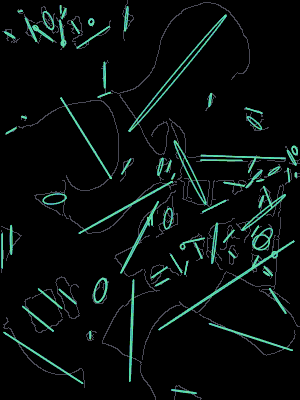
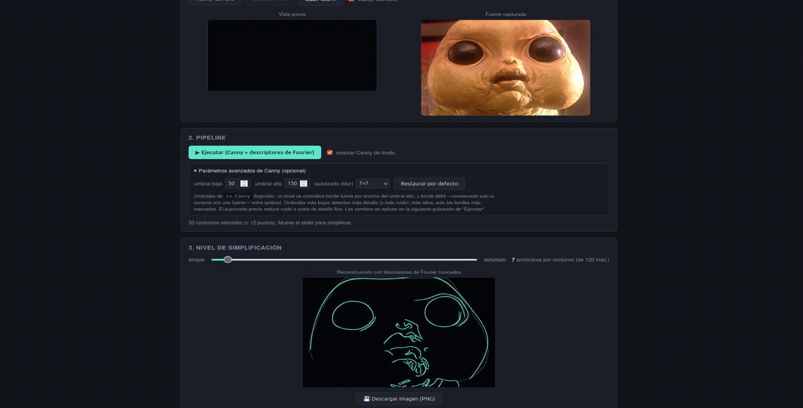

Demo web (todo en un `index.html`, sin build ni backend) que captura una cara por cámara o foto, detecta sus bordes y reconstruye los contornos usando **descriptores de Fourier**, permitiendo ver en vivo cómo la silueta se simplifica al retener solo los armónicos más bajos.

## Teoría: descriptores de Fourier de un contorno

Un contorno cerrado de $$n$$ puntos $$(x_k, y_k)$$, $$k = 0, \ldots, n-1$$, se puede ver como una secuencia de números complejos:

$$
z_k = x_k + i y_k
$$

Al ser una función periódica discreta (el contorno es cerrado: $$z_0$$ sigue a $$z_{n-1}$$), admite una **Transformada Discreta de Fourier (DFT)**:

$$
Z_m = \sum_{k=0}^{n-1} z_k \, e^{-i 2\pi m k / n}, \qquad m = 0, \ldots, n-1
$$

Cada coeficiente complejo $$Z_m$$ es un **descriptor de Fourier**: representa la contribución de la frecuencia (armónico) $$m$$ a la forma del contorno.

- $$Z_0$$ es el centroide del contorno (frecuencia 0, componente continua).
- $$Z_1$$ y $$Z_{n-1}$$ (frecuencias $$+1$$ y $$-1$$) describen la elipse que mejor aproxima la forma.
- Los armónicos de índice más alto ($$abs(m)$$ grande) codifican los detalles finos y las irregularidades del borde (curvatura, esquinas, ruido).

La transformada es invertible: la DFT inversa reconstruye exactamente el contorno original a partir de **todos** sus coeficientes:

$$
z_k = \frac{1}{n} \sum_{m=0}^{n-1} Z_m \, e^{i 2\pi m k / n}
$$

La idea principal de este experimento es que **no hace falta usar todos los coeficientes**. Si en la reconstrucción solo se suman los términos cuya frecuencia $$abs(f)$$ es menor o igual que un umbral $$K$$ (descartando el resto), se obtiene una versión *paso-bajo* del contorno:

- $$K$$ pequeño → solo sobreviven las frecuencias bajas → la forma reconstruida tiende a una elipse simplificada.
- $$K$$ grande (cercano a $$n/2$$) → se conservan casi todos los armónicos → la reconstrucción se aproxima al contorno original detectado por Canny.

Este truncado de armónicos es análogo a un filtro paso-bajo aplicado en el "dominio de la forma" en vez del dominio temporal/espacial habitual y es la base clásica de los *descriptores de Fourier de contorno* usados en reconocimiento de formas, firmas, geometría, etc. (véase [mi TFM](https://digibuo.uniovi.es/dspace/bitstream/handle/10651/76231/A2%20Poster%20TFM%20AGM.pdf?sequence=2&isAllowed=y) en el que los usé para reconocer piezas de geometría compleja).

Nótese que los índices $$m > n/2$$ de la DFT corresponden, por la periodicidad de la transformada, a frecuencias negativas equivalentes $$f = m - n$$; el código las tiene en cuenta al decidir qué coeficientes caen dentro de $$abs(f) \leq K$$.

> [!NOTE]
> En una DFT, la señal se trata como **periódica** con periodo $$n$$. Eso hace que un índice $$m$$ y su “gemelo” $$n - m$$ describan el **mismo armónico**, pero girando en sentidos opuestos. A ese emparejamiento se le llama **aliasing** (o *folding*): frecuencias altas no desaparecen, sino que **reaparecen** como frecuencias negativas equivalentes. Por eso, al truncar por $$abs(f) \leq K$$, hay que conservar **ambos lados** del espectro ($$m \leq K$$ y $$m \geq n - K$$), no solo los índices pequeños.

## Algoritmo (pipeline)

1. **Captura de la fuente** (`drawSourceFromMedia`): se toma un fotograma de la cámara o una imagen subida y se dibuja en un `<canvas>`, reescalada para que su lado mayor no supere `MAX_SIDE = 400 px` (mantiene el resto del pipeline rápido).

2. **Detección de bordes** (`computeContourFourierDescriptors`, con OpenCV.js):
   - Conversión a escala de grises (`cvtColor`).
   - Suavizado (`GaussianBlur`) para reducir ruido antes de la detección de bordes.
   - Detector de bordes de **Canny** (`Canny`) sobre la imagen suavizada.
   - Extracción de contornos (`findContours`, modo `RETR_LIST`, sin aproximación de puntos) a partir del mapa de bordes.

3. **Filtrado de contornos**: se descartan los contornos con menos de `MIN_CONTOUR_PTS = 12` puntos (ruido).

4. **DFT por contorno** (`dft`): para cada contorno retenido, sus puntos $$(x_k, y_k)$$ se tratan como la señal compleja $$z_k$$ descrita arriba y se calcula su DFT completa mediante la fórmula directa $$O(n^2)$$ (no se usa FFT real: con contornos de a lo sumo unos pocos miles de puntos, el coste es de milisegundos). El resultado es el conjunto de descriptores de Fourier $$Z_m$$ del contorno.

5. **Truncado y reconstrucción en vivo** (`reconstructAndStroke`, disparado por el slider "Nivel de simplificación"):
   - El usuario elige $$K$$ (número de armónicos a conservar por contorno).
   - Se seleccionan los índices $$m$$ cuya frecuencia equivalente $$abs(f) \leq K$$ (teniendo en cuenta el aliasing de frecuencias negativas explicado arriba).
   - Se recalcula la DFT inversa usando solo esos coeficientes, obteniendo puntos $$(\mathrm{Re}/n,\, \mathrm{Im}/n)$$ reconstruidos.
   - Se traza el contorno reconstruido como polilínea cerrada sobre el canvas de resultado, opcionalmente con el mapa de Canny semitransparente de fondo para comparar visualmente con el borde original.

Como el truncado y la reconstrucción (paso 5) son mucho más baratos que Canny + DFT completa (pasos 2–4), el slider puede recalcular la silueta en cada movimiento sin volver a ejecutar todo el pipeline pesado.

## Demo

A continuación puedes probarlo con tu webcam o subiendo una imagen:

<iframe
  src="../assets/blog_data/2026-08-24-fourier-faces/index.html"
  title="Fourier Faces"
  style="width:100%; min-height:1100px; border:0; border-radius:8px; background:transparent;"
  loading="lazy"
  referrerpolicy="no-referrer"></iframe>
