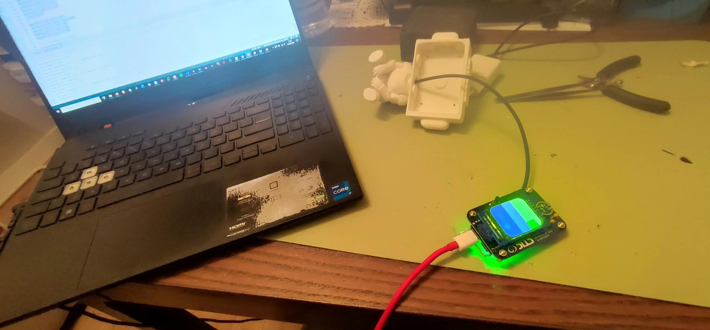
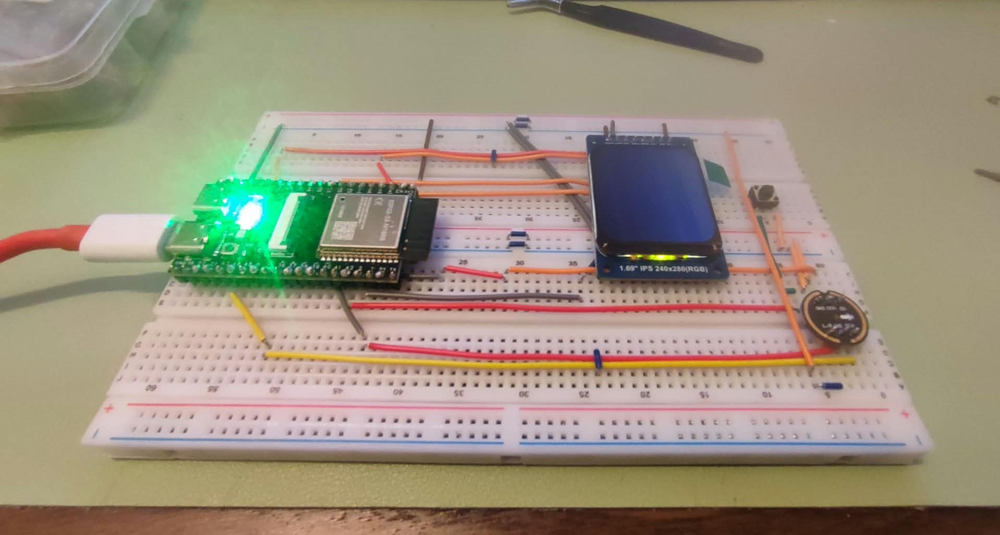
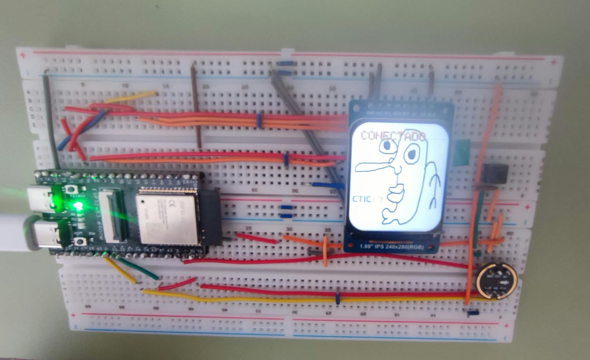
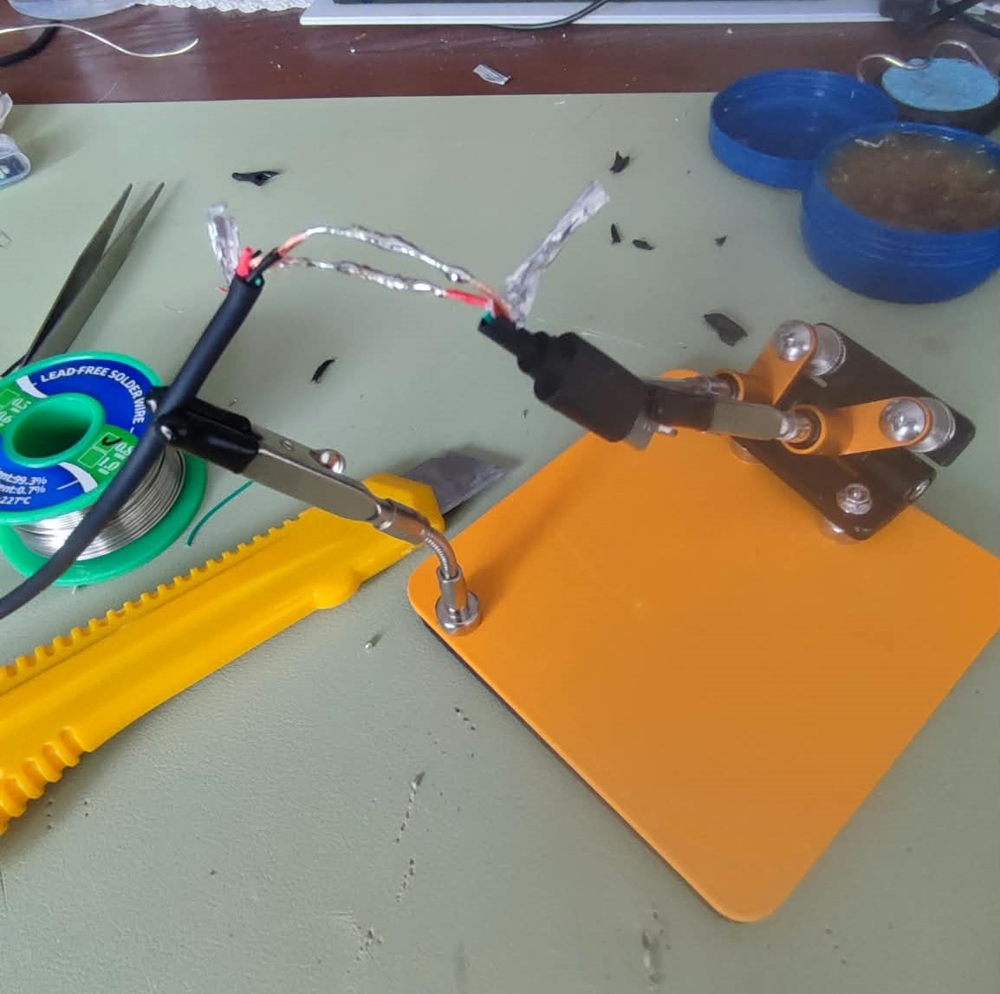
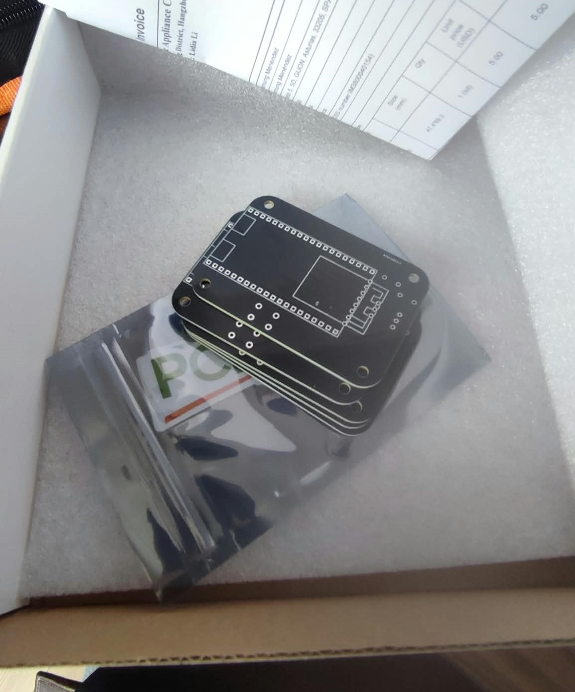
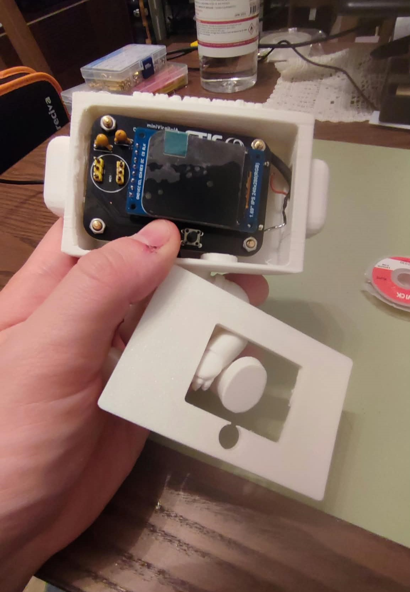
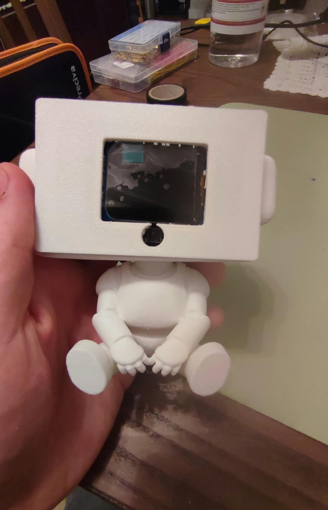

<div align="center" style="margin: 1.5em 0;">

<a href="https://github.com/agarnung/miniVirgil/tree/main">

</a>

</div>

**[miniVirgil](https://github.com/agarnung/miniVirgil)** is a palm-sized voice endpoint for an AI assistant. Hold a button, speak, release — the ESP32-S3 records raw PCM and ships it over WebSocket to the IA backend, which may run STT → LLM → TTS. The microcontroller does **no** on-device AI: it is a thin, reliable physical front-end (mic + button + screen + WiFi).

The idea is simple: put an assistant on a desk without a keyboard or a phone. Press, talk, watch the TFT flip through the cycle states while the heavy lifting happens on the server.

## How it works (software)

Firmware is a single Arduino sketch (`firmware/main.ino`). After boot it joins WiFi, opens a WebSocket to `/ws/chat-audio`, and sits in a small state machine:

```
STARTING → CONNECTED / DISCONNECTED
         → RECORDING...   (button held: I2S mic → PCM buffer in PSRAM)
         → PROCESSING → SENDING...  (binary PCM over WebSocket)
         → CONNECTED again
```

Design choices that matter in practice:

- **Push-to-talk on GPIO 42** — press opens the INMP441; release freezes the buffer and sends it. No continuous streaming, no wake-word (yet).
- **Raw 16 kHz PCM** — uncompressed, left channel. Skipping on-board codecs cuts latency and keeps the MCU free of AI libraries.
- **PSRAM as the audio scratchpad** — short utterances fit comfortably in the ESP32-S3’s external RAM.
- **Status bitmaps on the ST7789** — Waiting / Recording / Processing / Sending, converted from PNGs to RGB565 C arrays (`image_to_RGB565_bitmap.py`) and drawn with Adafruit GFX.

Libraries: Adafruit ST7789 + GFX + BusIO, and WebSocketsClient. Board profile: ESP32S3 Dev Module, 240 MHz, 16 MB flash, OPI PSRAM enabled.

On the backend side, audio goes through STT (e.g. ElevenLabs Scribe / local OpenAI), an LLM (Qwen) with RAG and tools, then TTS — miniVirgil just waits for the next press.

## Electronics

| Part | Role |
|---|---|
| **ESP32-S3 N16R8** | MCU + WiFi, 8 MB PSRAM, 16 MB flash |
| **INMP441** | I2S MEMS mic, 16 kHz voice capture |
| **ST7789V2** | 240×280 IPS TFT for state feedback |
| **Tactile button** | Push-to-talk (GPIO 42) |

Power and layout live in `electronic_design/` (schematic, PCB, BOM). The display is SPI; the mic is I2S; the button is a plain GPIO with the usual debounce in firmware. PSRAM is what makes “hold and speak for a few seconds” safe without fragmenting the internal heap.

### Rough BOM

| Item | Notes |
|---|---|
| ESP32-S3 N16R8 module / DevKit for proto | Final board hosts the module footprint |
| INMP441 breakout (proto) / MEMS on PCB | Left channel at 16 kHz |
| ST7789 1.69″ 240×280 IPS | Status UI only |
| Momentary push button | Front-panel PTT |
| Custom PCB (2-layer) | From [PCBWay](https://www.pcbway.com/) |
| 3D-printed shell | Body + faceplate in `mechanical_design/` |
| USB-C / LiPo path (as wired on the board) | Desk or battery use |
| Passives, headers, mounting hardware | Per the KiCad BOM |

Exact quantities and footprints: see the repo’s `electronic_design/` folder.

## Build story

### Prototyping the display

First: prove the TFT and bitmap pipeline before worrying about audio.



### Breadboard

Then the honest prototype: ESP32-S3, jumpers, mic path, button, and the IPS panel on a breadboard.



Once WiFi and the WebSocket handshake stuck, the screen showed **CONNECTED** — end-to-end loop alive.



<div style="text-align: center; font-size: 0.85em; font-style: italic; opacity: 0.85; margin: 0.4em 0 1em;">
check that guy anyway
</div>

### Soldering & cleanup

Cable work and soldering before freezing the pinout into copper.



### Custom PCBs

Boards from [PCBWay](https://www.pcbway.com/):



> [!IMPORTANT]
>
> Huge thanks to **[PCBWay](https://www.pcbway.com/)** for manufacturing these boards. The silkscreen printing is precise and clear, and the board surface is well-finished, making it very easy to clean with isopropyl alcohol. Both projects would be published openly on GitHub, promoting PCBWay, as well as on Instructables and on my personal website.
>
> If you want to order with them: their **prices** and **turnaround** are excellent — check them out at [pcbway.com](https://www.pcbway.com/).

### Into the shell

Fitting the PCB and display into the printed body:



Desk companion, assembled:



## What’s next

Roadmap highlights from the repo: play TTS back on-device (I2S amp), wake-word instead of the button, status LED, OTA, and a BLE fallback for locked-down networks.

Schematic, PCB, firmware, and mechanics: **[github.com/agarnung/miniVirgil](https://github.com/agarnung/miniVirgil)**.

<div align="center" style="margin: 1.5em 0;">

<a href="https://github.com/agarnung/miniVirgil/tree/main">

</a>

</div>
