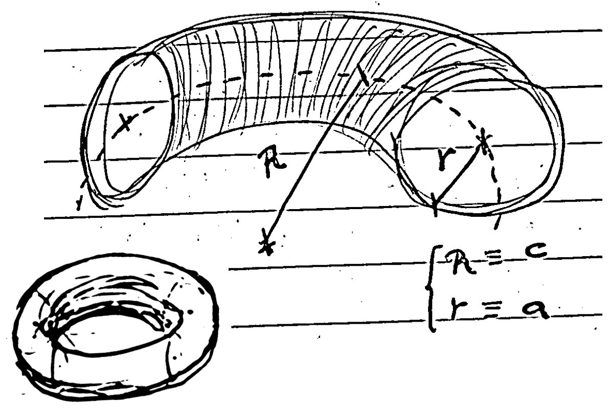

## Introduction

In our previous [post](./geometric-fitting-intuition), we explored the topic of geometric fitting of various entities to a set of observed data points.

When dealing with the fitting of an uncentered (or even unaligned with the horizontal XY plane) torus, which is useful in some metrology applications of cylindrical parts, one encounters a non-linear equation that must be optimized using methods like Newton-Raphson, gradient descent, Gauss-Newton, or Levenberg-Marquardt (see [6]).

Nevertheless, it may be beneficial to develop an alternative approach using the tools formulated centuries ago by Brook Taylor, in order to find very efficient linear approaches that often make our lives easier.

## Paper

To the benefict of better visualization, you can access the post main content in the LaTex PDF attached below:

  

    

  

  <h4 class="font-weight-bold" style="text-align: right; margin-top: 5px"><a target="_blank" href="{{ '/assets/blog_pdfs/2025-01-22-torus-fit/torus-fit.pdf' }}">Open as PDF</a></h4>

## Experiments:

The code was implemented in C++ using STL and Eigen. In this section, we present some self-explanatory results and perform a subjective quality assessment of the proposed method.

## Conclusions and Future Work:

The workaround _does the trick_; it allows us to fit a set of points in 3D space to an off-centered torus efficiently and robustly. Fitting a torus whose front symmetry plane has an arbitrary orientation complicates the problem significantly; the equation becomes even more complicated to express, even approximately, in a closed form. While the orientation can be integrated as a separate step by first fitting a plane as the torus's front symmetry plane, along with centering it using centroid approximation of the points, encapsulating the optimization entirely in a rigorous formulation is open for further discussion, such as the one presented here. For further exploration of this topic, refer to [7].

__A work in progress...__

## References

[1] Chernov, N. (2010). *Circular and Linear Regression: Fitting Circles and Lines by Least Squares*. Boca Raton: Chapman and Hall-CRC. ISBN 978-1-439-83590-6. [Journal of the Royal Statistical Society Series A: Statistics in Society, Volume 174, Issue 3, July 2011, Page 843.](https://doi.org/10.1111/j.1467-985X.2011.00709_4.x)

[2] Birchfield, S. (2017). *Image Processing and Analysis*. 1st Edition. Cengage Learning. ISBN 978-1285179520.

[3] Schneider, P., & Eberly, D. H. (2002). *Geometric Tools for Computer Graphics*. 1st Edition. Morgan Kaufmann. ISBN 978-1558605947.

[4] Eberly, D. (2020). *Robust and Error-Free Geometric Computing*. 1st Edition. CRC Press. ISBN 978-0367352943.

[5] https://mathworld.wolfram.com/Torus.html

[6] https://www.geometrictools.com/Documentation/TorusFitting.pdf

[7] ...
