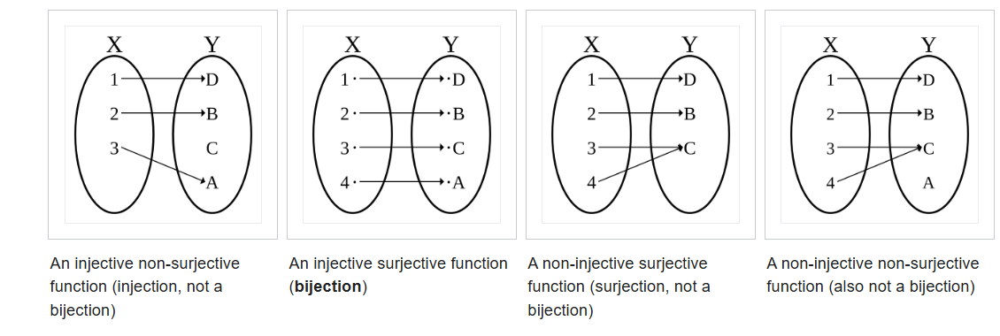

  <h2>Table of Contents</h2>
  <ol>
    <li><a href="#introduction"><label>Introduction</label></a></li>
    <li><a href="#convexnon-convex"><label>Convex/Non-convex</label></a></li>
    <li><a href="#smoothnon-smooth"><label>Smooth/Non-smooth</label></a></li>
    <li><a href="#differentiablenon-differentiable"><label>Differentiable/Non-differentiable</label></a></li>
    <li><a href="#integrablenon-integrable"><label>Integrable/Non-integrable</label></a></li>
    <li><a href="#localnon-local"><label>Local/Non-local</label></a></li>
    <li><a href="#linearnon-linear"><label>Linear/Non-linear</label></a></li>
    <li><a href="#boundedunbounded"><label>Bounded/Unbounded</label></a></li>
    <li><a href="#continuousdiscontinuous"><label>Continuous/Discontinuous</label></a></li>
    <li><a href="#bounded-variation-bvnon-bv"><label>Bounded Variation (BV)/Non-BV</label></a></li>
    <li><a href="#compactnon-compact"><label>Compact/Non-compact</label></a></li>
    <li><a href="#coercivenon-coercive"><label>Coercive/Non-coercive</label></a></li>
    <li><a href="#openclosed"><label>Open/Closed</label></a></li>
    <li><a href="#positive-definitesemi-positive-definiteindefinite"><label>Positive Definite/Semi-Positive Definite/Indefinite</label></a></li>
    <li><a href="#monotonicnon-monotonic"><label>Monotonic/Non-monotonic</label></a></li>
    <li><a href="#lipschitznon-lipschitz"><label>Lipschitz/Non-Lipschitz</label></a></li>
    <li><a href="#injectivesurjectivebijective"><label>Injective/Surjective/Bijective</label></a></li>
    <li><a href="#topological-spaces"><label>Topological Spaces</label></a></li>
    <li><a href="#normed-and-metric-spaces"><label>Normed and Metric Spaces</label></a></li>
    <li><a href="#function-spaces"><label>Function Spaces</label></a></li>
    <li><a href="#operators"><label>Operators</label></a></li>
  </ol>

<h2 id="introduction">Introduction</h2>
I recently purchased a wonderful book about variational methods in image processing (let's call it [1]), and just like stepping into a non-Newtonian liquid, I stumbled upon the dense stone of insufficiently rigorous mathematical education. As you dive deeper into more complex theorems, many terms appear that you think you understand or that seem reasonable, but whose true mathematical implications are beyond your grasp. This halts your eager reading and reduces your concentration.

Thus, in order to start tackling this issue little by little (both for myself and anyone else in my situation), we'll make a grand leap in this post and talk about some mathematical terms that are widely used in the literature. These terms will give us broader wisdom to support our future readings on related topics.

Without further ado, let's structure the post through a direct concept-definition-extrapolation scheme. Each of these concepts, in my personal, non-relevant opinion, could be used as definition content for an introductory university exam in computer science. It is a common thought of mine to advocate sometimes for an intuitive and comprehensive understanding of mathematics rather than a strict, lexicographical-axiomatic instruction.

# Various (_in no particular order_) Important Concepts in Mathematics and Related Fields of Science (~~all~~)

<h3 id="convexnon-convex">Convex/Non-convex</h3>
- **Convex:** A set or function is convex if, for any pair of points inside that domain, the "straight line" connecting them lies within the set or is below the graph of the function. Formally, a function $$ f $$ is convex if:
  
  $$
  f(\lambda x_1 + (1-\lambda)x_2) \leq \lambda f(x_1) + (1-\lambda)f(x_2)
  $$
  for all $$ x_1, x_2 \in \text{dom}(f) $$ and $$ \lambda \in [0,1] $$.
  
  A set $$ S \subseteq \mathbb{R}^n $$ is convex if for all $$ x_1, x_2 \in S $$ and $$ \lambda \in [0,1] $$:
  
  $$
  \lambda x_1 + (1-\lambda)x_2 \in S.
  $$
  A function $$ f $$ is convex if:

  $$
  f(\lambda x_1 + (1-\lambda)x_2) \leq \lambda f(x_1) + (1-\lambda)f(x_2).
  $$
  *Example*: $$ f(x) = x^2 $$.
- **Non-convex:** If it doesn't satisfy the above property, i.e., if there are points for which the inequality does not hold.  
  *Example*: $$ f(x) = \sin(x) $$.

<h3 id="smoothnon-smooth">Smooth/Non-smooth</h3>
- **Smooth:** A function is smooth if it has continuous derivatives of all required orders. For example, if a function $$ f $$ is of class $$ C^k $$, it means that its derivatives are continuous up to order $$ k $$:
  $$ f \in C^k $$ if $$ \frac{\partial^k f}{\partial x^k} $$ is continuous.  
  *Example*: $$ f(x) = e^x \in C^\infty $$.
- **Non-smooth:** A function is not smooth if it does not have continuous derivatives for all required orders, as happens in points of discontinuity, sharp peaks, or cusps.  
  *Example*: $$ f(x) = |x| $$ (not differentiable at $$ x = 0 $$).

<h3 id="differentiablenon-differentiable">Differentiable/Non-differentiable</h3>
- A function $$ f $$ is differentiable at $$ x_0 $$ if its derivative exists at that point. For functions of one variable, it is differentiable at $$ x_0 $$ if the following limit exists:
  
  $$
  f'(x_0) = \lim_{h \to 0} \frac{f(x_0+h)-f(x_0)}{h}
  $$

- **Non-differentiable:** A function is not differentiable if this limit does not exist at some point, as in the case of the absolute value function $$ f(x) = |x| $$ at $$ x = 0 $$, where its derivative is not defined in a strong sense.
  *Example*: $$ f(x) = |x| $$ at $$ x=0 $$.

<h3 id="integrablenon-integrable">Integrable/Non-integrable</h3>
- **Integrable (Lebesgue):** A function $$ f(x) $$ is integrable over a domain $$ \Omega $$ if its integral (either Riemann [which is more geometric and easy to understand with continuous or well-behaved functions] or Lebesgue [which is more abstract and powerful, used in complex situations like functions with many discontinuities or in probability theory]) is finite. Formally, $$ f $$ is Lebesgue integrable if:

  $$
  \int_\Omega |f(x)| dx < \infty
  $$

  *Example*: $$ f(x) = 1/x^2 $$ on $$ [1, \infty) $$.
  
- **Non-integrable:** If the integral above is infinite, the function is non-integrable.  
  *Example*: $$ f(x) = 1/x $$ on $$ (0,1] $$.

<h3 id="localnon-local">Local/Non-local</h3>
- **Local:** A property or behavior is local if it only depends on values near the variables in question. For example, a differential operator is local if it only involves values of the function and its derivatives in the vicinity of a point $$ x_0 $$ (i.e., values of $$ f $$ near $$ x_0 $$). For example, the derivative or a Gaussian filter is local.  
  *Example*: Derivative $$ f'(x) $$.

- **Non-local:** An operator is non-local if it depends on values from a broader set, not just from the neighborhood of a point. For example, the integral operator in diffusion or the Non-Local Means (NLM) algorithm:  

  $$
  u(x) = \int_\Omega K(x,y)u(y)dy
  $$
  
  This operator integrates over the entire domain, hence it exhibits non-local behavior.  
  *Example*: Integral operator $$ u(x) = \int_\Omega K(x,y)u(y)dy $$.

<h3 id="linearnon-linear">Linear/Non-linear</h3>
- **Linear:** An operator or equation is linear if it respects the properties of additivity (i.e., $$ f(x_1 + x_2) = f(x_1) + f(x_2) $$) and homogeneity/equivariance ($$ f(c \cdot x) = c \cdot f(x) $$).
  
  $$
  T(ax + by) = aT(x) + bT(y)
  $$
  *Example*: Matrix multiplication.
  
- **Non-linear:** If it doesn't satisfy any of the above properties, the system's output cannot be expressed as a simple linear combination of inputs, meaning the operator or equation is non-linear.  
  *Example*: $$ f(x) = x^2 $$, or the line equation, that is actually not lineal, but affine.

<h3 id="boundedunbounded">Bounded/Unbounded</h3>
- **Bounded:** A function $$ f $$ is bounded if there exists a constant $$ M $$ such that:
  
  $$
  |f(x)| \leq M \quad \text{for all } x \in \Omega
  $$
  
  Or a set S is bounded if all its elements are within a fixed distance from a certain point. A bounded operator means that it 'does not amplify the norm of the vectors too much,' which guarantees continuity, but the converse is not necessarily true.

  *Example*: $$ \sin(x) $$.

- **Unbounded:** A function is unbounded if such a constant does not exist. For example, $$ f(x) = x $$ or $$ f(x) = x^2 $$ on $$ \mathbb{R} $$.  
  *Example*: $$ f(x) = x $$ on $$ \mathbb{R} $$.

<h3 id="continuousdiscontinuous">Continuous/Discontinuous</h3>
- **Continuous:** A function $$ f $$ is continuous if small variations in the input cause small variations in the output. Formally, $$ f $$ is continuous at $$ x_0 $$ if:

  $$
  \lim_{x \to x_0} f(x) = f(x_0)
  $$

- **Discontinuous:** A function $$ f $$ presents a discontinuity if the limit above is not equal to $$ f(x_0) $$, such as with the Heaviside step function:

  $$
  u : \mathbb{R} \to \{0,1\}, \quad u(x) = \begin{cases} 0 & \text{if } x < 0 \\ 1 & \text{if } x \geq 0 \end{cases}
  $$

  *Types*: Removable, jump, essential.  
  *Example*: Heaviside step function (jump discontinuity).

FOTO 

<h3 id="bounded-variation-bvnon-bv">Bounded Variation (BV)/Non-BV</h3>
- **BV:** A function $$ f $$ is of bounded variation in an interval $$ [1, b] $$ if its total variation (TV) is finite in that interval. The TV is defined as:

  $$
  \text{Total variation } TV(f) = \sup \sum |f(x_i) - f(x_{i-1})| < \infty
  $$
  
  *Example*: $$ f(x) = x $$.

- **Non-BV:** A function $$ f $$ is non-BV if the total variation is infinite.  
  *Example*: $$ f(x) = \sin(x^2) $$ on $$ [0, \infty) $$.

FOTO 

<h3 id="compactnon-compact">Compact/Non-compact</h3>
- **Compact (in $$ \mathbb{R}^n $$)**: A set $$ S $$ is compact if it is closed and bounded (Heine-Borel), which guarantees the existence of solutions to variational problems.

  $$ S \subset \mathbb{R}^n $$ is compact $$ \iff $$ $$ S $$ is closed and bounded.
  
  A compact operator maps bounded sets to relatively compact sets (sets with convergent sequences), e.g., the inclusion of $$ l^2 $$ into $$ l^\infty $$.

- **Non-compact**: A non-compact set may either not be closed or not be bounded, like $$ \mathbb{R}^n $$. It fails at least one condition (i.e., it is open or unbounded).  
  *Example*: $$ \mathbb{R}^n $$.

<h3 id="coercivenon-coercive">Coercive/Non-coercive</h3>
- **Coercive**: A function $$ f $$ is coercive if it grows indefinitely as $$ |x| $$ grows, which guarantees the existence of a minimum in variational problems.
  $$ \lim_{\|x\| \to \infty} f(x) = \infty $$.  
  *Example*: $$ f(x) = x^2 $$.

- **Non-coercive**: If the function does not grow indefinitely, it is non-coercive, like an oscillating function or one that tends to a finite limit (damping).
  $$ f(x) $$ remains bounded as $$ \|x\| \to \infty $$.  
  *Example*: $$ f(x) = \arctan(x) $$.
  
<h3 id="openclosed">Open/Closed</h3>
- **Open**: A set $$ U \subset \mathbb{R}^n $$ is open if for every point $$ x \in U $$, there exists a ball $$ B_\epsilon(x) = \{ y \in \mathbb{R}^n : \|x - y\| < \epsilon \} $$ completely contained in $$ U $$. This means that $$ U $$ does not contain its boundary points.
  $$ U $$ is open $$ \iff $$ for every $$ x \in U $$, there exists $$ \epsilon > 0 $$ such that $$ B_\epsilon(x) \subseteq U $$.
  Contains no boundary points.  
  *Example*: $$ (0,1) \subseteq \mathbb{R} $$.

- **Closed**: A set $$ C \subset \mathbb{R}^n $$ is closed if it contains all its boundary points, i.e., if it includes its accumulation points or if its complement is open:
  $$ C $$ is closed $$ \iff \mathbb{R}^n \setminus C $$ is open.
  For example, $$ (0,1) $$ is an open set in $$ \mathbb{R} $$, while $$ [0,1] $$ is a closed set in $$ \mathbb{R} $$.
  Contains all boundary points.  
  *Example*: $$ [0,1] \subseteq \mathbb{R} $$.
  
<h3 id="positive-definitesemi-positive-definiteindefinite">Positive Definite/Semi-Positive Definite/Indefinite</h3>
- **Positive Definite**: A matrix $$ A \in \mathbb{R}^{n \times n} $$ is positive definite if for every non-zero vector $$ x \in \mathbb{R}^n $$, the quadratic product with it is strictly positive:
  $$ x^T A x > 0 $$ for all $$ x \neq 0 $$.  
  In variational problems, a functional $$ F(u) $$ is positive definite if:
  $$ F(u) > 0 $$ for all $$ u \neq 0 $$.
  This ensures the existence of strict local minima in minimization problems.

- **Semi-Positive Definite**: A matrix $$ A $$ is semi-positive definite if $$ x^T A x \geq 0 $$ for all $$ x \in \mathbb{R}^n $$, but it may be 0 for some $$ x \neq 0 $$. This implies that the system may have trivial or non-unique solutions.

- **Indefinite**: A matrix $$ A $$ is indefinite if there exist vectors $$ x_1 $$ and $$ x_2 $$ such that:
  $$ x_1^T A x_1 > 0 $$ and $$ x_2^T A x_2 < 0 $$.  
  In this case, the system may have unstable solutions or multiple critical points.

<h3 id="monotonicnon-monotonic">Monotonic/Non-monotonic</h3>
- **Monotonic**: A function $$ f(x) $$ is monotonically increasing if for any pair $$ x_1 < x_2 $$, it holds that $$ f(x_1) \leq f(x_2) $$, and monotonically decreasing if $$ f(x_1) \geq f(x_2) $$. For increasing: $$ f'(x) \geq 0 $$ for all $$ x \in \Omega $$.
  *Example*: $$ f(x) = e^x $$.

- **Non-monotonic**: A function $$ f(x) $$ is non-monotonic if it does not maintain a strictly increasing or decreasing behavior in its domain $$ \Omega $$. It oscillates.
  *Example*: $$ f(x) = \sin(x) $$.

<h3 id="lipschitznon-lipschitz">Lipschitz/Non-Lipschitz</h3>
- **Lipschitz:** A function $$ f $$ is Lipschitz continuous if there exists a constant $$ L $$ such that for all $$ x, y $$ in its domain:

  $$
  |f(x) - f(y)| \leq L|x - y|
  $$
  
  In simple terms, it's a way to see how smooth or controlled the function is; to check if it doesn't change 'too quickly,' in the sense that the difference in the function's value between any two points is limited by a constant multiple of the distance between the points.
  
  *Example*: $$ f(x) = x $$.

- **Non-Lipschitz:** A function is not Lipschitz continuous if no such constant $$ L $$ exists, which can imply non-unique or unstable solutions to a variational problem, due to the lack of smoothness of the function/functional.  

  *Example*: $$ f(x) = \sqrt{x} $$ for $$ x > 0 $$ near 0.

<h3 id="injectivesurjectivebijective">Injective/Surjective/Bijective</h3>

- **Injective**: One-to-one. A function $$ f: X \to Y $$ is **injective** if it assigns distinct elements in $$ X $$ to distinct elements in $$ Y $$. That is:
  $$
  f(x_1) = f(x_2) \quad \Rightarrow \quad x_1 = x_2
  $$
  There are no collapses: each output value comes from **at most one** input value.

- **Surjective**: Onto. A function $$ f: X \to Y $$ is **surjective** if it **covers all** of $$ Y $$, meaning that for every $$ y \in Y $$, there exists at least one $$ x \in X $$ such that:
  $$
  f(x) = y
  $$
  Every element of the codomain **has at least one preimage** in the domain.

- **Bijective**: Both (invertible). A function $$ f: X \to Y $$ is **bijective** if it is **both injective and surjective**, meaning it establishes a **one-to-one and onto** correspondence between $$ X $$ and $$ Y $$.
  Every bijective function has an **inverse function** $$ f^{-1}: Y \to X $$, such that:
  $$
  f^{-1}(f(x)) = x, \quad \forall x \in X
  $$
  $$
  f(f^{-1}(y)) = y, \quad \forall y \in Y
  $$

<h3 id="topological-spaces">Topological Spaces (Most General Setting)</h3>
Roughly speaking, a **topological space** is a geometrical space in which **closeness** is defined but cannot necessarily be measured by a numeric distance. Each of the following spaces contains the one below it (the hierarchy goes from most general to more specific):

- **General Topology**: The foundation of (defines) continuity, convergence, and compactness. It provides the basic structure for understanding topological spaces.
- **Metric Spaces**: Add distance ($$ d(x,y) $$). Spaces where **distances** are defined (through a metric), which induces a topology. These spaces allow measuring how "close" two points are.
- **Normed Spaces**: Add norm ($$ \|x\| $$). A special type of metric space where distances are defined through a **norm**, which leads to concepts of convergence and boundedness. Normed spaces also have more structure than general metric spaces.
- **Inner Product Spaces**: Add angles ($$ \langle x,y \rangle $$). A type of normed space where the norm is derived from an **inner product** (a generalization of the dot product). Inner product spaces have rich geometrical structures, enabling the definition of concepts like angles, orthogonality, and projection.

**Topologies on Function Spaces**:
- **Strong Topology**: Induced by the norm, governs convergence in norm.
- **Weak Topology**: Based on functional convergence, weaker than norm convergence.
- **Weak-Topology**: Convergence in terms of continuous linear functionals. Important in dual spaces, relevant for variational problems.

- **Vector Spaces**: A vector space is a set of elements (called vectors) that can be added and multiplied by scalars (numbers, usually real or complex), satisfying certain properties like associativity, commutativity, and the existence of a zero vector, etc. Vector spaces are the basic algebraic structure used in many areas of mathematics. Vector spaces can be considered as subsets of topological spaces if we impose an appropriate topology on them. However, vector spaces in general do not have a topology defined on them unless an additional structure is added. In other words, a vector space can become a topological space if it is endowed with a topology (e.g., through a norm or inner product).

<h3 id="normed-and-metric-spaces">Normed and Metric Spaces</h3>
- **Banach Spaces (Special Normed Space)**: Complete normed vector spaces (e.g., $$ L^p $$ spaces for $$ p \geq 1 $$).
- **Hilbert Space (Special Normed Space)**: Banach spaces with an inner product, allowing for notions of angles and orthogonality (e.g., $$ L^2 $$ spaces).

<h3 id="function-spaces">Function Spaces</h3>
Spaces of functions with specific properties, often equipped with norms or inner products. Function spaces can be seen as topological spaces where the points are functions, and the notions of continuity, convergence, and compactness depend on the chosen topology.
- **$$ L^p $$ Spaces**: $$ \|f\|_p = \left( \int |f|^p \right)^{1/p} < \infty $$. Function spaces with integrable p-th power norms.
- **$$ W^{k,p} $$ (Sobolev) Spaces**: Function spaces that incorporate weak derivatives.
- **$$ C^k $$ Spaces**: Spaces of functions with continuous derivatives up to order $$ k $$. The most common $$ C^k $$ space is $$ C^0 $$, the space of continuous functions, whereas $$ C^1 $$ is the space of continuously differentiable functions.

**Where do Function Spaces fit in Topological Spaces?**  
Function spaces are examples of topological spaces with additional structures:
- If they are defined with a norm → They are normed and topological spaces.
- If they are also complete → They are Banach or Hilbert spaces.
- Depending on the chosen topology, they may have different notions of convergence.

In summary, function spaces are specialized topological spaces, where different structures can be imposed depending on the application (norm, inner product, convergence measures, etc.).

<h3 id="operators">Operators</h3>
An operator is a mapping between "function spaces". It can be said that it is essentially a function, but instead of mapping real numbers to real numbers as basic functions do, it maps functions to functions, like the derivative operator $$ \frac{d}{dx}: F \to G $$, which acts on the function $$ f $$ such that $$ \frac{d}{dx}(f) = f' = g $$.

Let $$ X $$ and $$ Y $$ be normed spaces. An operator $$ T: X \to Y $$ can be categorized in several ways:

- **Linear/Nonlinear**, **Continuous/Discontinuous**, **Compact/Non-compact** (as explained above)

It is important to note that a continuous linear operator is always a bounded linear operator. But importantly, in the most general setting of a linear operator between arbitrary topological vector spaces, it is possible for a linear operator to be bounded but not continuous.

- **Bounded**: $$ T $$ is bounded if there exists a constant $$ C \geq 0 $$ such that:
  $$
  \|T(x)\|_Y \leq C \cdot \|x\|_X, \quad \forall x \in X
  $$
  For example, multiplication by a matrix with a finite norm, as the matrix does not "explode" the values of vectors in $$ \mathbb{R}^n $$.
  It is **not bounded** if it does not satisfy the inequality above, such as differentiation in $$ L^2 $$, where the norm of the derivative can grow indefinitely.

- **Self-adjoint (Hermitian)**: Satisfies $$ T = T^* $$ in Hilbert spaces, e.g., symmetric matrices in $$ \mathbb{R}^n $$.

- **Normal**: Satisfies $$ T \cdot T^* = T^* \cdot T $$ (commutes with its adjoint), e.g., unitary or orthogonal matrices.

- **Unitary**: Satisfies $$ T \cdot T^* = I $$, meaning it preserves norm, e.g., rotations in $$ \mathbb{R}^n $$.

- **Positive**: Satisfies $$ \langle Tx, x \rangle \geq 0 \quad \forall x $$, e.g., positive-definite operators in functional analysis.

- **Compact**: Maps bounded sets to relatively compact sets.

**21. Ill-posed/Well-posed**  

- **Ill-posed**: A problem $$ K u = f $$ is ill-posed, in the sense of Hadamard, if at least one of the following three conditions is satisfied:
  1. No solution exists,
  2. No unique solution exists (i.e., if $$ K^{-1} $$ does not exist or if $$ K^{-1} $$ is ill-conditioned, with values that are extremely disparate in magnitude),
  3. The solution is unstable.

- **Well-posed**: A problem $$ K u = f $$ is well-posed if it does not satisfy any of the three conditions above. Or equivalently, if it satisfies the following three conditions:
  1. A solution exists (i.e., if $$ K $$ is injective),
  2. The solution is unique (i.e., if $$ K^{-1} $$ exists),
  3. The solution is stable, i.e., it depends continuously on the data (i.e., if $$ K^{-1} $$ is continuous).

# Infography

We can use LaTeX to create a very nice infography that summarizes all the previous concepts:

  

    

  

  <h4 class="font-weight-bold" style="text-align: right; margin-top: 5px"><a target="_blank" href="{{ '/assets/blog_pdfs/XXXX-XX-XX-important-math-concepts/infogrpahy.pdf' }}">Open as PDF</a></h4>

# References
[1] variational methods in image processing Luminita vese
