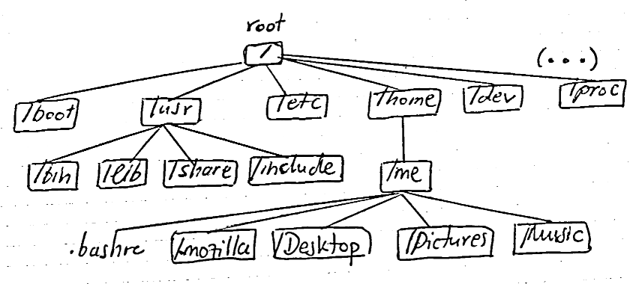
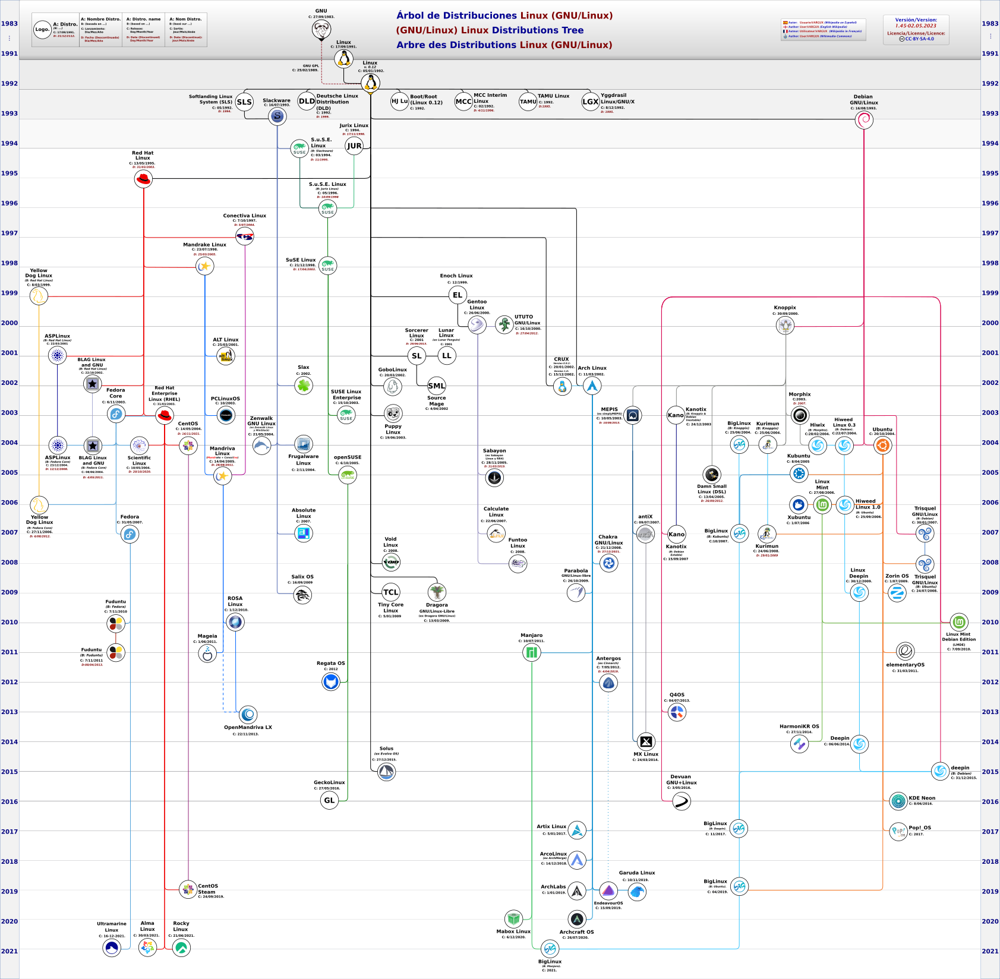

# Introduction

I usually find myself having a drink with friends, and a question arises: why would someone want to use Linux? It seems like a reasonable doubt; OSs like Windows are easier to use, have a showcase (UX) that is, at first glance, prettier, you can play more games on them immediately, it does not require computer knowledge to use, everything that a common person needs comes pre-installed, and it has many default tools, it has great support, etc. Moreover, it has the Windows Subsystem for Linux (WSL)!, which is essentially a compatibility layer from Microsoft to run Linux binaries (even using a real Linux kernel) within Windows itself (although obviously more limited than a native one).  

But if you are a programmer, you will understand that once you overcome the (not so flat) learning curve of Linux, the flexibility and control it offers will allow you to do things that in other operating systems you would find more limited. And perhaps more relevant, with the certainty that the OS is user- and privacy-respecting; you will be able to use your OS as you prefer. Linux does not operate under a proprietary software policy with forced updates and advertisements; moreover, it advocates much more for open software, which is especially interesting if you are a developer or researcher. It is easier to learn (out of curiosity) computer concepts in Linux than in Windows; and also to program and develop, let’s not fool ourselves. If your machine is very old, it probably cannot run an arbitrary Windows or MacOS, but it can run Linux. Also, if you are a computational artist and you like to customize your GUI or desktop _to the maximum_, Linux offers you more possibilities than any other.  

On the other hand, security (let's think about this in a very loosely strict way): the vast majority of users use Windows; so it is logical that the vast majority of cyberattacks are directed at Windows distributions; it is not that we are safer in Linux, which we are, but that we most probably are. Although under this same thinking, it is more frequent to have drivers/hardware support for Windows and not for Linux.  

But enough talking about competitions, since each option meets different needs, and they are not mutually exclusive. We will dedicate this post to delving into the Linux directory tree (and other UNIX-like operating systems). For Windows users, the well-known `C:\` drive and drive letters no longer exist; instead, the entire structure is replaced by a labyrinthine hierarchical file system and directories governed by the Filesystem Hierarchy Standard (FHS), which is the standard maintained by the Linux Foundation.

# The Linux structure

Before anything else, let's take a look and appreciate this beautiful tree of Linux distributions (GNU/Linux):  
  

This is my system:
```bash
$ uname -a 
```
```text
Linux pop-os 6.9.3-76060903-generic #202405300957~1732141768~22.04~f2697e1 SMP PREEMPT_DYNAMIC Wed N x86_64 x86_64 x86_64 GNU/Linux
```

Linux is an OS that works like a "big file system", or rather, "through files". Everything we see, even the directories themselves, the mouse, keyboard, printer..., are files. How can that be? It’s not that far-fetched; in the eyes of a computer, its lifeblood is 0s and 1s, and files contain nothing but binary numbers.  

There are several types of files in a Linux system:  

1. **General/Ordinary/Regular Files**: It may be an image, video, program, text file, or executable. These types of files can be in ASCII or binary format. It is the most commonly used file type in the Linux system.  

2. **Directory Files**: These types of files are a storage for other file types, so there may be a directory file within a directory (subdirectory).  

3. **Device Files**: In a Windows-like operating system, devices like CD-ROMs and hard drives are represented as drive letters like F:, G:, H:, whereas in the Linux system, devices are represented as files. For example, `/dev/sda1`, `/dev/sda2`, and so on. These comprise symbolic links, block files, socket files, and named pipe files.  

We are at the top of the Matrix (root), and we look below and identify 23 distinct directories. Most Windows people keep their whole lives warm inside the `/home` directory. But we are **gente con intriga**, and we will try to understand why each of them exists. We will go in a _certain_ order...  

## root (/) - Root Directory

The Linux filesystem hierarchy starts with the root directory as its foundation. It contains all other directories and subdirectories.

Let's take a look at the inmediate response of what we see below here:

```bash
alejandro@pop-os:/$ tree -D -L 1
[Dec 18 14:20]  .  
├── [Sep 18 18:35]  bin -> usr/bin  
├── [Jan 21 13:26]  boot  
├── [Feb  1 11:16]  dev  
├── [Jan 30 11:38]  etc  
├── [Dec 18 14:18]  home  
├── [Sep 18 18:35]  lib -> usr/lib  
├── [Sep 18 18:35]  lib32 -> usr/lib32  
├── [Sep 18 18:35]  lib64 -> usr/lib64  
├── [Sep 18 18:35]  libx32 -> usr/libx32  
├── [Dec 18 14:05]  lost+found  
├── [Dec 18 14:42]  media  
├── [Sep 18 18:35]  mnt  
├── [Jan 31 13:48]  opt  
├── [Feb  1 11:15]  proc  
├── [Jan  1  1970]  recovery  
├── [Jan 18 12:39]  root  
├── [Feb  1 11:16]  run  
├── [Sep 18 18:35]  sbin -> usr/sbin  
├── [Sep 18 18:35]  srv  
├── [Feb  1 11:15]  sys  
├── [Feb  1 11:59]  tmp  
├── [Sep 18 18:35]  usr  
└── [Dec 17 07:26]  var  

23 directories, 0 files  
```

## /bin - Essential Binaries

This directory stores essential executable programs for all users, such as `ls`, `cp`, `mkdir`, `rm`, among others.

## /boot - Boot Files

Contains files needed for the system to boot, including the Linux kernel (`vmlinuz`), the bootloader (`grub`), and other essential boot configuration files.

## /dev - Device Files

Contains special files representing system devices, such as hard drives (`/dev/sda`), terminals (`/dev/tty`), and other peripherals.

## /etc - Configuration Files

Stores system and application configuration files. Examples include:

- `/etc/passwd`: User account information.
- `/etc/group`: Information about user groups.
- `/etc/fstab`: File system and mount point information.

## /home - User Directories

Each user has a personal directory under `/home` to store their files and configurations. Example: `/home/username`.

```bash
alejandro@pop-os:/home$ tree -D -L 2
[Dec 18 14:18]  .  
└── [Feb  1 11:16]  alejandro  
    ├── [Jan 24 18:05]  Desktop  
    ├── [Jan 21 19:16]  Documents  
    ├── [Jan 29 01:04]  Downloads  
    ├── [Jan 22 13:04]  gems  
    ├── [Dec 18 14:29]  Music  
    ├── [Jan 23 22:00]  Pictures  
    ├── [Dec 18 14:29]  Public  
    ├── [Dec 18 14:29]  Templates  
    └── [Jan 21 19:17]  Videos  

10 directories, 0 files  
```

## /lib - Shared Libraries

Holds essential libraries required to run the binaries in `/bin` and `/sbin`. These libraries are critical for both the operating system and the applications in those directories.

## /lib32- Shared Libraries

Contains 32-bit libraries for running 32-bit applications on 64-bit systems.

## /lib64- Shared Libraries

Stores 64-bit libraries needed to run 64-bit applications on 64-bit systems.

## /libx32- Shared Libraries

Contains shared libraries for the x32 architecture, which uses 32-bit pointers but operates in 64-bit mode.

## /lost+found - File Recovery

Used to store fragments of files recovered after file system failures.

## /media - Removable Media Devices

Mounts removable devices like USB drives, CD-ROMs, and external disks.

## /mnt - Temporary Mount Points

Temporary mount point for external file systems, such as additional hard drives or partitions.

## /opt - Optional Software

Contains manually installed software and third-party applications, typically those not included in the default package management system.

## /proc - Virtual File System

A pseudo-filesystem that stores information about running processes and system state. Examples:

- `/proc/cpuinfo`: Processor information.
- `/proc/meminfo`: Memory usage statistics.
- `/proc/filesystems`: Supported file systems.

## /recovery - Systen Recovery 

Used in some distributions to store recovery tools and files in case of system failures.

## /root - Root User Directory

The personal directory of the root user (administrator), similar to `/home`, but exclusive to the superuser.

## /run - Volatile Runtime Data

Contains data files used by running processes. It is cleared upon reboot.

## /sbin - System Binaries

Stores system binaries, including administrative commands for the superuser, such as `fdisk`, `fsck`, `reboot`, and `shutdown`.

## /srv - Service Data

Contains data used by services like web servers, FTP servers, and databases.

## /sys - System and Hardware Information

A virtual file system that stores information about hardware devices and kernel configurations.

## /tmp - Temporary Files

Stores temporary files that can be deleted after use. It is generally cleared upon reboot, so it's not suitable for important data.

## /usr - User Programs and Data

Contains installed programs and applications, along with shared data such as libraries and documentation. Key subdirectories:

- `/usr/bin`: User binaries.
- `/usr/sbin`: Administrative binaries.
- `/usr/lib`: Shared libraries.
- `/usr/share`: Shared files like documentation and themes.
- `/usr/local`: Manually installed software.

```bash
alejandro@pop-os:/usr$ tree -D -L 1
[Sep 18 18:35]  .  
├── [Jan 30 11:38]  bin  
├── [Apr 18  2022]  games  
├── [Jan 18 12:49]  include  
├── [Jan 29 12:03]  lib  
├── [Sep 18 18:35]  lib32  
├── [Dec 17 07:01]  lib64  
├── [Jan  3 13:07]  libexec  
├── [Sep 18 18:35]  libx32  
├── [Jan 12 22:17]  local  
├── [Jan 30 11:38]  sbin  
├── [Jan 30 11:38]  share  
└── [Jan 21 13:20]  src  

12 directories, 0 files  
```

## /var - Variable Data

Contains files whose content changes frequently, such as logs, mail, and spool files. Examples include:

- `/var/log`: System log files.
- `/var/cache`: Program cache.
- `/var/mail`: User emails.
- `/var/spool`: Files awaiting processing, such as print jobs.

## /snap - Snap Packages

Present on systems using Snap, this directory stores applications in Snap format.

