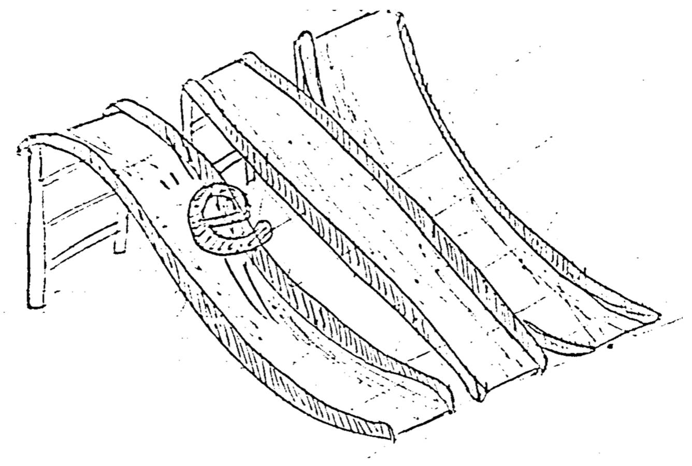
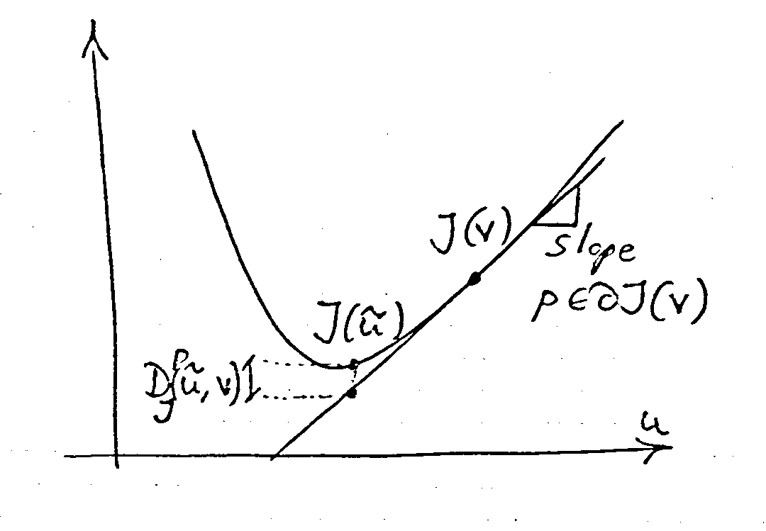
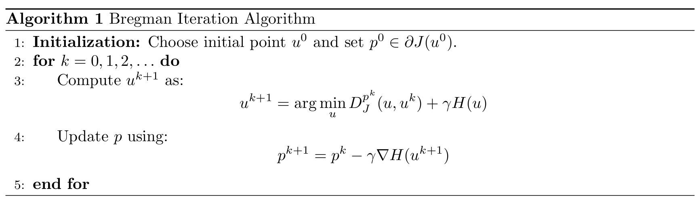
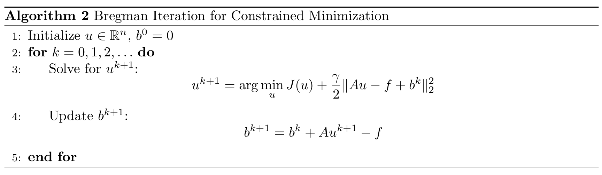
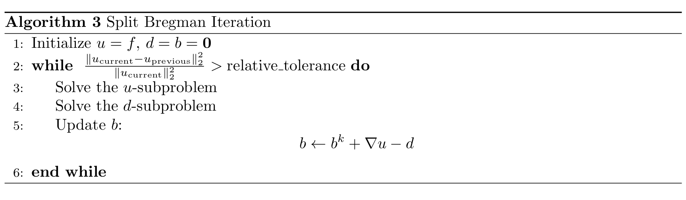
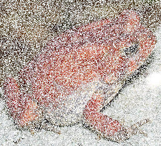
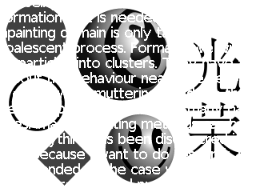
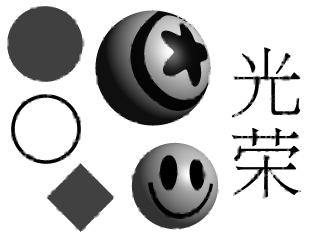
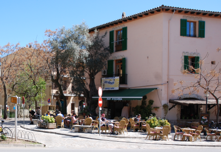

# Introduction

Have you ever come across a functional that you don’t know how to handle? With some "mixture" of norms and terms of fidelity and regularization that you can't manage "at once," all at the same time? Sometimes you miss a good decoupling of the variables, right? Well, when that happens, you should know that there is a technique called Split Bregman that can be very useful.

Let's take a broader look at the matter. In image processing, a very important class of problems are the convex programs involving classical regularization terms like l1, l2, or TV. The solutions to these problems are usually expensive (slow) to compute, but **Bregman iteration** techniques and their variants, such as **linearized Bregman**, **split Bregman**, and **Bregman operator splitting**, have been shown to yield simple, fast, and effective algorithms for these types of problems. All these algorithms have interesting connections with classical techniques based on the **Lagrangian**, such as the **method of multipliers**, the **alternating direction method of multipliers** (ADMM), and the **alternating minimization algorithm** (AMA), for the general problem of minimizing sums of convex functionals subject to linear equality constraints. In fact, the method originally proposed by Goldstein and Osher has been rediscovered as an equivalent form of ADMM. These algorithms can be especially effective when the convex functionals are based on the l1 norm and the squared l2 norm [4].

If our problem is convex, we are certain that we can use our Swiss army knife, Split Bregman, to speed up its computation; additionally, it usually lends itself to standard convergence analysis. We will see that the basic idea is to first split the original minimization problem into several subproblems by introducing some auxiliary variables and then solve each subproblem separately.

> [!NOTE] Remark  
> Compressed sensing refers to a paradigm that allows reconstructing signals or images (e.g., in MRI) from "very scarce" amounts of data. The l1-regularized optimization problems have received much attention in this regard. And methods based on Bregman iterations emerged to deal with the complications in solving these problems with the l1 norm and other too domain-specific cases.

## Bregman iteration

Bregman iteration [8] is a technique for solving constrained convex minimization problems of the form:

$$
\arg\min_u J(u) \quad \text{s.t.} \quad H(u) = 0,
$$

where $$J$$ and $$H$$ are (possibly non-differentiable, as TV or the $$L1$$ norm) convex functionals that take as arguments elements of a Hilbert space and return real values. The main idea behind all of this is the Bregman distance, defined as:

$$
D^p_J (u, v) := J(u) - J(v) - \langle p, u - v \rangle, \quad p \in \partial J(v),
$$

where $$\langle p, u - v \rangle$$ is the inner product between $$p$$ (which belongs to the subdifferential [a weak derivative] of $$J$$ at point $$v$$) and the vector $$u-v$$. It acts as the tangent plane to the function at $$v$$.

$$
D^p_J (u, v)
$$

compares the value $$J(u)$$ with the tangent plane (which in 1D is a line) $$J(v) + \langle p, u-v \rangle$$. Choosing a differentiable $$H$$, the subdifferential becomes the gradient $$\nabla H$$. This is not strictly a distance in the usual sense because it satisfies neither symmetry nor the triangle inequality, but it retains many distance properties (see [8]). Instead of directly measuring the distance between two points, it measures it as differences in function values, comparing $$J(u)$$ with a linear approximation of $$J$$ based on its tangent point $$J(v)$$. In other words, it measures the difference between the function value at $$u$$, which is $$J(u)$$, and the best linear approximation of $$J(u)$$ from $$v$$.

From the figure, it is clear that convexity is required for an effective linear approximation. The distance tends to zero when $$v$$ approaches the optimum $$\hat{u}$$. So, given an initial point $$u^0$$ and a parameter $$\gamma > 0$$, the Bregman iteration algorithm is formally:

$$
u^{k+1} = \arg\min_u D^{p^k}_J (u, u^k) + \gamma H(u), \quad p^k \in \partial J(u^k)
$$

## Split Bregman

The frequently called "Split Bregman Iteration" for solving convex problems consists essentially in formulating the unconstrained minimization problem as a constrained problem and then applying Bregman iteration to solve it [2]. This transformation of the problem gives us the advantage of then being able to use (variable) splitting to break it into subproblems that are easier to solve. Furthermore, it is usually possible to employ the FFT to solve some subproblem, making it particularly efficient. So, this splitting of Bregman iterations forms the Split Bregman method, first introduced to this field in [12].

Thus, if there is one phrase that can define the method, it is _"breaking down complicated problems into several simpler subproblems"_. Definitely, the idea of split Bregman is to apply **operator splitting** and **Bregman iteration** to solve constrained minimization problems.

# Implementation example

To get some background and be able to implement the algorithm ourselves, let's sketch out an example.

An important case is when the image $$ u \in \mathbb{R}^n $$ with linear equality constraints. Let $$ A $$ be a matrix and $$ H(u) = \frac{1}{2} \| A u - f \|_2^2 $$, when $$ A = I $$ we are dealing with the infamous ROF model: 

$$
\min_u \int_{\Omega} |\nabla u|_{L2} d\mathbf{x} + \frac{\lambda}{2} \int_{\Omega} (u(\mathbf{x}) - f(\mathbf{x}))^2 d\mathbf{x},
$$

and the Bregman iteration simplifies to:

where $$ b^k $$ is an auxiliary variable added in the quadratic penalty, representing the subdifferential $$ p^k $$. When the constraints are linear, this is equivalent to the Augmented Lagrangian method (i.e., method of multipliers) and it has been proven to converge to the solution both for isotropic and anisotropic TV cases [13].

Going back to this in more detail: Applying the operator splitting technique, let’s convert it into a constrained optimization problem:

$$
\min_{d,u} \sum_{i,j} |d_{i,j}| + \frac{\lambda}{2} \sum_{i,j} (f_{i,j} - u_{i,j})^2 \quad \text{s.t.} \quad d_{i,j} = \nabla u_{i,j}
$$

By introducing the variable $$ d_{i,j} $$ instead of the gradient of $$ u $$, we ensure that the two terms of the functional do not actually interact. Thus, we can solve it iteratively where in each iteration, we keep one of the variables fixed and optimize the functional with respect to the other. But first, we must reconvert it back into an unconstrained problem...

Introducing a penalty parameter $$ \gamma > 0 $$ and an auxiliary variable $$ b_{i,j} $$ (related to the Bregman iteration) that compensates for the error to enforce the imposed constraint:

$$
\min_{d,u} \sum_{i,j} |d_{i,j}| + \frac{\lambda}{2} \sum_{i,j} (f_{i,j} - u_{i,j})^2 + \frac{\gamma}{2} \sum_{i,j} |d_{i,j} - \nabla u_{i,j} - b_{i,j}|^2
$$

In [12], it was proposed to solve the above-mentioned problem by an alternating direction approach:

1. Compute the Euler-Lagrange equation of the **u-subproblem** with $$ d $$ fixed and solve it (may be solved for $$ u $$ in the frequency domain (DFT or DCT with periodic boundary conditions) or by iterative matrix techniques such as the Gauss-Seidel or Jacobi iterative methods, as Goldstein & Osher proposed [12]).

2. Compute the solution of the **d-subproblem** with $$ u $$ fixed by means of a projection or shrinkage/soft-thresholding, which imposes sparsity by controlling (in the direction of $$ \nabla u_{i,j} + b_{ij} $$) the magnitude of $$ d_{ij} $$ (i.e., making many elements of the solution tend to be zero or small, regularizing to reduce noise with non-essential features). This problem decouples over space, meaning it can be solved independently for each pixel.

3. The auxiliary variable $$ b $$ is initialized to zero and updated as $$ b^{k+1} = b^k + \nabla u^{k+1} - d^{k+1} $$. A good choice of $$ \gamma $$ is one for which both $$ d $$ and $$ u $$ subproblems converge quickly and are numerically well-conditioned. In the $$ d $$-subproblem, the shrinking effect is more dramatic when $$ \gamma $$ is small. In the $$ u $$-subproblem, the effect of $$ \gamma $$ increases when $$ \gamma $$ gets larger. It is also ill-conditioned in the limit $$ \gamma \to \infty $$. Therefore, $$ \gamma $$ should be neither extremely large nor small for good convergence [11].

It is worth mentioning that an alternative way of viewing this procedure is that: first, we make the appropriate variable substitutions (e.g., $$ d_{i,j} = \nabla u $$), which approximately impose the equality constraints, for example, by adding quadratic penalties:

$$
(u^*, d^*) = \arg\min_{u,d} \| d \|_1 + \frac{\lambda}{2} \| f - u \|_2^2 + \frac{\gamma}{2} \| d - \nabla u \|_2^2,
$$

and then we want to enforce **exactly** the equality constraint $$ d = \nabla u $$ by applying Bregman iteration to the unconstrained problem, which leads us to the described procedure. These are the steps that make up Split Bregman.

A simple pseudocode of this procedure serves as a mnemonic rule:

# Applications

What practical cases does this algorithm have? Efficiently solving problems formulated in a variational framework, as incredible as denoising, inpainting, or deblurring.

Here are the results of the original image, degraded image (either damaged or convolved/blurred), and the (restored) result (either inpainted or deconvolved/deblurred):

## TV Inpainting

In [1], a TV-based inpainting method using Split Bregman is implemented. The great advantage is that the formulation for inpainting is the same as for denoising (and almost identical to deblurring), except for the spatially-varying lambda in the $$u$$-subproblem.

  <table>
    <tr>
      <th>Original</th>
      <th>Degraded</th>
      <th>Restored</th>
    </tr>
    <tr>
      <td class="image-cell"></td>
      <td class="image-cell"></td>
      <td class="image-cell"></td>
    </tr>
  </table>

## TV-TV² Inpainting

In [2], a TV-TV²-based inpainting method using Split Bregman is implemented.

  <table>
    <tr>
      <th>Original</th>
      <th>Degraded</th>
      <th>Restored</th>
    </tr>
    <tr>
      <td class="image-cell"></td>
      <td class="image-cell"></td>
      <td class="image-cell"></td>
    </tr>
  </table>

## Deconvolution

In [14], the explained approach is used for deconvolution, and instead of keeping $$ \gamma $$ fixed, they increase it in each iteration.

  <table>
    <tr>
      <th>Original</th>
      <th>Degraded</th>
      <th>Restored</th>
    </tr>
    <tr>
      <td class="image-cell"></td>
      <td class="image-cell"></td>
      <td class="image-cell"></td>
    </tr>
  </table>

## References

[1] Pascal Getreuer, *Total Variation Inpainting using Split Bregman*, [Online Article](http://www.ipol.im/pub/art/2012/g-tvi/)  

[2] Konstantinos Papafitsoros, Carola Bibiane Schoenlieb, Bati Sengul, *Combined First and Second Order Total Variation Inpainting using Split Bregman*, [Online Article](http://www.ipol.im/pub/art/2013/40/)  

[3] Yin, W., Osher, S., Goldfarb, D., Darbon, J., *Bregman Iterative Algorithms for $$ l_1 $$-Minimization with Applications to Compressed Sensing*, UCLA CAM Report [07-37], 2007  

[4] Ernie Esser, *Applications of Lagrangian-Based Alternating Direction Methods and Connections to Split Bregman*, March 2009  

[5] Jinming Duan et al., *An edge-weighted second order variational model for image decomposition*, 2015  

[6] Otmar Scherzer, *Handbook of Mathematical Methods in Imaging*, Second Edition, 2015, ISBN 978-1-4939-0789-2, DOI [10.1007/978-1-4939-0790-8](https://doi.org/10.1007/978-1-4939-0790-8)  

[7] Jeong Heon Ki et al., *Image denoising feedback framework using split Bregman approach*, 2017  

[8] Pascal Getreuer, *Rudin-Osher-Fatemi Total Variation Denoising using Split Bregman*, 2012  

[9] Po-Wen Hsieh et al., *A regularization model with adaptive diffusivity for variational image denoising*, 2017  

[10] Jia-Wei Liao, *Variational Models and Numerical Methods for Image Processing*, 2020  

[11] Suh-Yuh Yang, *Variational Models and Numerical Methods for Image Processing*, 2020  

[12] Tom Goldstein, Stanley Osher, *The Split Bregman Method for $$ l_1 $$ Regularized Problems*, 2009  

[13] E. Esser, *Applications of Lagrangian-Based Alternating Direction Methods and Connections to Split Bregman*, UCLA CAM Report 09-21, 2009, [FTP Link](ftp://ftp.math.ucla.edu/pub/camreport/cam09-31.pdf)  

[14] Weihong Li et al., *Total Variation Blind Deconvolution Employing Split Bregman Iteration*, 2012, [Online Article](https://www.ipol.im/pub/art/2012/g-tvdc/)
